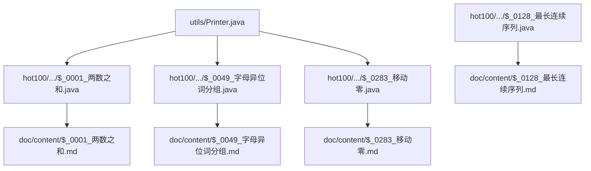
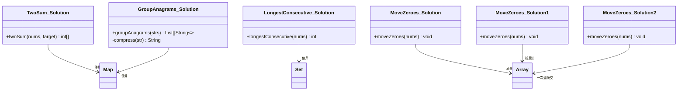
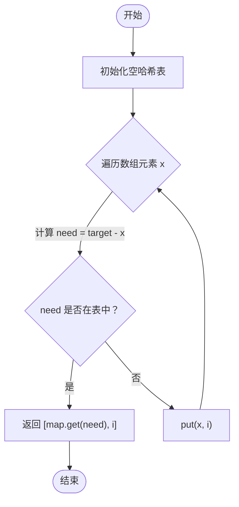
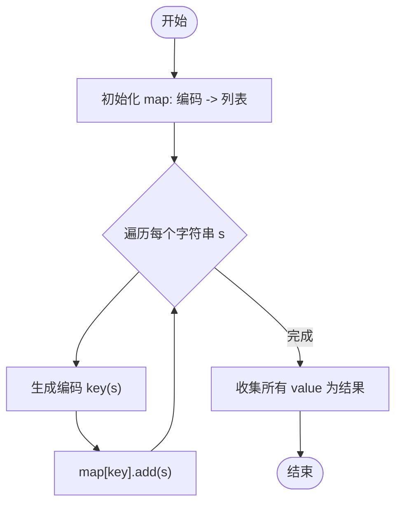
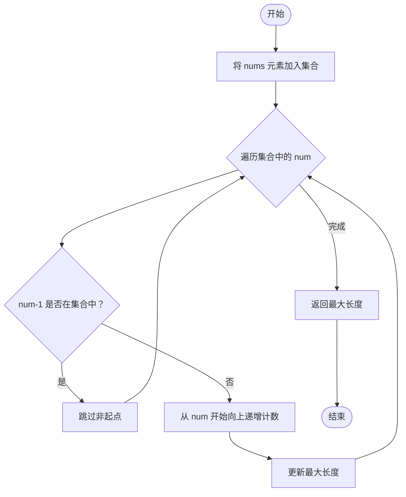
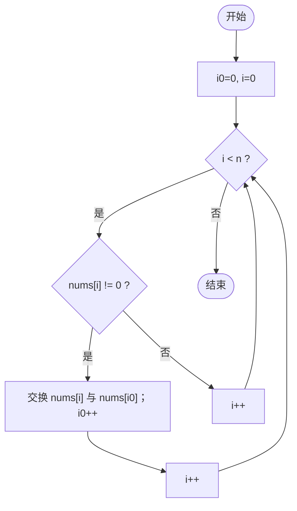
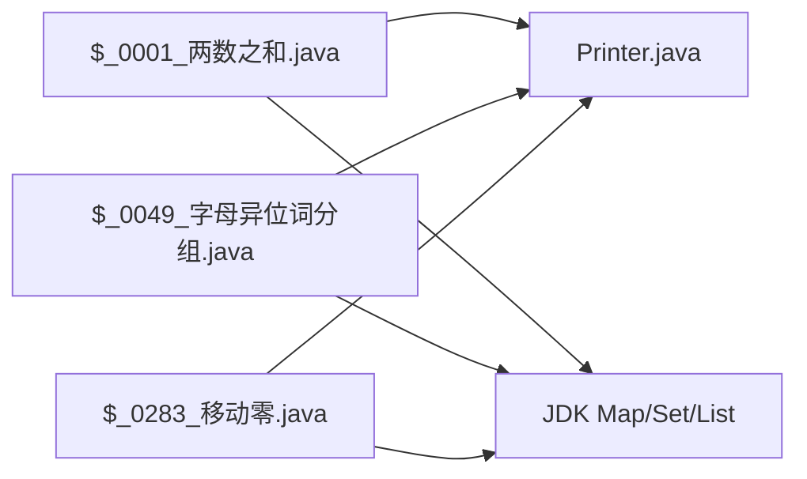

# Hot100热门题解

<cite>
**本文引用的文件**   
- [$_0001_两数之和.java](file://src/main/java/hot100/leetcode/editor/cn/$_0001_两数之和.java)
- [$_0001_两数之和.md](file://src/main/java/hot100/leetcode/editor/cn/doc/content/$_0001_两数之和.md)
- [$_0049_字母异位词分组.java](file://src/main/java/hot100/leetcode/editor/cn/$_0049_字母异位词分组.java)
- [$_0049_字母异位词分组.md](file://src/main/java/hot100/leetcode/editor/cn/doc/content/$_0049_字母异位词分组.md)
- [$_0128_最长连续序列.java](file://src/main/java/hot100/leetcode/editor/cn/$_0128_最长连续序列.java)
- [$_0128_最长连续序列.md](file://src/main/java/hot100/leetcode/editor/cn/doc/content/$_0128_最长连续序列.md)
- [$_0283_移动零.java](file://src/main/java/hot100/leetcode/editor/cn/$_0283_移动零.java)
- [$_0283_移动零.md](file://src/main/java/hot100/leetcode/editor/cn/doc/content/$_0283_移动零.md)
- [TwoSum.java](file://src/main/java/leetcode/editor/cn/TwoSum.java)
- [ThreeSum.java](file://src/main/java/leetcode/editor/cn/ThreeSum.java)
- [GroupAnagrams.java](file://src/main/java/leetcode/editor/cn/GroupAnagrams.java)
- [LongestConsecutiveSequence.java](file://src/main/java/leetcode/editor/cn/LongestConsecutiveSequence.java)
- [Printer.java](file://src/main/java/utils/Printer.java)
</cite>

## 目录
1. [简介](#简介)
2. [项目结构](#项目结构)
3. [核心组件](#核心组件)
4. [架构总览](#架构总览)
5. [详细题解分析](#详细题解分析)
6. [依赖关系分析](#依赖关系分析)
7. [性能与复杂度](#性能与复杂度)
8. [故障排查与易错点](#故障排查与易错点)
9. [结论](#结论)
10. [附录：测试与验证建议](#附录测试与验证建议)

## 简介
本文件面向LeetCode Hot100热门题目，基于仓库中已实现的Java题解与配套文档，系统化梳理每道题的题意、输入输出格式、边界条件、多种解法对比、关键步骤图解、复杂度分析与优化路径，并给出可执行的测试思路与常见陷阱提示。读者无需深入源码即可理解解题脉络，同时可通过“章节来源”快速定位到具体实现文件。

## 项目结构
仓库采用按题号组织的方式，Hot100相关题解集中在hot100包下，每个题包含：
- Java实现类（含Solution内部类）
- 配套Markdown文档（题型说明、多语言参考代码、可视化链接等）
- 可选的本地测试入口main方法

图示来源 
- [$_0001_两数之和.java:1-35](file://src/main/java/hot100/leetcode/editor/cn/$_0001_两数之和.java#L1-L35)
- [$_0049_字母异位词分组.java:1-77](file://src/main/java/hot100/leetcode/editor/cn/$_0049_字母异位词分组.java#L1-L77)
- [$_0128_最长连续序列.java:1-23](file://src/main/java/hot100/leetcode/editor/cn/$_0128_最长连续序列.java#L1-L23)
- [$_0283_移动零.java:1-68](file://src/main/java/hot100/leetcode/editor/cn/$_0283_移动零.java#L1-L68)
- [Printer.java:1-16](file://src/main/java/utils/Printer.java#L1-L16)

章节来源
- [README.md:1-12](file://README.md#L1-L12)

## 核心组件
- 哈希表映射：用于O(1)查找目标补数或统计频次，典型如两数之和、异位词分组。
- 双指针：常用于有序数组的两数/三数/四数问题，以及原地移动元素。
- 哈希集合+线性扫描：用于在O(n)内求最长连续序列。
- 原地覆盖/交换：用于空间O(1)的数组重排任务。

章节来源
- [$_0001_两数之和.java:10-27](file://src/main/java/hot100/leetcode/editor/cn/$_0001_两数之和.java#L10-L27)
- [$_0049_字母异位词分组.java:14-50](file://src/main/java/hot100/leetcode/editor/cn/$_0049_字母异位词分组.java#L14-L50)
- [$_0128_最长连续序列.md:45-65](file://src/main/java/hot100/leetcode/editor/cn/doc/content/$_0128_最长连续序列.md#L45-L65)
- [$_0283_移动零.java:12-24](file://src/main/java/hot100/leetcode/editor/cn/$_0283_移动零.java#L12-L24)

## 架构总览
下图展示各题的核心数据结构与调用关系，便于从整体把握算法选择与数据流。

图示来源 
- [$_0001_两数之和.java:10-27](file://src/main/java/hot100/leetcode/editor/cn/$_0001_两数之和.java#L10-L27)
- [$_0049_字母异位词分组.java:14-50](file://src/main/java/hot100/leetcode/editor/cn/$_0049_字母异位词分组.java#L14-L50)
- [$_0128_最长连续序列.java:10-15](file://src/main/java/hot100/leetcode/editor/cn/$_0128_最长连续序列.java#L10-L15)
- [$_0283_移动零.java:12-59](file://src/main/java/hot100/leetcode/editor/cn/$_0283_移动零.java#L12-L59)

## 详细题解分析

### 题一：两数之和（Two Sum）
- 题意与输入输出
  - 输入：整数数组nums、目标值target
  - 输出：两个下标，满足对应元素之和为target
  - 约束：仅存在唯一答案；不可重复使用同一元素
- 解法对比
  - 暴力枚举：时间O(n^2)，空间O(1)
  - 哈希表（推荐）：一次遍历，边查边存，时间O(n)，空间O(n)
- 关键步骤
  - 维护“值→索引”的映射
  - 对当前元素x，检查target-x是否已在表中
  - 若存在则返回结果；否则将x及其索引入表
- 复杂度
  - 时间：O(n)；空间：O(n)
- 易错点
  - 先查后存，避免误用自身
  - 注意空输入与越界（本题保证有解）
- 测试建议
  - 常规用例、负数、重复值、相邻/首尾组合
- 参考实现路径
  - [$_0001_两数之和.java:10-27](file://src/main/java/hot100/leetcode/editor/cn/$_0001_两数之和.java#L10-L27)
  - [TwoSum.java:62-75](file://src/main/java/leetcode/editor/cn/TwoSum.java#L62-L75)
- 流程图

图示来源 
- [$_0001_两数之和.java:10-27](file://src/main/java/hot100/leetcode/editor/cn/$_0001_两数之和.java#L10-L27)

章节来源
- [$_0001_两数之和.md:1-45](file://src/main/java/hot100/leetcode/editor/cn/doc/content/$_0001_两数之和.md#L1-L45)
- [$_0001_两数之和.java:10-27](file://src/main/java/hot100/leetcode/editor/cn/$_0001_两数之和.java#L10-L27)
- [TwoSum.java:62-75](file://src/main/java/leetcode/editor/cn/TwoSum.java#L62-L75)

### 题二：字母异位词分组（Group Anagrams）
- 题意与输入输出
  - 输入：字符串数组strs
  - 输出：将互为异位词的字符串归为一组
- 解法对比
  - 排序键：对每个字符串排序作为key，时间O(k log k) per string
  - 计数键（推荐）：统计a-z出现次数编码为key，时间O(k) per string
- 关键步骤
  - 构建“编码→列表”的映射
  - 遍历所有字符串，生成编码并加入对应列表
- 复杂度
  - 时间：O(N·k)；空间：O(N·k)（N为字符串个数，k为平均长度）
- 易错点
  - 编码需稳定且唯一（计数数组转字符串时顺序固定）
  - 空串处理
- 测试建议
  - 空串、单字符、全相同、全不同、大小写（本题限定小写）
- 参考实现路径
  - [$_0049_字母异位词分组.java:14-50](file://src/main/java/hot100/leetcode/editor/cn/$_0049_字母异位词分组.java#L14-L50)
  - [GroupAnagrams.java:51-72](file://src/main/java/leetcode/editor/cn/GroupAnagrams.java#L51-L72)
- 流程图

图示来源 
- [$_0049_字母异位词分组.java:14-50](file://src/main/java/hot100/leetcode/editor/cn/$_0049_字母异位词分组.java#L14-L50)

章节来源
- [$_0049_字母异位词分组.md:1-47](file://src/main/java/hot100/leetcode/editor/cn/doc/content/$_0049_字母异位词分组.md#L1-L47)
- [$_0049_字母异位词分组.java:14-50](file://src/main/java/hot100/leetcode/editor/cn/$_0049_字母异位词分组.java#L14-L50)
- [GroupAnagrams.java:51-72](file://src/main/java/leetcode/editor/cn/GroupAnagrams.java#L51-L72)

### 题三：最长连续序列（Longest Consecutive Sequence）
- 题意与输入输出
  - 输入：未排序整数数组nums
  - 输出：最长连续数字序列的长度（不要求原数组连续）
- 解法对比
  - 排序：O(n log n)
  - 哈希集合+只从起点扩展：均摊O(n)（推荐）
- 关键步骤
  - 将所有元素放入集合
  - 仅当num-1不在集合中时，从num开始向上递增计数
- 复杂度
  - 时间：O(n)；空间：O(n)
- 易错点
  - 必须判断“是否为起点”，否则会重复计数导致退化
- 测试建议
  - 空数组、全部重复、正负混合、长链
- 参考实现路径
  - [$_0128_最长连续序列.java:10-15](file://src/main/java/hot100/leetcode/editor/cn/$_0128_最长连续序列.java#L10-L15)
  - [LongestConsecutiveSequence.java:51-68](file://src/main/java/leetcode/editor/cn/LongestConsecutiveSequence.java#L51-L68)
- 流程图

图示来源 
- [$_0128_最长连续序列.md:45-65](file://src/main/java/hot100/leetcode/editor/cn/doc/content/$_0128_最长连续序列.md#L45-L65)

章节来源
- [$_0128_最长连续序列.md:1-36](file://src/main/java/hot100/leetcode/editor/cn/doc/content/$_0128_最长连续序列.md#L1-L36)
- [$_0128_最长连续序列.java:10-15](file://src/main/java/hot100/leetcode/editor/cn/$_0128_最长连续序列.java#L10-L15)
- [LongestConsecutiveSequence.java:51-68](file://src/main/java/leetcode/editor/cn/LongestConsecutiveSequence.java#L51-L68)

### 题四：移动零（Move Zeroes）
- 题意与输入输出
  - 输入：整型数组nums
  - 输出：原地将所有0移到末尾，保持非零元素相对顺序
- 解法对比
  - 两次遍历：先覆盖非零，再尾部填0
  - 一次遍历交换：维护“下一个0的位置”，遇到非零即交换
- 关键步骤
  - 方案A：快慢指针覆盖非零，随后尾部置0
  - 方案B：i0指向首个0位置，i扫描，遇非零则交换并推进i0
- 复杂度
  - 时间：O(n)；空间：O(1)
- 易错点
  - 原地操作不能额外分配数组
  - 交换时需保证相对顺序不变
- 测试建议
  - 全0、无0、单个元素、0与非零交错
- 参考实现路径
  - [$_0283_移动零.java:12-24](file://src/main/java/hot100/leetcode/editor/cn/$_0283_移动零.java#L12-L24)
  - [$_0283_移动零.java:30-40](file://src/main/java/hot100/leetcode/editor/cn/$_0283_移动零.java#L30-L40)
  - [$_0283_移动零.java:46-59](file://src/main/java/hot100/leetcode/editor/cn/$_0283_移动零.java#L46-L59)
- 流程图（一次遍历交换）

图示来源 
- [$_0283_移动零.java:46-59](file://src/main/java/hot100/leetcode/editor/cn/$_0283_移动零.java#L46-L59)

章节来源
- [$_0283_移动零.md:1-34](file://src/main/java/hot100/leetcode/editor/cn/doc/content/$_0283_移动零.md#L1-L34)
- [$_0283_移动零.java:12-59](file://src/main/java/hot100/leetcode/editor/cn/$_0283_移动零.java#L12-L59)

### 补充：三数之和（Three Sum）
- 思路要点
  - 排序+双指针，固定一个数，左右指针寻找另外两个数
  - 去重：跳过重复的固定数和左右指针重复值
- 复杂度
  - 时间：O(n^2)；空间：O(1)（不计结果存储）
- 参考实现路径
  - [ThreeSum.java:62-90](file://src/main/java/leetcode/editor/cn/ThreeSum.java#L62-L90)

章节来源
- [ThreeSum.java:1-48](file://src/main/java/leetcode/editor/cn/ThreeSum.java#L1-L48)
- [ThreeSum.java:62-90](file://src/main/java/leetcode/editor/cn/ThreeSum.java#L62-L90)

## 依赖关系分析
- 模块耦合
  - 题解类主要依赖标准库Map/Set/List/Arrays
  - 测试打印统一通过utils.Printer
- 外部依赖
  - 无第三方库，纯JDK实现
- 潜在循环依赖
  - 各题相互独立，无循环依赖

图示来源 
- [$_0001_两数之和.java:1-35](file://src/main/java/hot100/leetcode/editor/cn/$_0001_两数之和.java#L1-L35)
- [$_0049_字母异位词分组.java:1-77](file://src/main/java/hot100/leetcode/editor/cn/$_0049_字母异位词分组.java#L1-L77)
- [$_0283_移动零.java:1-68](file://src/main/java/hot100/leetcode/editor/cn/$_0283_移动零.java#L1-L68)
- [Printer.java:1-16](file://src/main/java/utils/Printer.java#L1-L16)

章节来源
- [Printer.java:1-16](file://src/main/java/utils/Printer.java#L1-L16)

## 性能与复杂度
- 两数之和：哈希表O(n)/O(n)
- 字母异位词分组：计数编码O(N·k)/O(N·k)
- 最长连续序列：哈希集合O(n)/O(n)
- 移动零：原地双指针O(n)/O(1)
- 三数之和：排序+双指针O(n^2)/O(1)

[本节为通用性能讨论，不直接分析具体文件]

## 故障排查与易错点
- 两数之和
  - 先查后存，避免使用自身
  - 注意null返回值（本题保证有解）
- 字母异位词分组
  - 编码稳定性：计数数组转字符串的顺序要固定
  - 空串与单字符边界
- 最长连续序列
  - 必须从“起点”开始扩展，否则可能退化为O(n^2)
- 移动零
  - 原地操作，不要复制数组
  - 交换法需保证相对顺序不变
- 三数之和
  - 去重要彻底：固定数、左指针、右指针均需跳过重复
- 调试技巧
  - 使用utils.Printer打印中间状态
  - 构造极端用例：空、单元素、全同、极值范围

章节来源
- [$_0001_两数之和.java:10-27](file://src/main/java/hot100/leetcode/editor/cn/$_0001_两数之和.java#L10-L27)
- [$_0049_字母异位词分组.java:14-50](file://src/main/java/hot100/leetcode/editor/cn/$_0049_字母异位词分组.java#L14-L50)
- [$_0128_最长连续序列.md:45-65](file://src/main/java/hot100/leetcode/editor/cn/doc/content/$_0128_最长连续序列.md#L45-L65)
- [$_0283_移动零.java:12-59](file://src/main/java/hot100/leetcode/editor/cn/$_0283_移动零.java#L12-L59)
- [ThreeSum.java:62-90](file://src/main/java/leetcode/editor/cn/ThreeSum.java#L62-L90)
- [Printer.java:1-16](file://src/main/java/utils/Printer.java#L1-L16)

## 结论
本仓库针对Hot100经典题提供了清晰、可运行的Java实现与配套文档。通过哈希表、双指针、哈希集合与原地操作等基础技巧，可在O(n)或O(n^2)级别高效求解。建议在掌握上述模板的基础上，举一反三，迁移至更多变体问题。

[本节为总结性内容，不直接分析具体文件]

## 附录：测试与验证建议
- 单元测试骨架
  - 在每个题的main中构造多组用例，覆盖边界与随机数据
  - 使用utils.Printer输出断言信息
- 回归策略
  - 保留历史提交记录，逐步增加用例
  - 对关键分支（如空输入、重复值、极值）单独建用例集
- 参考入口
  - [$_0001_两数之和.java:30-35](file://src/main/java/hot100/leetcode/editor/cn/$_0001_两数之和.java#L30-L35)
  - [$_0049_字母异位词分组.java:71-77](file://src/main/java/hot100/leetcode/editor/cn/$_0049_字母异位词分组.java#L71-L77)
  - [$_0283_移动零.java:61-68](file://src/main/java/hot100/leetcode/editor/cn/$_0283_移动零.java#L61-L68)

章节来源
- [$_0001_两数之和.java:30-35](file://src/main/java/hot100/leetcode/editor/cn/$_0001_两数之和.java#L30-L35)
- [$_0049_字母异位词分组.java:71-77](file://src/main/java/hot100/leetcode/editor/cn/$_0049_字母异位词分组.java#L71-L77)
- [$_0283_移动零.java:61-68](file://src/main/java/hot100/leetcode/editor/cn/$_0283_移动零.java#L61-L68)
- [Printer.java:1-16](file://src/main/java/utils/Printer.java#L1-L16)