# 中等题解

<cite>
**本文引用的文件**   
- [$_0049_字母异位词分组.java](file://src/main/java/hot100/leetcode/editor/cn/$_0049_字母异位词分组.java)
- [GroupAnagrams.md](file://src/main/java/leetcode/editor/cn/doc/content/GroupAnagrams.md)
- [$_0283_移动零.java](file://src/main/java/hot100/leetcode/editor/cn/$_0283_移动零.java)
- [MinimumSizeSubarraySum.java](file://src/main/java/leetcode/editor/cn/MinimumSizeSubarraySum.java)
- [MinimumSizeSubarraySum.md](file://src/main/java/leetcode/editor/cn/doc/content/MinimumSizeSubarraySum.md)
- [LongestSubstringWithoutRepeatingCharacters.java](file://src/main/java/leetcode/editor/cn/LongestSubstringWithoutRepeatingCharacters.java)
- [LongestSubstringWithoutRepeatingCharacters.md](file://src/main/java/leetcode/editor/cn/doc/content/LongestSubstringWithoutRepeatingCharacters.md)
- [ThreeSum.java](file://src/main/java/leetcode/editor/cn/ThreeSum.java)
- [ThreeSum.md](file://src/main/java/leetcode/editor/cn/doc/content/ThreeSum.md)
- [MaximumPointsYouCanObtainFromCards.java](file://src/main/java/leetcode/editor/cn/MaximumPointsYouCanObtainFromCards.java)
- [MaximumPointsYouCanObtainFromCards.md](file://src/main/java/leetcode/editor/cn/doc/content/MaximumPointsYouCanObtainFromCards.md)
- [MinimumSwapsToGroupAll1sTogether.java](file://src/main/java/leetcode/editor/cn/MinimumSwapsToGroupAll1sTogether.java)
- [MinimumSwapsToGroupAll1sTogether.md](file://src/main/java/leetcode/editor/cn/doc/content/MinimumSwapsToGroupAll1sTogether.md)
- [$_0128_最长连续序列.java](file://src/main/java/hot100/leetcode/editor/cn/$_0128_最长连续序列.java)
- [$_0128_最长连续序列.md](file://src/main/java/hot100/leetcode/editor/cn/doc/content/$_0128_最长连续序列.md)
</cite>

## 更新摘要
**变更内容**   
- 新增LeetCode第128题'最长连续序列'的详细题解分析
- 添加了基于哈希表的O(n)时间复杂度解法
- 补充了并查集和区间合并两种高级解法的对比分析
- 更新了项目结构图和依赖关系图以包含新题目

## 目录
1. [引言](#引言)
2. [项目结构](#项目结构)
3. [核心组件](#核心组件)
4. [架构总览](#架构总览)
5. [详细题解与实现分析](#详细题解与实现分析)
6. [依赖关系分析](#依赖关系分析)
7. [性能考量](#性能考量)
8. [故障排查指南](#故障排查指南)
9. [结论](#结论)
10. [附录：算法模板与扩展思考](#附录算法模板与扩展思考)

## 引言
本文件面向LeetCode Hot100中的"中等难度"题目，聚焦滑动窗口、双指针、哈希表与前缀和等高频技巧。文档对每道题给出：
- 题意深层解读与边界条件
- 多种解法对比与优化路径
- 状态转移或窗口维护的图解
- 完整测试用例设计与验证策略
- 代码难点、陷阱与最佳实践
- 相关算法模板与可迁移思路

## 项目结构
仓库按"题号+中文标题"组织Java实现，配套Markdown题目说明位于doc/content下。典型结构如下：
- hot100/.../$_题号_标题.java：包含Solution类及多解法注释
- leetcode/editor/cn/doc/content/*.md：对应题目的官方描述、示例与约束
- leetcode/editor/cn/*：更多中等题实现（如滑动窗口、前缀和、双指针）

```mermaid
graph TB
A["hot100/.../$_0049_字母异位词分组.java"] --> B["doc/content/GroupAnagrams.md"]
C["leetcode/editor/cn/MinimumSizeSubarraySum.java"] --> D["doc/content/MinimumSizeSubarraySum.md"]
E["leetcode/editor/cn/LongestSubstringWithoutRepeatingCharacters.java"] --> F["doc/content/LongestSubstringWithoutRepeatingCharacters.md"]
G["leetcode/editor/cn/ThreeSum.java"] --> H["doc/content/ThreeSum.md"]
I["leetcode/editor/cn/MaximumPointsYouCanObtainFromCards.java"] --> J["doc/content/MaximumPointsYouCanObtainFromCards.md"]
K["leetcode/editor/cn/MinimumSwapsToGroupAll1sTogether.java"] --> L["doc/content/MinimumSwapsToGroupAll1sTogether.md"]
M["hot100/.../$_0128_最长连续序列.java"] --> N["doc/content/$_0128_最长连续序列.md"]
```

**图表来源**
- [$_0049_字母异位词分组.java:1-77](file://src/main/java/hot100/leetcode/editor/cn/$_0049_字母异位词分组.java#L1-L77)
- [GroupAnagrams.md:1-36](file://src/main/java/leetcode/editor/cn/doc/content/GroupAnagrams.md#L1-L36)
- [MinimumSizeSubarraySum.java:52-74](file://src/main/java/leetcode/editor/cn/MinimumSizeSubarraySum.java#L52-L74)
- [MinimumSizeSubarraySum.md:1-47](file://src/main/java/leetcode/editor/cn/doc/content/MinimumSizeSubarraySum.md#L1-L47)
- [LongestSubstringWithoutRepeatingCharacters.java:50-74](file://src/main/java/leetcode/editor/cn/LongestSubstringWithoutRepeatingCharacters.java#L50-L74)
- [LongestSubstringWithoutRepeatingCharacters.md:1-39](file://src/main/java/leetcode/editor/cn/doc/content/LongestSubstringWithoutRepeatingCharacters.md#L1-L39)
- [ThreeSum.java:57-93](file://src/main/java/leetcode/editor/cn/ThreeSum.java#L57-L93)
- [ThreeSum.md:1-47](file://src/main/java/leetcode/editor/cn/doc/content/ThreeSum.md#L1-L47)
- [MaximumPointsYouCanObtainFromCards.java:60-87](file://src/main/java/leetcode/editor/cn/MaximumPointsYouCanObtainFromCards.java#L60-L87)
- [MaximumPointsYouCanObtainFromCards.md:1-55](file://src/main/java/leetcode/editor/cn/doc/content/MaximumPointsYouCanObtainFromCards.md#L1-L55)
- [MinimumSwapsToGroupAll1sTogether.java:56-77](file://src/main/java/leetcode/editor/cn/MinimumSwapsToGroupAll1sTogether.java#L56-L77)
- [MinimumSwapsToGroupAll1sTogether.md:1-51](file://src/main/java/leetcode/editor/cn/doc/content/MinimumSwapsToGroupAll1sTogether.md#L1-L51)
- [$_0128_最长连续序列.java:1-79](file://src/main/java/hot100/leetcode/editor/cn/$_0128_最长连续序列.java#L1-L79)
- [$_0128_最长连续序列.md:1-288](file://src/main/java/hot100/leetcode/editor/cn/doc/content/$_0128_最长连续序列.md#L1-L288)

章节来源
- [$_0049_字母异位词分组.java:1-77](file://src/main/java/hot100/leetcode/editor/cn/$_0049_字母异位词分组.java#L1-L77)
- [$_0283_移动零.java:1-68](file://src/main/java/hot100/leetcode/editor/cn/$_0283_移动零.java#L1-L68)

## 核心组件
- 哈希映射分组：将具有相同字符计数的字符串归为一组，键可用"排序后字符串"或"压缩计数串"。
- 原地双指针重排：通过一次遍历将非零元素前移，尾部补零；或交换维护全零窗口。
- 最小长度子数组：正数数组上的定长/变长滑动窗口，维护区间和并收缩左端点。
- 最长无重复子串：固定大小字符集下的布尔标记窗口，遇到冲突时收缩至去重。
- 三数之和：排序+双指针，配合剪枝与去重保证O(n^2)。
- 从两端取k个最大和：等价于求长度为n-k的连续子数组的最小和，用滑动窗口。
- 最少交换使所有1相邻：统计1的总数k，滑动窗口内找最多1的区间，答案=k-窗口内1的最大值。
- **最长连续序列**：使用哈希集合判断连续性，或通过区间合并维护连续区间。

章节来源
- [$_0049_字母异位词分组.java:14-49](file://src/main/java/hot100/leetcode/editor/cn/$_0049_字母异位词分组.java#L14-L49)
- [$_0283_移动零.java:12-59](file://src/main/java/hot100/leetcode/editor/cn/$_0283_移动零.java#L12-L59)
- [MinimumSizeSubarraySum.java:57-71](file://src/main/java/leetcode/editor/cn/MinimumSizeSubarraySum.java#L57-L71)
- [LongestSubstringWithoutRepeatingCharacters.java:56-71](file://src/main/java/leetcode/editor/cn/LongestSubstringWithoutRepeatingCharacters.java#L56-L71)
- [ThreeSum.java:62-90](file://src/main/java/leetcode/editor/cn/ThreeSum.java#L62-L90)
- [MaximumPointsYouCanObtainFromCards.java:65-84](file://src/main/java/leetcode/editor/cn/MaximumPointsYouCanObtainFromCards.java#L65-L84)
- [MinimumSwapsToGroupAll1sTogether.java:61-74](file://src/main/java/hot100/leetcode/editor/cn/$_0128_最长连续序列.java#L61-L74)
- [$_0128_最长连续序列.java:17-36](file://src/main/java/hot100/leetcode/editor/cn/$_0128_最长连续序列.java#L17-L36)

## 架构总览
以下图展示各题在"输入→处理→输出"层面的通用模式，以及关键数据结构（哈希表、滑动窗口、双指针）的使用位置。

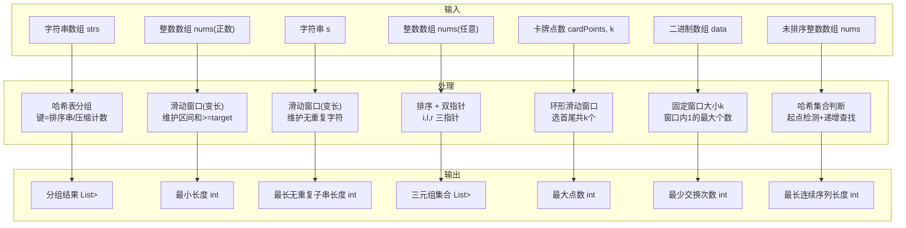

**图表来源**
- [$_0049_字母异位词分组.java:14-49](file://src/main/java/hot100/leetcode/editor/cn/$_0049_字母异位词分组.java#L14-L49)
- [MinimumSizeSubarraySum.java:57-71](file://src/main/java/leetcode/editor/cn/MinimumSizeSubarraySum.java#L57-L71)
- [LongestSubstringWithoutRepeatingCharacters.java:56-71](file://src/main/java/leetcode/editor/cn/LongestSubstringWithoutRepeatingCharacters.java#L56-L71)
- [ThreeSum.java:62-90](file://src/main/java/leetcode/editor/cn/ThreeSum.java#L62-L90)
- [MaximumPointsYouCanObtainFromCards.java:65-84](file://src/main/java/leetcode/editor/cn/MaximumPointsYouCanObtainFromCards.java#L65-L84)
- [MinimumSwapsToGroupAll1sTogether.java:61-74](file://src/main/java/hot100/leetcode/editor/cn/$_0128_最长连续序列.java#L61-L74)
- [$_0128_最长连续序列.java:46-71](file://src/main/java/hot100/leetcode/editor/cn/$_0128_最长连续序列.java#L46-L71)

## 详细题解与实现分析

### 题目一：字母异位词分组
- 题意要点
  - 将互为字母异位词的字符串分到同一组，顺序无关。
  - 约束：字符串数量可达1e4，单串长度可达100，仅小写字母。
- 解法对比
  - 方法A：以"排序后的字符串"为键分组。时间复杂度O(n·m log m)，空间O(n·m)。
  - 方法B：以"压缩计数串"为键分组（记录每个字母出现次数）。时间复杂度O(n·m)，空间O(n·m)。
- 边界与陷阱
  - 空串需正确参与分组。
  - 键构造要稳定且唯一，避免不同异位词产生相同键。
- 算法步骤
  - 遍历字符串数组，计算键。
  - 将当前字符串加入对应键的列表。
  - 收集所有列表作为结果。
- 复杂度
  - 方法A：时间O(n·m log m)，空间O(n·m)。
  - 方法B：时间O(n·m)，空间O(n·m)。
- 测试用例设计
  - 常规：["eat","tea","tan","ate","nat","bat"]
  - 含空串：[""]
  - 单元素：["a"]
  - 大量重复异位词：["abc","bca","cab","cba"]
- 代码片段路径
  - [$_0049_字母异位词分组.java:14-49](file://src/main/java/hot100/leetcode/editor/cn/$_0049_字母异位词分组.java#L14-L49)
  - [$_0049_字母异位词分组.java:57-69](file://src/main/java/hot100/leetcode/editor/cn/$_0049_字母异位词分组.java#L57-L69)

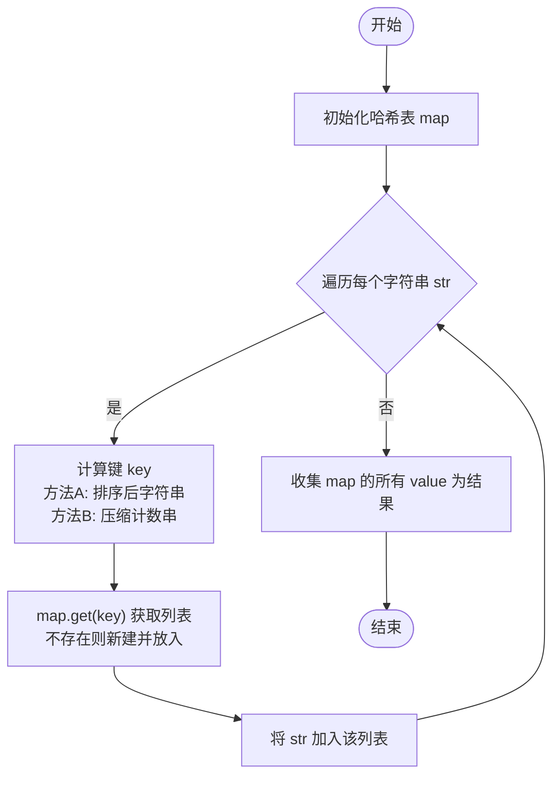

**图表来源**
- [$_0049_字母异位词分组.java:14-49](file://src/main/java/hot100/leetcode/editor/cn/$_0049_字母异位词分组.java#L14-L49)
- [$_0049_字母异位词分组.java:57-69](file://src/main/java/hot100/leetcode/editor/cn/$_0049_字母异位词分组.java#L57-L69)

章节来源
- [$_0049_字母异位词分组.java:14-49](file://src/main/java/hot100/leetcode/editor/cn/$_0049_字母异位词分组.java#L14-L49)
- [$_0049_字母异位词分组.java:57-69](file://src/main/java/hot100/leetcode/editor/cn/$_0049_字母异位词分组.java#L57-L69)
- [GroupAnagrams.md:1-36](file://src/main/java/leetcode/editor/cn/doc/content/GroupAnagrams.md#L1-L36)

### 题目二：移动零
- 题意要点
  - 原地将所有0移动到末尾，保持非零元素相对顺序。
- 解法对比
  - 方法A：一次扫描，非零元素依次写入前部，尾部填充0。
  - 方法B：维护"全零窗口"左边界i0，遇到非零即与i0交换，右移i0。
- 边界与陷阱
  - 全0或全非0数组应直接返回。
  - 注意保持非零元素的相对顺序。
- 算法步骤
  - 方法A：l指向下一个非零应放的位置，遍历i，若nums[i]!=0则写入nums[l++]。
  - 方法B：i0指向首个0的位置，遍历i，若nums[i]!=0则交换nums[i]与nums[i0]，i0++。
- 复杂度
  - 两种方法均为O(n)时间，O(1)额外空间。
- 测试用例设计
  - [0,1,0,3,12] → [1,3,12,0,0]
  - [0,0,0] → [0,0,0]
  - [1,2,3] → [1,2,3]
- 代码片段路径
  - [$_0283_移动零.java:12-23](file://src/main/java/hot100/leetcode/editor/cn/$_0283_移动零.java#L12-L23)
  - [$_0283_移动零.java:46-59](file://src/main/java/hot100/leetcode/editor/cn/$_0283_移动零.java#L46-L59)

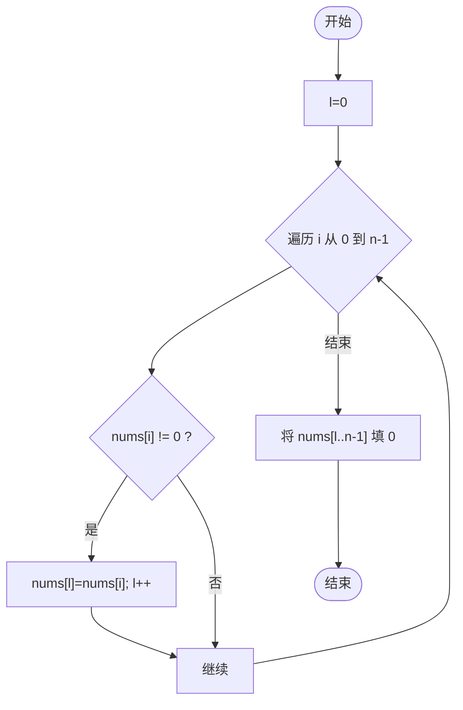

**图表来源**
- [$_0283_移动零.java:12-23](file://src/main/java/hot100/leetcode/editor/cn/$_0283_移动零.java#L12-L23)

章节来源
- [$_0283_移动零.java:12-23](file://src/main/java/hot100/leetcode/editor/cn/$_0283_移动零.java#L12-L23)
- [$_0283_移动零.java:46-59](file://src/main/java/hot100/leetcode/editor/cn/$_0283_移动零.java#L46-L59)

### 题目三：长度最小的子数组（和≥target）
- 题意要点
  - 正数数组中，找到和≥target的最短连续子数组长度。
- 解法对比
  - 滑动窗口（推荐）：O(n)时间，O(1)空间。
  - 前缀和+二分：O(n log n)时间，O(n)空间。
- 边界与陷阱
  - target可能大于总和，此时返回0。
  - 窗口收缩时的长度更新时机要准确。
- 算法步骤（滑动窗口）
  - r右扩累加sum，当sum≥target时尝试收缩l，更新答案。
- 复杂度
  - 滑动窗口：O(n)时间，O(1)空间。
- 测试用例设计
  - target=7, nums=[2,3,1,2,4,3] → 2
  - target=4, nums=[1,4,4] → 1
  - target=11, nums=[1,1,1,1,1,1,1,1] → 0
- 代码片段路径
  - [MinimumSizeSubarraySum.java:57-71](file://src/main/java/leetcode/editor/cn/MinimumSizeSubarraySum.java#L57-L71)

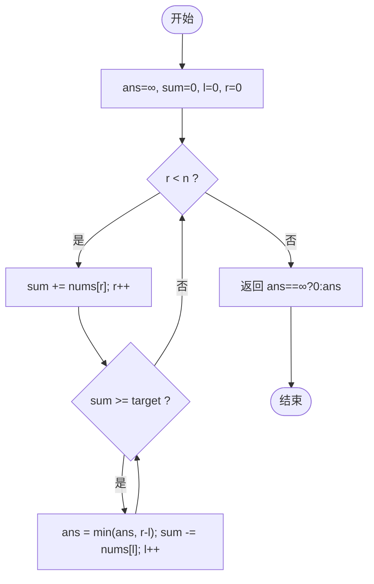

**图表来源**
- [MinimumSizeSubarraySum.java:57-71](file://src/main/java/leetcode/editor/cn/MinimumSizeSubarraySum.java#L57-L71)

章节来源
- [MinimumSizeSubarraySum.java:57-71](file://src/main/java/leetcode/editor/cn/MinimumSizeSubarraySum.java#L57-L71)
- [MinimumSizeSubarraySum.md:1-47](file://src/main/java/leetcode/editor/cn/doc/content/MinimumSizeSubarraySum.md#L1-L47)

### 题目四：无重复字符的最长子串
- 题意要点
  - 求不含重复字符的最长子串长度。
- 解法对比
  - 滑动窗口+布尔标记（字符集较小）：O(n)时间，O(Σ)空间。
  - 滑动窗口+哈希表记录最近位置：更通用。
- 边界与陷阱
  - 空串返回0。
  - 字符集大小决定数组或哈希表的选择。
- 算法步骤
  - right右扩，若窗口内已有重复，left右移至去重为止，更新答案。
- 复杂度
  - O(n)时间，O(Σ)空间（Σ为字符集大小）。
- 测试用例设计
  - "abcabcbb" → 3
  - "bbbbb" → 1
  - "pwwkew" → 3
- 代码片段路径
  - [LongestSubstringWithoutRepeatingCharacters.java:56-71](file://src/main/java/leetcode/editor/cn/LongestSubstringWithoutRepeatingCharacters.java#L56-L71)

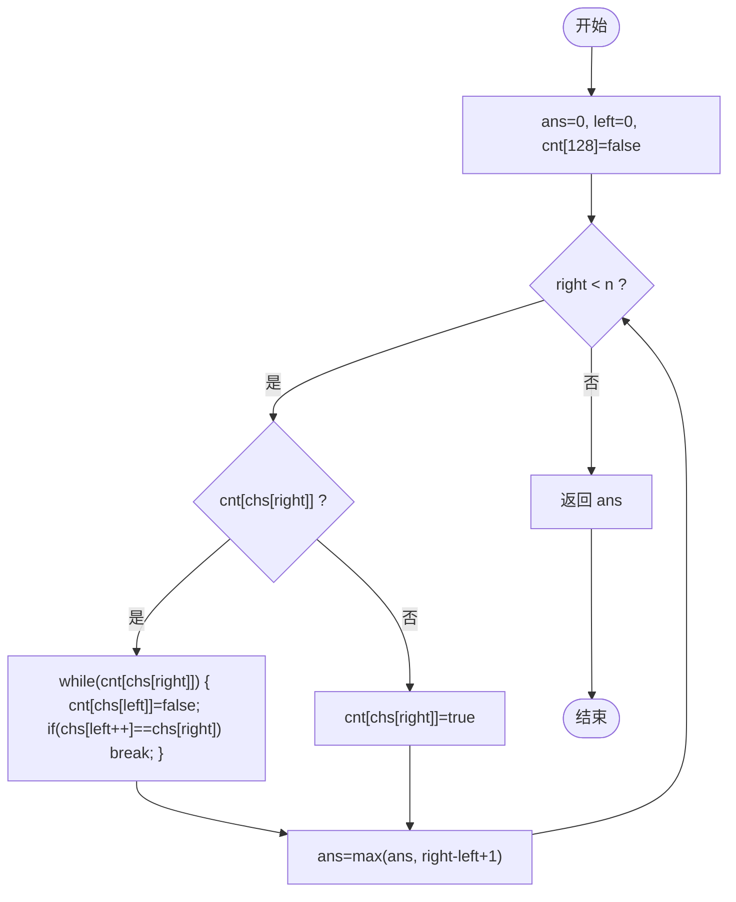

**图表来源**
- [LongestSubstringWithoutRepeatingCharacters.java:56-71](file://src/main/java/leetcode/editor/cn/LongestSubstringWithoutRepeatingCharacters.java#L56-L71)

章节来源
- [LongestSubstringWithoutRepeatingCharacters.java:56-71](file://src/main/java/leetcode/editor/cn/LongestSubstringWithoutRepeatingCharacters.java#L56-L71)
- [LongestSubstringWithoutRepeatingCharacters.md:1-39](file://src/main/java/leetcode/editor/cn/doc/content/LongestSubstringWithoutRepeatingCharacters.md#L1-L39)

### 题目五：三数之和
- 题意要点
  - 找出所有不重复三元组，使其和为0。
- 解法对比
  - 排序+双指针：O(n^2)时间，O(1)额外空间（不计结果存储）。
- 边界与陷阱
  - 去重要严格：外层i跳过重复，内层l/r也跳过重复。
  - 剪枝：最小/最大可能和判断提前终止或continue。
- 算法步骤
  - 排序后固定i，l=i+1, r=n-1，根据三数和调整l/r。
- 复杂度
  - O(n^2)时间，O(1)额外空间。
- 测试用例设计
  - [-1,0,1,2,-1,-4] → [[-1,-1,2],[-1,0,1]]
  - [0,1,1] → []
  - [0,0,0] → [[0,0,0]]
- 代码片段路径
  - [ThreeSum.java:62-90](file://src/main/java/leetcode/editor/cn/ThreeSum.java#L62-L90)

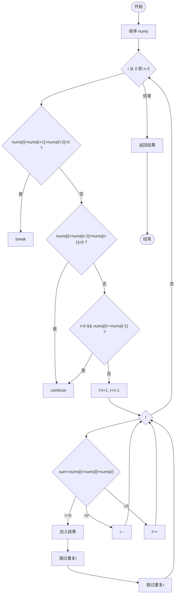

**图表来源**
- [ThreeSum.java:62-90](file://src/main/java/leetcode/editor/cn/ThreeSum.java#L62-L90)

章节来源
- [ThreeSum.java:62-90](file://src/main/java/leetcode/editor/cn/ThreeSum.java#L62-L90)
- [ThreeSum.md:1-47](file://src/main/java/leetcode/editor/cn/doc/content/ThreeSum.md#L1-L47)

### 题目六：从卡片两端获得的最大点数
- 题意要点
  - 每次只能从首或尾取一张卡，取k张，最大化点数和。
- 解法对比
  - 逆向思维：取首尾共k张等价于去掉中间长度为n-k的子数组，求剩余最大和=总和-最小子数组和。
  - 环形滑动窗口：直接维护长度为n-k的窗口，滑过环形序列。
- 边界与陷阱
  - k=n时答案为总和。
  - 环形窗口索引越界处理。
- 算法步骤
  - 计算初始窗口和，滑动更新最大值，最后用总和减最小窗口和或直接维护首尾组合。
- 复杂度
  - O(n)时间，O(1)空间。
- 测试用例设计
  - [1,2,3,4,5,6,1], k=3 → 12
  - [2,2,2], k=2 → 4
  - [9,7,7,9,7,7,9], k=7 → 55
- 代码片段路径
  - [MaximumPointsYouCanObtainFromCards.java:65-84](file://src/main/java/leetcode/editor/cn/MaximumPointsYouCanObtainFromCards.java#L65-L84)

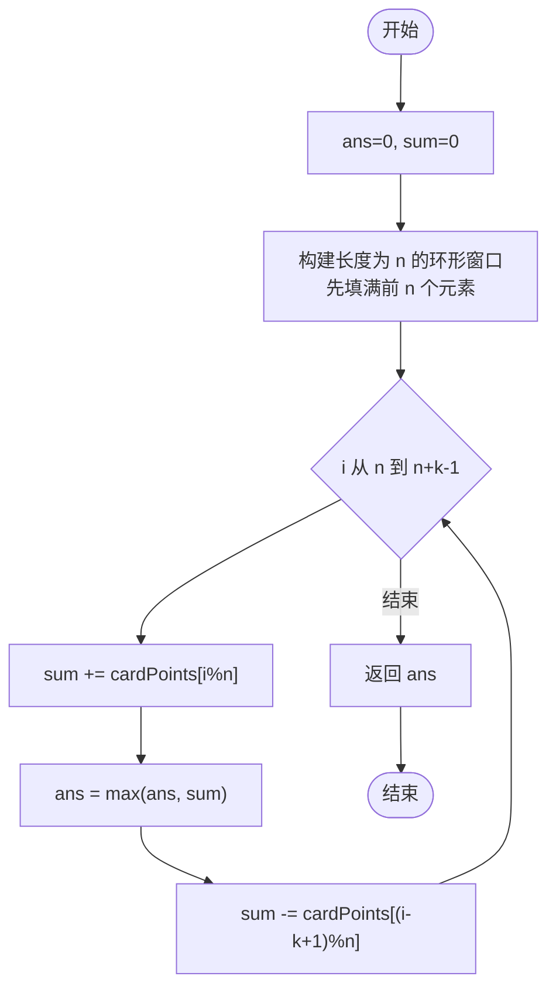

**图表来源**
- [MaximumPointsYouCanObtainFromCards.java:65-84](file://src/main/java/leetcode/editor/cn/MaximumPointsYouCanObtainFromCards.java#L65-L84)

章节来源
- [MaximumPointsYouCanObtainFromCards.java:65-84](file://src/main/java/leetcode/editor/cn/MaximumPointsYouCanObtainFromCards.java#L65-L84)
- [MaximumPointsYouCanObtainFromCards.md:1-55](file://src/main/java/leetcode/editor/cn/doc/content/MaximumPointsYouCanObtainFromCards.md#L1-L55)

### 题目七：最少交换使所有1相邻
- 题意要点
  - 通过交换使所有1集中在一起，求最少交换次数。
- 解法对比
  - 统计1的总数k，滑动窗口大小为k，窗口内1越多，需要交换的0越少。
- 边界与陷阱
  - k=0时答案为0。
  - 窗口滑动时维护窗口内1的个数。
- 算法步骤
  - 计算k，遍历数组维护窗口内1的个数，记录最大值maxOnes，答案=k-maxOnes。
- 复杂度
  - O(n)时间，O(1)空间。
- 测试用例设计
  - [1,0,1,0,1] → 1
  - [0,0,0,1,0] → 0
  - [1,0,1,0,1,0,0,1,1,0,1] → 3
- 代码片段路径
  - [MinimumSwapsToGroupAll1sTogether.java:61-74](file://src/main/java/hot100/leetcode/editor/cn/$_0128_最长连续序列.java#L61-L74)

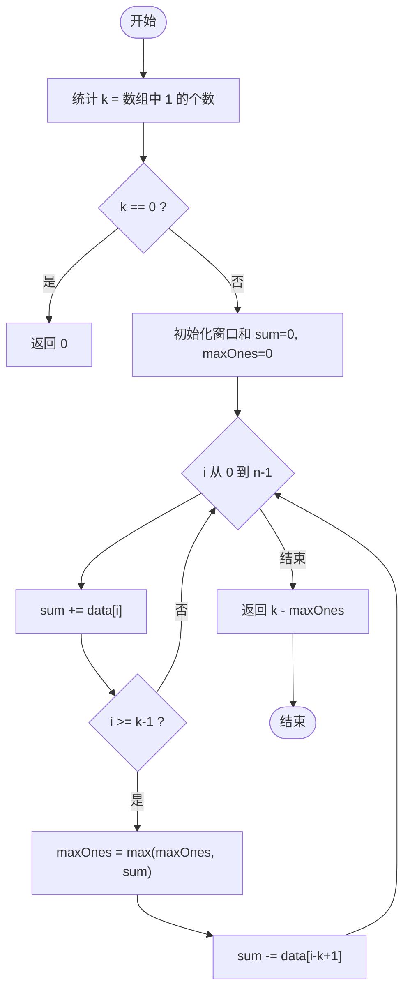

**图表来源**
- [MinimumSwapsToGroupAll1sTogether.java:61-74](file://src/main/java/hot100/leetcode/editor/cn/$_0128_最长连续序列.java#L61-L74)

章节来源
- [MinimumSwapsToGroupAll1sTogether.java:61-74](file://src/main/java/hot100/leetcode/editor/cn/$_0128_最长连续序列.java#L61-L74)
- [MinimumSwapsToGroupAll1sTogether.md:1-51](file://src/main/java/leetcode/editor/cn/doc/content/MinimumSwapsToGroupAll1sTogether.md#L1-L51)

### 题目八：最长连续序列（新增）
- 题意要点
  - 在未排序的整数数组中找出数字连续的最长序列长度，要求O(n)时间复杂度。
  - 序列元素在原数组中不需要连续，但数值必须连续。
- 解法对比
  - **方法A：哈希集合+起点检测**（推荐）
    - 将数组元素存入HashSet，只从序列起点开始向后查找
    - 时间复杂度O(n)，空间复杂度O(n)
  - **方法B：区间合并**
    - 使用两个HashMap分别记录区间的左右端点
    - 合并相邻区间并更新最大长度
    - 时间复杂度O(n)，空间复杂度O(n)
- 边界与陷阱
  - 空数组返回0
  - 重复元素需要去重处理
  - 大整数范围可能导致溢出问题
- 算法步骤（方法A：哈希集合）
  - 将所有元素加入HashSet
  - 遍历集合，如果x-1不在集合中，说明x是序列起点
  - 从x开始向后查找x+1, x+2...直到找不到为止
  - 更新最大长度
- 算法步骤（方法B：区间合并）
  - 维护lowHigh和highLow两个映射，记录区间端点
  - 对于每个新元素，检查是否与相邻区间连接
  - 合并区间并更新最大长度
- 复杂度
  - 两种方法均为O(n)时间，O(n)空间
- 测试用例设计
  - [100,4,200,1,3,2] → 4（序列[1,2,3,4]）
  - [0,3,7,2,5,8,4,6,0,1] → 9（序列[0,1,2,3,4,5,6,7,8]）
  - [1,0,1,2] → 3（序列[0,1,2]）
  - [] → 0
  - [1,2,3,4,5] → 5
- 代码片段路径
  - [$_0128_最长连续序列.java:17-36](file://src/main/java/hot100/leetcode/editor/cn/$_0128_最长连续序列.java#L17-L36)
  - [$_0128_最长连续序列.java:46-71](file://src/main/java/hot100/leetcode/editor/cn/$_0128_最长连续序列.java#L46-L71)

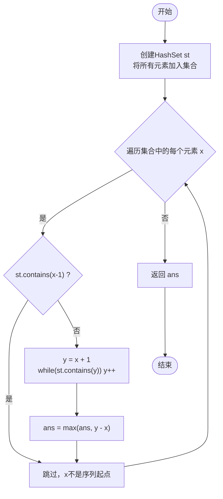

**图表来源**
- [$_0128_最长连续序列.java:46-71](file://src/main/java/hot100/leetcode/editor/cn/$_0128_最长连续序列.java#L46-L71)

章节来源
- [$_0128_最长连续序列.java:17-36](file://src/main/java/hot100/leetcode/editor/cn/$_0128_最长连续序列.java#L17-L36)
- [$_0128_最长连续序列.java:46-71](file://src/main/java/hot100/leetcode/editor/cn/$_0128_最长连续序列.java#L46-L71)
- [$_0128_最长连续序列.md:1-288](file://src/main/java/hot100/leetcode/editor/cn/doc/content/$_0128_最长连续序列.md#L1-L288)

## 依赖关系分析
- 模块内聚性
  - 每道题独立成类，职责单一，便于单元测试与复用。
- 外部依赖
  - 主要依赖标准库：java.util.*、java.lang.Math、Arrays等。
- 潜在循环依赖
  - 各题之间无相互import，耦合度低。

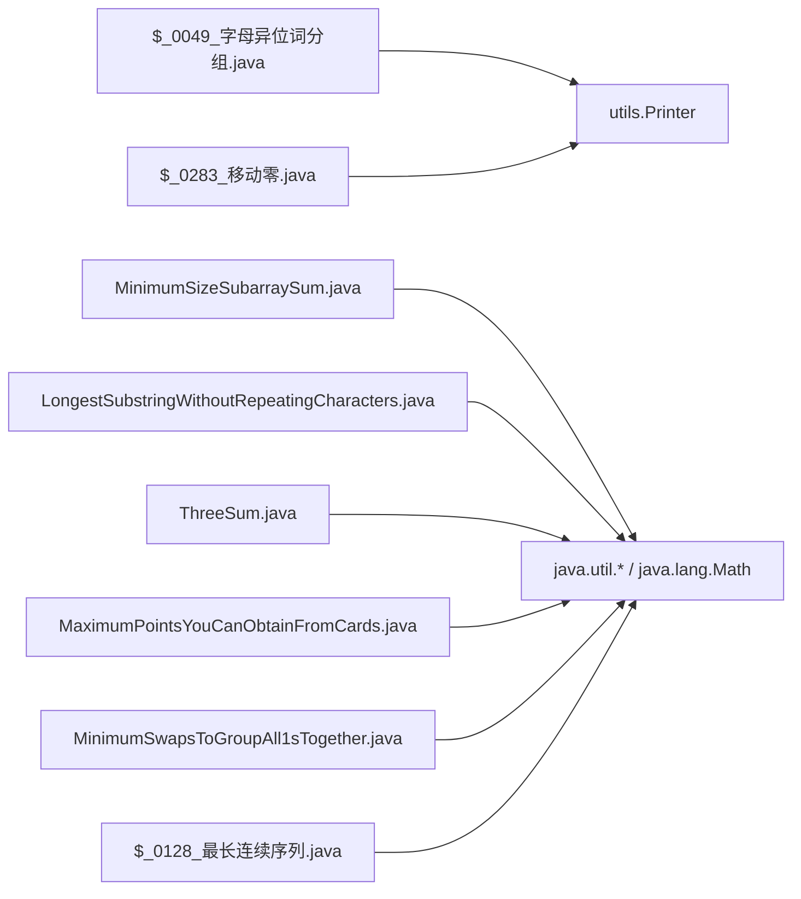

**图表来源**
- [$_0049_字母异位词分组.java:1-10](file://src/main/java/hot100/leetcode/editor/cn/$_0049_字母异位词分组.java#L1-L10)
- [$_0283_移动零.java:1-10](file://src/main/java/hot100/leetcode/editor/cn/$_0283_移动零.java#L1-L10)
- [MinimumSizeSubarraySum.java:52-56](file://src/main/java/leetcode/editor/cn/MinimumSizeSubarraySum.java#L52-L56)
- [LongestSubstringWithoutRepeatingCharacters.java:45-55](file://src/main/java/leetcode/editor/cn/LongestSubstringWithoutRepeatingCharacters.java#L45-L55)
- [ThreeSum.java:52-60](file://src/main/java/leetcode/editor/cn/ThreeSum.java#L52-L60)
- [MaximumPointsYouCanObtainFromCards.java:59-63](file://src/main/java/leetcode/editor/cn/MaximumPointsYouCanObtainFromCards.java#L59-L63)
- [MinimumSwapsToGroupAll1sTogether.java:55-59](file://src/main/java/hot100/leetcode/editor/cn/$_0128_最长连续序列.java#L55-L59)
- [$_0128_最长连续序列.java:3-8](file://src/main/java/hot100/leetcode/editor/cn/$_0128_最长连续序列.java#L3-L8)

章节来源
- [$_0049_字母异位词分组.java:1-10](file://src/main/java/hot100/leetcode/editor/cn/$_0049_字母异位词分组.java#L1-L10)
- [$_0283_移动零.java:1-10](file://src/main/java/hot100/leetcode/editor/cn/$_0283_移动零.java#L1-L10)
- [MinimumSizeSubarraySum.java:52-56](file://src/main/java/leetcode/editor/cn/MinimumSizeSubarraySum.java#L52-L56)
- [LongestSubstringWithoutRepeatingCharacters.java:45-55](file://src/main/java/leetcode/editor/cn/LongestSubstringWithoutRepeatingCharacters.java#L45-L55)
- [ThreeSum.java:52-60](file://src/main/java/leetcode/editor/cn/ThreeSum.java#L52-L60)
- [MaximumPointsYouCanObtainFromCards.java:59-63](file://src/main/java/leetcode/editor/cn/MaximumPointsYouCanObtainFromCards.java#L59-L63)
- [MinimumSwapsToGroupAll1sTogether.java:55-59](file://src/main/java/hot100/leetcode/editor/cn/$_0128_最长连续序列.java#L55-L59)
- [$_0128_最长连续序列.java:3-8](file://src/main/java/hot100/leetcode/editor/cn/$_0128_最长连续序列.java#L3-L8)

## 性能考量
- 时间复杂度优先
  - 滑动窗口与双指针通常可将O(n^2)降为O(n)。
  - 哈希表分组将匹配从比较转为O(1)查找。
  - 最长连续序列通过起点检测避免重复遍历，确保O(n)均摊复杂度。
- 空间复杂度控制
  - 尽量使用原地操作与常数级辅助空间。
  - 字符集较小时用定长数组替代HashMap以降低开销。
  - 哈希集合去重可减少重复计算。
- 边界与常量
  - 注意Integer.MAX_VALUE溢出风险（本题未涉及大数乘积，但需注意累加范围）。
  - 环形窗口索引取模需谨慎，避免负数或越界。
  - 大整数范围处理需要考虑边界情况。

## 故障排查指南
- 常见错误
  - 窗口收缩时机错误导致漏算或重复计算。
  - 去重逻辑不完整导致结果重复。
  - 环形窗口索引计算错误。
  - 最长连续序列中忘记检查x-1是否存在导致重复计算。
- 调试建议
  - 打印窗口左右边界与当前状态（sum/maxOnes/ans）。
  - 针对极端用例：空串、全0、全非0、k=0/k=n、target极大。
  - 对于最长连续序列，验证是否只从真正的起点开始查找。
- 定位路径
  - [MinimumSizeSubarraySum.java:57-71](file://src/main/java/leetcode/editor/cn/MinimumSizeSubarraySum.java#L57-L71)
  - [LongestSubstringWithoutRepeatingCharacters.java:56-71](file://src/main/java/leetcode/editor/cn/LongestSubstringWithoutRepeatingCharacters.java#L56-L71)
  - [ThreeSum.java:62-90](file://src/main/java/leetcode/editor/cn/ThreeSum.java#L62-L90)
  - [MaximumPointsYouCanObtainFromCards.java:65-84](file://src/main/java/leetcode/editor/cn/MaximumPointsYouCanObtainFromCards.java#L65-L84)
  - [MinimumSwapsToGroupAll1sTogether.java:61-74](file://src/main/java/hot100/leetcode/editor/cn/$_0128_最长连续序列.java#L61-L74)
  - [$_0128_最长连续序列.java:46-71](file://src/main/java/hot100/leetcode/editor/cn/$_0128_最长连续序列.java#L46-L71)

## 结论
上述中等题围绕滑动窗口、双指针、哈希表与前缀和展开，体现了"问题转化+窗口维护+去重/剪枝"的核心范式。新增的最长连续序列题目展示了如何通过巧妙的起点检测和区间合并思想达到O(n)时间复杂度。掌握这些模板与细节，可在面试与竞赛中快速建模与高效实现。

## 附录：算法模板与扩展思考
- 滑动窗口模板
  - 变长窗口：右扩累加，满足条件时收缩左边界并更新答案。
  - 固定窗口：先计算初始窗口，再整体平移更新。
- 双指针模板
  - 有序数组：固定一端，另一端双向逼近。
  - 原地重排：快慢指针或交换维护分区。
- 哈希分组模板
  - 键设计：排序串、计数串、特征向量。
- 前缀和模板
  - 区间和问题：O(1)查询，结合二分或单调栈扩展。
- **最长连续序列模板**
  - 起点检测：只从x-1不在集合中的元素开始查找
  - 区间合并：维护左右端点映射，合并相邻区间
- 扩展思考
  - 将"从两端取k个"转化为"去掉中间n-k个"的视角转换。
  - 将"最少交换"转化为"窗口内最优目标"的计数问题。
  - 将"最长连续序列"转化为"区间合并"或"起点检测"的问题。