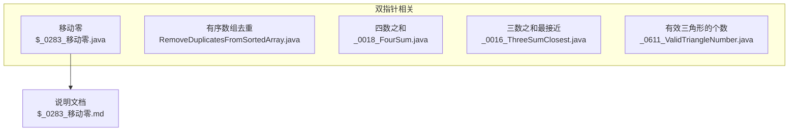
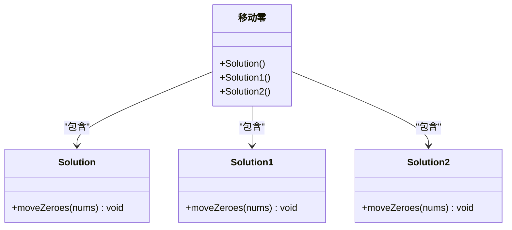
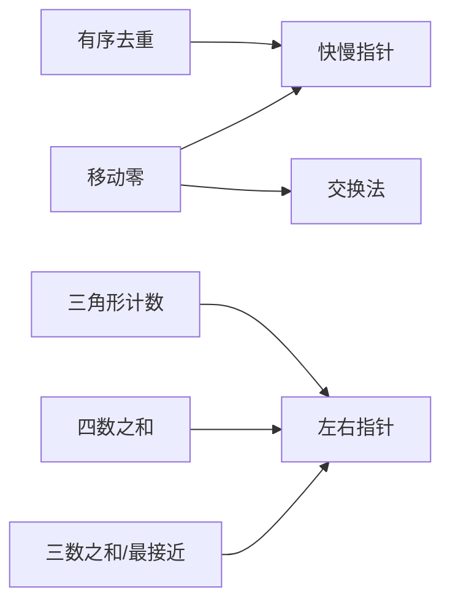

# 双指针问题

<cite>
**本文引用的文件**
- [$_0283_移动零.java](file://src/main/java/hot100/leetcode/editor/cn/$_0283_移动零.java)
- [$_0283_移动零.md](file://src/main/java/hot100/leetcode/editor/cn/doc/content/$_0283_移动零.md)
- [RemoveDuplicatesFromSortedArray.java](file://src/main/java/leetcode/editor/cn/RemoveDuplicatesFromSortedArray.java)
- [_0611_ValidTriangleNumber.java](file://src/main/java/leetcode/editor/cn/_0611_ValidTriangleNumber.java)
- [_0018_FourSum.java](file://src/main/java/leetcode/editor/cn/_0018_FourSum.java)
- [_0016_ThreeSumClosest.java](file://src/main/java/leetcode/editor/cn/_0016_ThreeSumClosest.java)
</cite>

## 目录
1. [引言](#引言)
2. [项目结构](#项目结构)
3. [核心组件](#核心组件)
4. [架构总览](#架构总览)
5. [详细组件分析](#详细组件分析)
6. [依赖关系分析](#依赖关系分析)
7. [性能与复杂度](#性能与复杂度)
8. [故障排查指南](#故障排查指南)
9. [结论](#结论)
10. [附录：模板与变体](#附录模板与变体)

## 引言
本文件聚焦 LeetCode 中等难度中的“双指针”主题，以“移动零”为核心案例，系统讲解原地操作技巧与双指针的应用模式。内容覆盖左右指针、快慢指针等策略的使用场景、实现细节、边界条件处理，并给出多种变体问题的扩展思考与通用模板总结，帮助读者建立可复用的解题框架。

## 项目结构
围绕“双指针”主题，仓库中与本题及典型双指针问题相关的源码分布如下：
- 移动零（原地重排）：hot100 专题下的 $_0283_移动零.java 及其说明文档
- 去重（有序数组）：RemoveDuplicatesFromSortedArray.java
- 三数之和/最接近目标值：_0018_FourSum.java、_0016_ThreeSumClosest.java
- 三角形计数（排序+双指针）：_0611_ValidTriangleNumber.java



**图表来源**
- [$_0283_移动零.java](file://src/main/java/hot100/leetcode/editor/cn/$_0283_移动零.java)
- [$_0283_移动零.md](file://src/main/java/hot100/leetcode/editor/cn/doc/content/$_0283_移动零.md)
- [RemoveDuplicatesFromSortedArray.java](file://src/main/java/leetcode/editor/cn/RemoveDuplicatesFromSortedArray.java)
- [_0018_FourSum.java](file://src/main/java/leetcode/editor/cn/_0018_FourSum.java)
- [_0016_ThreeSumClosest.java](file://src/main/java/leetcode/editor/cn/_0016_ThreeSumClosest.java)
- [_0611_ValidTriangleNumber.java](file://src/main/java/leetcode/editor/cn/_0611_ValidTriangleNumber.java)

**章节来源**
- [$_0283_移动零.java](file://src/main/java/hot100/leetcode/editor/cn/$_0283_移动零.java)
- [$_0283_移动零.md](file://src/main/java/hot100/leetcode/editor/cn/doc/content/$_0283_移动零.md)
- [RemoveDuplicatesFromSortedArray.java](file://src/main/java/leetcode/editor/cn/RemoveDuplicatesFromSortedArray.java)
- [_0018_FourSum.java](file://src/main/java/leetcode/editor/cn/_0018_FourSum.java)
- [_0016_ThreeSumClosest.java](file://src/main/java/leetcode/editor/cn/_0016_ThreeSumClosest.java)
- [_0611_ValidTriangleNumber.java](file://src/main/java/leetcode/editor/cn/_0611_ValidTriangleNumber.java)

## 核心组件
- 移动零（原地重排）：提供三种常见思路
  - 快慢指针（先写非零，再填零）
  - 栈思想（用下标模拟入栈位置）
  - 交换法（一次遍历，遇到非零就与 i0 交换）
- 有序数组去重：经典快慢指针，维护不重复区间
- 三数之和/最接近目标值：排序后固定一个元素，左右指针收缩
- 三角形计数：排序后固定最大边，左右指针统计合法组合

这些组件共同体现了双指针在“原地修改”“减少额外空间”“控制时间复杂度”方面的核心价值。

**章节来源**
- [$_0283_移动零.java](file://src/main/java/hot100/leetcode/editor/cn/$_0283_移动零.java)
- [RemoveDuplicatesFromSortedArray.java](file://src/main/java/leetcode/editor/cn/RemoveDuplicatesFromSortedArray.java)
- [_0018_FourSum.java](file://src/main/java/leetcode/editor/cn/_0018_FourSum.java)
- [_0016_ThreeSumClosest.java](file://src/main/java/leetcode/editor/cn/_0016_ThreeSumClosest.java)
- [_0611_ValidTriangleNumber.java](file://src/main/java/leetcode/editor/cn/_0611_ValidTriangleNumber.java)

## 架构总览
下图展示“移动零”的三种解法在代码层面的类与方法关系，便于理解不同策略的实现差异与复用点。



**图表来源**
- [$_0283_移动零.java](file://src/main/java/hot100/leetcode/editor/cn/$_0283_移动零.java)

## 详细组件分析

### 移动零（原地重排）
- 目标：将所有 0 移动到末尾，保持非零元素的相对顺序，且原地修改。
- 关键技巧：
  - 快慢指针：慢指针指向下一个应写入非零的位置；快指针扫描全数组。
  - 交换法：维护一个“全零窗口”左边界 i0，遇到非零即与 i0 交换，然后右移 i0。
  - 两次扫描：先收集非零，再统一填充尾部为 0。

```mermaid
flowchart TD
Start(["开始"]) --> Init["初始化 l=0"]
Init --> Loop{"i 从 0 到 n-1"}
Loop --> |nums[i] != 0| Write["nums[l]=nums[i]; l++"]
Write --> NextI["i++"]
Loop --> |nums[i] == 0| NextI
NextI --> Loop
Loop --> |结束| Fill["将 nums[l..n-1] 置为 0"]
Fill --> End(["结束"])
```

**图表来源**
- [$_0283_移动零.java](file://src/main/java/hot100/leetcode/editor/cn/$_0283_移动零.java)

- 算法步骤（快慢指针版）
  - 初始化 l=0
  - 遍历 i=0..n-1：若 nums[i]!=0，则 nums[l]=nums[i]，l++
  - 最后将 nums[l..n-1] 全部置 0
- 边界条件
  - 空数组或长度为 1：直接返回
  - 全 0 或无 0：逻辑仍成立
- 复杂度
  - 时间 O(n)，空间 O(1)
- 参考路径
  - [$_0283_移动零.java](file://src/main/java/hot100/leetcode/editor/cn/$_0283_移动零.java)

- 交换法（一次遍历）
  - 维护 i0 表示“全零窗口”的左边界
  - 当 nums[i]!=0 时，交换 nums[i] 与 nums[i0]，i0++
  - 优点：仅一次遍历，交换次数更少
- 参考路径
  - [$_0283_移动零.java](file://src/main/java/hot100/leetcode/editor/cn/$_0283_移动零.java)

- 与“移除元素”的关系
  - 可复用“移除元素”的思路：先去除所有 0，再将剩余部分补 0
  - 该思路在官方题解中也有体现
- 参考路径
  - [$_0283_移动零.md](file://src/main/java/hot100/leetcode/editor/cn/doc/content/$_0283_移动零.md)

**章节来源**
- [$_0283_移动零.java](file://src/main/java/hot100/leetcode/editor/cn/$_0283_移动零.java)
- [$_0283_移动零.md](file://src/main/java/hot100/leetcode/editor/cn/doc/content/$_0283_移动零.md)

### 有序数组去重（快慢指针）
- 目标：原地删除重复项，使每个元素只出现一次，返回新长度。
- 关键点：
  - 使用 l 指向“不重复区间的最后一个位置”
  - i 从 1 开始扫描，若 nums[i]!=nums[l]，则 l++ 并将 nums[i] 写入 l
- 复杂度
  - 时间 O(n)，空间 O(1)
- 参考路径
  - [RemoveDuplicatesFromSortedArray.java](file://src/main/java/leetcode/editor/cn/RemoveDuplicatesFromSortedArray.java)

**章节来源**
- [RemoveDuplicatesFromSortedArray.java](file://src/main/java/leetcode/editor/cn/RemoveDuplicatesFromSortedArray.java)

### 三数之和/最接近目标值（左右指针）
- 三数之和最接近
  - 排序后固定 i，左右指针 j,k 向中间收缩，根据差值调整方向
  - 注意更新“最接近”的答案，并在相等时提前返回
- 四数之和
  - 两层循环固定 i,j，再用左右指针 m,n 寻找两数之和
  - 需要跳过重复元素以避免重复答案
- 复杂度
  - 排序 O(n log n)，双指针 O(n^2)
- 参考路径
  - [_0016_ThreeSumClosest.java](file://src/main/java/leetcode/editor/cn/_0016_ThreeSumClosest.java)
  - [_0018_FourSum.java](file://src/main/java/leetcode/editor/cn/_0018_FourSum.java)

**章节来源**
- [_0016_ThreeSumClosest.java](file://src/main/java/leetcode/editor/cn/_0016_ThreeSumClosest.java)
- [_0018_FourSum.java](file://src/main/java/leetcode/editor/cn/_0018_FourSum.java)

### 有效三角形的个数（排序+左右指针）
- 思路：
  - 排序后固定最大边 i，左右指针 m,n 在 [0,i-1] 范围内查找满足三角不等式的三元组
  - 若 nums[m]+nums[n]<=nums[i]，m++；否则，[m,n) 内任意与 n 的组合均合法，累加 n-m 并 n--
- 复杂度
  - 排序 O(n log n)，双指针 O(n^2)
- 参考路径
  - [_0611_ValidTriangleNumber.java](file://src/main/java/leetcode/editor/cn/_0611_ValidTriangleNumber.java)

**章节来源**
- [_0611_ValidTriangleNumber.java](file://src/main/java/leetcode/editor/cn/_0611_ValidTriangleNumber.java)

## 依赖关系分析
- 移动零的三种实现相互独立，分别体现不同的双指针策略
- 其他题目通过“排序+双指针”形成统一的左右指针范式
- 整体耦合度低，适合按题型分类学习



**图表来源**
- [$_0283_移动零.java](file://src/main/java/hot100/leetcode/editor/cn/$_0283_移动零.java)
- [RemoveDuplicatesFromSortedArray.java](file://src/main/java/leetcode/editor/cn/RemoveDuplicatesFromSortedArray.java)
- [_0016_ThreeSumClosest.java](file://src/main/java/leetcode/editor/cn/_0016_ThreeSumClosest.java)
- [_0018_FourSum.java](file://src/main/java/leetcode/editor/cn/_0018_FourSum.java)
- [_0611_ValidTriangleNumber.java](file://src/main/java/leetcode/editor/cn/_0611_ValidTriangleNumber.java)

## 性能与复杂度
- 移动零
  - 快慢指针：O(n) 时间，O(1) 空间
  - 交换法：O(n) 时间，O(1) 空间，通常交换次数更少
- 有序去重：O(n) 时间，O(1) 空间
- 三数之和/最接近：O(n^2) 时间，O(1) 额外空间（不计排序开销）
- 四数之和：O(n^2) 时间，O(1) 额外空间（不计排序开销）
- 三角形计数：O(n^2) 时间，O(1) 额外空间（不计排序开销）

[本节为通用性能讨论，无需具体文件引用]

## 故障排查指南
- 移动零
  - 忘记最后填充 0：会导致尾部残留旧数据
  - 越界访问：确保 l 不超过数组长度
  - 原地交换时的顺序：避免覆盖未处理元素
- 有序去重
  - 初始 l 的取值：应从 0 开始，i 从 1 开始比较
  - 返回值应为 l+1
- 三数/四数之和
  - 未排序导致左右指针失效
  - 未跳过重复元素导致结果重复
  - 溢出风险：求和时使用更大类型或提前剪枝
- 三角形计数
  - 未排序导致三角不等式判断错误
  - 累加范围计算错误：应为 n-m

[本节为通用排查建议，无需具体文件引用]

## 结论
双指针是解决大量数组/字符串问题的利器。通过“快慢指针”“左右指针”“交换法”等模式，可以在 O(n) 或 O(n^2) 时间内完成复杂任务，同时保持 O(1) 额外空间。掌握这些模式与边界处理，能显著提升解题效率与代码质量。

[本节为总结性内容，无需具体文件引用]

## 附录：模板与变体

### 快慢指针模板（原地重排）
- 适用：过滤/重排元素，保持相对顺序
- 要点：
  - slow 指向下一个写入位置
  - fast 扫描全序列
  - 结束时按需填充尾部
- 参考路径
  - [$_0283_移动零.java](file://src/main/java/hot100/leetcode/editor/cn/$_0283_移动零.java)

### 交换法模板（一次遍历）
- 适用：将特定元素移到末尾或开头
- 要点：
  - 维护“目标区域”的边界
  - 遇到不符合条件的元素即与边界交换
- 参考路径
  - [$_0283_移动零.java](file://src/main/java/hot100/leetcode/editor/cn/$_0283_移动零.java)

### 左右指针模板（排序后搜索）
- 适用：两数/三数/四数之和、最接近目标值、三角形计数等
- 要点：
  - 先排序
  - 固定外层索引，左右指针向中间收缩
  - 注意去重与剪枝
- 参考路径
  - [_0016_ThreeSumClosest.java](file://src/main/java/leetcode/editor/cn/_0016_ThreeSumClosest.java)
  - [_0018_FourSum.java](file://src/main/java/leetcode/editor/cn/_0018_FourSum.java)
  - [_0611_ValidTriangleNumber.java](file://src/main/java/leetcode/editor/cn/_0611_ValidTriangleNumber.java)

### 有序去重模板
- 适用：有序数组去重、保留 k 个重复等
- 要点：
  - 维护不重复区间尾指针
  - 遇到新元素才写入
- 参考路径
  - [RemoveDuplicatesFromSortedArray.java](file://src/main/java/leetcode/editor/cn/RemoveDuplicatesFromSortedArray.java)