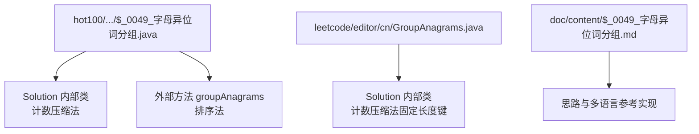
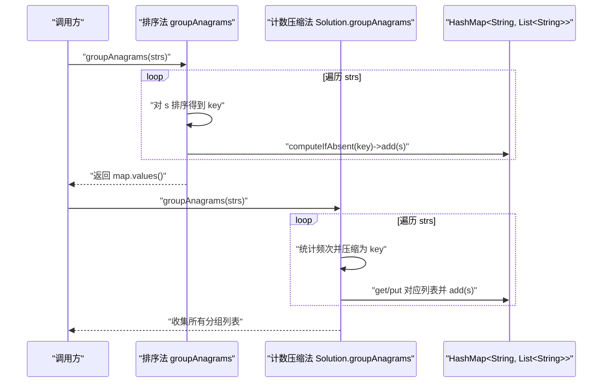
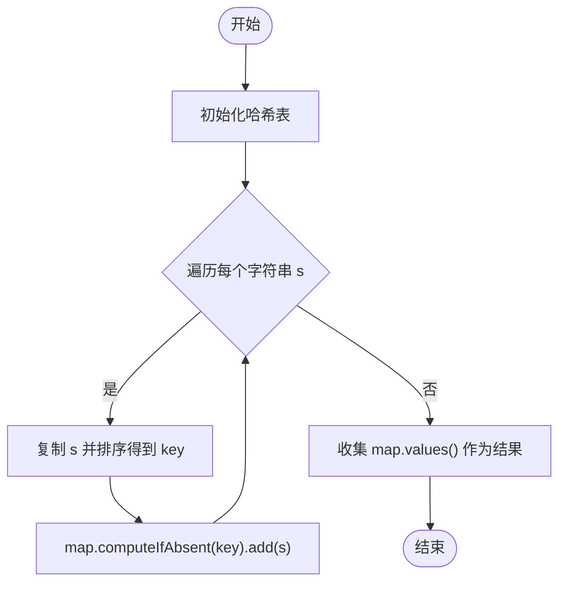
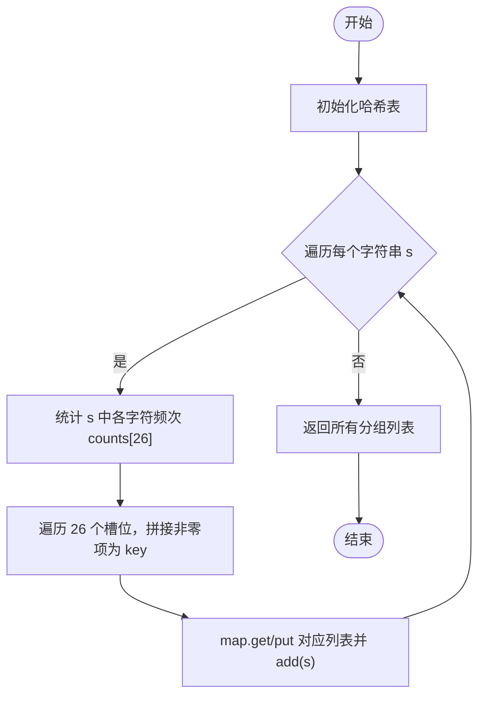
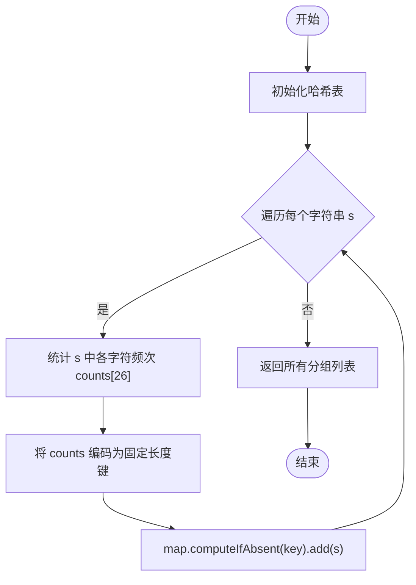
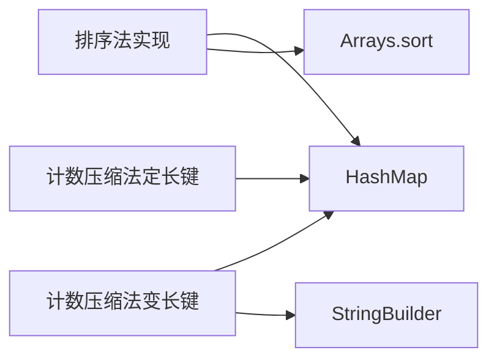

# 哈希表问题

<cite>
**本文引用的文件**   
- [src/main/java/hot100/leetcode/editor/cn/$_0049_字母异位词分组.java](file://src/main/java/hot100/leetcode/editor/cn/$_0049_字母异位词分组.java)
- [src/main/java/leetcode/editor/cn/GroupAnagrams.java](file://src/main/java/leetcode/editor/cn/GroupAnagrams.java)
- [src/main/java/hot100/leetcode/editor/cn/doc/content/$_0049_字母异位词分组.md](file://src/main/java/hot100/leetcode/editor/cn/doc/content/$_0049_字母异位词分组.md)
</cite>

## 目录
1. [引言](#引言)
2. [项目结构](#项目结构)
3. [核心组件](#核心组件)
4. [架构总览](#架构总览)
5. [详细组件分析](#详细组件分析)
6. [依赖关系分析](#依赖关系分析)
7. [性能考量](#性能考量)
8. [故障排查指南](#故障排查指南)
9. [结论](#结论)
10. [附录](#附录)

## 引言
本文件聚焦于 LeetCode 中等难度中的哈希表相关问题，重点围绕“字母异位词分组”这一经典题目展开。我们将系统讲解两种主流解法：排序法与计数压缩法，深入剖析键值设计、冲突处理与优化策略，并给出时间/空间复杂度分析与性能对比。同时提供完整的代码实现路径与测试用例说明，覆盖边界条件与异常情况的处理建议。

## 项目结构
仓库中与本题相关的核心代码位于两个位置：
- hot100 专题目录下的题解类，包含两种解法的内联实现与示例入口
- leetcode.editor.cn 目录下的标准题解类，采用计数压缩法生成唯一键进行分组

图表来源
- [src/main/java/hot100/leetcode/editor/cn/$_0049_字母异位词分组.java:11-77](file://src/main/java/hot100/leetcode/editor/cn/$_0049_字母异位词分组.java#L11-L77)
- [src/main/java/leetcode/editor/cn/GroupAnagrams.java:46-75](file://src/main/java/leetcode/editor/cn/GroupAnagrams.java#L46-L75)
- [src/main/java/hot100/leetcode/editor/cn/doc/content/$_0049_字母异位词分组.md:55-71](file://src/main/java/hot100/leetcode/editor/cn/doc/content/$_0049_字母异位词分组.md#L55-L71)

章节来源
- [src/main/java/hot100/leetcode/editor/cn/$_0049_字母异位词分组.java:11-77](file://src/main/java/hot100/leetcode/editor/cn/$_0049_字母异位词分组.java#L11-L77)
- [src/main/java/leetcode/editor/cn/GroupAnagrams.java:46-75](file://src/main/java/leetcode/editor/cn/GroupAnagrams.java#L46-L75)
- [src/main/java/hot100/leetcode/editor/cn/doc/content/$_0049_字母异位词分组.md:55-71](file://src/main/java/hot100/leetcode/editor/cn/doc/content/$_0049_字母异位词分组.md#L55-L71)

## 核心组件
- 计数压缩法（变长键）
  - 通过统计每个字符出现次数，将非零的“字符+频次”拼接为唯一键，用于哈希表分组
  - 优点：键长度与字符串中不同字符数相关，通常更短；适合字符集较小且分布稀疏的场景
  - 缺点：需要遍历 26 个槽位构建键，存在常数开销
- 排序法
  - 对每个字符串排序后作为键，相同异位词必然得到相同键
  - 优点：实现简洁直观；无需额外计数数组
  - 缺点：排序带来 O(L log L) 的额外开销，整体时间复杂度更高
- 计数压缩法（定长键）
  - 使用长度为 26 的整型数组表示频次，直接转为键（或编码为字节串），避免拼接开销
  - 优点：键构造稳定且高效；适合高频调用场景
  - 缺点：键长度固定，可能略大于实际需要的变长键

章节来源
- [src/main/java/hot100/leetcode/editor/cn/$_0049_字母异位词分组.java:14-49](file://src/main/java/hot100/leetcode/editor/cn/$_0049_字母异位词分组.java#L14-L49)
- [src/main/java/hot100/leetcode/editor/cn/$_0049_字母异位词分组.java:57-69](file://src/main/java/hot100/leetcode/editor/cn/$_0049_字母异位词分组.java#L57-L69)
- [src/main/java/leetcode/editor/cn/GroupAnagrams.java:51-71](file://src/main/java/leetcode/editor/cn/GroupAnagrams.java#L51-L71)

## 架构总览
下图展示了两种解法在函数层面的调用关系与数据流：

图表来源
- [src/main/java/hot100/leetcode/editor/cn/$_0049_字母异位词分组.java:57-69](file://src/main/java/hot100/leetcode/editor/cn/$_0049_字母异位词分组.java#L57-L69)
- [src/main/java/hot100/leetcode/editor/cn/$_0049_字母异位词分组.java:14-49](file://src/main/java/hot100/leetcode/editor/cn/$_0049_字母异位词分组.java#L14-L49)

## 详细组件分析

### 组件一：排序法（按排序后的字符串作为键）
- 算法流程
  - 初始化哈希表，键为排序后的字符串，值为该组异位词列表
  - 遍历输入数组，对每个字符串排序后作为键插入到哈希表中
  - 最后收集所有分组列表作为结果
- 复杂度分析
  - 时间复杂度：O(N·L log L)，其中 N 为字符串个数，L 为平均字符串长度
  - 空间复杂度：O(N·L) 存储结果与哈希表键值
- 适用场景
  - 字符串较短、实现要求简洁时优先选择
- 关键实现要点
  - 使用 computeIfAbsent 简化空值判断与插入逻辑
  - 注意不要修改原始字符串，而是基于副本排序

图表来源
- [src/main/java/hot100/leetcode/editor/cn/$_0049_字母异位词分组.java:57-69](file://src/main/java/hot100/leetcode/editor/cn/$_0049_字母异位词分组.java#L57-L69)

章节来源
- [src/main/java/hot100/leetcode/editor/cn/$_0049_字母异位词分组.java:57-69](file://src/main/java/hot100/leetcode/editor/cn/$_0049_字母异位词分组.java#L57-L69)

### 组件二：计数压缩法（变长键）
- 算法流程
  - 对每个字符串统计 a-z 的出现次数
  - 仅拼接出现过的“字符+频次”，形成变长唯一键
  - 以该键为分组依据存入哈希表
- 复杂度分析
  - 时间复杂度：O(N·(L + Σ))，Σ 为字符集大小（此处为 26），总体近似 O(N·L)
  - 空间复杂度：O(N·L) 存储结果与键值
- 适用场景
  - 字符串较长且字符种类有限时，优于排序法
- 关键实现要点
  - 使用 int[26] 统计频次
  - 仅对非零项拼接，减少键长度
  - 注意空串的特殊处理

图表来源
- [src/main/java/hot100/leetcode/editor/cn/$_0049_字母异位词分组.java:14-49](file://src/main/java/hot100/leetcode/editor/cn/$_0049_字母异位词分组.java#L14-L49)

章节来源
- [src/main/java/hot100/leetcode/editor/cn/$_0049_字母异位词分组.java:14-49](file://src/main/java/hot100/leetcode/editor/cn/$_0049_字母异位词分组.java#L14-L49)

### 组件三：计数压缩法（定长键）
- 算法流程
  - 对每个字符串统计 a-z 的频次
  - 将长度为 26 的计数数组直接编码为键（例如固定长度的字符串或字节序列）
  - 以该键为分组依据存入哈希表
- 复杂度分析
  - 时间复杂度：O(N·(L + Σ))，Σ=26，总体近似 O(N·L)
  - 空间复杂度：O(N·L) 存储结果与键值
- 适用场景
  - 追求稳定的键构造过程，避免频繁拼接带来的开销
- 关键实现要点
  - 使用固定长度编码，便于快速比较与哈希
  - 注意编码方式的一致性，确保异位词映射到同一键

图表来源
- [src/main/java/leetcode/editor/cn/GroupAnagrams.java:51-71](file://src/main/java/leetcode/editor/cn/GroupAnagrams.java#L51-L71)

章节来源
- [src/main/java/leetcode/editor/cn/GroupAnagrams.java:51-71](file://src/main/java/leetcode/editor/cn/GroupAnagrams.java#L51-L71)

## 依赖关系分析
- 模块耦合
  - 两种解法均依赖 Java 标准库的 HashMap、ArrayList、Arrays 等集合与工具类
  - 计数压缩法还依赖 StringBuilder 进行键构建（变长键）
- 外部依赖
  - 无第三方库依赖，纯标准库实现
- 潜在循环依赖
  - 当前实现为单文件独立方法，不存在循环依赖

图表来源
- [src/main/java/hot100/leetcode/editor/cn/$_0049_字母异位词分组.java:57-69](file://src/main/java/hot100/leetcode/editor/cn/$_0049_字母异位词分组.java#L57-L69)
- [src/main/java/hot100/leetcode/editor/cn/$_0049_字母异位词分组.java:14-49](file://src/main/java/hot100/leetcode/editor/cn/$_0049_字母异位词分组.java#L14-L49)
- [src/main/java/leetcode/editor/cn/GroupAnagrams.java:51-71](file://src/main/java/leetcode/editor/cn/GroupAnagrams.java#L51-L71)

章节来源
- [src/main/java/hot100/leetcode/editor/cn/$_0049_字母异位词分组.java:14-69](file://src/main/java/hot100/leetcode/editor/cn/$_0049_字母异位词分组.java#L14-L69)
- [src/main/java/leetcode/editor/cn/GroupAnagrams.java:51-71](file://src/main/java/leetcode/editor/cn/GroupAnagrams.java#L51-L71)

## 性能考量
- 排序法 vs 计数压缩法
  - 当字符串长度较大时，排序法的 O(L log L) 会成为瓶颈，计数压缩法更接近线性 O(L)
  - 计数压缩法的常数开销来自 26 槽位的遍历与键构建，但整体仍优于排序法
- 键设计与冲突处理
  - 变长键更紧凑，但构建过程涉及多次 append；定长键构建更快，但长度固定
  - 哈希冲突由底层 HashMap 处理，合理设计键可显著降低冲突概率
- 内存占用
  - 结果列表与键值对象会占用较多内存，建议在大规模数据下评估堆内存压力
- 优化建议
  - 预分配 HashMap 容量以减少扩容开销
  - 对于极长字符串，优先考虑定长键方案以降低拼接成本
  - 若字符集更大（如 Unicode），需调整计数数组大小或改用其他编码策略

[本节为通用性能讨论，不直接分析具体文件]

## 故障排查指南
- 常见错误与边界情况
  - 空字符串处理：空串应能正确分组，避免索引越界或空指针
  - 全相同字符：计数数组全部集中在一个槽位，键构建需正确处理
  - 大量重复异位词：哈希表值列表增长较快，注意内存使用
- 调试建议
  - 打印中间键值，验证异位词是否映射到同一键
  - 检查哈希表 values 的顺序是否与期望一致（题目允许任意顺序）
- 定位路径
  - 排序法实现路径：[src/main/java/hot100/leetcode/editor/cn/$_0049_字母异位词分组.java:57-69](file://src/main/java/hot100/leetcode/editor/cn/$_0049_字母异位词分组.java#L57-L69)
  - 计数压缩法（变长键）实现路径：[src/main/java/hot100/leetcode/editor/cn/$_0049_字母异位词分组.java:14-49](file://src/main/java/hot100/leetcode/editor/cn/$_0049_字母异位词分组.java#L14-L49)
  - 计数压缩法（定长键）实现路径：[src/main/java/leetcode/editor/cn/GroupAnagrams.java:51-71](file://src/main/java/leetcode/editor/cn/GroupAnagrams.java#L51-L71)

章节来源
- [src/main/java/hot100/leetcode/editor/cn/$_0049_字母异位词分组.java:14-69](file://src/main/java/hot100/leetcode/editor/cn/$_0049_字母异位词分组.java#L14-L69)
- [src/main/java/leetcode/editor/cn/GroupAnagrams.java:51-71](file://src/main/java/leetcode/editor/cn/GroupAnagrams.java#L51-L71)

## 结论
- 对于字母异位词分组问题，计数压缩法在时间与空间上通常优于排序法，尤其适用于长字符串与大规模数据
- 键设计是哈希表应用的核心：变长键更紧凑，定长键更高效；根据场景选择合适的编码策略
- 在实际工程中，建议结合数据特征（字符串长度、字符集、重复度）选择最优实现，并进行充分的边界与异常测试

[本节为总结性内容，不直接分析具体文件]

## 附录
- 测试用例建议
  - 基本用例：["eat","tea","tan","ate","nat","bat"]
  - 边界用例：[""]、["a"]、["aa","bb","cc"]
  - 极端用例：大量重复异位词、超长字符串、全相同字符
- 参考文档
  - 思路与多语言参考实现见：[src/main/java/hot100/leetcode/editor/cn/doc/content/$_0049_字母异位词分组.md:55-71](file://src/main/java/hot100/leetcode/editor/cn/doc/content/$_0049_字母异位词分组.md#L55-L71)

章节来源
- [src/main/java/hot100/leetcode/editor/cn/doc/content/$_0049_字母异位词分组.md:55-71](file://src/main/java/hot100/leetcode/editor/cn/doc/content/$_0049_字母异位词分组.md#L55-L71)