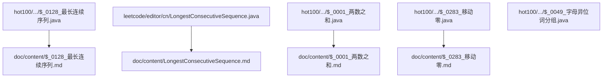
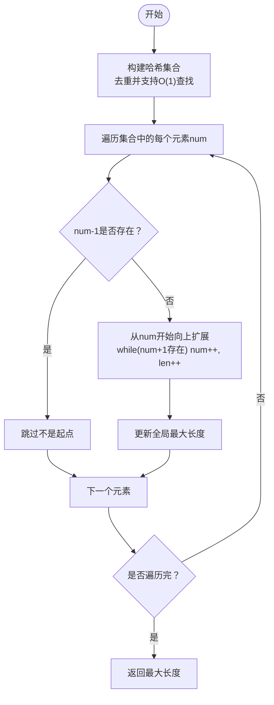
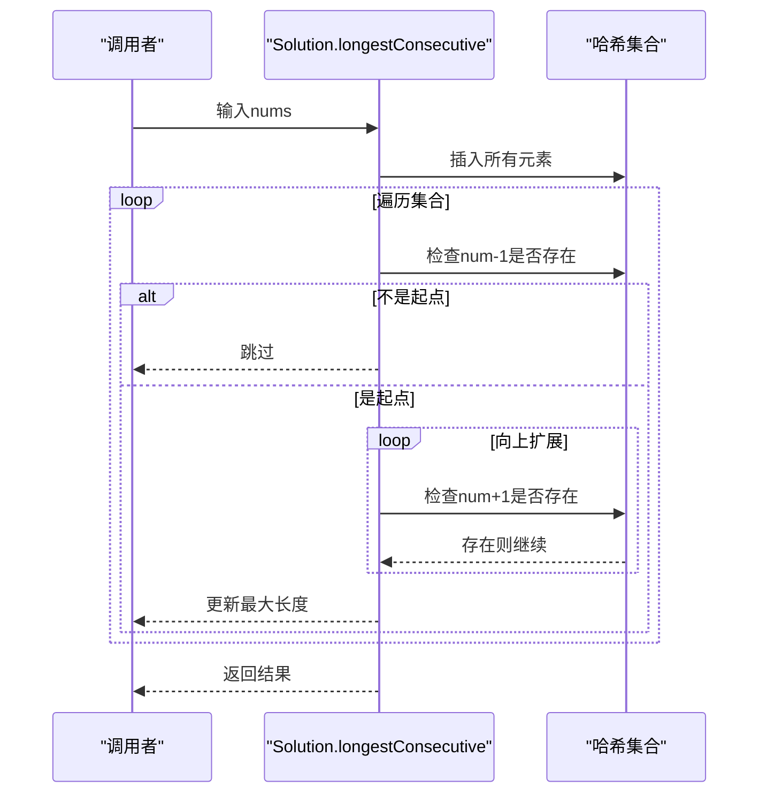
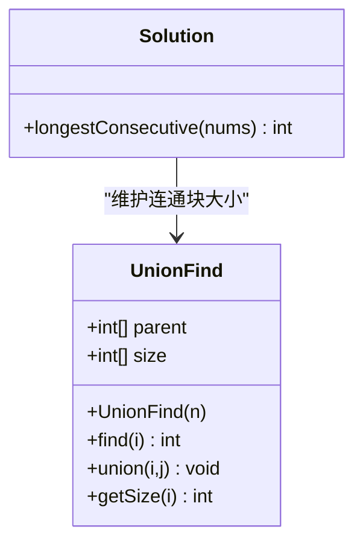
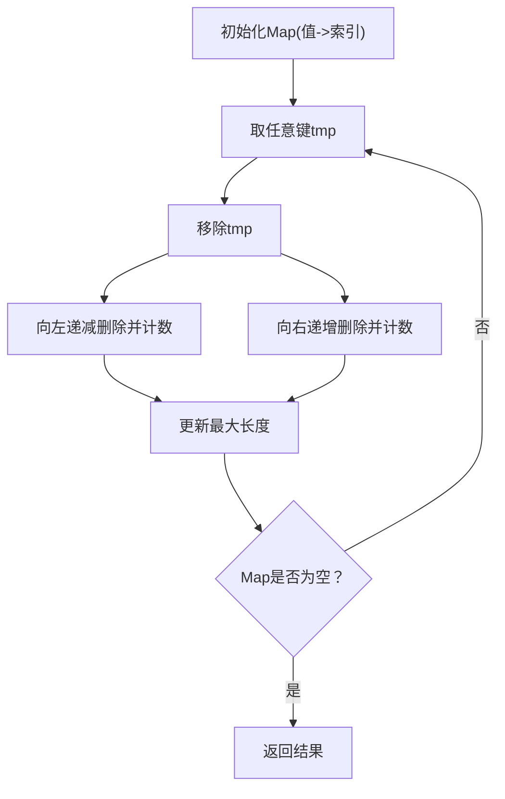
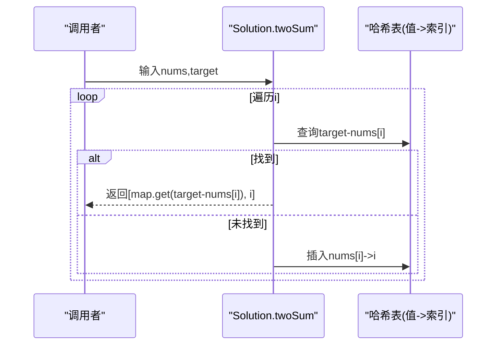
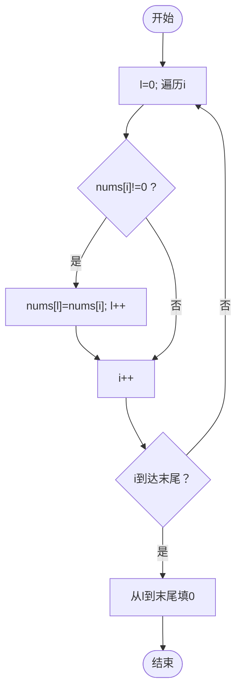
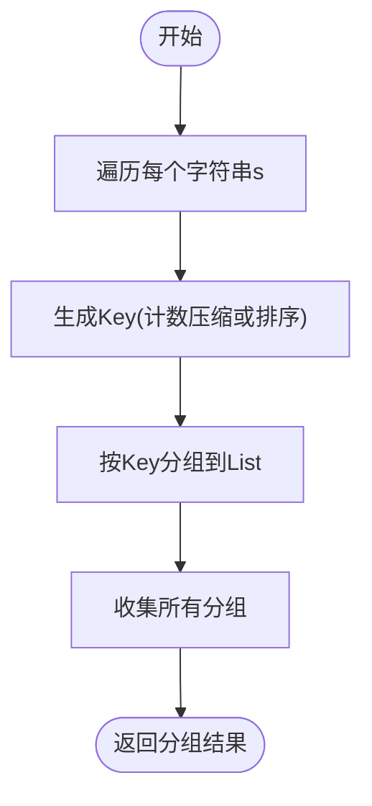
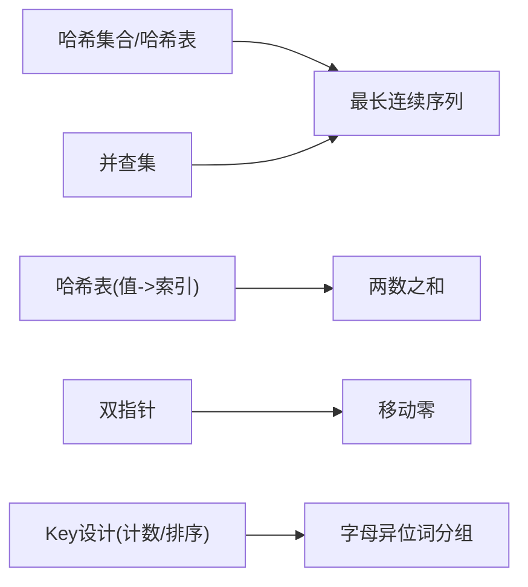

# 数组字符串问题

<cite>
**本文引用的文件**
- [最长连续序列（Java）](file://src/main/java/hot100/leetcode/editor/cn/$_0128_最长连续序列.java)
- [最长连续序列（题解文档）](file://src/main/java/hot100/leetcode/editor/cn/doc/content/$_0128_最长连续序列.md)
- [最长连续序列（另一实现）](file://src/main/java/leetcode/editor/cn/LongestConsecutiveSequence.java)
- [两数之和（Java）](file://src/main/java/hot100/leetcode/editor/cn/$_0001_两数之和.java)
- [两数之和（题解文档）](file://src/main/java/hot100/leetcode/editor/cn/doc/content/$_0001_两数之和.md)
- [移动零（Java）](file://src/main/java/hot100/leetcode/editor/cn/$_0283_移动零.java)
- [移动零（题解文档）](file://src/main/java/hot100/leetcode/editor/cn/doc/content/$_0283_移动零.md)
- [字母异位词分组（Java）](file://src/main/java/hot100/leetcode/editor/cn/$_0049_字母异位词分组.java)
</cite>

## 目录
1. [引言](#引言)
2. [项目结构](#项目结构)
3. [核心组件](#核心组件)
4. [架构总览](#架构总览)
5. [详细组件分析](#详细组件分析)
6. [依赖关系分析](#依赖关系分析)
7. [性能考量](#性能考量)
8. [故障排查指南](#故障排查指南)
9. [结论](#结论)
10. [附录](#附录)

## 引言
本文件聚焦于LeetCode中等难度中的“数组与字符串”主题，围绕“最长连续序列”这一经典问题展开，系统讲解多种解法：哈希集合优化、并查集思想等。重点阐述从O(n²)到O(n)的复杂度优化路径，解释数据结构选择的重要性（如HashSet在去重和查找中的应用），并提供完整的解题步骤图解、状态转移分析与测试用例设计建议。同时，结合仓库中其他典型题目（两数之和、移动零、字母异位词分组）展示常用技巧与模式。

## 项目结构
仓库采用按题号组织的方式，每个题目包含Java实现与配套题解Markdown。与本文相关的核心文件如下：
- 最长连续序列：提供空壳模板与题解文档，另有一处基于Map的实现
- 两数之和：哈希表单遍扫描的经典范式
- 移动零：双指针原地操作的多版本实现
- 字母异位词分组：哈希+计数/排序作为Key的模式

图表来源
- [最长连续序列（Java）:1-23](file://src/main/java/hot100/leetcode/editor/cn/$_0128_最长连续序列.java#L1-L23)
- [最长连续序列（题解文档）:1-288](file://src/main/java/hot100/leetcode/editor/cn/doc/content/$_0128_最长连续序列.md#L1-L288)
- [最长连续序列（另一实现）:1-91](file://src/main/java/leetcode/editor/cn/LongestConsecutiveSequence.java#L1-L91)
- [两数之和（Java）:1-35](file://src/main/java/hot100/leetcode/editor/cn/$_0001_两数之和.java#L1-L35)
- [两数之和（题解文档）:1-234](file://src/main/java/hot100/leetcode/editor/cn/doc/content/$_0001_两数之和.md#L1-L234)
- [移动零（Java）:1-68](file://src/main/java/hot100/leetcode/editor/cn/$_0283_移动零.java#L1-L68)
- [移动零（题解文档）:1-248](file://src/main/java/hot100/leetcode/editor/cn/doc/content/$_0283_移动零.md#L1-L248)
- [字母异位词分组（Java）:1-77](file://src/main/java/hot100/leetcode/editor/cn/$_0049_字母异位词分组.java#L1-L77)

章节来源
- [最长连续序列（Java）:1-23](file://src/main/java/hot100/leetcode/editor/cn/$_0128_最长连续序列.java#L1-L23)
- [最长连续序列（题解文档）:1-288](file://src/main/java/hot100/leetcode/editor/cn/doc/content/$_0128_最长连续序列.md#L1-L288)
- [最长连续序列（另一实现）:1-91](file://src/main/java/leetcode/editor/cn/LongestConsecutiveSequence.java#L1-L91)
- [两数之和（Java）:1-35](file://src/main/java/hot100/leetcode/editor/cn/$_0001_两数之和.java#L1-L35)
- [两数之和（题解文档）:1-234](file://src/main/java/hot100/leetcode/editor/cn/doc/content/$_0001_两数之和.md#L1-L234)
- [移动零（Java）:1-68](file://src/main/java/hot100/leetcode/editor/cn/$_0283_移动零.java#L1-L68)
- [移动零（题解文档）:1-248](file://src/main/java/hot100/leetcode/editor/cn/doc/content/$_0283_移动零.md#L1-L248)
- [字母异位词分组（Java）:1-77](file://src/main/java/hot100/leetcode/editor/cn/$_0049_字母异位词分组.java#L1-L77)

## 核心组件
- 最长连续序列：以哈希集合为核心，通过“仅从序列起点扩展”的策略将均摊时间复杂度降至O(n)。题解文档提供了多语言参考实现与复杂度说明。
- 两数之和：哈希表记录值到索引的映射，一次遍历完成匹配，是哈希表应用的入门范式。
- 移动零：双指针原地重排，提供两种思路（先覆盖再补零；交换滑动窗口）。
- 字母异位词分组：使用计数压缩或排序后的字符串作为哈希键进行分组。

章节来源
- [最长连续序列（题解文档）:45-65](file://src/main/java/hot100/leetcode/editor/cn/doc/content/$_0128_最长连续序列.md#L45-L65)
- [两数之和（Java）:13-26](file://src/main/java/hot100/leetcode/editor/cn/$_0001_两数之和.java#L13-L26)
- [移动零（Java）:12-23](file://src/main/java/hot100/leetcode/editor/cn/$_0283_移动零.java#L12-L23)
- [字母异位词分组（Java）:14-50](file://src/main/java/hot100/leetcode/editor/cn/$_0049_字母异位词分组.java#L14-L50)

## 架构总览
下图展示了“最长连续序列”问题的算法流程与关键数据结构交互。该流程体现了“空间换时间”的核心思想：用哈希集合快速判断存在性，并通过“只从起点扩展”避免重复计算。

图表来源
- [最长连续序列（题解文档）:45-65](file://src/main/java/hot100/leetcode/editor/cn/doc/content/$_0128_最长连续序列.md#L45-L65)

## 详细组件分析

### 最长连续序列（哈希集合优化）
- 目标：在未排序整数数组中找到数字连续的最长序列长度，要求O(n)时间。
- 关键点：
  - 使用哈希集合存储所有元素，便于O(1)存在性查询。
  - 仅当当前元素是某个连续序列的起点（即num-1不在集合中）时才开始扩展，避免重复计算。
  - 虽然外层for循环嵌套内层while循环，但每个元素最多被访问两次（一次作为起点检查，一次在扩展过程中），因此均摊时间复杂度为O(n)。
- 复杂度：
  - 时间：O(n)
  - 空间：O(n)（哈希集合）
- 常见陷阱：
  - 未判起点导致重复扩展，退化为O(n²)。
  - 对空数组的处理。
- 测试用例建议：
  - 基本：[100,4,200,1,3,2] → 4
  - 含重复：[0,3,7,2,5,8,4,6,0,1] → 9
  - 边界：[] → 0；[1] → 1；[-1,-2,-3] → 3
  - 大跨度：[10^9, -10^9, 10^9-1] → 2

图表来源
- [最长连续序列（题解文档）:156-189](file://src/main/java/hot100/leetcode/editor/cn/doc/content/$_0128_最长连续序列.md#L156-L189)

章节来源
- [最长连续序列（题解文档）:45-65](file://src/main/java/hot100/leetcode/editor/cn/doc/content/$_0128_最长连续序列.md#L45-L65)
- [最长连续序列（Java）:10-15](file://src/main/java/hot100/leetcode/editor/cn/$_0128_最长连续序列.java#L10-L15)

### 最长连续序列（并查集思路）
- 思路概述：
  - 将相邻数值视为图中的边，使用并查集维护连通块大小。
  - 每遇到一个数x，若x-1存在则将x与x-1合并；若x+1存在则将x与x+1合并。
  - 最终答案即为所有连通块大小的最大值。
- 复杂度：
  - 时间：近似O(n α(n))，α为反阿克曼函数，实际接近线性。
  - 空间：O(n)（并查集parent与size数组或哈希映射）。
- 适用场景：
  - 当需要动态维护“相邻关系”的连通性时，并查集非常直观。
- 注意：
  - 本题更常见的最优解法是哈希集合方案；并查集可作为拓展理解。

图表来源
- [最长连续序列（题解文档）:37-37](file://src/main/java/hot100/leetcode/editor/cn/doc/content/$_0128_最长连续序列.md#L37-L37)

章节来源
- [最长连续序列（题解文档）:37-37](file://src/main/java/hot100/leetcode/editor/cn/doc/content/$_0128_最长连续序列.md#L37-L37)

### 最长连续序列（基于Map的实现对比）
- 仓库中存在一种基于HashMap的实现，其核心思想是通过不断删除已访问元素来标记“已处理”，从而避免重复计算。
- 优点：无需额外集合，直接复用原数据结构的删除操作。
- 风险：
  - 迭代器与并发修改的边界条件需谨慎处理。
  - 递归左右扩展可能带来栈深度问题（极端情况下）。
- 复杂度：
  - 时间：均摊O(n)，因为每个元素最多被删除一次。
  - 空间：O(n)（Map本身）。

图表来源
- [最长连续序列（另一实现）:51-88](file://src/main/java/leetcode/editor/cn/LongestConsecutiveSequence.java#L51-L88)

章节来源
- [最长连续序列（另一实现）:51-88](file://src/main/java/leetcode/editor/cn/LongestConsecutiveSequence.java#L51-L88)

### 两数之和（哈希表范式）
- 思路：一次遍历，维护“值→索引”的哈希表，对于当前元素nums[i]，检查target-nums[i]是否已在表中。
- 复杂度：时间O(n)，空间O(n)。
- 价值：哈希表应用的基础范式，后续nSum系列可复用此模式。

图表来源
- [两数之和（Java）:13-26](file://src/main/java/hot100/leetcode/editor/cn/$_0001_两数之和.java#L13-L26)

章节来源
- [两数之和（Java）:13-26](file://src/main/java/hot100/leetcode/editor/cn/$_0001_两数之和.java#L13-L26)
- [两数之和（题解文档）:56-84](file://src/main/java/hot100/leetcode/editor/cn/doc/content/$_0001_两数之和.md#L56-L84)

### 移动零（双指针原地操作）
- 方法一：先覆盖非零元素，再填充尾部为零。
- 方法二：交换滑动窗口，保证前段全为非零，后段全为零。
- 复杂度：时间O(n)，空间O(1)。
- 要点：保持相对顺序（方法一天然保持；方法二需确保交换策略正确）。

图表来源
- [移动零（Java）:12-23](file://src/main/java/hot100/leetcode/editor/cn/$_0283_移动零.java#L12-L23)

章节来源
- [移动零（Java）:12-23](file://src/main/java/hot100/leetcode/editor/cn/$_0283_移动零.java#L12-L23)
- [移动零（题解文档）:44-57](file://src/main/java/hot100/leetcode/editor/cn/doc/content/$_0283_移动零.md#L44-L57)

### 字母异位词分组（哈希+计数/排序）
- 思路：
  - 计数压缩：统计字符频次，构造唯一Key（例如“字符+频次”拼接）。
  - 排序Key：将字符串排序后作为Key。
- 复杂度：
  - 计数压缩：时间O(n·k)，空间O(n·k)（n为字符串个数，k为平均长度）。
  - 排序Key：时间O(n·k log k)，空间O(n·k)。
- 适用性：适合分组类问题，Key的设计是关键。

图表来源
- [字母异位词分组（Java）:14-50](file://src/main/java/hot100/leetcode/editor/cn/$_0049_字母异位词分组.java#L14-L50)

章节来源
- [字母异位词分组（Java）:14-50](file://src/main/java/hot100/leetcode/editor/cn/$_0049_字母异位词分组.java#L14-L50)

## 依赖关系分析
- 最长连续序列：
  - 哈希集合方案依赖O(1)查找的数据结构，强调“去重+快速存在性判断”。
  - 并查集方案依赖连通块维护，适合“相邻关系”建模。
- 两数之和：
  - 依赖哈希表“值→索引”映射，体现“空间换时间”的典型用法。
- 移动零：
  - 纯数组原地操作，不依赖外部数据结构，强调双指针技巧。
- 字母异位词分组：
  - 依赖哈希表与Key设计（计数或排序），体现“等价类划分”的思想。

图表来源
- [最长连续序列（题解文档）:37-37](file://src/main/java/hot100/leetcode/editor/cn/doc/content/$_0128_最长连续序列.md#L37-L37)
- [两数之和（Java）:13-26](file://src/main/java/hot100/leetcode/editor/cn/$_0001_两数之和.java#L13-L26)
- [移动零（Java）:12-23](file://src/main/java/hot100/leetcode/editor/cn/$_0283_移动零.java#L12-L23)
- [字母异位词分组（Java）:14-50](file://src/main/java/hot100/leetcode/editor/cn/$_0049_字母异位词分组.java#L14-L50)

章节来源
- [最长连续序列（题解文档）:37-37](file://src/main/java/hot100/leetcode/editor/cn/doc/content/$_0128_最长连续序列.md#L37-L37)
- [两数之和（Java）:13-26](file://src/main/java/hot100/leetcode/editor/cn/$_0001_两数之和.java#L13-L26)
- [移动零（Java）:12-23](file://src/main/java/hot100/leetcode/editor/cn/$_0283_移动零.java#L12-L23)
- [字母异位词分组（Java）:14-50](file://src/main/java/hot100/leetcode/editor/cn/$_0049_字母异位词分组.java#L14-L50)

## 性能考量
- 哈希集合方案：
  - 优势：实现简洁，常数因子小，易于并行化（预处理阶段）。
  - 注意：避免重复扩展，否则退化至O(n²)。
- 并查集方案：
  - 优势：适合动态连通性问题；在本题中可作为思维拓展。
  - 注意：路径压缩与按秩合并可降低常数开销。
- 两数之和：
  - 单次遍历，避免二次搜索，显著降低时间复杂度。
- 移动零：
  - 原地操作，减少额外空间；交换策略可减少写次数。
- 字母异位词分组：
  - 计数压缩优于排序Key，尤其在字符串较长时。

## 故障排查指南
- 最长连续序列：
  - 现象：超时。排查是否对所有元素都进行了扩展（应仅从起点扩展）。
  - 现象：结果偏小。排查空数组与重复元素处理。
- 两数之和：
  - 现象：返回下标错误。确认哈希表存储的是“值→索引”，且先查询再插入。
- 移动零：
  - 现象：相对顺序改变。检查覆盖/交换逻辑是否正确维持顺序。
- 字母异位词分组：
  - 现象：分组不正确。验证Key的唯一性与稳定性（计数压缩或排序）。

章节来源
- [最长连续序列（题解文档）:45-65](file://src/main/java/hot100/leetcode/editor/cn/doc/content/$_0128_最长连续序列.md#L45-L65)
- [两数之和（题解文档）:56-84](file://src/main/java/hot100/leetcode/editor/cn/doc/content/$_0001_两数之和.md#L56-L84)
- [移动零（题解文档）:44-57](file://src/main/java/hot100/leetcode/editor/cn/doc/content/$_0283_移动零.md#L44-L57)
- [字母异位词分组（Java）:33-49](file://src/main/java/hot100/leetcode/editor/cn/$_0049_字母异位词分组.java#L33-L49)

## 结论
- “最长连续序列”问题通过哈希集合的“去重+快速存在性判断”与“仅从起点扩展”的策略，可将复杂度从O(n²)优化至O(n)。
- 并查集提供了另一种视角，适用于“相邻关系”的连通性建模，虽非最优，但有助于拓展思维。
- 哈希表在数组与字符串问题中广泛应用，关键在于合理设计Key与映射关系。
- 双指针与原地操作是提升效率的重要手段，尤其在对空间敏感的场景。

## 附录
- 相关题目推荐：
  - 两数之和：哈希表基础范式
  - 移动零：双指针原地操作
  - 字母异位词分组：哈希+Key设计
- 实践建议：
  - 优先尝试哈希集合/哈希表方案，必要时考虑并查集或双指针。
  - 设计完备的测试用例，覆盖边界与极端情况。
  - 关注均摊复杂度与常数因子，避免不必要的重复计算。