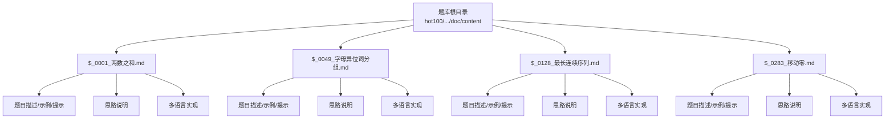
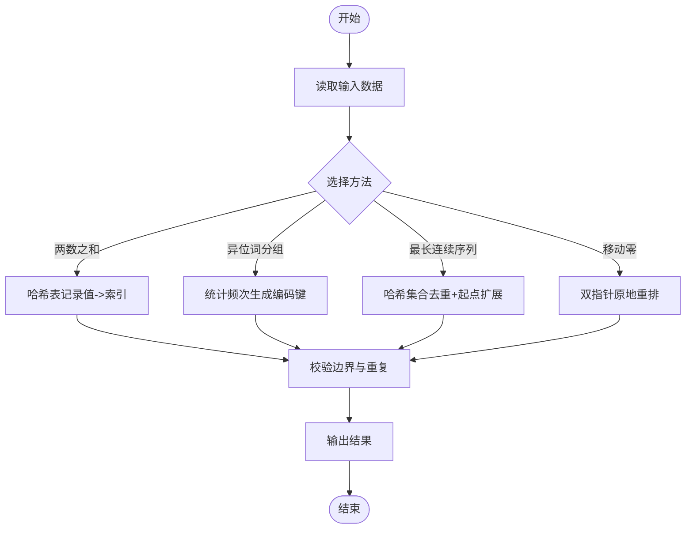
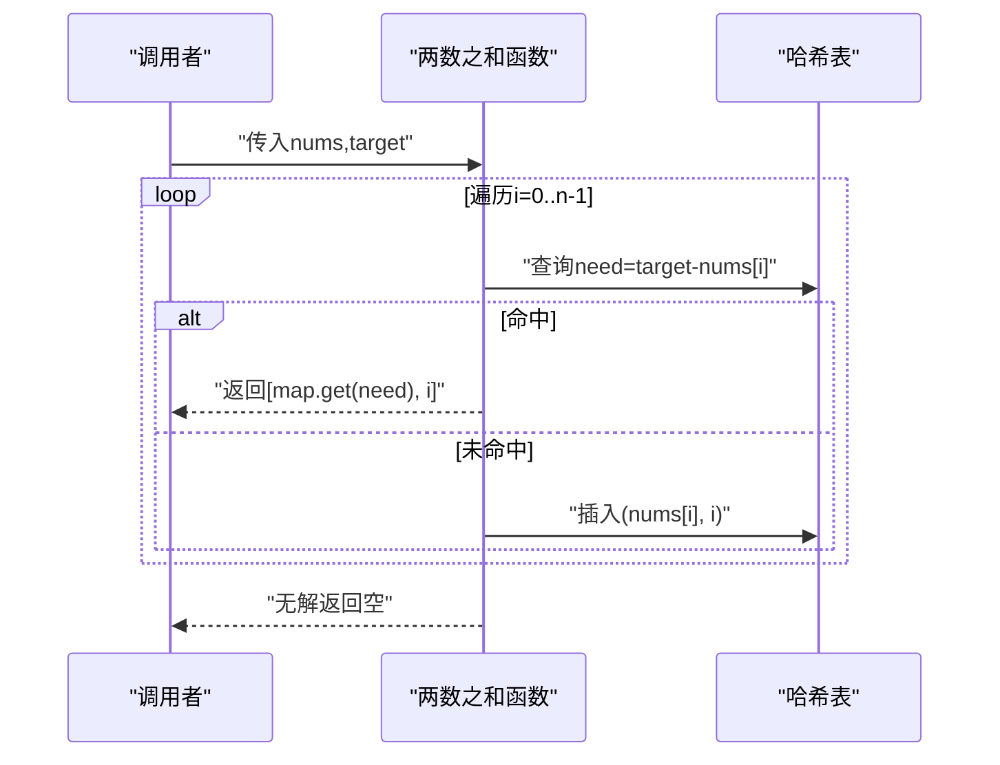
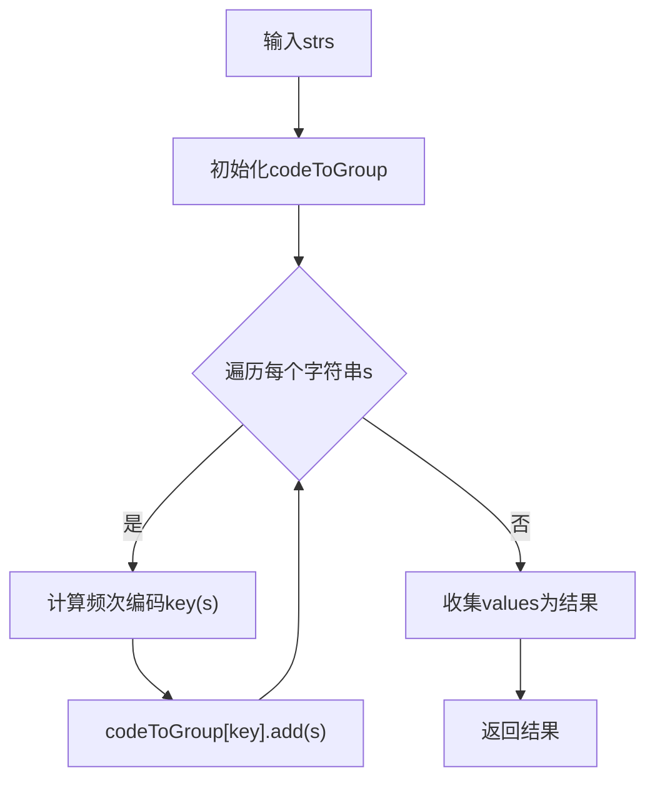
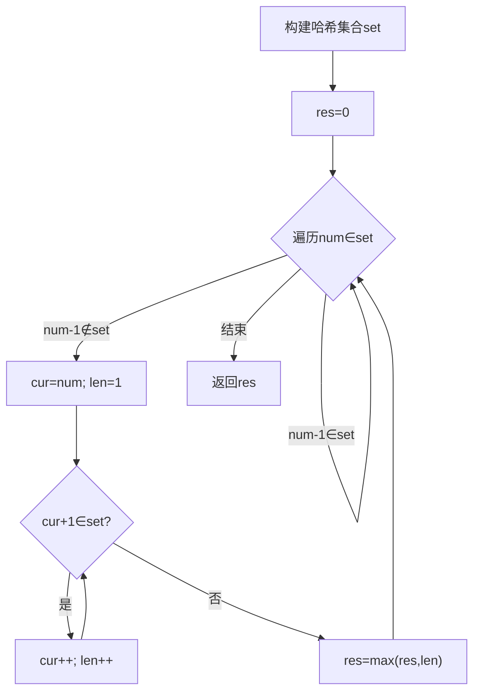
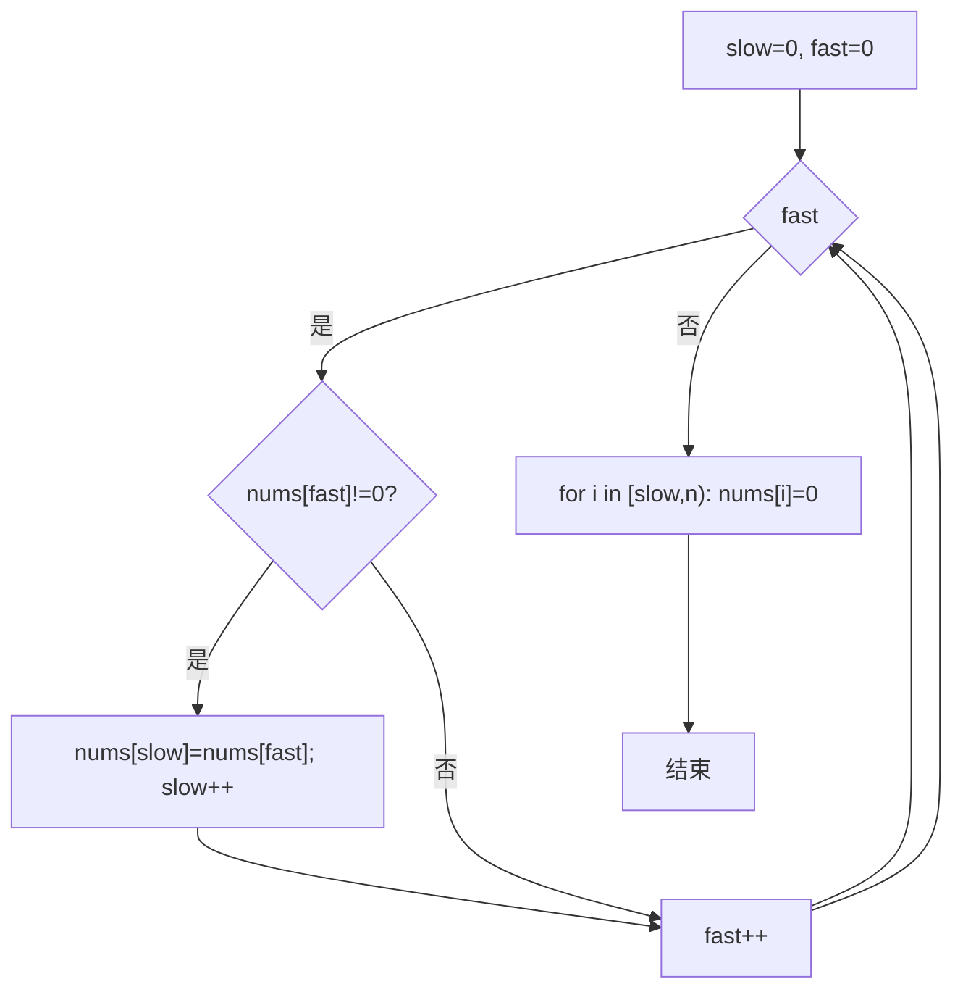
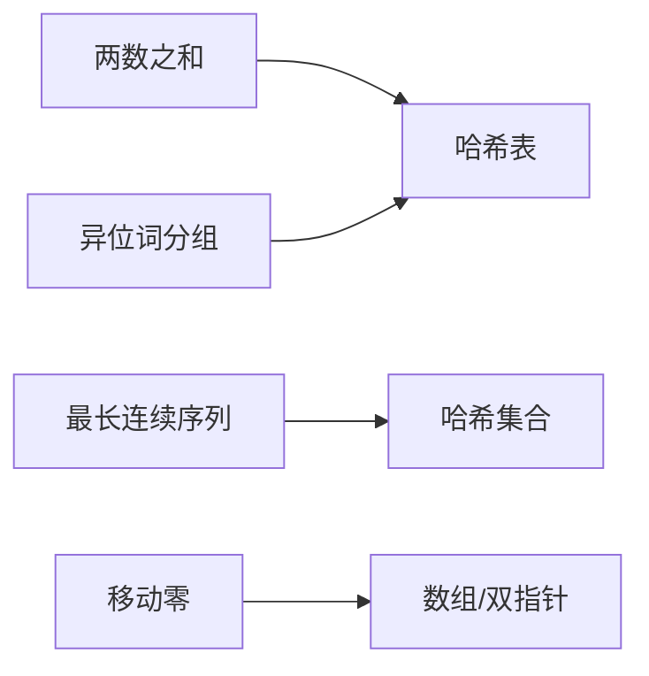

# 困难题解

<cite>
**本文引用的文件**   
- [$_0001_两数之和.md](file://src/main/java/hot100/leetcode/editor/cn/doc/content/$_0001_两数之和.md)
- [$_0049_字母异位词分组.md](file://src/main/java/hot100/leetcode/editor/cn/doc/content/$_0049_字母异位词分组.md)
- [$_0128_最长连续序列.md](file://src/main/java/hot100/leetcode/editor/cn/doc/content/$_0128_最长连续序列.md)
- [$_0283_移动零.md](file://src/main/java/hot100/leetcode/editor/cn/doc/content/$_0283_移动零.md)
</cite>

## 目录
1. [引言](#引言)
2. [项目结构](#项目结构)
3. [核心组件](#核心组件)
4. [架构总览](#架构总览)
5. [详细组件分析](#详细组件分析)
6. [依赖分析](#依赖分析)
7. [性能考量](#性能考量)
8. [故障排查指南](#故障排查指南)
9. [结论](#结论)
10. [附录](#附录)

## 引言
本文件面向LeetCode Hot100中的“困难”级别题目，提供系统化、可落地的题解文档。内容覆盖：
- 高级解题思路与算法设计
- 复杂度权衡与深度优化策略
- 极端边界条件与测试策略
- 代码工程化考虑与常见陷阱
- 相关算法理论与实际应用案例

为保证严谨性，所有分析与建议均基于仓库中已存在的题解材料进行提炼与扩展。

## 项目结构
仓库以“题号+中文标题”的Markdown文档组织题解，每道题包含：
- 题目描述与示例
- 标签（Related Topics）
- 官方或社区思路说明
- 多语言参考实现（C++/Python/Java/Go/JavaScript）
- 可视化链接

图表来源
- [$_0001_两数之和.md:1-234](file://src/main/java/hot100/leetcode/editor/cn/doc/content/$_0001_两数之和.md#L1-L234)
- [$_0049_字母异位词分组.md:1-308](file://src/main/java/hot100/leetcode/editor/cn/doc/content/$_0049_字母异位词分组.md#L1-L308)
- [$_0128_最长连续序列.md:1-288](file://src/main/java/hot100/leetcode/editor/cn/doc/content/$_0128_最长连续序列.md#L1-L288)
- [$_0283_移动零.md:1-248](file://src/main/java/hot100/leetcode/editor/cn/doc/content/$_0283_移动零.md#L1-L248)

章节来源
- [$_0001_两数之和.md:1-234](file://src/main/java/hot100/leetcode/editor/cn/doc/content/$_0001_两数之和.md#L1-L234)
- [$_0049_字母异位词分组.md:1-308](file://src/main/java/hot100/leetcode/editor/cn/doc/content/$_0049_字母异位词分组.md#L1-L308)
- [$_0128_最长连续序列.md:1-288](file://src/main/java/hot100/leetcode/editor/cn/doc/content/$_0128_最长连续序列.md#L1-L288)
- [$_0283_移动零.md:1-248](file://src/main/java/hot100/leetcode/editor/cn/doc/content/$_0283_移动零.md#L1-L248)

## 核心组件
本节聚焦四道典型题目的核心思想、关键数据结构与复杂度特性，并给出进阶优化方向与工程化注意事项。

- 两数之和
  - 核心思想：哈希表记录值到索引的映射，一次扫描完成查找。
  - 时间/空间复杂度：O(n)/O(n)。
  - 边界与陷阱：重复元素处理、溢出风险（在求差时）、返回值顺序不敏感。
  - 进阶：若需返回所有解且去重，可结合排序+双指针；若数据范围极大但稀疏，可用有序集合或分块哈希。
  - 工程化：避免二次访问同一索引；注意语言级Map的默认行为与空值处理。

- 字母异位词分组
  - 核心思想：将每个字符串编码为等价的键（如字符频次数组转字符串），用哈希表分组。
  - 时间/空间复杂度：O(Σ|s|)/O(Σ|s|)。
  - 边界与陷阱：空串、单字符、全相同字符、大小写与字符集假设。
  - 进阶：对超大输入采用流式聚合；编码可采用定长计数数组拼接或素数乘积（注意溢出）。
  - 工程化：选择不可变键类型；避免频繁字符串拼接开销。

- 最长连续序列
  - 核心思想：哈希集合去重后，仅从“序列起点”开始向上延伸，保证线性均摊。
  - 时间/空间复杂度：O(n)/O(n)。
  - 边界与陷阱：空数组、全部重复、负数区间、整数边界。
  - 进阶：若内存受限，可考虑外部排序+线性扫描；或使用并查集按连通分量维护长度（常数因子略大）。
  - 工程化：确保只从起点扩展，避免重复计算导致退化。

- 移动零
  - 核心思想：双指针原地重排非零元素，尾部补零。
  - 时间/空间复杂度：O(n)/O(1)。
  - 边界与陷阱：全零、无零、单元素、保持相对顺序。
  - 进阶：交换而非覆盖可减少写入次数（当零较多时更优）。
  - 工程化：严格保证慢指针语义与循环不变式。

章节来源
- [$_0001_两数之和.md:1-234](file://src/main/java/hot100/leetcode/editor/cn/doc/content/$_0001_两数之和.md#L1-L234)
- [$_0049_字母异位词分组.md:1-308](file://src/main/java/hot100/leetcode/editor/cn/doc/content/$_0049_字母异位词分组.md#L1-L308)
- [$_0128_最长连续序列.md:1-288](file://src/main/java/hot100/leetcode/editor/cn/doc/content/$_0128_最长连续序列.md#L1-L288)
- [$_0283_移动零.md:1-248](file://src/main/java/hot100/leetcode/editor/cn/doc/content/$_0283_移动零.md#L1-L248)

## 架构总览
以下图示展示各题的核心流程与数据结构交互关系。

图表来源
- [$_0001_两数之和.md:1-234](file://src/main/java/hot100/leetcode/editor/cn/doc/content/$_0001_两数之和.md#L1-L234)
- [$_0049_字母异位词分组.md:1-308](file://src/main/java/hot100/leetcode/editor/cn/doc/content/$_0049_字母异位词分组.md#L1-L308)
- [$_0128_最长连续序列.md:1-288](file://src/main/java/hot100/leetcode/editor/cn/doc/content/$_0128_最长连续序列.md#L1-L288)
- [$_0283_移动零.md:1-248](file://src/main/java/hot100/leetcode/editor/cn/doc/content/$_0283_移动零.md#L1-L248)

## 详细组件分析

### 两数之和
- 问题要点
  - 目标：找到两个不同下标使和等于target。
  - 约束：唯一答案、不能复用同一元素。
- 算法推导
  - 设当前元素为x，需要寻找y=target-x。使用哈希表维护已遍历元素的值到索引映射，可在O(1)内判断是否存在y。
  - 正确性：若存在解(i,j)，则在遍历到j时，i<j已被插入表中，必能命中。
- 复杂度
  - 时间：O(n)；空间：O(n)。
- 边界与极端情况
  - 重复元素：先查后插，避免自身匹配。
  - 数值范围：注意差值可能越界（在强类型语言中）。
- 多种解法对比
  - 排序+双指针：O(n log n)/O(1)额外空间，但会破坏原始索引，需保留原索引映射。
  - 哈希表：最优通用解。
- 测试策略
  - 最小规模、全相同、负数、边界target、重复元素、无序分布。
- 工程化技巧
  - 使用不可变键；提前短路返回；避免多余装箱/拆箱。

图表来源
- [$_0001_两数之和.md:1-234](file://src/main/java/hot100/leetcode/editor/cn/doc/content/$_0001_两数之和.md#L1-L234)

章节来源
- [$_0001_两数之和.md:1-234](file://src/main/java/hot100/leetcode/editor/cn/doc/content/$_0001_两数之和.md#L1-L234)

### 字母异位词分组
- 问题要点
  - 将互为异位词的字符串归为一组。
- 算法推导
  - 等价类判定：若两字符串字符频次完全一致则为异位词。将频次数组转为稳定键（如固定长度字符串或元组），作为哈希表的键。
  - 正确性：频次一致的字符串必然映射到同一键，从而被分到同一组。
- 复杂度
  - 时间：O(Σ|s|)；空间：O(Σ|s|)。
- 边界与极端情况
  - 空串、单字符、全相同字符、字符集限制（仅小写字母）。
- 多种解法对比
  - 排序键：O(Σ|s| log |s|)，简单但较慢。
  - 频次编码：O(Σ|s|)，推荐。
  - 素数乘积：理论上可行，但易溢出，不推荐。
- 测试策略
  - 空串、单元素、大量重复、不同长度、全相同字符、随机分布。
- 工程化技巧
  - 使用不可变键；避免中间对象过多；批量收集结果。

图表来源
- [$_0049_字母异位词分组.md:1-308](file://src/main/java/hot100/leetcode/editor/cn/doc/content/$_0049_字母异位词分组.md#L1-L308)

章节来源
- [$_0049_字母异位词分组.md:1-308](file://src/main/java/hot100/leetcode/editor/cn/doc/content/$_0049_字母异位词分组.md#L1-L308)

### 最长连续序列
- 问题要点
  - 在未排序数组中找最长数字连续序列的长度，要求O(n)。
- 算法推导
  - 将元素放入哈希集合去重。对每个元素x，若x-1不在集合中，则x是某连续序列的起点，从x开始递增查找，直到断点为止。
  - 正确性与线性证明：每个元素最多被“起点检查”访问一次，且在作为起点时才参与while扩展，整体均摊O(n)。
- 复杂度
  - 时间：O(n)；空间：O(n)。
- 边界与极端情况
  - 空数组、全部重复、负数、最大/最小整数值。
- 多种解法对比
  - 排序：O(n log n)，不符合要求。
  - 并查集：按相邻元素合并连通块，维护块大小，常数因子较大。
- 测试策略
  - 空、单元素、全相同、连续段分散、含负数、极值。
- 工程化技巧
  - 严格“仅从起点扩展”；避免重复计算；注意集合构造开销。

图表来源
- [$_0128_最长连续序列.md:1-288](file://src/main/java/hot100/leetcode/editor/cn/doc/content/$_0128_最长连续序列.md#L1-L288)

章节来源
- [$_0128_最长连续序列.md:1-288](file://src/main/java/hot100/leetcode/editor/cn/doc/content/$_0128_最长连续序列.md#L1-L288)

### 移动零
- 问题要点
  - 原地将所有0移到末尾，保持非零元素相对顺序。
- 算法推导
  - 双指针：slow指向下一个非零应放置的位置，fast扫描数组；遇到非零则写到slow并推进slow。最后将slow之后的位置置0。
  - 正确性：循环不变式为[0, slow)为非零元素且保持相对顺序。
- 复杂度
  - 时间：O(n)；空间：O(1)。
- 边界与极端情况
  - 全零、无零、单元素、已满足条件。
- 多种解法对比
  - 覆盖+尾部补零：写入次数少。
  - 交换法：当零较多时减少赋值次数。
- 测试策略
  - 全零、无零、单元素、首尾零、交替零与非零。
- 工程化技巧
  - 明确slow语义；避免越界；尽量原地操作。

图表来源
- [$_0283_移动零.md:1-248](file://src/main/java/hot100/leetcode/editor/cn/doc/content/$_0283_移动零.md#L1-L248)

章节来源
- [$_0283_移动零.md:1-248](file://src/main/java/hot100/leetcode/editor/cn/doc/content/$_0283_移动零.md#L1-L248)

## 依赖分析
- 内部依赖
  - 各题解相互独立，无跨文件引用。
- 外部依赖
  - 标准库数据结构：哈希表、哈希集合、列表/数组。
- 耦合与内聚
  - 每题解高度内聚，接口清晰，便于单元测试与替换实现。

图表来源
- [$_0001_两数之和.md:1-234](file://src/main/java/hot100/leetcode/editor/cn/doc/content/$_0001_两数之和.md#L1-L234)
- [$_0049_字母异位词分组.md:1-308](file://src/main/java/hot100/leetcode/editor/cn/doc/content/$_0049_字母异位词分组.md#L1-L308)
- [$_0128_最长连续序列.md:1-288](file://src/main/java/hot100/leetcode/editor/cn/doc/content/$_0128_最长连续序列.md#L1-L288)
- [$_0283_移动零.md:1-248](file://src/main/java/hot100/leetcode/editor/cn/doc/content/$_0283_移动零.md#L1-L248)

## 性能考量
- 哈希结构
  - 平均O(1)操作，最坏退化至O(n)。可通过合理扩容阈值与自定义哈希降低冲突。
- 内存占用
  - 哈希集合/表在大数据量下显著增加内存，必要时考虑分块或外部排序。
- 缓存友好
  - 顺序扫描优于随机访问；原地算法减少分配与拷贝。
- 分支预测
  - 减少复杂分支；尽量使用算术与位运算替代条件判断（在合适场景）。

## 故障排查指南
- 两数之和
  - 症状：返回自身索引或遗漏解。
  - 排查：确认“先查后插”的顺序；检查重复元素处理。
- 异位词分组
  - 症状：分组错误、空串异常。
  - 排查：核对编码键稳定性；确认字符集假设与空串分支。
- 最长连续序列
  - 症状：超时或结果偏小。
  - 排查：是否从起点扩展；集合是否去重；是否误判前驱存在。
- 移动零
  - 症状：相对顺序改变或未置零。
  - 排查：slow语义是否正确；尾部补零范围是否完整。

章节来源
- [$_0001_两数之和.md:1-234](file://src/main/java/hot100/leetcode/editor/cn/doc/content/$_0001_两数之和.md#L1-L234)
- [$_0049_字母异位词分组.md:1-308](file://src/main/java/hot100/leetcode/editor/cn/doc/content/$_0049_字母异位词分组.md#L1-L308)
- [$_0128_最长连续序列.md:1-288](file://src/main/java/hot100/leetcode/editor/cn/doc/content/$_0128_最长连续序列.md#L1-L288)
- [$_0283_移动零.md:1-248](file://src/main/java/hot100/leetcode/editor/cn/doc/content/$_0283_移动零.md#L1-L248)

## 结论
- 哈希表/集合是解决“快速查找/去重/分组”问题的首选工具，但需注意退化与内存成本。
- 双指针在原地重排与滑动窗口场景中具备常数空间优势。
- 线性算法的关键在于“避免重复计算”，例如仅从序列起点扩展。
- 工程化层面，稳定的键设计、严格的循环不变式与完备的边界测试是高质量实现的保障。

## 附录
- 相关理论
  - 哈希表与哈希集合：开放寻址/链地址法的权衡与负载因子。
  - 双指针与滑动窗口：状态转移与窗口收缩策略。
  - 并查集：连通分量维护与路径压缩/按秩合并。
- 实践建议
  - 优先选择哈希方案，再根据约束评估排序/双指针/并查集。
  - 针对大规模数据，考虑流式处理与分批聚合。
  - 编写单元用例覆盖边界与极端分布，持续回归验证。