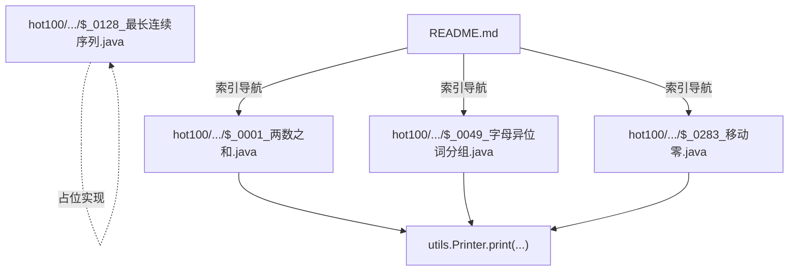
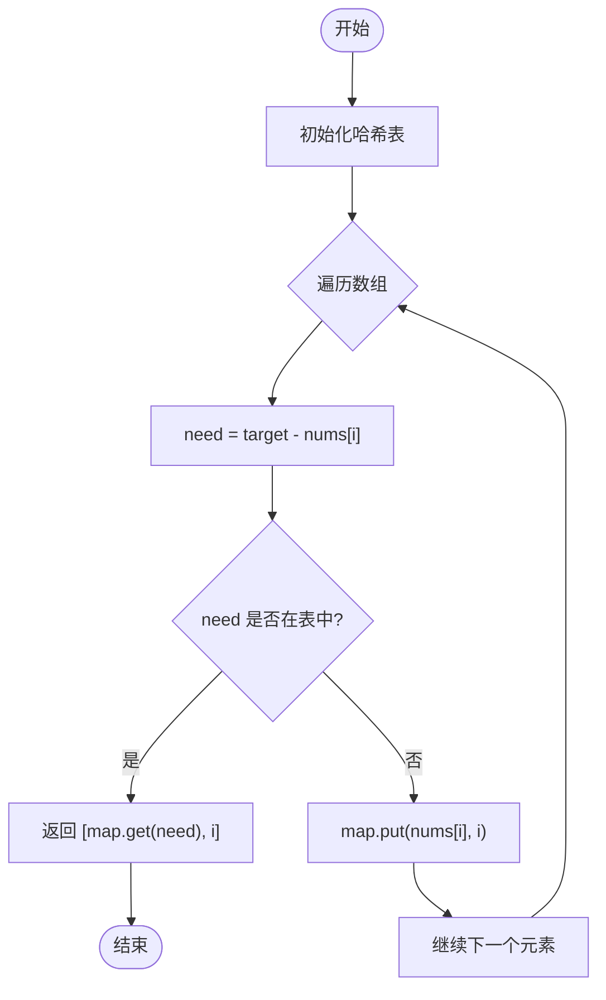
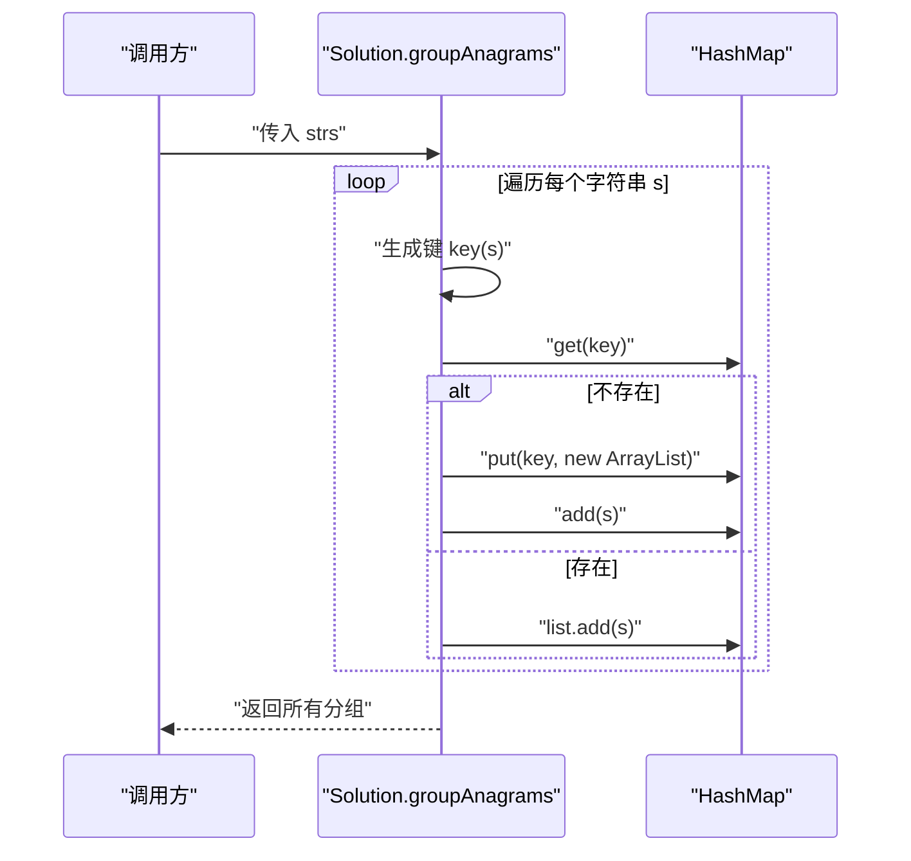
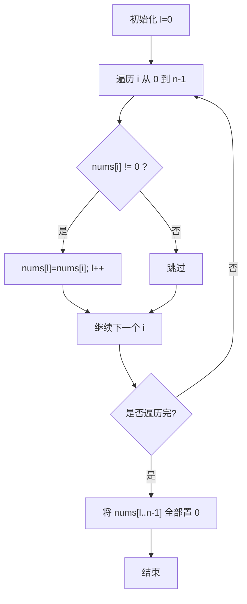
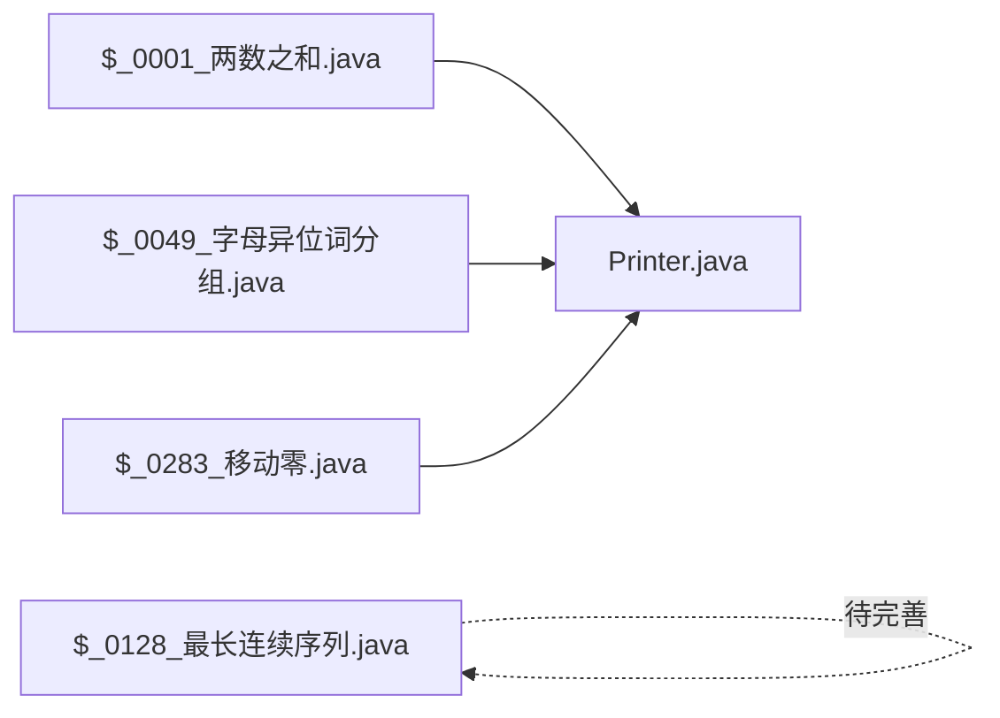

# 简单题解

<cite>
**本文引用的文件**   
- [$_0001_两数之和.java](file://src/main/java/hot100/leetcode/editor/cn/$_0001_两数之和.java)
- [$_0049_字母异位词分组.java](file://src/main/java/hot100/leetcode/editor/cn/$_0049_字母异位词分组.java)
- [$_0128_最长连续序列.java](file://src/main/java/hot100/leetcode/editor/cn/$_0128_最长连续序列.java)
- [$_0283_移动零.java](file://src/main/java/hot100/leetcode/editor/cn/$_0283_移动零.java)
- [Printer.java](file://src/main/java/utils/Printer.java)
- [README.md](file://README.md)
</cite>

## 目录
1. [简介](#简介)
2. [项目结构](#项目结构)
3. [核心组件](#核心组件)
4. [架构总览](#架构总览)
5. [详细题目解析](#详细题目解析)
6. [依赖关系分析](#依赖关系分析)
7. [性能与复杂度](#性能与复杂度)
8. [故障排查与易错点](#故障排查与易错点)
9. [结论](#结论)
10. [附录：学习建议与参考](#附录学习建议与参考)

## 简介
本文件面向LeetCode Hot100中的“简单”难度题目，基于仓库中已实现的Java代码与配套文档，为初学者提供清晰、循序渐进的题解。每道题包含：
- 题目要求与输入输出格式
- 解题思路（逐步算法步骤）
- 基础实现要点与关键逻辑说明
- 时间与空间复杂度分析
- 测试用例与验证方法
- 常见错误与边界条件
- 相关知识点链接与学习建议

## 项目结构
仓库采用按题号组织的方式，Hot100简单题集中在 hot100 包下，每个题目一个类，内部包含 Solution 类以及 main 测试入口；工具类 Printer 用于统一打印输出。



图示来源
- [$_0001_两数之和.java:1-35](file://src/main/java/hot100/leetcode/editor/cn/$_0001_两数之和.java#L1-L35)
- [$_0049_字母异位词分组.java:1-77](file://src/main/java/hot100/leetcode/editor/cn/$_0049_字母异位词分组.java#L1-L77)
- [$_0283_移动零.java:1-68](file://src/main/java/hot100/leetcode/editor/cn/$_0283_移动零.java#L1-L68)
- [$_0128_最长连续序列.java:1-23](file://src/main/java/hot100/leetcode/editor/cn/$_0128_最长连续序列.java#L1-L23)
- [README.md:1-12](file://README.md#L1-L12)

章节来源
- [README.md:1-12](file://README.md#L1-L12)

## 核心组件
- 两数之和：哈希表一次扫描，记录值到索引映射，边查边存。
- 字母异位词分组：将字符串编码为唯一键（计数压缩或排序），用哈希表分组。
- 移动零：双指针/覆盖+填充，或交换法，原地调整数组。
- 最长连续序列：当前为占位实现，需补充哈希集合去重+只从序列起点扩展的标准解法。

章节来源
- [$_0001_两数之和.java:10-27](file://src/main/java/hot100/leetcode/editor/cn/$_0001_两数之和.java#L10-L27)
- [$_0049_字母异位词分组.java:11-51](file://src/main/java/hot100/leetcode/editor/cn/$_0049_字母异位词分组.java#L11-L51)
- [$_0283_移动零.java:9-24](file://src/main/java/hot100/leetcode/editor/cn/$_0283_移动零.java#L9-L24)
- [$_0128_最长连续序列.java:7-15](file://src/main/java/hot100/leetcode/editor/cn/$_0128_最长连续序列.java#L7-L15)

## 架构总览
整体结构为“题目类 + 内部Solution + 工具打印”，main 方法作为本地测试入口，调用对应题目的 Solution 方法并打印结果。

```mermaid
classDiagram
class 两数之和 {
+main()
class Solution {
+twoSum(nums, target) int[]
}
}
class 字母异位词分组 {
+groupAnagrams(strs) List<List<String>>
-compress(str) String
+main()
class Solution {
+groupAnagrams(strs) List<List<String>>
}
}
class 移动零 {
+main()
class Solution {
+moveZeroes(nums) void
}
class Solution1 {
+moveZeroes(nums) void
}
class Solution2 {
+moveZeroes(nums) void
}
}
class 最长连续序列 {
+main()
class Solution {
+longestConsecutive(nums) int
}
}
class Printer {
+print(args) void
}
两数之和 --> Printer : "使用"
字母异位词分组 --> Printer : "使用"
移动零 --> Printer : "使用"
```

图示来源
- [$_0001_两数之和.java:10-35](file://src/main/java/hot100/leetcode/editor/cn/$_0001_两数之和.java#L10-L35)
- [$_0049_字母异位词分组.java:11-77](file://src/main/java/hot100/leetcode/editor/cn/$_0049_字母异位词分组.java#L11-L77)
- [$_0283_移动零.java:9-68](file://src/main/java/hot100/leetcode/editor/cn/$_0283_移动零.java#L9-L68)
- [$_0128_最长连续序列.java:7-23](file://src/main/java/hot100/leetcode/editor/cn/$_0128_最长连续序列.java#L7-L23)
- [Printer.java:9-15](file://src/main/java/utils/Printer.java#L9-L15)

## 详细题目解析

### 题目一：两数之和
- 题目要求
  - 输入：整数数组 nums，目标值 target
  - 输出：两个元素的下标，使得两数之和等于 target
  - 假设：每种输入仅有一个答案，且不能重复使用同一元素
- 输入输出格式与边界
  - 长度范围：[2, 10^4]
  - 数值范围：[-10^9, 10^9]
  - 保证有唯一解
- 解题思路
  - 维护“值 -> 索引”的哈希表
  - 遍历数组，对每个元素计算 need = target - nums[i]
  - 若 need 已在表中，返回其索引与 i；否则将 nums[i] 与 i 存入表
- 复杂度分析
  - 时间：O(n)，一次扫描
  - 空间：O(n)，哈希表存储
- 关键逻辑与易错点
  - 先查后存，避免重复使用同一元素
  - 注意空输入与无解情况（本题保证有解）
- 测试与验证
  - 示例：nums=[2,7,11,15], target=9 → [0,1]
  - 可在 main 中构造不同用例，借助 Printer 打印结果
- 相关知识点
  - 哈希表、一次扫描技巧、双指针对比（有序数组可用左右指针）



图示来源
- [$_0001_两数之和.java:13-26](file://src/main/java/hot100/leetcode/editor/cn/$_0001_两数之和.java#L13-L26)

章节来源
- [$_0001_两数之和.java:10-35](file://src/main/java/hot100/leetcode/editor/cn/$_0001_两数之和.java#L10-L35)
- [Printer.java:9-15](file://src/main/java/utils/Printer.java#L9-L15)

---

### 题目二：字母异位词分组
- 题目要求
  - 输入：字符串数组 strs
  - 输出：将互为字母异位词的字符串分到同一组
- 输入输出格式与边界
  - 长度范围：[1, 10^4]
  - 单个字符串长度：[0, 100]
  - 仅含小写字母
- 解题思路
  - 编码策略（两种等价方式）：
    - 计数压缩：统计 a-z 出现次数，生成唯一键
    - 排序键：对字符排序后的字符串作为键
  - 使用哈希表将相同键的字符串归入同一列表
- 复杂度分析
  - 计数压缩：时间 O(N·L)，空间 O(N·L)
  - 排序键：时间 O(N·L log L)，空间 O(N·L)
- 关键逻辑与易错点
  - 空串处理
  - 键的唯一性与稳定性
  - 结果顺序可任意
- 测试与验证
  - 示例：strs=["eat","tea","tan","ate","nat","bat"] → 多组分组均可
- 相关知识点
  - 哈希表、字符串编码、排序 vs 计数



图示来源
- [$_0049_字母异位词分组.java:14-31](file://src/main/java/hot100/leetcode/editor/cn/$_0049_字母异位词分组.java#L14-L31)
- [$_0049_字母异位词分组.java:36-49](file://src/main/java/hot100/leetcode/editor/cn/$_0049_字母异位词分组.java#L36-L49)

章节来源
- [$_0049_字母异位词分组.java:11-77](file://src/main/java/hot100/leetcode/editor/cn/$_0049_字母异位词分组.java#L11-L77)

---

### 题目三：移动零
- 题目要求
  - 输入：整型数组 nums
  - 输出：原地将所有 0 移动到末尾，非零元素相对顺序不变
- 输入输出格式与边界
  - 允许原地修改，不返回值
- 解题思路
  - 方案A（覆盖+填充）：用指针 l 指向下一个非零应放位置，遍历数组将非零写入，最后将尾部填 0
  - 方案B（交换法）：遇到非零时与 i0 位置交换，i0 右移，保持 [0..i0-1] 全为 0
- 复杂度分析
  - 时间：O(n)
  - 空间：O(1)
- 关键逻辑与易错点
  - 覆盖法需要二次填充 0
  - 交换法在 i==i0 时也会交换，但语义正确
- 测试与验证
  - 示例：[0,1,0,3,12] → [1,3,12,0,0]
- 相关知识点
  - 双指针、原地操作、数组填充



图示来源
- [$_0283_移动零.java:12-23](file://src/main/java/hot100/leetcode/editor/cn/$_0283_移动零.java#L12-L23)

章节来源
- [$_0283_移动零.java:9-68](file://src/main/java/hot100/leetcode/editor/cn/$_0283_移动零.java#L9-L68)

---

### 题目四：最长连续序列
- 题目要求
  - 输入：整型数组 nums
  - 输出：最长连续递增序列的长度（元素值连续，如 1,2,3,4）
- 输入输出格式与边界
  - 通常要求 O(n) 时间，不允许排序
- 当前状态
  - 该题为占位实现，返回 0，需补充标准解法
- 推荐解法（供参考）
  - 使用 HashSet 去重
  - 仅当 x-1 不在集合中时，从 x 开始向右扩展计数
  - 更新最大长度
- 复杂度分析
  - 时间：O(n)
  - 空间：O(n)
- 测试与验证
  - 示例：[100,4,200,1,3,2] → 4（序列 1,2,3,4）
- 相关知识点
  - 哈希集合、序列起点判定、线性扫描

章节来源
- [$_0128_最长连续序列.java:7-15](file://src/main/java/hot100/leetcode/editor/cn/$_0128_最长连续序列.java#L7-L15)

## 依赖关系分析
- 模块内依赖
  - 各题目类通过内部 Solution 暴露算法接口
  - main 方法负责构造用例并调用 Solution
  - 统一使用 utils.Printer 进行输出
- 外部依赖
  - Java 标准库：java.util.*（Map、List、Arrays 等）
- 耦合与内聚
  - 题目间相互独立，低耦合
  - 每个题目高内聚，便于单独阅读与测试



图示来源
- [$_0001_两数之和.java:1-35](file://src/main/java/hot100/leetcode/editor/cn/$_0001_两数之和.java#L1-L35)
- [$_0049_字母异位词分组.java:1-77](file://src/main/java/hot100/leetcode/editor/cn/$_0049_字母异位词分组.java#L1-L77)
- [$_0283_移动零.java:1-68](file://src/main/java/hot100/leetcode/editor/cn/$_0283_移动零.java#L1-L68)
- [$_0128_最长连续序列.java:1-23](file://src/main/java/hot100/leetcode/editor/cn/$_0128_最长连续序列.java#L1-L23)
- [Printer.java:1-16](file://src/main/java/utils/Printer.java#L1-L16)

## 性能与复杂度
- 两数之和：O(n)/O(n)
- 字母异位词分组：O(N·L)/O(N·L)（计数压缩更优）
- 移动零：O(n)/O(1)
- 最长连续序列（建议）：O(n)/O(n)

## 故障排查与易错点
- 两数之和
  - 先存后查会导致重复使用同一元素
  - 未考虑空数组或无解（本题保证有解）
- 字母异位词分组
  - 键构造不稳定导致分组错误
  - 忘记处理空串
- 移动零
  - 覆盖法遗漏尾部填充 0
  - 交换法未正确处理 i 与 i0 的关系
- 最长连续序列
  - 未判起点导致 O(n^2) 退化
  - 未去重导致重复计数

章节来源
- [$_0001_两数之和.java:13-26](file://src/main/java/hot100/leetcode/editor/cn/$_0001_两数之和.java#L13-L26)
- [$_0049_字母异位词分组.java:36-49](file://src/main/java/hot100/leetcode/editor/cn/$_0049_字母异位词分组.java#L36-L49)
- [$_0283_移动零.java:12-23](file://src/main/java/hot100/leetcode/editor/cn/$_0283_移动零.java#L12-L23)
- [$_0128_最长连续序列.java:10-14](file://src/main/java/hot100/leetcode/editor/cn/$_0128_最长连续序列.java#L10-L14)

## 结论
本仓库以清晰的模块化结构组织了 LeetCode Hot100 简单题的 Java 实现，配合统一的打印工具与 README 索引，便于学习与自测。建议在完成现有实现的基础上，补齐最长连续序列的完整解法，并增加更多边界用例与单元测试，以提升健壮性。

## 附录：学习建议与参考
- 基础知识
  - 哈希表：查找与去重的利器
  - 双指针：原地操作与区间问题常用技巧
  - 字符串编码：计数与排序两种范式
- 练习建议
  - 先手写伪代码，再对照实现
  - 准备典型用例与边界用例（空、单元素、全相同、最大值/最小值）
  - 用本地 main 快速验证，逐步扩展
- 参考路径
  - 两数之和：哈希表一次扫描
  - 字母异位词分组：计数压缩优于排序
  - 移动零：覆盖+填充或交换法
  - 最长连续序列：集合去重+起点判定