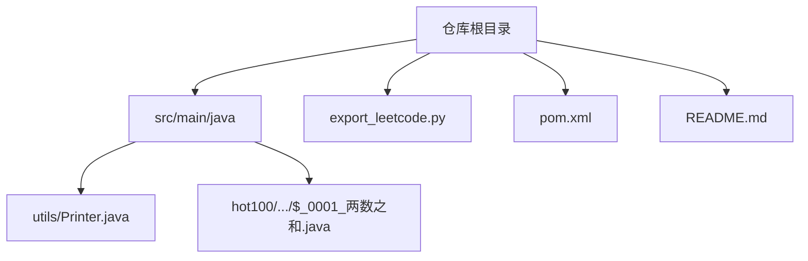
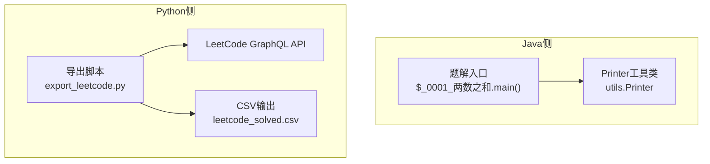
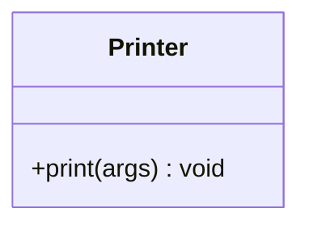
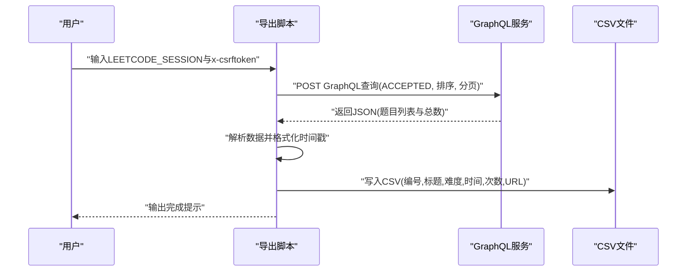
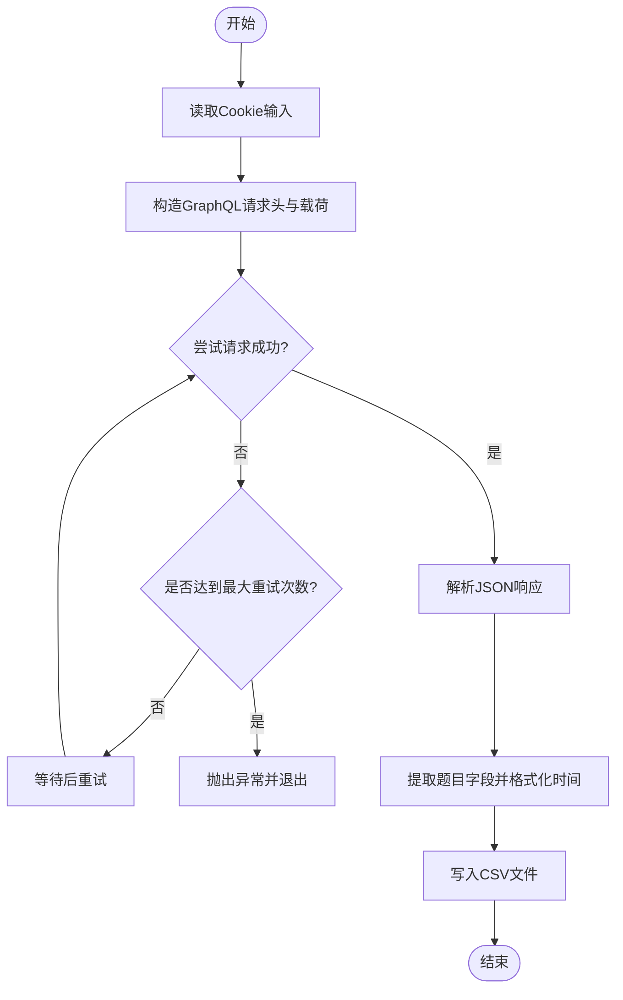
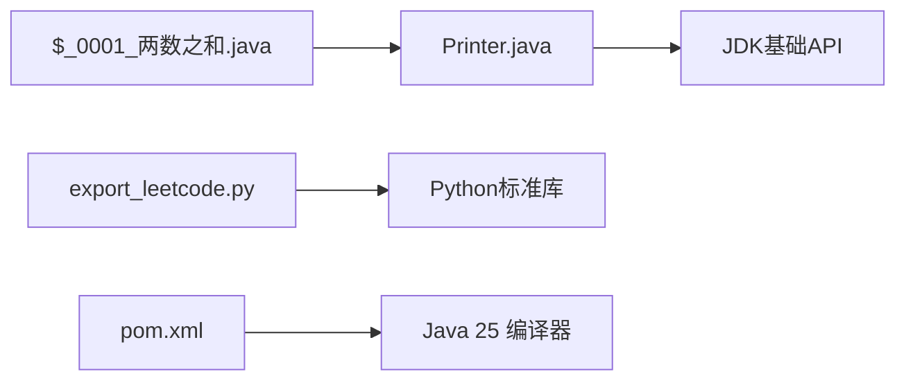

# 工具和工具类

<cite>
**本文引用的文件**   
- [Printer.java](file://src/main/java/utils/Printer.java)
- [$_0001_两数之和.java](file://src/main/java/hot100/leetcode/editor/cn/$_0001_两数之和.java)
- [export_leetcode.py](file://export_leetcode.py)
- [pom.xml](file://pom.xml)
- [README.md](file://README.md)
</cite>

## 目录
1. [简介](#简介)
2. [项目结构](#项目结构)
3. [核心组件](#核心组件)
4. [架构总览](#架构总览)
5. [详细组件分析](#详细组件分析)
6. [依赖分析](#依赖分析)
7. [性能考虑](#性能考虑)
8. [故障排除指南](#故障排除指南)
9. [结论](#结论)
10. [附录](#附录)

## 简介
本文件聚焦于LeetCode算法题解项目中的“工具与工具类”，围绕以下目标展开：
- 详细说明Java端Printer工具类的功能、使用方式与扩展方法
- 解释Python数据导出脚本的工作原理与使用方法
- 提供自定义工具类的开发指南
- 给出调试技巧与性能监控建议
- 总结工具类设计原则与最佳实践
- 汇总常见问题与排障方案

## 项目结构
本项目为多语言混合工程，主要包含：
- Java源码与工具类：位于 src/main/java 下，其中 utils.Printer 为通用打印工具
- Python导出脚本：位于仓库根目录 export_leetcode.py，用于从LeetCode个人主页拉取已提交题目并导出CSV
- Maven构建配置：pom.xml 管理编译版本与依赖
- README.md：简要说明与部分练习索引

图表来源
- [Printer.java:1-16](file://src/main/java/utils/Printer.java#L1-L16)
- [$_0001_两数之和.java:1-35](file://src/main/java/hot100/leetcode/editor/cn/$_0001_两数之和.java#L1-L35)
- [export_leetcode.py:1-106](file://export_leetcode.py#L1-L106)
- [pom.xml:1-102](file://pom.xml#L1-L102)
- [README.md:1-12](file://README.md#L1-L12)

章节来源
- [README.md:1-12](file://README.md#L1-L12)

## 核心组件
- Printer工具类（Java）
  - 作用：统一输出调试信息，支持可变参数，便于在解题代码中快速打印结果或中间状态
  - 位置：src/main/java/utils/Printer.java
  - 使用示例：在测试入口中通过静态导入调用，传入任意对象数组进行逐行输出
- 数据导出脚本（Python）
  - 作用：通过GraphQL接口获取用户已AC的题目列表，并将编号、标题、难度、最后提交时间、提交次数与URL写入CSV
  - 位置：export_leetcode.py
  - 输入：LEETCODE_SESSION 与 x-csrftoken 两个Cookie值
  - 输出：leetcode_solved.csv

章节来源
- [Printer.java:1-16](file://src/main/java/utils/Printer.java#L1-L16)
- [$_0001_两数之和.java:1-35](file://src/main/java/hot100/leetcode/editor/cn/$_0001_两数之和.java#L1-L35)
- [export_leetcode.py:1-106](file://export_leetcode.py#L1-L106)

## 架构总览
整体由两部分组成：
- Java侧：以工具类为中心，被各题解的main方法或测试逻辑引用，用于本地验证与调试
- Python侧：独立脚本，负责与LeetCode站点交互，完成数据导出

图表来源
- [Printer.java:1-16](file://src/main/java/utils/Printer.java#L1-L16)
- [$_0001_两数之和.java:1-35](file://src/main/java/hot100/leetcode/editor/cn/$_0001_两数之和.java#L1-L35)
- [export_leetcode.py:1-106](file://export_leetcode.py#L1-L106)

## 详细组件分析

### Printer工具类分析
- 设计要点
  - 单一职责：仅负责将多个对象按行输出到标准输出
  - 可变参数：支持一次传入多个对象，内部循环逐个打印
  - 无外部依赖：不引入第三方库，降低耦合度
- 复杂度
  - 时间复杂度：O(n)，n为传入参数个数
  - 空间复杂度：O(1)，仅使用局部迭代变量
- 使用方式
  - 在题解文件中通过静态导入直接调用
  - 适合在main方法或单元测试中打印中间结果、边界条件验证等
- 扩展建议
  - 增加日志级别控制（如DEBUG/INFO/WARN），便于生产环境关闭冗余输出
  - 增加格式化能力（如对齐、前缀、时间戳）
  - 支持输出到文件或网络通道（例如统一日志收集）

图表来源
- [Printer.java:1-16](file://src/main/java/utils/Printer.java#L1-L16)

章节来源
- [Printer.java:1-16](file://src/main/java/utils/Printer.java#L1-L16)
- [$_0001_两数之和.java:1-35](file://src/main/java/hot100/leetcode/editor/cn/$_0001_两数之和.java#L1-L35)

### Python数据导出脚本工作原理
- 工作流程
  - 读取用户提供的Cookie（会话与CSRF令牌）
  - 构造GraphQL请求，查询已接受题目的分页列表
  - 解析返回数据，提取必要字段（编号、标题、难度、最后提交时间、提交次数、URL）
  - 将结果写入CSV文件
- 关键实现点
  - 使用urllib发起HTTPS请求，设置SSL上下文
  - 内置重试机制：对HTTP错误与网络异常进行有限次重试
  - 时间戳转换：将服务器返回的时间转换为本地可读格式
- 输出格式
  - CSV列：编号、标题、难度、最后提交时间、提交次数、URL

图表来源
- [export_leetcode.py:1-106](file://export_leetcode.py#L1-L106)

章节来源
- [export_leetcode.py:1-106](file://export_leetcode.py#L1-L106)

### 复杂逻辑流程图（导出脚本核心流程）

图表来源
- [export_leetcode.py:1-106](file://export_leetcode.py#L1-L106)

## 依赖分析
- Java侧
  - 工具类Printer无外部依赖，仅使用JDK基础API
  - 题解入口通过静态导入引用工具类，形成单向依赖
- Python侧
  - 使用标准库：csv、json、ssl、time、urllib.request、urllib.error
  - 无第三方依赖，便于跨平台运行
- 构建与运行时
  - Maven配置指定Java版本为25，确保编译器与目标一致
  - 可选依赖包括Jackson XML、Lombok、SLF4J Simple（当前工具类未直接使用）

图表来源
- [Printer.java:1-16](file://src/main/java/utils/Printer.java#L1-L16)
- [$_0001_两数之和.java:1-35](file://src/main/java/hot100/leetcode/editor/cn/$_0001_两数之和.java#L1-L35)
- [export_leetcode.py:1-106](file://export_leetcode.py#L1-L106)
- [pom.xml:1-102](file://pom.xml#L1-L102)

章节来源
- [pom.xml:1-102](file://pom.xml#L1-L102)

## 性能考虑
- Printer工具类
  - 优点：轻量、无锁、无IO开销（仅标准输出）
  - 注意：大量频繁调用可能影响控制台I/O性能；建议在批量输出时合并消息或使用缓冲
- 导出脚本
  - 网络请求：采用有限重试与固定间隔，避免瞬时失败导致中断
  - 数据处理：单次拉取较大分页（first=10000），减少往返次数；若数据量极大，可改为分页增量处理
  - I/O：CSV写入为顺序写，性能稳定；如需并发追加，需引入同步机制

[本节为通用指导，不涉及具体文件分析]

## 故障排除指南
- 导出脚本常见错误
  - Cookie无效或过期：请重新登录LeetCode并复制最新LEETCODE_SESSION与x-csrftoken
  - 网络异常或超时：脚本会重试，若仍失败，检查代理与防火墙设置
  - HTTP错误码：查看控制台输出的错误摘要，必要时调整请求头或UA
- 打印工具类问题
  - 输出为空或乱码：确认传入对象实现了合理的toString；检查控制台编码
  - 性能瓶颈：减少高频打印，或将调试输出开关化
- 构建与运行
  - Java版本不匹配：确保Maven与JDK均为25
  - 依赖缺失：当前工具类无需额外依赖；若后续引入日志框架，需在pom.xml中添加相应依赖

章节来源
- [export_leetcode.py:1-106](file://export_leetcode.py#L1-L106)
- [pom.xml:1-102](file://pom.xml#L1-L102)

## 结论
- Printer工具类提供了简洁可靠的调试输出能力，适合作为团队统一的打印入口
- 导出脚本通过GraphQL高效获取已做题记录，并以CSV形式沉淀，便于复盘与分析
- 建议在未来增强工具类的可配置性与可扩展性，同时完善导出脚本的分页与容错策略

[本节为总结性内容，不涉及具体文件分析]

## 附录

### 使用步骤速查
- 使用Printer工具类
  - 在需要打印的位置通过静态导入调用
  - 参考路径：[$_0001_两数之和.java:1-35](file://src/main/java/hot100/leetcode/editor/cn/$_0001_两数之和.java#L1-L35)
- 运行导出脚本
  - 执行脚本并按提示输入Cookie
  - 参考路径：[export_leetcode.py:1-106](file://export_leetcode.py#L1-L106)

### 自定义工具类开发指南
- 设计原则
  - 单一职责：每个工具类只解决一类问题
  - 低耦合：尽量不依赖业务模块，保持可复用性
  - 高内聚：相关功能集中在同一包或模块下
- 推荐实践
  - 提供清晰的API文档与注释
  - 对异常进行明确定义与处理
  - 为关键路径添加单元测试
- 扩展方向
  - 日志集成：对接SLF4J或其他日志框架
  - 配置中心：支持动态开关与阈值配置
  - 输出渠道：支持文件、网络、可视化面板等多目标

[本节为通用指导，不涉及具体文件分析]