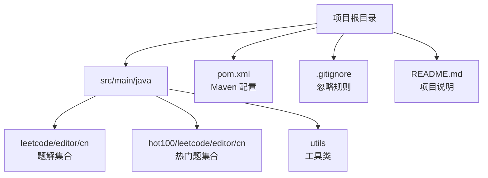
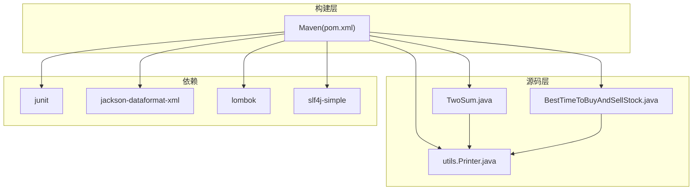
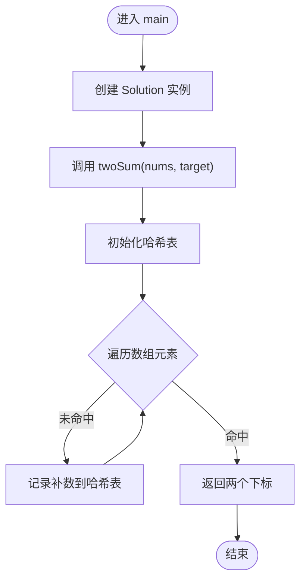
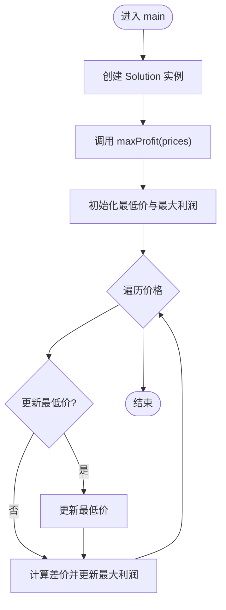
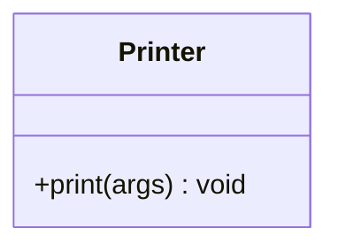
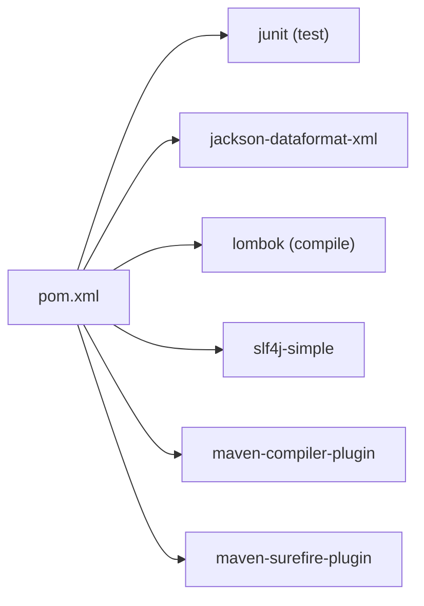

# 快速开始

<cite>
**本文引用的文件**   
- [README.md](file://README.md)
- [pom.xml](file://pom.xml)
- [.gitignore](file://.gitignore)
- [$_0001_两数之和.java](file://src/main/java/hot100/leetcode/editor/cn/$_0001_两数之和.java)
- [TwoSum.java](file://src/main/java/leetcode/editor/cn/TwoSum.java)
- [BestTimeToBuyAndSellStock.java](file://src/main/java/leetcode/editor/cn/BestTimeToBuyAndSellStock.java)
- [Printer.java](file://src/main/java/utils/Printer.java)
</cite>

## 目录
1. [简介](#简介)
2. [项目结构](#项目结构)
3. [核心组件](#核心组件)
4. [架构总览](#架构总览)
5. [详细组件分析](#详细组件分析)
6. [依赖分析](#依赖分析)
7. [性能与构建建议](#性能与构建建议)
8. [故障排除指南](#故障排除指南)
9. [结论](#结论)
10. [附录：环境设置与运行步骤](#附录环境设置与运行步骤)

## 简介
本仓库是一个基于 Java 的 LeetCode 算法题解练习项目，采用 Maven 进行依赖与构建管理。代码按“题目 + 编辑器模板”的方式组织，便于在本地直接运行、调试与扩展。项目同时包含少量工具类（如打印输出）以及部分热门题目的示例实现，适合初学者快速上手，也满足有经验的开发者对工程化与可维护性的要求。

## 项目结构
- 源码根目录：src/main/java
  - leetcode/editor/cn：存放大量题解，每个题目一个 Java 文件，内部通常包含 Solution 类与 main 方法用于本地测试
  - hot100/leetcode/editor/cn：精选热门题目集合，结构与上述类似
  - utils：通用工具类（例如 Printer）
- 构建配置：pom.xml（Maven 项目描述与插件配置）
- 忽略规则：.gitignore（忽略 IDE 配置、构建产物等）
- 说明文档：README.md（简要说明与部分题目索引）

图表来源
- [pom.xml:1-102](file://pom.xml#L1-L102)
- [README.md:1-12](file://README.md#L1-L12)

章节来源
- [README.md:1-12](file://README.md#L1-L12)
- [pom.xml:1-102](file://pom.xml#L1-L102)
- [.gitignore:1-3](file://.gitignore#L1-L3)

## 核心组件
- 题解模板与入口
  - 每个题解文件包含一个外部类与内部 Solution 类，并提供 main 方法作为本地执行入口，方便直接运行验证思路
  - 参考路径：[TwoSum.java](file://src/main/java/leetcode/editor/cn/TwoSum.java)、[BestTimeToBuyAndSellStock.java](file://src/main/java/leetcode/editor/cn/BestTimeToBuyAndSellStock.java)
- 工具类
  - utils.Printer：提供统一的打印输出方法，简化调试输出
  - 参考路径：[Printer.java](file://src/main/java/utils/Printer.java)
- 构建与依赖
  - pom.xml：定义 Java 版本、依赖库（JUnit、Jackson XML、Lombok、SLF4J Simple）、Maven 插件与编译目标
  - 参考路径：[pom.xml](file://pom.xml)

章节来源
- [TwoSum.java:1-78](file://src/main/java/leetcode/editor/cn/TwoSum.java#L1-L78)
- [BestTimeToBuyAndSellStock.java:1-62](file://src/main/java/leetcode/editor/cn/BestTimeToBuyAndSellStock.java#L1-L62)
- [Printer.java:1-16](file://src/main/java/utils/Printer.java#L1-L16)
- [pom.xml:1-102](file://pom.xml#L1-L102)

## 架构总览
从工程角度，本项目为“单模块 Maven 应用”，以“题目即单元”的组织方式，将每个题解独立成文件，并通过各自的 main 方法驱动运行。工具类被多个题解复用，依赖通过 Maven 集中管理。

图表来源
- [pom.xml:19-43](file://pom.xml#L19-L43)
- [TwoSum.java:1-78](file://src/main/java/leetcode/editor/cn/TwoSum.java#L1-L78)
- [BestTimeToBuyAndSellStock.java:1-62](file://src/main/java/leetcode/editor/cn/BestTimeToBuyAndSellStock.java#L1-L62)
- [Printer.java:1-16](file://src/main/java/utils/Printer.java#L1-L16)

## 详细组件分析

### 组件一：两数之和（TwoSum）
- 角色与职责
  - TwoSum 类：提供 main 方法作为本地测试入口，实例化内部 Solution 并调用 twoSum 方法
  - Solution 内部类：实现两数之和的核心逻辑
- 关键流程
  - 初始化数据结构（哈希表）
  - 遍历数组，查找补数是否存在于表中
  - 返回匹配到的两个下标
- 复杂度
  - 时间：O(n)
  - 空间：O(n)

图表来源
- [TwoSum.java:55-78](file://src/main/java/leetcode/editor/cn/TwoSum.java#L55-L78)

章节来源
- [TwoSum.java:1-78](file://src/main/java/leetcode/editor/cn/TwoSum.java#L1-L78)

### 组件二：买卖股票的最佳时机（BestTimeToBuyAndSellStock）
- 角色与职责
  - BestTimeToBuyAndSellStock 类：提供 main 方法作为本地测试入口，实例化内部 Solution 并调用 maxProfit 方法
  - Solution 内部类：实现一次交易的最大利润计算
- 关键流程
  - 维护历史最低价与当前最大利润
  - 遍历价格序列，更新最低价与最大利润
- 复杂度
  - 时间：O(n)
  - 空间：O(1)

图表来源
- [BestTimeToBuyAndSellStock.java:39-62](file://src/main/java/leetcode/editor/cn/BestTimeToBuyAndSellStock.java#L39-L62)

章节来源
- [BestTimeToBuyAndSellStock.java:1-62](file://src/main/java/leetcode/editor/cn/BestTimeToBuyAndSellStock.java#L1-L62)

### 组件三：工具类 Printer
- 角色与职责
  - 提供静态 print 方法，统一输出格式，便于调试
- 使用方式
  - 在题解中通过静态导入或全限定名调用，减少重复代码

图表来源
- [Printer.java:9-15](file://src/main/java/utils/Printer.java#L9-L15)

章节来源
- [Printer.java:1-16](file://src/main/java/utils/Printer.java#L1-L16)

### 组件四：热门题示例（$_0001_两数之和）
- 角色与职责
  - 展示热门题集合中的典型结构：外部类 + 内部 Solution + 自定义 main 方法
  - 演示使用 utils.Printer 进行输出
- 关键点
  - 与 TwoSum 类似，但更贴近“热门题”命名与组织风格

章节来源
- [$_0001_两数之和.java:1-35](file://src/main/java/hot100/leetcode/editor/cn/$_0001_两数之和.java#L1-L35)
- [Printer.java:1-16](file://src/main/java/utils/Printer.java#L1-L16)

## 依赖分析
- 构建与语言版本
  - Java 源与目标版本：25（由 pom.xml 指定）
- 主要依赖
  - junit：单元测试框架（test 作用域）
  - jackson-dataformat-xml：XML 数据格式支持
  - lombok：注解生成器（compile 作用域）
  - slf4j-simple：简单日志实现
- 插件
  - maven-compiler-plugin：编译器插件，确保 source/target 一致
  - maven-surefire-plugin：测试执行插件
  - 其他生命周期插件（clean、resources、jar、install、deploy、site 等）

图表来源
- [pom.xml:13-17](file://pom.xml#L13-L17)
- [pom.xml:19-43](file://pom.xml#L19-L43)
- [pom.xml:89-99](file://pom.xml#L89-L99)

章节来源
- [pom.xml:1-102](file://pom.xml#L1-L102)

## 性能与构建建议
- 构建优化
  - 使用增量编译：避免频繁 clean；仅在必要时清理 target
  - 合理设置 JVM 参数：在 IDEA 或命令行中为 Maven 分配足够内存，提升大型项目的编译速度
- 运行时优化
  - 优先选择 O(n) 或 O(n log n) 的算法实现，避免不必要的对象创建
  - 合理使用缓存与预分配容量（如 HashMap 初始容量），减少扩容开销
- 依赖管理
  - 仅引入必要依赖，保持最小化依赖集，降低冲突风险
  - 锁定依赖版本，保证团队一致性

## 故障排除指南
- 无法找到或解析依赖
  - 检查网络与 Maven 镜像配置是否正确
  - 确认 pom.xml 中依赖坐标与版本无误
- 编译失败（Java 版本不匹配）
  - 确认本地 JDK 版本与 pom.xml 中 source/target 一致（当前为 25）
  - 在 IDEA 中同步 Project SDK 与 Language Level
- 运行时报错（找不到主类或包）
  - 确认 main 方法所在类的包路径正确
  - 在 IDEA 中右键运行对应类的 main 方法
- 测试相关
  - 若后续添加单元测试，请确保 junit 依赖可用，并在 test 目录下编写用例
  - 使用 maven-surefire-plugin 执行测试

章节来源
- [pom.xml:13-17](file://pom.xml#L13-L17)
- [pom.xml:19-43](file://pom.xml#L19-L43)
- [.gitignore:1-3](file://.gitignore#L1-L3)

## 结论
本项目以“题目即单元”的结构清晰、易于扩展，配合 Maven 的依赖管理与多工具链支持，既适合初学者快速实践算法，也为进阶用户提供良好的工程基础。建议在继续开发时逐步完善单元测试、统一输出规范，并持续优化依赖与构建脚本。

## 附录：环境设置与运行步骤

- 环境准备
  - 安装 JDK 25（与 pom.xml 中 source/target 保持一致）
  - 安装 Maven（推荐 3.8+）
  - 安装 IDE（IntelliJ IDEA 或 Eclipse），并配置 JDK 与 Maven
- 克隆与打开项目
  - 使用 Git 克隆仓库到本地
  - 在 IDE 中选择“Open as Maven Project”或导入 pom.xml
- 首次构建
  - 在项目根目录执行：mvn compile
  - 如需打包：mvn package
- 运行第一个题解
  - 在 IDE 中找到 src/main/java/leetcode/editor/cn/TwoSum.java
  - 右键该类，选择“Run 'TwoSum.main()'”
  - 或在命令行执行：mvn exec:java -Dexec.mainClass="leetcode.editor.cn.TwoSum"（需额外配置 exec-maven-plugin）
- 编写与测试新题解
  - 在 leetcode/editor/cn 下新建 Java 文件，包含外部类与内部 Solution 类
  - 在外部类中添加 main 方法，实例化 Solution 并调用相应方法
  - 如需单元测试，可在 src/test/java 下创建对应测试类并使用 JUnit
- 常见问题
  - 如果编译报错提示 Java 版本不兼容，请检查 JAVA_HOME 与 IDE 的 Project SDK
  - 如果依赖下载失败，检查 Maven 镜像与网络连通性
  - 如果运行时报找不到类，检查包名与类名是否一致

章节来源
- [pom.xml:13-17](file://pom.xml#L13-L17)
- [pom.xml:89-99](file://pom.xml#L89-L99)
- [TwoSum.java:55-78](file://src/main/java/leetcode/editor/cn/TwoSum.java#L55-L78)