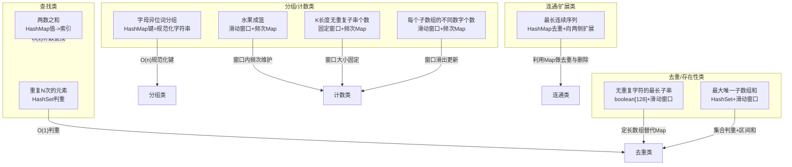
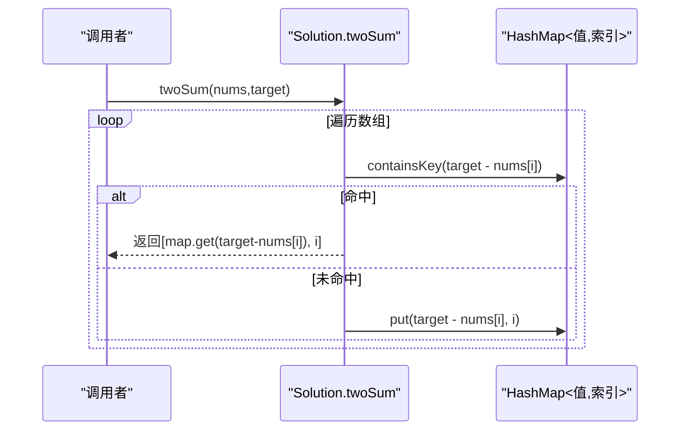
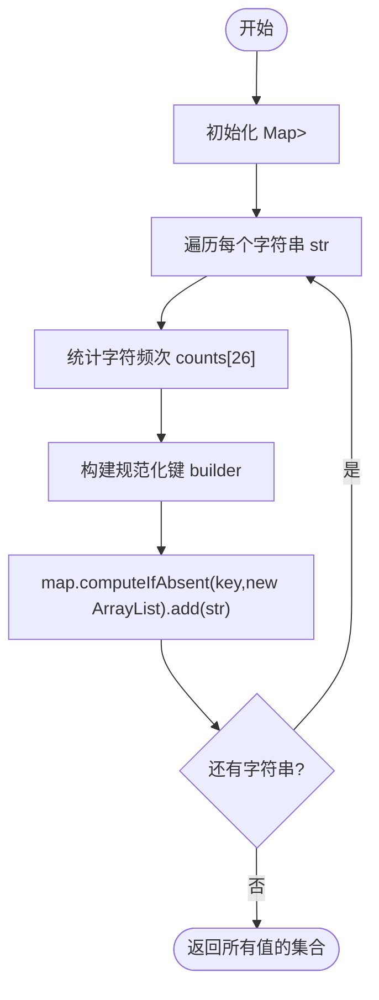
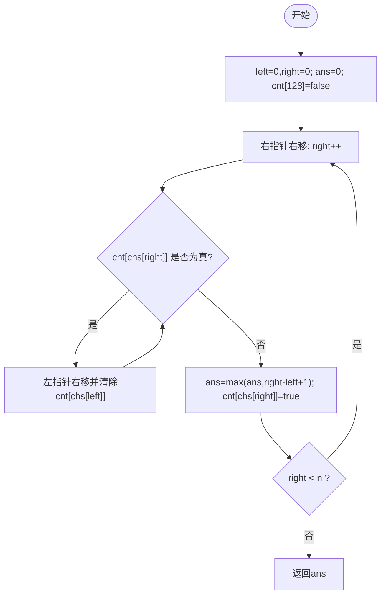
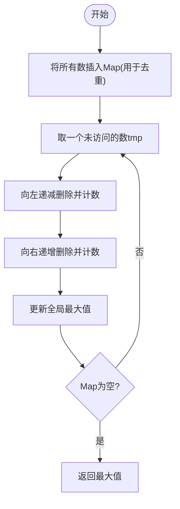
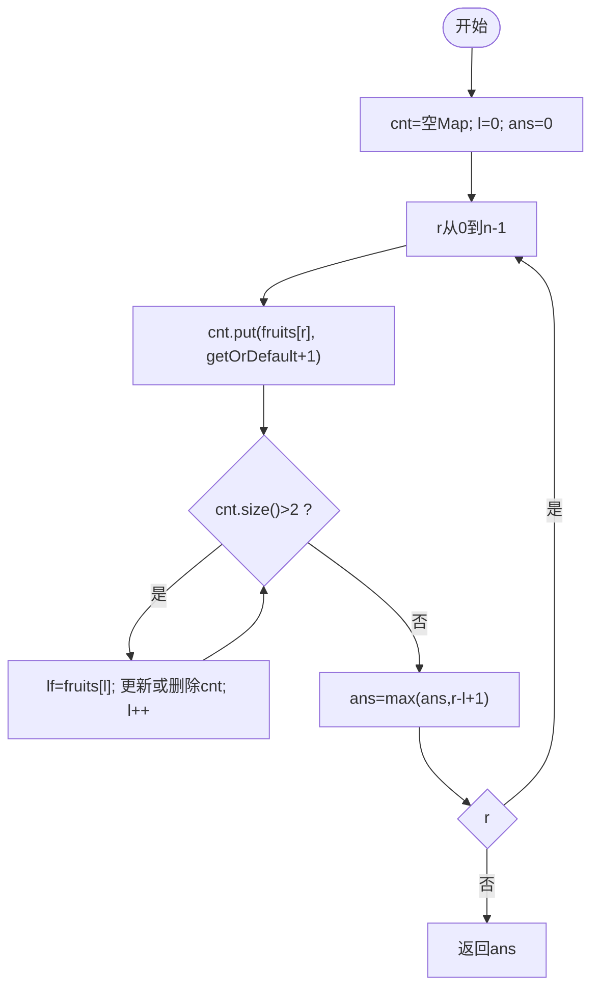
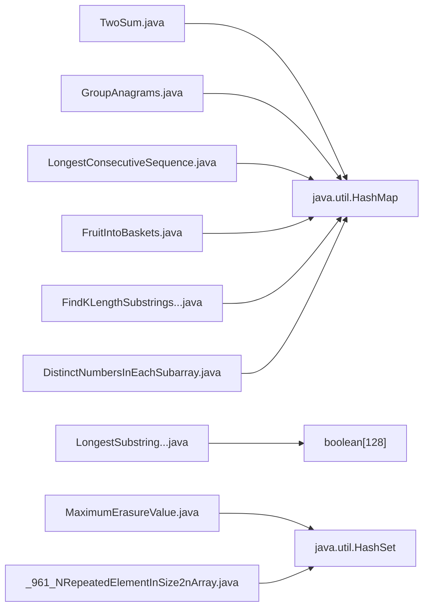

# 哈希表应用

<cite>
**本文引用的文件**   
- [TwoSum.java](file://src/main/java/leetcode/editor/cn/TwoSum.java)
- [GroupAnagrams.java](file://src/main/java/leetcode/editor/cn/GroupAnagrams.java)
- [LongestSubstringWithoutRepeatingCharacters.java](file://src/main/java/leetcode/editor/cn/LongestSubstringWithoutRepeatingCharacters.java)
- [LongestConsecutiveSequence.java](file://src/main/java/leetcode/editor/cn/LongestConsecutiveSequence.java)
- [FruitIntoBaskets.java](file://src/main/java/leetcode/editor/cn/FruitIntoBaskets.java)
- [FindKLengthSubstringsWithNoRepeatedCharacters.java](file://src/main/java/leetcode/editor/cn/FindKLengthSubstringsWithNoRepeatedCharacters.java)
- [DistinctNumbersInEachSubarray.java](file://src/main/java/leetcode/editor/cn/DistinctNumbersInEachSubarray.java)
- [MaximumErasureValue.java](file://src/main/java/leetcode/editor/cn/MaximumErasureValue.java)
- [_961_NRepeatedElementInSize2nArray.java](file://src/main/java/leetcode/editor/cn/_961_NRepeatedElementInSize2nArray.java)
</cite>

## 目录
1. [引言](#引言)
2. [项目结构](#项目结构)
3. [核心组件](#核心组件)
4. [架构总览](#架构总览)
5. [详细组件分析](#详细组件分析)
6. [依赖分析](#依赖分析)
7. [性能考量](#性能考量)
8. [故障排查指南](#故障排查指南)
9. [结论](#结论)
10. [附录](#附录)

## 引言
本文件围绕LeetCode题解仓库中的哈希表实践，系统讲解哈希表的工作原理、冲突解决与性能特性，并结合Java集合框架的HashMap、HashSet等给出实战技巧。文档通过“去重、计数、查找”三大典型场景串联多道题目，展示滑动窗口+哈希表的组合模式，并讨论自定义哈希函数设计与碰撞处理策略，最后提供时间复杂度分析与空间优化建议。

## 项目结构
本项目将每道题以独立类组织，位于编辑器适配包下，便于按题号检索与对照。与哈希表相关的实现集中在以下文件：
- 两数之和（哈希表一次扫描）
- 字母异位词分组（哈希表分组）
- 无重复字符的最长子串（哈希/位标记+滑动窗口）
- 最长连续序列（哈希表去重+线性扩展）
- 水果成篮（滑动窗口+频次映射）
- K长度无重复子串个数（固定窗口+频次映射）
- 每个子数组的不同数字个数（滑动窗口+频次映射）
- 最大唯一子数组和（滑动窗口+集合去重）
- 大小为N且重复N次的元素（集合去重）

```mermaid
graph TB
A["TwoSum.java<br/>两数之和"] --> H1["HashMap<Integer,Integer><br/>值->索引"]
B["GroupAnagrams.java<br/>字母异位词分组"] --> H2["HashMap<String,List<String>><br/>键=规范化字符串"]
C["LongestSubstringWithoutRepeatingCharacters.java<br/>无重复字符的最长子串"] --> S1["boolean[128]<br/>ASCII存在性"]
D["LongestConsecutiveSequence.java<br/>最长连续序列"] --> H3["HashMap<Integer,Integer><br/>值->索引(用于删除)"]
E["FruitIntoBaskets.java<br/>水果成篮"] --> H4["HashMap<Integer,Integer><br/>种类->频次"]
F["FindKLengthSubstringsWithNoRepeatedCharacters.java<br/>K长度无重复子串个数"] --> H5["HashMap<Character,Integer><br/>字符->频次"]
G["DistinctNumbersInEachSubarray.java<br/>每个子数组的不同数字个数"] --> H6["HashMap<Integer,Integer><br/>数值->频次"]
H["MaximumErasureValue.java<br/>最大唯一子数组和"] --> S2["HashSet<Integer><br/>去重集合"]
I["_961_NRepeatedElementInSize2nArray.java<br/>重复N次的元素"] --> S3["HashSet<Integer><br/>去重集合"]
```

图表来源
- [TwoSum.java:62-75](file://src/main/java/leetcode/editor/cn/TwoSum.java#L62-L75)
- [GroupAnagrams.java:51-72](file://src/main/java/leetcode/editor/cn/GroupAnagrams.java#L51-L72)
- [LongestSubstringWithoutRepeatingCharacters.java:56-71](file://src/main/java/leetcode/editor/cn/LongestSubstringWithoutRepeatingCharacters.java#L56-L71)
- [LongestConsecutiveSequence.java:51-88](file://src/main/java/leetcode/editor/cn/LongestConsecutiveSequence.java#L51-L88)
- [FruitIntoBaskets.java:73-88](file://src/main/java/leetcode/editor/cn/FruitIntoBaskets.java#L73-L88)
- [FindKLengthSubstringsWithNoRepeatedCharacters.java:44-60](file://src/main/java/leetcode/editor/cn/FindKLengthSubstringsWithNoRepeatedCharacters.java#L44-L60)
- [DistinctNumbersInEachSubarray.java:57-71](file://src/main/java/leetcode/editor/cn/DistinctNumbersInEachSubarray.java#L57-L71)
- [MaximumErasureValue.java:51-67](file://src/main/java/leetcode/editor/cn/MaximumErasureValue.java#L51-L67)
- [_961_NRepeatedElementInSize2nArray.java:63-75](file://src/main/java/leetcode/editor/cn/_961_NRepeatedElementInSize2nArray.java#L63-L75)

章节来源
- [TwoSum.java:62-75](file://src/main/java/leetcode/editor/cn/TwoSum.java#L62-L75)
- [GroupAnagrams.java:51-72](file://src/main/java/leetcode/editor/cn/GroupAnagrams.java#L51-L72)
- [LongestSubstringWithoutRepeatingCharacters.java:56-71](file://src/main/java/leetcode/editor/cn/LongestSubstringWithoutRepeatingCharacters.java#L56-L71)
- [LongestConsecutiveSequence.java:51-88](file://src/main/java/leetcode/editor/cn/LongestConsecutiveSequence.java#L51-L88)
- [FruitIntoBaskets.java:73-88](file://src/main/java/leetcode/editor/cn/FruitIntoBaskets.java#L73-L88)
- [FindKLengthSubstringsWithNoRepeatedCharacters.java:44-60](file://src/main/java/leetcode/editor/cn/FindKLengthSubstringsWithNoRepeatedCharacters.java#L44-L60)
- [DistinctNumbersInEachSubarray.java:57-71](file://src/main/java/leetcode/editor/cn/DistinctNumbersInEachSubarray.java#L57-L71)
- [MaximumErasureValue.java:51-67](file://src/main/java/leetcode/editor/cn/MaximumErasureValue.java#L51-L67)
- [_961_NRepeatedElementInSize2nArray.java:63-75](file://src/main/java/leetcode/editor/cn/_961_NRepeatedElementInSize2nArray.java#L63-L75)

## 核心组件
- HashMap<Integer, Integer>：值到索引或频次的映射，常用于“两数之和”“滑动窗口计数”“连续序列扩展”等。
- HashMap<String, List<String>>：将等价类（如异位词）归组，键为规范化后的标识。
- HashSet<Integer>：快速判重，适合“是否存在重复”“去重统计”的场景。
- boolean[] / int[] 计数数组：当键空间有限（如ASCII、小写字母、数字范围）时，用定长数组替代哈希表以降低开销。

章节来源
- [TwoSum.java:62-75](file://src/main/java/leetcode/editor/cn/TwoSum.java#L62-L75)
- [GroupAnagrams.java:51-72](file://src/main/java/leetcode/editor/cn/GroupAnagrams.java#L51-L72)
- [LongestSubstringWithoutRepeatingCharacters.java:56-71](file://src/main/java/leetcode/editor/cn/LongestSubstringWithoutRepeatingCharacters.java#L56-L71)
- [MaximumErasureValue.java:51-67](file://src/main/java/leetcode/editor/cn/MaximumErasureValue.java#L51-L67)

## 架构总览
下图展示了各题在“数据结构选择 + 算法范式”上的关系，体现哈希表在不同问题中的角色与组合方式。

图表来源
- [TwoSum.java:62-75](file://src/main/java/leetcode/editor/cn/TwoSum.java#L62-L75)
- [_961_NRepeatedElementInSize2nArray.java:63-75](file://src/main/java/leetcode/editor/cn/_961_NRepeatedElementInSize2nArray.java#L63-L75)
- [GroupAnagrams.java:51-72](file://src/main/java/leetcode/editor/cn/GroupAnagrams.java#L51-L72)
- [FruitIntoBaskets.java:73-88](file://src/main/java/leetcode/editor/cn/FruitIntoBaskets.java#L73-L88)
- [FindKLengthSubstringsWithNoRepeatedCharacters.java:44-60](file://src/main/java/leetcode/editor/cn/FindKLengthSubstringsWithNoRepeatedCharacters.java#L44-L60)
- [DistinctNumbersInEachSubarray.java:57-71](file://src/main/java/leetcode/editor/cn/DistinctNumbersInEachSubarray.java#L57-L71)
- [LongestSubstringWithoutRepeatingCharacters.java:56-71](file://src/main/java/leetcode/editor/cn/LongestSubstringWithoutRepeatingCharacters.java#L56-L71)
- [MaximumErasureValue.java:51-67](file://src/main/java/leetcode/editor/cn/MaximumErasureValue.java#L51-L67)
- [LongestConsecutiveSequence.java:51-88](file://src/main/java/leetcode/editor/cn/LongestConsecutiveSequence.java#L51-L88)

## 详细组件分析

### 两数之和（HashMap：值→索引）
- 目标：在一次遍历中，对当前元素x，检查target-x是否已出现；若出现则返回两者索引。
- 关键点：先查后存，避免使用自身作为配对。
- 复杂度：时间O(n)，空间O(n)。
- 代码片段路径：[TwoSum.java:62-75](file://src/main/java/leetcode/editor/cn/TwoSum.java#L62-L75)

图表来源
- [TwoSum.java:62-75](file://src/main/java/leetcode/editor/cn/TwoSum.java#L62-L75)

章节来源
- [TwoSum.java:62-75](file://src/main/java/leetcode/editor/cn/TwoSum.java#L62-L75)

### 字母异位词分组（HashMap：规范化键→列表）
- 目标：将互为异位词的字符串分到同一组。
- 关键设计：构造稳定的“规范化键”，例如字符频次向量或排序后的字符串；本题采用频次压缩为字符串作为键。
- 复杂度：时间O(n·k)（n为字符串数，k为平均长度），空间O(n·k)。
- 代码片段路径：[GroupAnagrams.java:51-72](file://src/main/java/leetcode/editor/cn/GroupAnagrams.java#L51-L72)

图表来源
- [GroupAnagrams.java:51-72](file://src/main/java/leetcode/editor/cn/GroupAnagrams.java#L51-L72)

章节来源
- [GroupAnagrams.java:51-72](file://src/main/java/leetcode/editor/cn/GroupAnagrams.java#L51-L72)

### 无重复字符的最长子串（定长数组+滑动窗口）
- 目标：求不含重复字符的最长子串长度。
- 关键设计：由于字符集较小（ASCII），使用boolean[128]记录存在性，配合左右指针滑动窗口。
- 复杂度：时间O(n)，空间O(Σ)（Σ为字符集大小）。
- 代码片段路径：[LongestSubstringWithoutRepeatingCharacters.java:56-71](file://src/main/java/leetcode/editor/cn/LongestSubstringWithoutRepeatingCharacters.java#L56-L71)

图表来源
- [LongestSubstringWithoutRepeatingCharacters.java:56-71](file://src/main/java/leetcode/editor/cn/LongestSubstringWithoutRepeatingCharacters.java#L56-L71)

章节来源
- [LongestSubstringWithoutRepeatingCharacters.java:56-71](file://src/main/java/leetcode/editor/cn/LongestSubstringWithoutRepeatingCharacters.java#L56-L71)

### 最长连续序列（HashMap去重+线性扩展）
- 目标：在未排序数组中找到最长连续整数序列的长度。
- 关键设计：将所有数放入Map用于去重；仅从序列起点（即x-1不在集合中）开始向右扩展，保证整体O(n)。
- 复杂度：时间O(n)，空间O(n)。
- 代码片段路径：[LongestConsecutiveSequence.java:51-88](file://src/main/java/leetcode/editor/cn/LongestConsecutiveSequence.java#L51-L88)

图表来源
- [LongestConsecutiveSequence.java:51-88](file://src/main/java/leetcode/editor/cn/LongestConsecutiveSequence.java#L51-L88)

章节来源
- [LongestConsecutiveSequence.java:51-88](file://src/main/java/leetcode/editor/cn/LongestConsecutiveSequence.java#L51-L88)

### 水果成篮（滑动窗口+频次Map）
- 目标：最多两种水果类型的最长子段长度。
- 关键设计：维护窗口内每种水果的频次Map，当种类数>2时收缩左边界。
- 复杂度：时间O(n)，空间O(2)=O(1)。
- 代码片段路径：[FruitIntoBaskets.java:73-88](file://src/main/java/leetcode/editor/cn/FruitIntoBaskets.java#L73-L88)

图表来源
- [FruitIntoBaskets.java:73-88](file://src/main/java/leetcode/editor/cn/FruitIntoBaskets.java#L73-L88)

章节来源
- [FruitIntoBaskets.java:73-88](file://src/main/java/leetcode/editor/cn/FruitIntoBaskets.java#L73-L88)

### K长度无重复子串个数（固定窗口+频次Map）
- 目标：长度为K且不含重复字符的子串数量。
- 关键设计：维护窗口内字符频次Map，窗口满时判断size==K。
- 复杂度：时间O(n)，空间O(min(n,Σ))。
- 代码片段路径：[FindKLengthSubstringsWithNoRepeatedCharacters.java:44-60](file://src/main/java/leetcode/editor/cn/FindKLengthSubstringsWithNoRepeatedCharacters.java#L44-L60)

章节来源
- [FindKLengthSubstringsWithNoRepeatedCharacters.java:44-60](file://src/main/java/leetcode/editor/cn/FindKLengthSubstringsWithNoRepeatedCharacters.java#L44-L60)

### 每个子数组的不同数字个数（滑动窗口+频次Map）
- 目标：对每个长度为k的窗口，输出不同元素个数。
- 关键设计：窗口滑出时更新频次Map，size即为答案。
- 复杂度：时间O(n)，空间O(k)。
- 代码片段路径：[DistinctNumbersInEachSubarray.java:57-71](file://src/main/java/leetcode/editor/cn/DistinctNumbersInEachSubarray.java#L57-L71)

章节来源
- [DistinctNumbersInEachSubarray.java:57-71](file://src/main/java/leetcode/editor/cn/DistinctNumbersInEachSubarray.java#L57-L71)

### 最大唯一子数组和（HashSet+滑动窗口）
- 目标：删除一个只含不同元素的子数组，使其和最大。
- 关键设计：用Set维护窗口内元素，遇到重复则收缩左边界，同时维护窗口和。
- 复杂度：时间O(n)，空间O(k)。
- 代码片段路径：[MaximumErasureValue.java:51-67](file://src/main/java/leetcode/editor/cn/MaximumErasureValue.java#L51-L67)

章节来源
- [MaximumErasureValue.java:51-67](file://src/main/java/leetcode/editor/cn/MaximumErasureValue.java#L51-L67)

### 重复N次的元素（HashSet判重）
- 目标：在特定分布条件下找到重复N次的元素。
- 关键设计：首次遇到重复的元素即为答案。
- 复杂度：时间O(n)，空间O(n)。
- 代码片段路径：[_961_NRepeatedElementInSize2nArray.java:63-75](file://src/main/java/leetcode/editor/cn/_961_NRepeatedElementInSize2nArray.java#L63-L75)

章节来源
- [_961_NRepeatedElementInSize2nArray.java:63-75](file://src/main/java/leetcode/editor/cn/_961_NRepeatedElementInSize2nArray.java#L63-L75)

## 依赖分析
- 内部耦合：各题相互独立，主要依赖Java标准库java.util.HashMap、java.util.HashSet、java.util.Map、java.util.Set。
- 外部依赖：无第三方库依赖。
- 循环依赖：无。

图表来源
- [TwoSum.java:62-75](file://src/main/java/leetcode/editor/cn/TwoSum.java#L62-L75)
- [GroupAnagrams.java:51-72](file://src/main/java/leetcode/editor/cn/GroupAnagrams.java#L51-L72)
- [LongestSubstringWithoutRepeatingCharacters.java:56-71](file://src/main/java/leetcode/editor/cn/LongestSubstringWithoutRepeatingCharacters.java#L56-L71)
- [LongestConsecutiveSequence.java:51-88](file://src/main/java/leetcode/editor/cn/LongestConsecutiveSequence.java#L51-L88)
- [FruitIntoBaskets.java:73-88](file://src/main/java/leetcode/editor/cn/FruitIntoBaskets.java#L73-L88)
- [FindKLengthSubstringsWithNoRepeatedCharacters.java:44-60](file://src/main/java/leetcode/editor/cn/FindKLengthSubstringsWithNoRepeatedCharacters.java#L44-L60)
- [DistinctNumbersInEachSubarray.java:57-71](file://src/main/java/leetcode/editor/cn/DistinctNumbersInEachSubarray.java#L57-L71)
- [MaximumErasureValue.java:51-67](file://src/main/java/leetcode/editor/cn/MaximumErasureValue.java#L51-L67)
- [_961_NRepeatedElementInSize2nArray.java:63-75](file://src/main/java/leetcode/editor/cn/_961_NRepeatedElementInSize2nArray.java#L63-L75)

章节来源
- [TwoSum.java:62-75](file://src/main/java/leetcode/editor/cn/TwoSum.java#L62-L75)
- [GroupAnagrams.java:51-72](file://src/main/java/leetcode/editor/cn/GroupAnagrams.java#L51-L72)
- [LongestSubstringWithoutRepeatingCharacters.java:56-71](file://src/main/java/leetcode/editor/cn/LongestSubstringWithoutRepeatingCharacters.java#L56-L71)
- [LongestConsecutiveSequence.java:51-88](file://src/main/java/leetcode/editor/cn/LongestConsecutiveSequence.java#L51-L88)
- [FruitIntoBaskets.java:73-88](file://src/main/java/leetcode/editor/cn/FruitIntoBaskets.java#L73-L88)
- [FindKLengthSubstringsWithNoRepeatedCharacters.java:44-60](file://src/main/java/leetcode/editor/cn/FindKLengthSubstringsWithNoRepeatedCharacters.java#L44-L60)
- [DistinctNumbersInEachSubarray.java:57-71](file://src/main/java/leetcode/editor/cn/DistinctNumbersInEachSubarray.java#L57-L71)
- [MaximumErasureValue.java:51-67](file://src/main/java/leetcode/editor/cn/MaximumErasureValue.java#L51-L67)
- [_961_NRepeatedElementInSize2nArray.java:63-75](file://src/main/java/leetcode/editor/cn/_961_NRepeatedElementInSize2nArray.java#L63-L75)

## 性能考量
- 时间复杂度
  - 两数之和：O(n)
  - 异位词分组：O(n·k)
  - 无重复子串：O(n)
  - 最长连续序列：O(n)
  - 滑动窗口类（水果成篮、K长度无重复、不同数字个数、最大唯一子数组和）：均摊O(n)
- 空间复杂度
  - 哈希表/集合：O(n)
  - 定长数组（如boolean[128]）：O(Σ)
- 冲突与扩容
  - Java HashMap基于数组+链表/红黑树，负载因子默认0.75；合理预估容量可减少rehash带来的额外开销。
- 空间优化技巧
  - 键空间有限时用定长数组替代HashMap/HashSet（如ASCII、小写字母、数字范围）。
  - 滑动窗口中尽量使用原地更新，避免不必要的对象创建。
  - 对频繁创建的键（如异位词键）可考虑复用StringBuilder或预分配缓冲区。

## 故障排查指南
- 越界与空输入
  - 检查窗口边界条件（l<=r、i<k-1等），确保不会访问非法索引。
- 重复计数错误
  - 窗口滑出时务必正确减少频次或移除键，避免Map.size()失真。
- 哈希键不稳定
  - 异位词分组键必须稳定（排序或频次向量），否则无法正确分组。
- 初始容量设置
  - 已知数据规模时可设置初始容量，降低扩容成本。
- 内存占用过高
  - 优先使用定长数组替代哈希表；必要时及时清理不再需要的条目。

## 结论
哈希表在LeetCode高频题型中扮演“快速查找/判重/计数”的核心角色。结合滑动窗口、双指针、前缀和等范式，可高效解决大量字符串与数组问题。实践中应优先考虑键空间的紧凑表示（定长数组）、合理预估容量、以及窗口更新的细节正确性，从而获得稳定且优秀的性能表现。

## 附录
- 常见模式速查
  - 两数之和：一次扫描+补数查找
  - 异位词分组：规范化键+分组收集
  - 无重复子串：定长数组+滑动窗口
  - 最长连续序列：集合去重+从起点扩展
  - 滑动窗口计数：频次Map+窗口约束
  - 去重统计：HashSet判重
- 与其他数据结构对比
  - 与TreeMap/TreeSet相比：哈希结构平均O(1)，但无序；需要有序时使用TreeMap/TreeSet。
  - 与数组/位图相比：当键空间小且密集时，数组/位图更快更省内存。