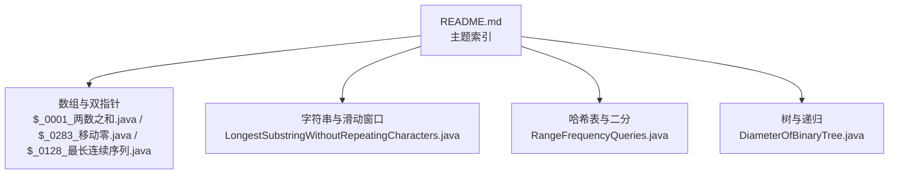
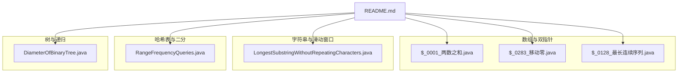
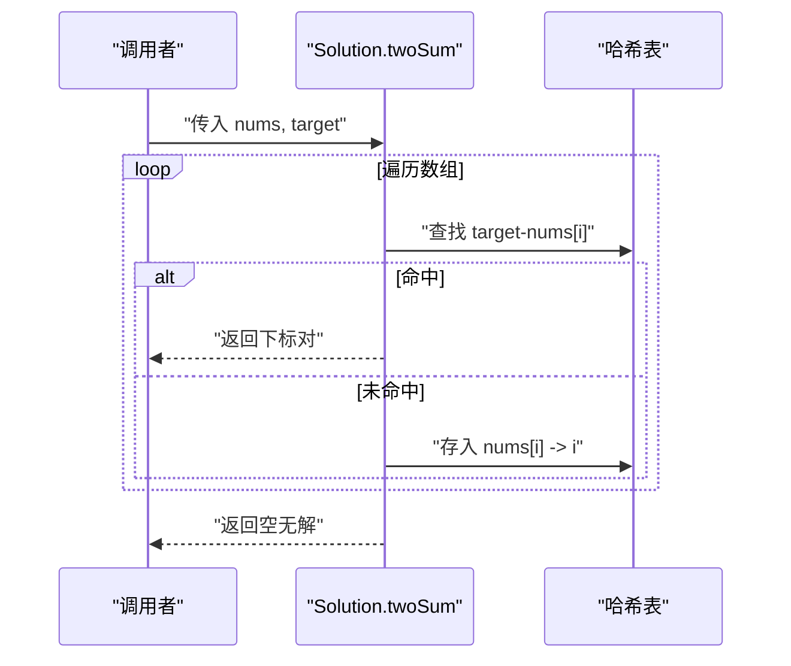
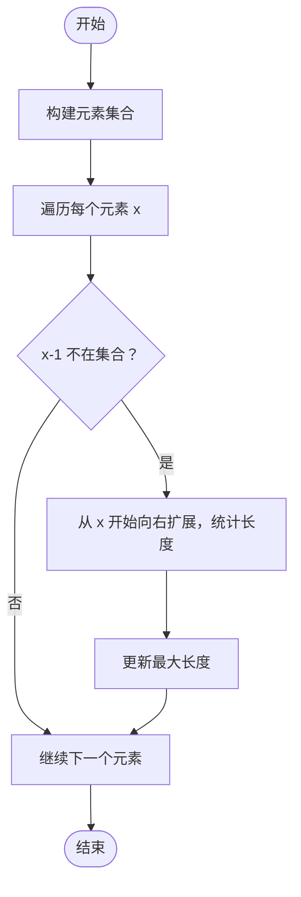
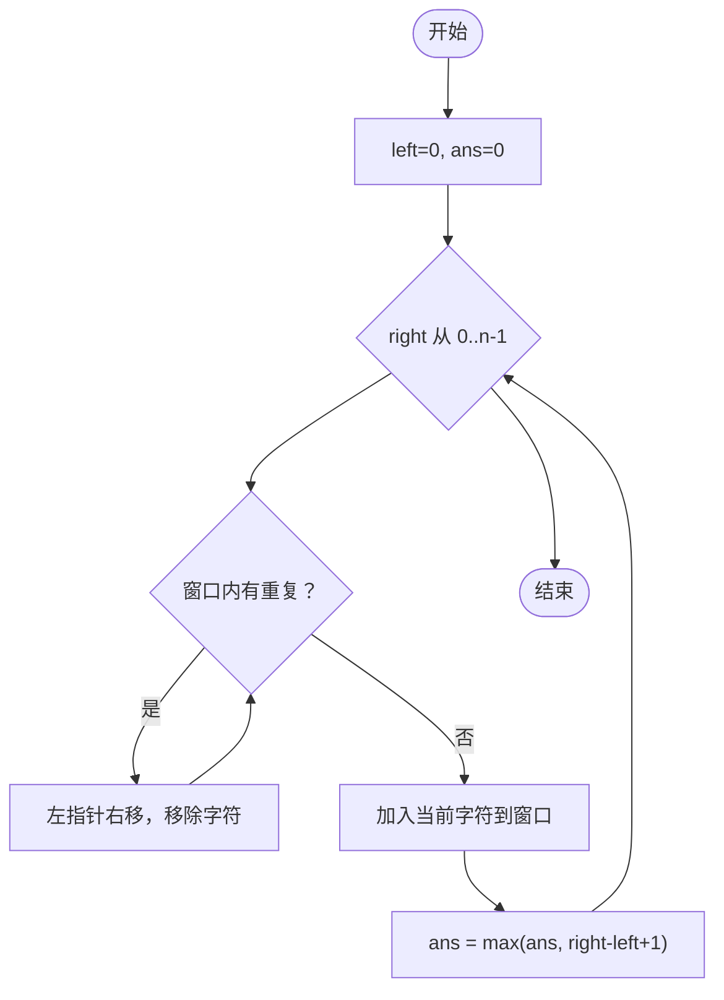
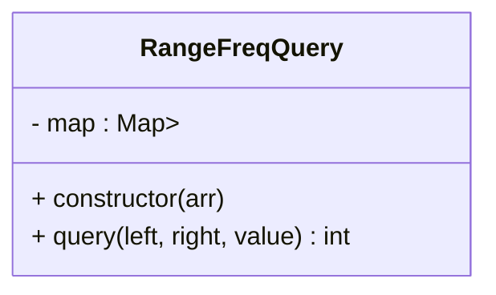
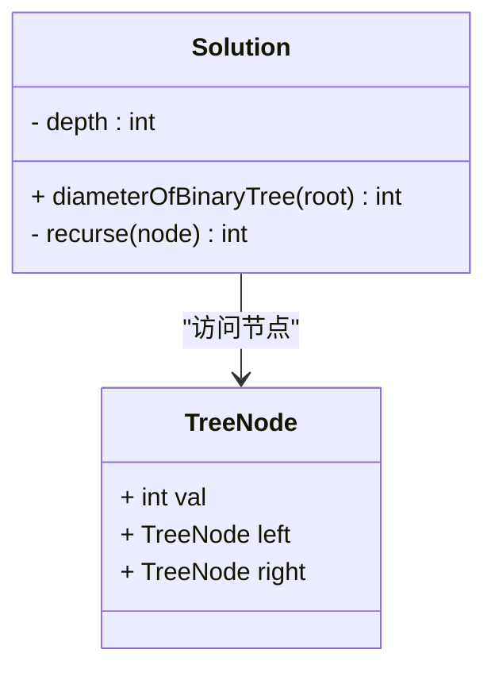
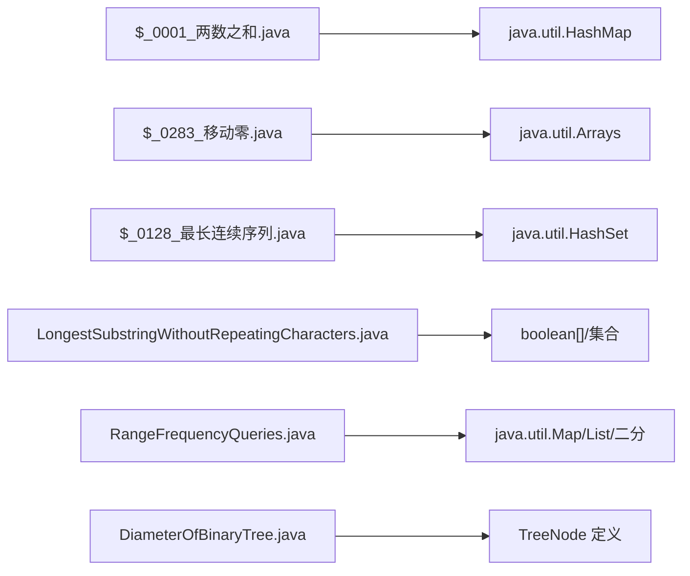

# 数据结构专题

<cite>
**本文引用的文件**   
- [README.md](file://README.md)
- [$_0001_两数之和.java](file://src/main/java/hot100/leetcode/editor/cn/$_0001_两数之和.java)
- [$_0283_移动零.java](file://src/main/java/hot100/leetcode/editor/cn/$_0283_移动零.java)
- [$_0128_最长连续序列.java](file://src/main/java/hot100/leetcode/editor/cn/$_0128_最长连续序列.java)
- [RangeFrequencyQueries.java](file://src/main/java/leetcode/editor/cn/RangeFrequencyQueries.java)
- [DiameterOfBinaryTree.java](file://src/main/java/leetcode/editor/cn/DiameterOfBinaryTree.java)
- [LongestSubstringWithoutRepeatingCharacters.java](file://src/main/java/leetcode/editor/cn/LongestSubstringWithoutRepeatingCharacters.java)
</cite>

## 目录
1. [引言](#引言)
2. [项目结构](#项目结构)
3. [核心组件](#核心组件)
4. [架构总览](#架构总览)
5. [详细组件分析](#详细组件分析)
6. [依赖分析](#依赖分析)
7. [性能考虑](#性能考虑)
8. [故障排查指南](#故障排查指南)
9. [结论](#结论)
10. [附录](#附录)

## 引言
本专题围绕数组、字符串、链表、树、图、哈希表等核心数据结构，结合仓库中的题解代码，系统讲解其特点、适用场景与性能特征；通过实际题目示例展示数据结构的选择与使用技巧；解释不同数据结构之间的转换与优化策略；并给出边界条件处理、内存管理注意事项以及性能调优建议与最佳实践。目标是帮助读者在LeetCode刷题与工程实践中建立“以数据结构为中心”的解题方法论。

## 项目结构
本项目为Java实现的LeetCode题解集合，按“hot100/热门题”和“leetcode/editor/cn/通用题”组织，每个题一个类，内部包含Solution实现与main测试入口。文档将聚焦以下代表性文件：
- 数组与双指针：两数之和、移动零、最长连续序列（骨架）
- 字符串与滑动窗口：无重复字符的最长子串
- 哈希表与二分：子数组内值频率查询
- 树与递归：二叉树直径



图表来源
- [README.md:1-12](file://README.md#L1-L12)
- [$_0001_两数之和.java:1-35](file://src/main/java/hot100/leetcode/editor/cn/$_0001_两数之和.java#L1-L35)
- [$_0283_移动零.java:1-68](file://src/main/java/hot100/leetcode/editor/cn/$_0283_移动零.java#L1-L68)
- [$_0128_最长连续序列.java:1-23](file://src/main/java/hot100/leetcode/editor/cn/$_0128_最长连续序列.java#L1-L23)
- [LongestSubstringWithoutRepeatingCharacters.java:1-74](file://src/main/java/leetcode/editor/cn/LongestSubstringWithoutRepeatingCharacters.java#L1-L74)
- [RangeFrequencyQueries.java:1-76](file://src/main/java/leetcode/editor/cn/RangeFrequencyQueries.java#L1-L76)
- [DiameterOfBinaryTree.java:1-88](file://src/main/java/leetcode/editor/cn/DiameterOfBinaryTree.java#L1-L88)

章节来源
- [README.md:1-12](file://README.md#L1-L12)

## 核心组件
本节从“数据结构—算法思想—典型题目—复杂度—边界与优化”五个维度，梳理仓库中体现的核心能力。

- 数组与双指针
  - 代表题目：两数之和（哈希辅助）、移动零（原地分区/交换）、最长连续序列（骨架待补）
  - 关键思想：一次扫描+哈希记录、快慢指针/左右指针、原地重排
  - 复杂度：O(n)/O(1)或O(n)/O(n)，视是否允许额外空间
  - 边界：空数组、全相同元素、目标不存在
  - 优化：避免多次遍历；优先原地操作减少分配

- 字符串与滑动窗口
  - 代表题目：无重复字符的最长子串
  - 关键思想：左右指针维护合法窗口，配合计数/存在性结构快速判断
  - 复杂度：O(n)时间，O(k)空间（k为字符集大小）
  - 边界：空串、单字符、全重复
  - 优化：固定字符集用定长数组替代Map；右扩左缩保证线性

- 哈希表与二分
  - 代表题目：子数组内值的频率查询
  - 关键思想：预处理位置列表，查询时二分定位区间计数
  - 复杂度：构造O(n)，查询O(log n)
  - 边界：value不存在、left>right、越界
  - 优化：预排序位置列表；必要时可换线段树/分块

- 树与递归
  - 代表题目：二叉树直径
  - 关键思想：后序遍历自底向上计算深度，同时更新全局最优
  - 复杂度：O(n)时间，O(h)栈空间
  - 边界：空树、单节点、链状树
  - 优化：避免重复计算；用成员变量或返回值传递信息

章节来源
- [$_0001_两数之和.java:1-35](file://src/main/java/hot100/leetcode/editor/cn/$_0001_两数之和.java#L1-L35)
- [$_0283_移动零.java:1-68](file://src/main/java/hot100/leetcode/editor/cn/$_0283_移动零.java#L1-L68)
- [$_0128_最长连续序列.java:1-23](file://src/main/java/hot100/leetcode/editor/cn/$_0128_最长连续序列.java#L1-L23)
- [LongestSubstringWithoutRepeatingCharacters.java:1-74](file://src/main/java/leetcode/editor/cn/LongestSubstringWithoutRepeatingCharacters.java#L1-L74)
- [RangeFrequencyQueries.java:1-76](file://src/main/java/leetcode/editor/cn/RangeFrequencyQueries.java#L1-L76)
- [DiameterOfBinaryTree.java:1-88](file://src/main/java/leetcode/editor/cn/DiameterOfBinaryTree.java#L1-L88)

## 架构总览
下图展示了各题解模块与其对应的数据结构主题关系，便于从“问题—数据结构—算法范式”的角度进行检索与复习。



图表来源
- [README.md:1-12](file://README.md#L1-L12)
- [$_0001_两数之和.java:1-35](file://src/main/java/hot100/leetcode/editor/cn/$_0001_两数之和.java#L1-L35)
- [$_0283_移动零.java:1-68](file://src/main/java/hot100/leetcode/editor/cn/$_0283_移动零.java#L1-L68)
- [$_0128_最长连续序列.java:1-23](file://src/main/java/hot100/leetcode/editor/cn/$_0128_最长连续序列.java#L1-L23)
- [LongestSubstringWithoutRepeatingCharacters.java:1-74](file://src/main/java/leetcode/editor/cn/LongestSubstringWithoutRepeatingCharacters.java#L1-L74)
- [RangeFrequencyQueries.java:1-76](file://src/main/java/leetcode/editor/cn/RangeFrequencyQueries.java#L1-L76)
- [DiameterOfBinaryTree.java:1-88](file://src/main/java/leetcode/editor/cn/DiameterOfBinaryTree.java#L1-L88)

## 详细组件分析

### 数组与双指针：两数之和（哈希辅助）
- 数据结构选择：数组+哈希表
- 算法要点：一次遍历，边查边存；利用target-nums[i]快速定位配对
- 复杂度：时间O(n)，空间O(n)
- 边界与异常：无解返回空；输入为空或长度不足
- 优化建议：若允许二次遍历且数组有序，可用双指针降至O(1)空间



图表来源
- [$_0001_两数之和.java:1-35](file://src/main/java/hot100/leetcode/editor/cn/$_0001_两数之和.java#L1-L35)

章节来源
- [$_0001_两数之和.java:1-35](file://src/main/java/hot100/leetcode/editor/cn/$_0001_两数之和.java#L1-L35)

### 数组与双指针：移动零（原地分区/交换）
- 数据结构选择：数组
- 算法要点：
  - 方案一：非零元素前移，尾部填充零
  - 方案二：维护“首个零位置”，遇到非零则交换并推进
- 复杂度：时间O(n)，空间O(1)
- 边界与异常：空数组、全零、全非零
- 优化建议：尽量一次遍历完成；交换法可减少写次数

```mermaid
flowchart TD
Start(["开始"]) --> Init["初始化指针 i0=0"]
Init --> Loop{"遍历 i 从 0..n-1"}
Loop --> |nums[i]!=0| Swap["交换 nums[i] 与 nums[i0] 并 i0++"]
Swap --> Loop
Loop --> |nums[i]==0| Loop
Loop --> End(["结束"])
```

图表来源
- [$_0283_移动零.java:1-68](file://src/main/java/hot100/leetcode/editor/cn/$_0283_移动零.java#L1-L68)

章节来源
- [$_0283_移动零.java:1-68](file://src/main/java/hot100/leetcode/editor/cn/$_0283_移动零.java#L1-L68)

### 数组与双指针：最长连续序列（骨架）
- 数据结构选择：哈希集合（去重+O(1)查找）
- 算法要点：仅从序列起点开始扩展，避免重复计算
- 复杂度：期望O(n)时间，O(n)空间
- 边界与异常：空数组、重复元素、负数
- 状态：当前文件提供骨架方法，可据此补充完整实现



图表来源
- [$_0128_最长连续序列.java:1-23](file://src/main/java/hot100/leetcode/editor/cn/$_0128_最长连续序列.java#L1-L23)

章节来源
- [$_0128_最长连续序列.java:1-23](file://src/main/java/hot100/leetcode/editor/cn/$_0128_最长连续序列.java#L1-L23)

### 字符串与滑动窗口：无重复字符的最长子串
- 数据结构选择：布尔数组/哈希表（记录窗口内字符出现情况）
- 算法要点：右指针扩张窗口，重复时收缩左指针直至合法
- 复杂度：时间O(n)，空间O(k)（k为字符集大小）
- 边界与异常：空串、单字符、全重复
- 优化建议：固定ASCII范围用定长数组更高效



图表来源
- [LongestSubstringWithoutRepeatingCharacters.java:1-74](file://src/main/java/leetcode/editor/cn/LongestSubstringWithoutRepeatingCharacters.java#L1-L74)

章节来源
- [LongestSubstringWithoutRepeatingCharacters.java:1-74](file://src/main/java/leetcode/editor/cn/LongestSubstringWithoutRepeatingCharacters.java#L1-L74)

### 哈希表与二分：子数组内值的频率查询
- 数据结构选择：哈希表映射值→有序位置列表；查询时用二分
- 算法要点：构造阶段收集每个值的所有下标；查询时在列表中二分定位[left,right]内的个数
- 复杂度：构造O(n)，查询O(log n)
- 边界与异常：value不存在、left>right、越界
- 优化建议：位置列表天然递增；必要时可改用线段树/分块支持更复杂区间统计



图表来源
- [RangeFrequencyQueries.java:1-76](file://src/main/java/leetcode/editor/cn/RangeFrequencyQueries.java#L1-L76)

章节来源
- [RangeFrequencyQueries.java:1-76](file://src/main/java/leetcode/editor/cn/RangeFrequencyQueries.java#L1-L76)

### 树与递归：二叉树直径
- 数据结构选择：二叉树节点
- 算法要点：后序遍历，自底向上计算左右子树深度，同时更新全局最大直径
- 复杂度：时间O(n)，空间O(h)（h为树高）
- 边界与异常：空树、单节点、链状树
- 优化建议：避免重复计算深度；用成员变量或返回值传递信息



图表来源
- [DiameterOfBinaryTree.java:1-88](file://src/main/java/leetcode/editor/cn/DiameterOfBinaryTree.java#L1-L88)

章节来源
- [DiameterOfBinaryTree.java:1-88](file://src/main/java/leetcode/editor/cn/DiameterOfBinaryTree.java#L1-L88)

## 依赖分析
- 模块内聚与耦合
  - 每个题解类相对独立，低耦合，便于单独阅读与测试
  - 主要依赖标准库（数组、字符串、集合、工具类），外部依赖极少
- 直接依赖
  - 两数之和：HashMap
  - 无重复子串：定长布尔数组/集合
  - 子数组频率：HashMap+List+二分
  - 二叉树直径：TreeNode定义与递归
- 潜在循环依赖
  - 未见跨类相互引用，基本无循环依赖风险



图表来源
- [$_0001_两数之和.java:1-35](file://src/main/java/hot100/leetcode/editor/cn/$_0001_两数之和.java#L1-L35)
- [$_0283_移动零.java:1-68](file://src/main/java/hot100/leetcode/editor/cn/$_0283_移动零.java#L1-L68)
- [$_0128_最长连续序列.java:1-23](file://src/main/java/hot100/leetcode/editor/cn/$_0128_最长连续序列.java#L1-L23)
- [LongestSubstringWithoutRepeatingCharacters.java:1-74](file://src/main/java/leetcode/editor/cn/LongestSubstringWithoutRepeatingCharacters.java#L1-L74)
- [RangeFrequencyQueries.java:1-76](file://src/main/java/leetcode/editor/cn/RangeFrequencyQueries.java#L1-L76)
- [DiameterOfBinaryTree.java:1-88](file://src/main/java/leetcode/editor/cn/DiameterOfBinaryTree.java#L1-L88)

章节来源
- [$_0001_两数之和.java:1-35](file://src/main/java/hot100/leetcode/editor/cn/$_0001_两数之和.java#L1-L35)
- [$_0283_移动零.java:1-68](file://src/main/java/hot100/leetcode/editor/cn/$_0283_移动零.java#L1-L68)
- [$_0128_最长连续序列.java:1-23](file://src/main/java/hot100/leetcode/editor/cn/$_0128_最长连续序列.java#L1-L23)
- [LongestSubstringWithoutRepeatingCharacters.java:1-74](file://src/main/java/leetcode/editor/cn/LongestSubstringWithoutRepeatingCharacters.java#L1-L74)
- [RangeFrequencyQueries.java:1-76](file://src/main/java/leetcode/editor/cn/RangeFrequencyQueries.java#L1-L76)
- [DiameterOfBinaryTree.java:1-88](file://src/main/java/leetcode/editor/cn/DiameterOfBinaryTree.java#L1-L88)

## 性能考虑
- 时间复杂度优先
  - 优先O(n)线性扫描：两数之和、移动零、无重复子串
  - 需要区间统计时，采用预处理+二分或线段树
- 空间复杂度权衡
  - 能原地修改尽量原地（如移动零）
  - 哈希表换取常数时间查找，注意最坏退化
- 缓存友好
  - 顺序访问数组优于随机访问
  - 固定字符集用定长数组比Map更快
- 递归深度
  - 树深过大可能栈溢出，必要时迭代化或打平
- 批量操作
  - 大量查询时，优先考虑预处理（如位置列表）

[本节为通用指导，不直接分析具体文件]

## 故障排查指南
- 常见错误
  - 数组越界：检查left/right边界与空输入
  - 哈希键冲突/空值：确保key存在再取值或使用默认值
  - 滑动窗口死循环：确保左指针严格前进
  - 递归未收敛：明确终止条件与返回值
- 调试建议
  - 打印关键指针位置与窗口状态
  - 针对极端用例：空、单元素、全相同、逆序、最大值
- 内存管理
  - 避免不必要的对象创建（如频繁装箱）
  - 大数组/大集合谨慎使用，评估堆空间

[本节为通用指导，不直接分析具体文件]

## 结论
- 数据结构是解题的基石：先识别数据形态，再匹配合适结构与算法范式
- 典型模式高度复用：双指针、滑动窗口、哈希+二分、后序遍历自底向上
- 优化路径清晰：从暴力→哈希加速→双指针/滑动窗口→预处理+二分/线段树
- 工程化思维：关注边界、复杂度、内存与可维护性

[本节为总结性内容，不直接分析具体文件]

## 附录
- 推荐练习清单（与本专题相关）
  - 数组与双指针：两数之和、移动零、三数之和、四数之和、有效三角形个数
  - 字符串与滑动窗口：无重复字符的最长子串、最小覆盖子串
  - 哈希与二分：子数组内值的频率查询、最长连续序列
  - 树与递归：二叉树直径、二叉树的最大深度、二叉树的层序遍历

[本节为拓展内容，不直接分析具体文件]