# 数组与字符串

<cite>
**本文引用的文件**   
- [README.md](file://README.md)
- [TwoSum.java](file://src/main/java/leetcode/editor/cn/TwoSum.java)
- [ThreeSum.java](file://src/main/java/leetcode/editor/cn/ThreeSum.java)
- [$_0283_移动零.java](file://src/main/java/hot100/leetcode/editor/cn/$_0283_移动零.java)
- [MinimumSizeSubarraySum.java](file://src/main/java/leetcode/editor/cn/MinimumSizeSubarraySum.java)
- [LongestSubstringWithoutRepeatingCharacters.java](file://src/main/java/leetcode/editor/cn/LongestSubstringWithoutRepeatingCharacters.java)
- [_238_ProductOfArrayExceptSelf.java](file://src/main/java/leetcode/editor/cn/_238_ProductOfArrayExceptSelf.java)
- [_303_RangeSumQueryImmutable.java](file://src/main/java/leetcode/editor/cn/_303_RangeSumQueryImmutable.java)
- [_724_FindPivotIndex.java](file://src/main/java/leetcode/editor/cn/_724_FindPivotIndex.java)
- [$_0049_字母异位词分组.java](file://src/main/java/hot100/leetcode/editor/cn/$_0049_字母异位词分组.java)
</cite>

## 目录
1. [引言](#引言)
2. [项目结构](#项目结构)
3. [核心组件](#核心组件)
4. [架构总览](#架构总览)
5. [详细组件分析](#详细组件分析)
6. [依赖分析](#依赖分析)
7. [性能考虑](#性能考虑)
8. [故障排查指南](#故障排查指南)
9. [结论](#结论)
10. [附录](#附录)

## 引言
本文件聚焦于LeetCode题解仓库中的“数组与字符串”主题，系统梳理基础操作、内存布局与时间复杂度，并深入讲解双指针、滑动窗口、前缀和等核心模式在数组与字符串中的应用。文档结合仓库中具体题目实现，给出边界条件处理、内存优化技巧与性能调优方法，同时总结常见陷阱与最佳实践，帮助读者在不同场景下做出合理的数据结构与算法选择。

## 项目结构
仓库采用按题目划分的模块化组织方式：每个题一个Java源文件，包含题目描述注释与Solution类实现；部分热门题位于hot100子包下，便于快速定位高频题型。与“数组与字符串”相关的典型文件包括两数之和、三数之和、移动零、最小长度子数组、无重复字符的最长子串、除自身以外数组的乘积、范围求和、中心索引以及字母异位词分组等。

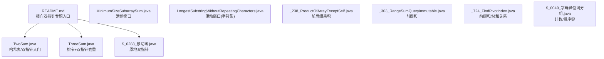

图示来源
- [README.md:6-12](file://README.md#L6-L12)
- [TwoSum.java:55-76](file://src/main/java/leetcode/editor/cn/TwoSum.java#L55-L76)
- [ThreeSum.java:57-92](file://src/main/java/leetcode/editor/cn/ThreeSum.java#L57-L92)
- [$_0283_移动零.java:12-24](file://src/main/java/hot100/leetcode/editor/cn/$_0283_移动零.java#L12-L24)
- [MinimumSizeSubarraySum.java:52-72](file://src/main/java/leetcode/editor/cn/MinimumSizeSubarraySum.java#L52-L72)
- [LongestSubstringWithoutRepeatingCharacters.java:50-72](file://src/main/java/leetcode/editor/cn/LongestSubstringWithoutRepeatingCharacters.java#L50-L72)
- [_238_ProductOfArrayExceptSelf.java:41-61](file://src/main/java/leetcode/editor/cn/_238_ProductOfArrayExceptSelf.java#L41-L61)
- [_303_RangeSumQueryImmutable.java:48-66](file://src/main/java/leetcode/editor/cn/_303_RangeSumQueryImmutable.java#L48-L66)
- [_724_FindPivotIndex.java:58-77](file://src/main/java/leetcode/editor/cn/_724_FindPivotIndex.java#L58-L77)
- [$_0049_字母异位词分组.java:11-50](file://src/main/java/hot100/leetcode/editor/cn/$_0049_字母异位词分组.java#L11-L50)

章节来源
- [README.md:6-12](file://README.md#L6-L12)

## 核心组件
本节从“数据结构—算法模式—复杂度—适用场景”四个维度，对仓库中与数组和字符串相关的关键实现进行归纳。

- 哈希表 + 一次遍历（两数之和）
  - 要点：维护“目标值-当前值”的补数映射，边扫描边查找，避免O(n^2)。
  - 复杂度：时间O(n)，空间O(n)。
  - 适用：无序数组中寻找满足等式关系的元素对。
  - 参考路径：[TwoSum.java:62-75](file://src/main/java/leetcode/editor/cn/TwoSum.java#L62-L75)

- 排序 + 双指针去重（三数之和）
  - 要点：先排序，固定左端点，左右指针收缩；注意跳过重复元素以避免重复三元组。
  - 复杂度：时间O(n^2)，空间O(1)或O(log n)取决于排序实现。
  - 适用：多数和、有序区间搜索、去重要求。
  - 参考路径：[ThreeSum.java:62-90](file://src/main/java/leetcode/editor/cn/ThreeSum.java#L62-L90)

- 原地双指针（移动零）
  - 要点：将非零元素依次前移，尾部填充零；或交换法保证一次遍历。
  - 复杂度：时间O(n)，空间O(1)。
  - 适用：原地重排、分区问题。
  - 参考路径：[$_0283_移动零.java:12-24](file://src/main/java/hot100/leetcode/editor/cn/$_0283_移动零.java#L12-L24)

- 滑动窗口（最小长度子数组）
  - 要点：右指针扩展窗口累加，当满足条件时尽量收缩左指针更新答案。
  - 复杂度：时间O(n)，空间O(1)。
  - 适用：连续子数组最值/最短/最长问题，单调性可判定。
  - 参考路径：[MinimumSizeSubarraySum.java:57-71](file://src/main/java/leetcode/editor/cn/MinimumSizeSubarraySum.java#L57-L71)

- 滑动窗口（无重复字符的最长子串）
  - 要点：用布尔数组或哈希表记录窗口内字符出现情况，遇到重复则收缩左边界。
  - 复杂度：时间O(n)，空间O(k)（k为字符集大小）。
  - 适用：字符串/数组上的“不重复/最多K个不同”等窗口约束。
  - 参考路径：[LongestSubstringWithoutRepeatingCharacters.java:56-71](file://src/main/java/leetcode/editor/cn/LongestSubstringWithoutRepeatingCharacters.java#L56-L71)

- 前后缀乘积（除自身以外数组的乘积）
  - 要点：先计算前缀乘积，再从右向左累积后缀乘积并合并到结果数组，避免除法。
  - 复杂度：时间O(n)，空间O(1)额外（不计输出）。
  - 适用：需要“除自身外”聚合信息的数组问题。
  - 参考路径：[_238_ProductOfArrayExceptSelf.java:46-59](file://src/main/java/leetcode/editor/cn/_238_ProductOfArrayExceptSelf.java#L46-L59)

- 前缀和（范围求和/中心索引）
  - 要点：预处理前缀和数组，区间和O(1)查询；中心索引可通过总和与前缀和关系判断。
  - 复杂度：构造O(n)，查询O(1)；中心索引O(n)。
  - 适用：多次区间求和、平衡分割点等问题。
  - 参考路径：
    - [_303_RangeSumQueryImmutable.java:52-66](file://src/main/java/leetcode/editor/cn/_303_RangeSumQueryImmutable.java#L52-L66)
    - [_724_FindPivotIndex.java:63-76](file://src/main/java/leetcode/editor/cn/_724_FindPivotIndex.java#L63-L76)

- 字符串分组（字母异位词分组）
  - 要点：以“排序后的字符串”或“字符频次压缩串”作为哈希键，将异位词归入同一组。
  - 复杂度：时间O(n·k log k)或O(n·k)，空间O(n·k)。
  - 适用：字符串等价类分组、同构匹配。
  - 参考路径：[$_0049_字母异位词分组.java:14-50](file://src/main/java/hot100/leetcode/editor/cn/$_0049_字母异位词分组.java#L14-L50)

章节来源
- [TwoSum.java:62-75](file://src/main/java/leetcode/editor/cn/TwoSum.java#L62-L75)
- [ThreeSum.java:62-90](file://src/main/java/leetcode/editor/cn/ThreeSum.java#L62-L90)
- [$_0283_移动零.java:12-24](file://src/main/java/hot100/leetcode/editor/cn/$_0283_移动零.java#L12-L24)
- [MinimumSizeSubarraySum.java:57-71](file://src/main/java/leetcode/editor/cn/MinimumSizeSubarraySum.java#L57-L71)
- [LongestSubstringWithoutRepeatingCharacters.java:56-71](file://src/main/java/leetcode/editor/cn/LongestSubstringWithoutRepeatingCharacters.java#L56-L71)
- [_238_ProductOfArrayExceptSelf.java:46-59](file://src/main/java/leetcode/editor/cn/_238_ProductOfArrayExceptSelf.java#L46-L59)
- [_303_RangeSumQueryImmutable.java:52-66](file://src/main/java/leetcode/editor/cn/_303_RangeSumQueryImmutable.java#L52-L66)
- [_724_FindPivotIndex.java:63-76](file://src/main/java/leetcode/editor/cn/_724_FindPivotIndex.java#L63-L76)
- [$_0049_字母异位词分组.java:14-50](file://src/main/java/hot100/leetcode/editor/cn/$_0049_字母异位词分组.java#L14-L50)

## 架构总览
下图展示“数组与字符串”常用模式与对应题目的关系，体现从输入到输出的数据流与控制流。

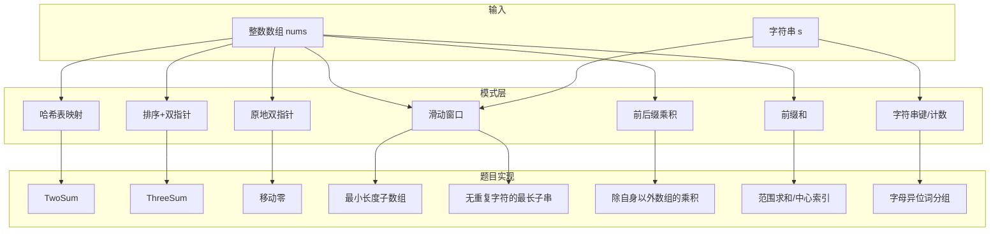

图示来源
- [TwoSum.java:62-75](file://src/main/java/leetcode/editor/cn/TwoSum.java#L62-L75)
- [ThreeSum.java:62-90](file://src/main/java/leetcode/editor/cn/ThreeSum.java#L62-L90)
- [$_0283_移动零.java:12-24](file://src/main/java/hot100/leetcode/editor/cn/$_0283_移动零.java#L12-L24)
- [MinimumSizeSubarraySum.java:57-71](file://src/main/java/leetcode/editor/cn/MinimumSizeSubarraySum.java#L57-L71)
- [LongestSubstringWithoutRepeatingCharacters.java:56-71](file://src/main/java/leetcode/editor/cn/LongestSubstringWithoutRepeatingCharacters.java#L56-L71)
- [_238_ProductOfArrayExceptSelf.java:46-59](file://src/main/java/leetcode/editor/cn/_238_ProductOfArrayExceptSelf.java#L46-L59)
- [_303_RangeSumQueryImmutable.java:52-66](file://src/main/java/leetcode/editor/cn/_303_RangeSumQueryImmutable.java#L52-L66)
- [_724_FindPivotIndex.java:63-76](file://src/main/java/leetcode/editor/cn/_724_FindPivotIndex.java#L63-L76)
- [$_0049_字母异位词分组.java:14-50](file://src/main/java/hot100/leetcode/editor/cn/$_0049_字母异位词分组.java#L14-L50)

## 详细组件分析

### 两数之和（哈希表一次遍历）
- 思路要点
  - 使用哈希表存储“目标值-当前值”的下标，边遍历边查找是否已有补数。
  - 若找到，直接返回两个下标；否则继续插入。
- 复杂度
  - 时间O(n)，空间O(n)。
- 边界与陷阱
  - 空数组/长度不足需提前判断（题目通常保证有效输入）。
  - 重复元素不会冲突，因为先查后插。
- 代码片段路径
  - [TwoSum.java:62-75](file://src/main/java/leetcode/editor/cn/TwoSum.java#L62-L75)

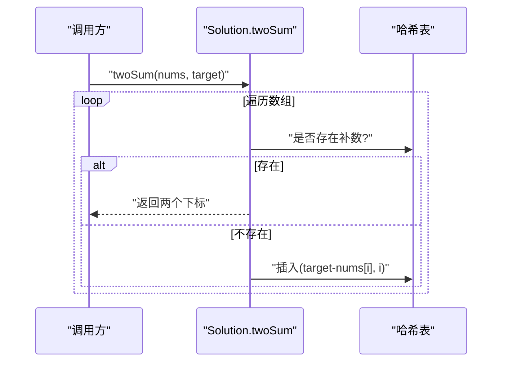

图示来源
- [TwoSum.java:62-75](file://src/main/java/leetcode/editor/cn/TwoSum.java#L62-L75)

章节来源
- [TwoSum.java:62-75](file://src/main/java/leetcode/editor/cn/TwoSum.java#L62-L75)

### 三数之和（排序+双指针去重）
- 思路要点
  - 先排序，固定i，l=i+1，r=n-1，根据三数之和与0的关系移动l/r。
  - 关键：跳过重复的i/l/r，避免重复三元组。
- 复杂度
  - 时间O(n^2)，空间O(1)或O(log n)。
- 边界与陷阱
  - 剪枝：最小/最大可能和提前break/continue。
  - 去重逻辑必须严谨，防止遗漏或重复。
- 代码片段路径
  - [ThreeSum.java:62-90](file://src/main/java/leetcode/editor/cn/ThreeSum.java#L62-L90)

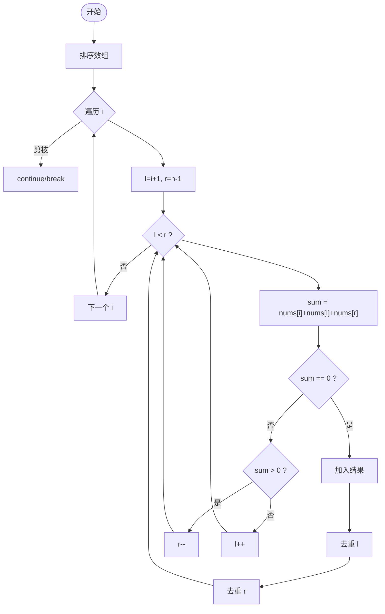

图示来源
- [ThreeSum.java:62-90](file://src/main/java/leetcode/editor/cn/ThreeSum.java#L62-L90)

章节来源
- [ThreeSum.java:62-90](file://src/main/java/leetcode/editor/cn/ThreeSum.java#L62-L90)

### 移动零（原地双指针）
- 思路要点
  - 方案一：非零元素顺序前移，尾部填零。
  - 方案二：交换法，保证一次遍历且尽量少的写操作。
- 复杂度
  - 时间O(n)，空间O(1)。
- 边界与陷阱
  - 全零/全非零/含多个零的情况均能正确处理。
- 代码片段路径
  - [$_0283_移动零.java:12-24](file://src/main/java/hot100/leetcode/editor/cn/$_0283_移动零.java#L12-L24)

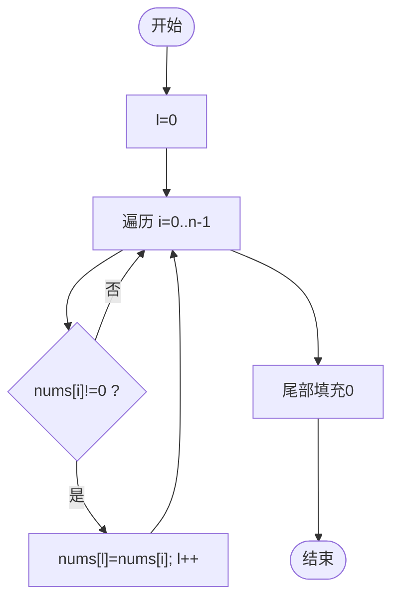

图示来源
- [$_0283_移动零.java:12-24](file://src/main/java/hot100/leetcode/editor/cn/$_0283_移动零.java#L12-L24)

章节来源
- [$_0283_移动零.java:12-24](file://src/main/java/hot100/leetcode/editor/cn/$_0283_移动零.java#L12-L24)

### 最小长度子数组（滑动窗口）
- 思路要点
  - 右指针不断扩展窗口并累加和；当满足条件时，尝试收缩左指针更新答案。
- 复杂度
  - 时间O(n)，空间O(1)。
- 边界与陷阱
  - 初始答案设为无穷大，最终若无解返回0。
- 代码片段路径
  - [MinimumSizeSubarraySum.java:57-71](file://src/main/java/leetcode/editor/cn/MinimumSizeSubarraySum.java#L57-L71)

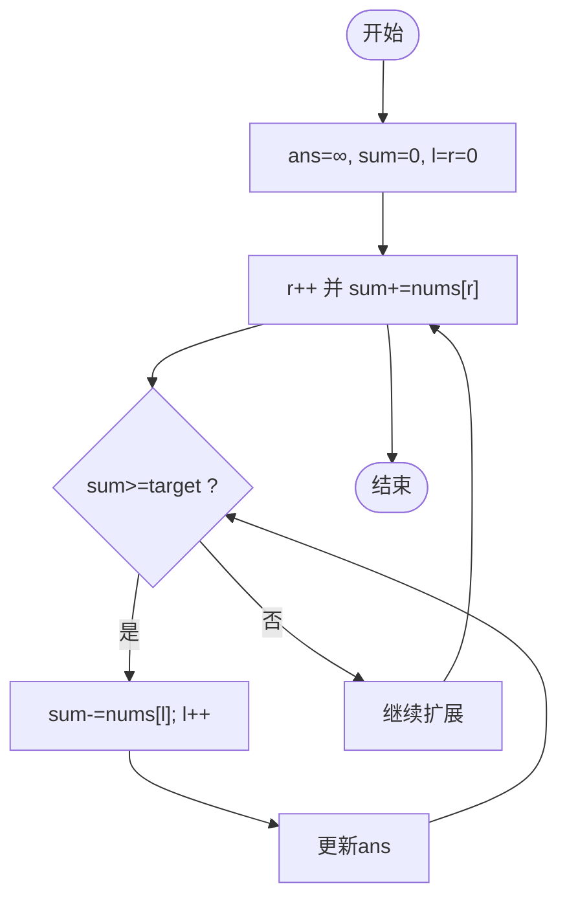

图示来源
- [MinimumSizeSubarraySum.java:57-71](file://src/main/java/leetcode/editor/cn/MinimumSizeSubarraySum.java#L57-L71)

章节来源
- [MinimumSizeSubarraySum.java:57-71](file://src/main/java/leetcode/editor/cn/MinimumSizeSubarraySum.java#L57-L71)

### 无重复字符的最长子串（滑动窗口-字符集）
- 思路要点
  - 使用定长布尔数组记录窗口内字符状态，遇到重复则收缩左边界直到无重复。
- 复杂度
  - 时间O(n)，空间O(k)（k为字符集大小）。
- 边界与陷阱
  - 字符集大小决定辅助数组尺寸；注意ASCII/Unicode差异。
- 代码片段路径
  - [LongestSubstringWithoutRepeatingCharacters.java:56-71](file://src/main/java/leetcode/editor/cn/LongestSubstringWithoutRepeatingCharacters.java#L56-L71)

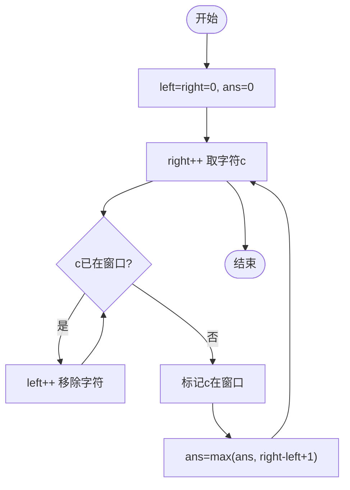

图示来源
- [LongestSubstringWithoutRepeatingCharacters.java:56-71](file://src/main/java/leetcode/editor/cn/LongestSubstringWithoutRepeatingCharacters.java#L56-L71)

章节来源
- [LongestSubstringWithoutRepeatingCharacters.java:56-71](file://src/main/java/leetcode/editor/cn/LongestSubstringWithoutRepeatingCharacters.java#L56-L71)

### 除自身以外数组的乘积（前后缀乘积）
- 思路要点
  - 从左到右计算前缀乘积存入结果；从右到左累积后缀乘积并与前缀乘积相乘得到最终答案。
- 复杂度
  - 时间O(n)，空间O(1)额外（不计输出）。
- 边界与陷阱
  - 注意0的个数与位置，但前后缀乘积天然规避了显式分支。
- 代码片段路径
  - [_238_ProductOfArrayExceptSelf.java:46-59](file://src/main/java/leetcode/editor/cn/_238_ProductOfArrayExceptSelf.java#L46-L59)

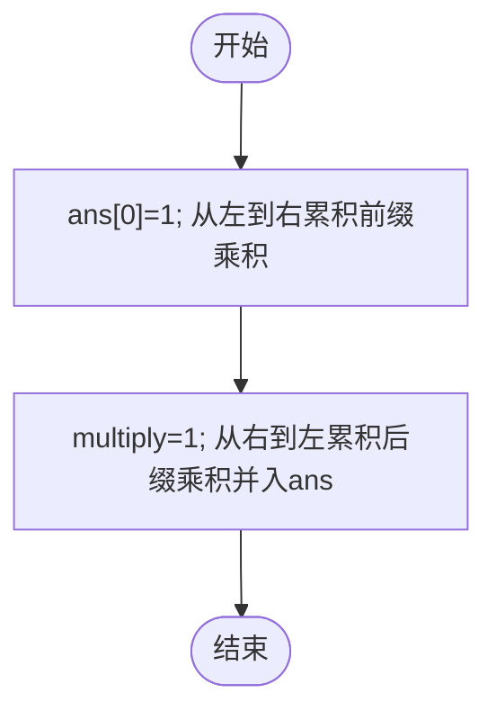

图示来源
- [_238_ProductOfArrayExceptSelf.java:46-59](file://src/main/java/leetcode/editor/cn/_238_ProductOfArrayExceptSelf.java#L46-L59)

章节来源
- [_238_ProductOfArrayExceptSelf.java:46-59](file://src/main/java/leetcode/editor/cn/_238_ProductOfArrayExceptSelf.java#L46-L59)

### 前缀和：范围求和与中心索引
- 范围求和
  - 构造长度为n+1的前缀和数组，区间和通过差值O(1)获取。
  - 代码片段路径：[_303_RangeSumQueryImmutable.java:52-66](file://src/main/java/leetcode/editor/cn/_303_RangeSumQueryImmutable.java#L52-L66)
- 中心索引
  - 利用总和与前缀和关系：若左侧和×2+当前值=总和，则为所求索引。
  - 代码片段路径：[_724_FindPivotIndex.java:63-76](file://src/main/java/leetcode/editor/cn/_724_FindPivotIndex.java#L63-L76)

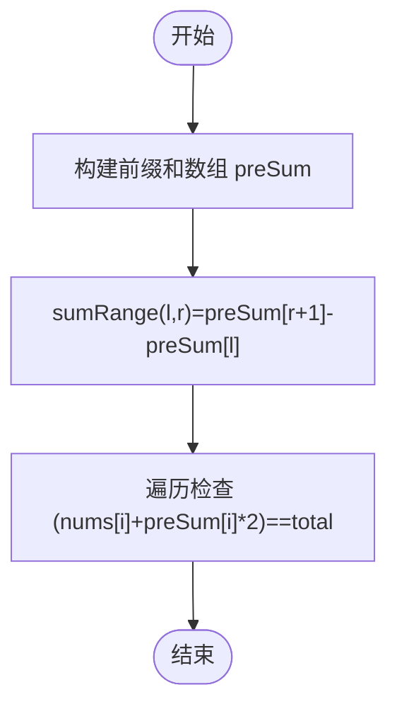

图示来源
- [_303_RangeSumQueryImmutable.java:52-66](file://src/main/java/leetcode/editor/cn/_303_RangeSumQueryImmutable.java#L52-L66)
- [_724_FindPivotIndex.java:63-76](file://src/main/java/leetcode/editor/cn/_724_FindPivotIndex.java#L63-L76)

章节来源
- [_303_RangeSumQueryImmutable.java:52-66](file://src/main/java/leetcode/editor/cn/_303_RangeSumQueryImmutable.java#L52-L66)
- [_724_FindPivotIndex.java:63-76](file://src/main/java/leetcode/editor/cn/_724_FindPivotIndex.java#L63-L76)

### 字母异位词分组（字符串键/计数）
- 思路要点
  - 两种键策略：排序后的字符串，或字符频次压缩串；将异位词归入同一组。
- 复杂度
  - 时间O(n·k log k)或O(n·k)，空间O(n·k)。
- 边界与陷阱
  - 空串、单字符、大量重复字符的处理。
- 代码片段路径
  - [$_0049_字母异位词分组.java:14-50](file://src/main/java/hot100/leetcode/editor/cn/$_0049_字母异位词分组.java#L14-L50)

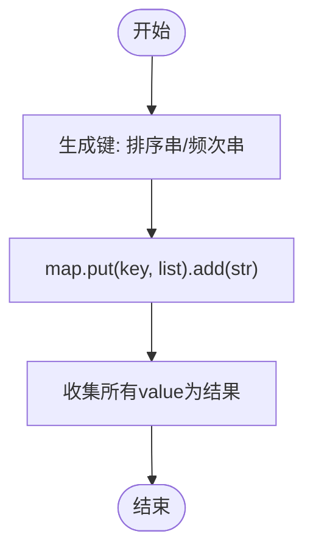

图示来源
- [$_0049_字母异位词分组.java:14-50](file://src/main/java/hot100/leetcode/editor/cn/$_0049_字母异位词分组.java#L14-L50)

章节来源
- [$_0049_字母异位词分组.java:14-50](file://src/main/java/hot100/leetcode/editor/cn/$_0049_字母异位词分组.java#L14-L50)

## 依赖分析
- 模块耦合
  - 各题解文件相互独立，仅通过统一的utils.Printer进行调试打印（部分文件引用），降低耦合度。
- 外部依赖
  - 主要依赖标准库：java.util.*（Map、List、Arrays等）、java.lang.Math等。
- 循环依赖
  - 未见循环导入，结构清晰。

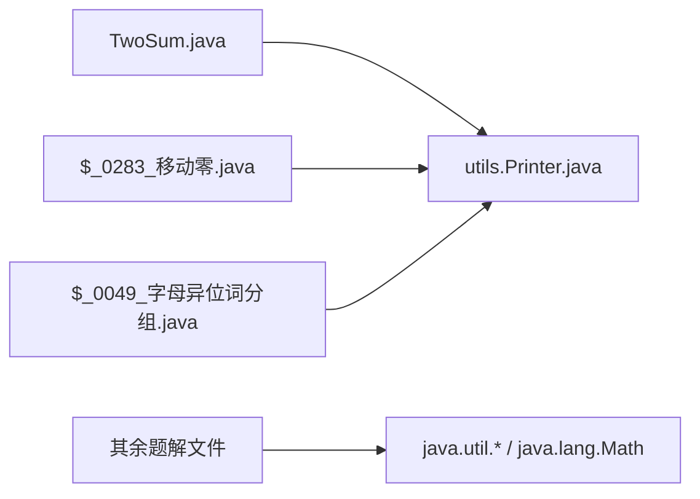

图示来源
- [$_0283_移动零.java:1-10](file://src/main/java/hot100/leetcode/editor/cn/$_0283_移动零.java#L1-L10)
- [$_0049_字母异位词分组.java:1-10](file://src/main/java/hot100/leetcode/editor/cn/$_0049_字母异位词分组.java#L1-L10)

章节来源
- [$_0283_移动零.java:1-10](file://src/main/java/hot100/leetcode/editor/cn/$_0283_移动零.java#L1-L10)
- [$_0049_字母异位词分组.java:1-10](file://src/main/java/hot100/leetcode/editor/cn/$_0049_字母异位词分组.java#L1-L10)

## 性能考虑
- 时间复杂度优先
  - 优先选择线性或近线性方案：哈希表、双指针、滑动窗口、前缀和。
- 空间优化
  - 原地双指针减少额外空间；前后缀乘积复用输出数组避免二次分配。
- 常数因子优化
  - 使用定长数组替代泛型集合（如字符集布尔数组）以降低装箱开销。
- 缓存友好
  - 顺序访问数组、减少随机跳转，提升CPU缓存命中率。
- 边界与溢出
  - 注意中间和/乘积溢出风险，必要时使用更大类型或提前剪枝。

## 故障排查指南
- 双指针/滑动窗口常见问题
  - 左右指针越界：确保循环条件与边界更新正确。
  - 去重逻辑错误：三数之和中漏掉或过度去重会导致结果不正确。
  - 窗口收缩时机：应在满足条件后再收缩，避免错过最优解。
- 前缀和/后缀乘积
  - 索引偏移：前缀和数组长度通常为n+1，注意查询时的索引映射。
  - 零值处理：乘积问题中0的位置会影响结果，前后缀乘积方法天然规避分支。
- 哈希表
  - 键的选择：异位词分组的键要唯一稳定；排序串与频次串各有优劣。
  - 容量预估：预置合适初始容量可减少扩容开销。

章节来源
- [ThreeSum.java:62-90](file://src/main/java/leetcode/editor/cn/ThreeSum.java#L62-L90)
- [MinimumSizeSubarraySum.java:57-71](file://src/main/java/leetcode/editor/cn/MinimumSizeSubarraySum.java#L57-L71)
- [_303_RangeSumQueryImmutable.java:52-66](file://src/main/java/leetcode/editor/cn/_303_RangeSumQueryImmutable.java#L52-L66)
- [_238_ProductOfArrayExceptSelf.java:46-59](file://src/main/java/leetcode/editor/cn/_238_ProductOfArrayExceptSelf.java#L46-L59)
- [$_0049_字母异位词分组.java:14-50](file://src/main/java/hot100/leetcode/editor/cn/$_0049_字母异位词分组.java#L14-L50)

## 结论
通过对仓库中数组与字符串相关题目的系统化梳理，可以形成一套稳定的解题范式：识别问题特征→选择合适模式（哈希/双指针/滑动窗口/前缀和/前后缀）→关注边界与去重→评估复杂度与空间→落地实现与优化。掌握这些模式与细节，能够在多数数组与字符串问题上快速定位高效解法。

## 附录
- 相向双指针专题入口（README）
  - 参考路径：[README.md:6-12](file://README.md#L6-L12)