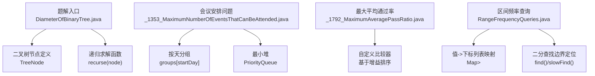
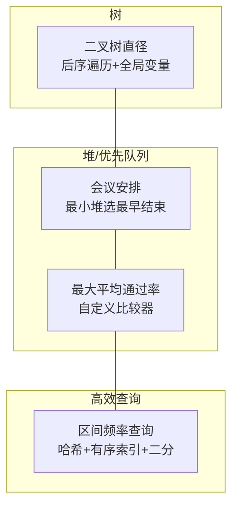
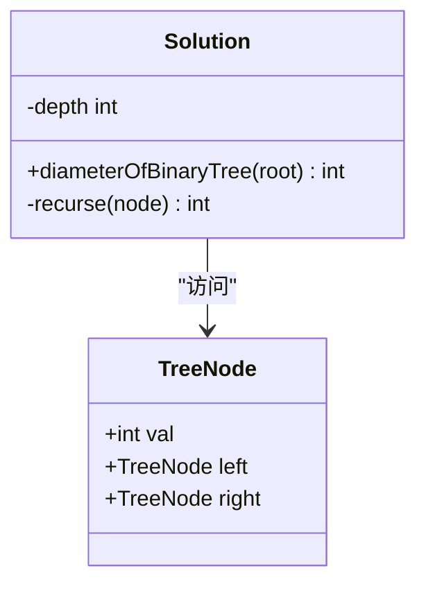
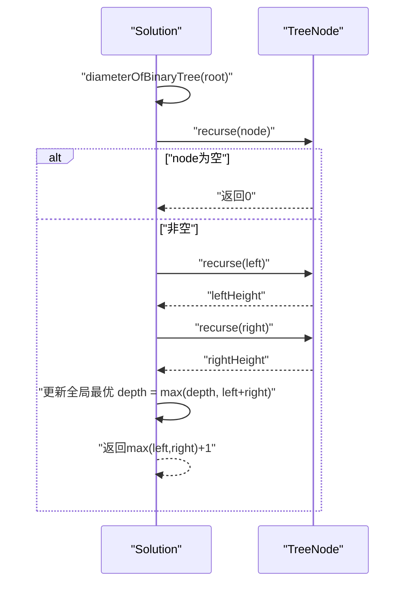
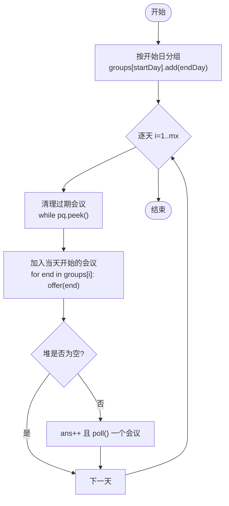
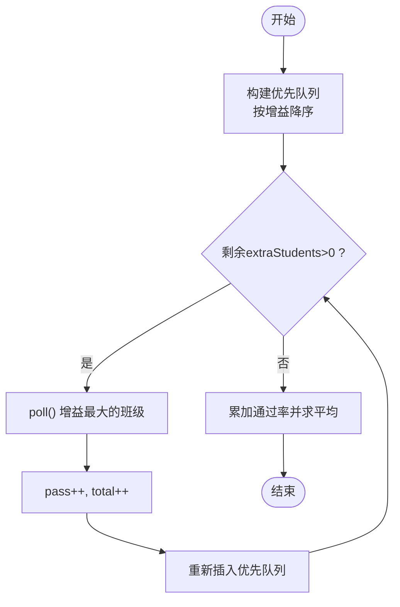
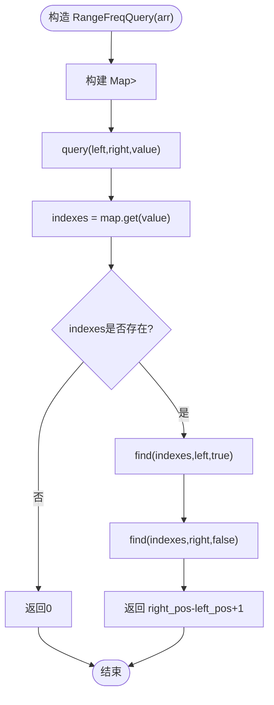
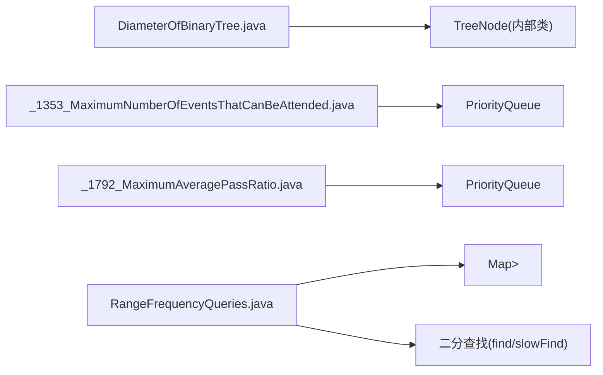

# 树与图

<cite>
**本文引用的文件**   
- [DiameterOfBinaryTree.java](file://src/main/java/leetcode/editor/cn/DiameterOfBinaryTree.java)
- [_1353_MaximumNumberOfEventsThatCanBeAttended.java](file://src/main/java/leetcode/editor/cn/_1353_MaximumNumberOfEventsThatCanBeAttended.java)
- [_1792_MaximumAveragePassRatio.java](file://src/main/java/leetcode/editor/cn/_1792_MaximumAveragePassRatio.java)
- [RangeFrequencyQueries.java](file://src/main/java/leetcode/editor/cn/RangeFrequencyQueries.java)
</cite>

## 目录
1. [引言](#引言)
2. [项目结构](#项目结构)
3. [核心组件](#核心组件)
4. [架构总览](#架构总览)
5. [详细组件分析](#详细组件分析)
6. [依赖分析](#依赖分析)
7. [性能考虑](#性能考虑)
8. [故障排查指南](#故障排查指南)
9. [结论](#结论)
10. [附录](#附录)

## 引言
本文件面向LeetCode算法题解仓库中的“树与图”主题，聚焦以下目标：
- 系统梳理二叉树、平衡树、堆、图等复杂数据结构的实现与应用
- 覆盖树的遍历（前序、中序、后序、层序）与图的搜索（BFS、DFS）、最短路径等经典范式
- 结合具体题目示例展示建模方法与解题思路
- 解释递归、迭代与动态规划在不同场景下的应用
- 提供空间复杂度优化与递归深度控制技巧

说明：本仓库包含大量独立题解文件。为贴合“树与图”主题，本文选取与树、堆、优先队列相关的代表性文件进行深度解析，并在此基础上补充通用算法框架与最佳实践，帮助读者建立从数据结构到算法策略的完整认知。

## 项目结构
围绕“树与图”主题，本文重点关注的代码位于编辑器导出的题解目录中，典型文件包括：
- 二叉树直径计算：体现树的后序遍历与递归思想
- 最大可参加会议数：体现贪心+最小堆（优先队列）的应用
- 最大平均通过率：体现自定义比较器的优先队列与增量优化
- 区间频率查询：体现哈希表+有序索引+二分查找的组合设计（虽非严格树/图，但有助于理解高效查询的数据结构设计）

图表来源
- [DiameterOfBinaryTree.java:56-73](file://src/main/java/leetcode/editor/cn/DiameterOfBinaryTree.java#L56-L73)
- [_1353_MaximumNumberOfEventsThatCanBeAttended.java:57-86](file://src/main/java/leetcode/editor/cn/_1353_MaximumNumberOfEventsThatCanBeAttended.java#L57-L86)
- [_1792_MaximumAveragePassRatio.java:54-75](file://src/main/java/leetcode/editor/cn/_1792_MaximumAveragePassRatio.java#L54-L75)
- [RangeFrequencyQueries.java:62-156](file://src/main/java/leetcode/editor/cn/RangeFrequencyQueries.java#L62-L156)

章节来源
- [DiameterOfBinaryTree.java:35-88](file://src/main/java/leetcode/editor/cn/DiameterOfBinaryTree.java#L35-L88)
- [_1353_MaximumNumberOfEventsThatCanBeAttended.java:44-89](file://src/main/java/leetcode/editor/cn/_1353_MaximumNumberOfEventsThatCanBeAttended.java#L44-L89)
- [_1792_MaximumAveragePassRatio.java:42-78](file://src/main/java/leetcode/editor/cn/_1792_MaximumAveragePassRatio.java#L42-L78)
- [RangeFrequencyQueries.java:47-165](file://src/main/java/leetcode/editor/cn/RangeFrequencyQueries.java#L47-L165)

## 核心组件
本节对关键数据结构与算法要点进行提炼：
- 二叉树节点与后序遍历：通过左右子树高度更新全局最优（如直径），是典型的“自底向上”递归模式
- 最小堆（优先队列）：用于维护候选集合的最小元素，常用于贪心选择或调度问题
- 自定义比较器：在优先队列中按“边际收益”排序，支持增量式优化
- 哈希表+有序索引+二分：将值映射到其出现位置列表，利用有序性快速统计区间内频次

章节来源
- [DiameterOfBinaryTree.java:56-73](file://src/main/java/leetcode/editor/cn/DiameterOfBinaryTree.java#L56-L73)
- [_1353_MaximumNumberOfEventsThatCanBeAttended.java:57-86](file://src/main/java/leetcode/editor/cn/_1353_MaximumNumberOfEventsThatCanBeAttended.java#L57-L86)
- [_1792_MaximumAveragePassRatio.java:54-75](file://src/main/java/leetcode/editor/cn/_1792_MaximumAveragePassRatio.java#L54-L75)
- [RangeFrequencyQueries.java:62-156](file://src/main/java/leetcode/editor/cn/RangeFrequencyQueries.java#L62-L156)

## 架构总览
下图展示了各题解模块之间的职责划分与交互关系：
- 二叉树模块负责树形结构的递归处理
- 会议安排模块负责时间轴上的贪心选择与堆维护
- 最大平均通过率模块负责按增益排序的增量分配
- 区间频率查询模块负责高效范围统计

图表来源
- [DiameterOfBinaryTree.java:56-73](file://src/main/java/leetcode/editor/cn/DiameterOfBinaryTree.java#L56-L73)
- [_1353_MaximumNumberOfEventsThatCanBeAttended.java:57-86](file://src/main/java/leetcode/editor/cn/_1353_MaximumNumberOfEventsThatCanBeAttended.java#L57-L86)
- [_1792_MaximumAveragePassRatio.java:54-75](file://src/main/java/leetcode/editor/cn/_1792_MaximumAveragePassRatio.java#L54-L75)
- [RangeFrequencyQueries.java:62-156](file://src/main/java/leetcode/editor/cn/RangeFrequencyQueries.java#L62-L156)

## 详细组件分析

### 二叉树直径（后序遍历与递归）
- 目标：求任意两节点间最长路径长度（边数）
- 方法：后序遍历，自底向上返回当前节点的高度；同时用全局变量记录左高+右高的最大值
- 关键点：
  - 递归终止条件为空节点返回0
  - 每次递归更新全局最优
  - 返回值是当前节点的最大高度

图表来源
- [DiameterOfBinaryTree.java:56-73](file://src/main/java/leetcode/editor/cn/DiameterOfBinaryTree.java#L56-L73)
- [DiameterOfBinaryTree.java:73-85](file://src/main/java/leetcode/editor/cn/DiameterOfBinaryTree.java#L73-L85)

图表来源
- [DiameterOfBinaryTree.java:56-73](file://src/main/java/leetcode/editor/cn/DiameterOfBinaryTree.java#L56-L73)

章节来源
- [DiameterOfBinaryTree.java:56-73](file://src/main/java/leetcode/editor/cn/DiameterOfBinaryTree.java#L56-L73)
- [DiameterOfBinaryTree.java:73-85](file://src/main/java/leetcode/editor/cn/DiameterOfBinaryTree.java#L73-L85)

### 最大可参加会议数（贪心+最小堆）
- 目标：在每天只能参加一场会议的前提下，最大化参加的会议数量
- 方法：
  - 将会议按开始日分组
  - 逐天扫描，将当天开始的会议加入最小堆（以结束日为键）
  - 每日先弹出已过期会议，再从堆顶选择一个能参加的会议（结束日最小的）
- 关键点：
  - 使用数组的ArrayList[]按开始日分组
  - 最小堆保证总是选择“即将结束”的会议，留出更多后续空间

图表来源
- [_1353_MaximumNumberOfEventsThatCanBeAttended.java:57-86](file://src/main/java/leetcode/editor/cn/_1353_MaximumNumberOfEventsThatCanBeAttended.java#L57-L86)

章节来源
- [_1353_MaximumNumberOfEventsThatCanBeAttended.java:57-86](file://src/main/java/leetcode/editor/cn/_1353_MaximumNumberOfEventsThatCanBeAttended.java#L57-L86)

### 最大平均通过率（优先队列+自定义比较器）
- 目标：将额外学生分配到班级，使所有班级的平均通过率最大
- 方法：
  - 使用优先队列，按“增加一名学生带来的通过率增益”排序
  - 每次取出增益最大的班级，分配一名学生后再放回队列
- 关键点：
  - 自定义比较器避免浮点误差，采用交叉相乘比较
  - 增量分配确保每一步都是局部最优，整体逼近全局最优

图表来源
- [_1792_MaximumAveragePassRatio.java:54-75](file://src/main/java/leetcode/editor/cn/_1792_MaximumAveragePassRatio.java#L54-L75)

章节来源
- [_1792_MaximumAveragePassRatio.java:54-75](file://src/main/java/leetcode/editor/cn/_1792_MaximumAveragePassRatio.java#L54-L75)

### 区间频率查询（哈希表+有序索引+二分）
- 目标：多次查询子数组中某值的出现次数
- 方法：
  - 预处理：值→下标列表（有序）
  - 查询：在有序列表中定位[left,right]范围内的计数
- 关键点：
  - 使用二分查找确定左右边界
  - 若未找到对应值，返回0

图表来源
- [RangeFrequencyQueries.java:62-156](file://src/main/java/leetcode/editor/cn/RangeFrequencyQueries.java#L62-L156)

章节来源
- [RangeFrequencyQueries.java:62-156](file://src/main/java/leetcode/editor/cn/RangeFrequencyQueries.java#L62-L156)

## 依赖分析
- 二叉树直径：仅依赖TreeNode结构与递归逻辑，无外部库依赖
- 会议安排：依赖数组分组与最小堆（PriorityQueue）
- 最大平均通过率：依赖优先队列与自定义比较器
- 区间频率查询：依赖HashMap、ArrayList与二分查找

图表来源
- [DiameterOfBinaryTree.java:56-73](file://src/main/java/leetcode/editor/cn/DiameterOfBinaryTree.java#L56-L73)
- [_1353_MaximumNumberOfEventsThatCanBeAttended.java:57-86](file://src/main/java/leetcode/editor/cn/_1353_MaximumNumberOfEventsThatCanBeAttended.java#L57-L86)
- [_1792_MaximumAveragePassRatio.java:54-75](file://src/main/java/leetcode/editor/cn/_1792_MaximumAveragePassRatio.java#L54-L75)
- [RangeFrequencyQueries.java:62-156](file://src/main/java/leetcode/editor/cn/RangeFrequencyQueries.java#L62-L156)

章节来源
- [DiameterOfBinaryTree.java:56-73](file://src/main/java/leetcode/editor/cn/DiameterOfBinaryTree.java#L56-L73)
- [_1353_MaximumNumberOfEventsThatCanBeAttended.java:57-86](file://src/main/java/leetcode/editor/cn/_1353_MaximumNumberOfEventsThatCanBeAttended.java#L57-L86)
- [_1792_MaximumAveragePassRatio.java:54-75](file://src/main/java/leetcode/editor/cn/_1792_MaximumAveragePassRatio.java#L54-L75)
- [RangeFrequencyQueries.java:62-156](file://src/main/java/leetcode/editor/cn/RangeFrequencyQueries.java#L62-L156)

## 性能考虑
- 二叉树直径
  - 时间复杂度：O(n)，每个节点访问一次
  - 空间复杂度：O(h)，h为树高，最坏退化为O(n)
  - 优化建议：对于极深树，可考虑显式栈模拟递归以避免栈溢出
- 会议安排
  - 预处理分组：O(n)
  - 逐天扫描与堆操作：O(mx log n)，mx为最大结束日
  - 空间复杂度：O(n)存储分组与堆
- 最大平均通过率
  - 初始建堆：O(m)
  - 每次分配：O(log m)，共extraStudents次
  - 总时间：O(m + extraStudents·log m)
  - 注意：比较器需避免浮点误差，使用整数交叉乘法
- 区间频率查询
  - 预处理：O(n)
  - 单次查询：O(log k)，k为值出现的次数
  - 空间复杂度：O(n)

[本节为通用性能讨论，不直接分析具体文件]

## 故障排查指南
- 二叉树递归深度过大导致栈溢出
  - 现象：运行时报栈溢出错误
  - 排查：检查树是否极度不平衡；尝试迭代版后序或使用显式栈
- 优先队列比较器异常
  - 现象：抛出比较器异常或结果不符合预期
  - 排查：确认比较器满足全序关系；避免浮点误差，改用整数运算
- 二分查找边界错误
  - 现象：查询结果偏大或偏小
  - 排查：确认left/right边界定位逻辑一致；处理不存在值的边界情况

章节来源
- [DiameterOfBinaryTree.java:56-73](file://src/main/java/leetcode/editor/cn/DiameterOfBinaryTree.java#L56-L73)
- [_1792_MaximumAveragePassRatio.java:54-75](file://src/main/java/leetcode/editor/cn/_1792_MaximumAveragePassRatio.java#L54-L75)
- [RangeFrequencyQueries.java:137-156](file://src/main/java/leetcode/editor/cn/RangeFrequencyQueries.java#L137-L156)

## 结论
- 二叉树问题常以递归为核心，后序遍历适合“自底向上”聚合信息
- 贪心+堆是调度与资源分配问题的常用组合，关键在于正确定义“优先级”
- 自定义比较器需谨慎处理数值精度与全序约束
- 高效查询可通过“预处理+有序结构+二分”达成
- 针对大规模输入，应关注空间复杂度与递归深度控制，必要时采用迭代或显式栈替代

[本节为总结性内容，不直接分析具体文件]

## 附录
- 树遍历模板（概念性）
  - 前序：根→左→右
  - 中序：左→根→右
  - 后序：左→右→根
  - 层序：使用队列逐层扩展
- 图搜索模板（概念性）
  - DFS：递归或栈，适合连通性与拓扑相关
  - BFS：队列，适合最短步数或层次展开
- 最短路径（概念性）
  - Dijkstra：非负权边的单源最短路径
  - Bellman-Ford：含负权边的检测与求解
  - Floyd-Warshall：多源最短路径

[本节为概念性内容，不直接分析具体文件]