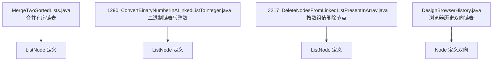
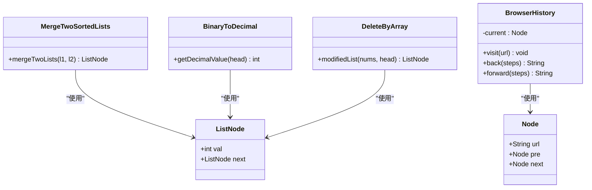
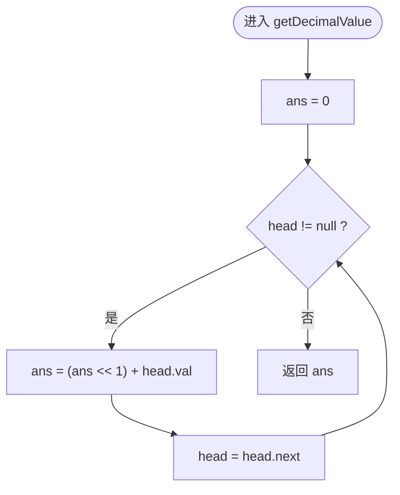
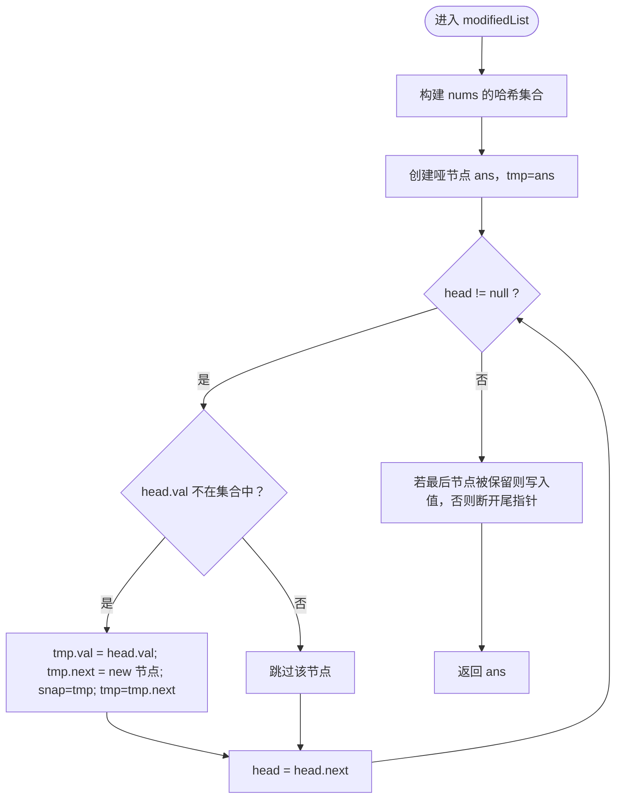
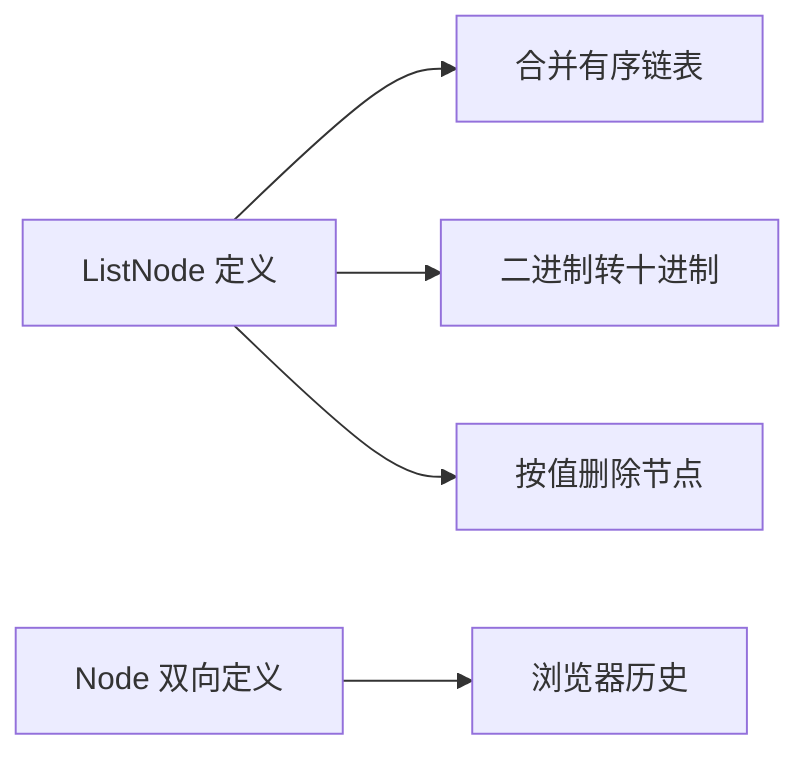

# 链表操作

<cite>
**本文引用的文件**   
- [MergeTwoSortedLists.java](file://src/main/java/leetcode/editor/cn/MergeTwoSortedLists.java)
- [_1290_ConvertBinaryNumberInALinkedListToInteger.java](file://src/main/java/leetcode/editor/cn/_1290_ConvertBinaryNumberInALinkedListToInteger.java)
- [_3217_DeleteNodesFromLinkedListPresentInArray.java](file://src/main/java/leetcode/editor/cn/_3217_DeleteNodesFromLinkedListPresentInArray.java)
- [DesignBrowserHistory.java](file://src/main/java/leetcode/editor/cn/DesignBrowserHistory.java)
</cite>

## 目录
1. [引言](#引言)
2. [项目结构](#项目结构)
3. [核心组件](#核心组件)
4. [架构总览](#架构总览)
5. [详细组件分析](#详细组件分析)
6. [依赖关系分析](#依赖关系分析)
7. [性能考量](#性能考量)
8. [故障排查指南](#故障排查指南)
9. [结论](#结论)
10. [附录](#附录)

## 引言
本文件面向LeetCode算法题解仓库中的“链表”主题，系统梳理单链表、双向链表与循环链表的实现要点与常见操作技巧。结合仓库中已有的题目代码，深入讲解合并有序链表、二进制转十进制、按值删除节点、浏览器历史（双向链表）等典型场景；并补充链表反转、环检测、分割等经典算法的思路与边界处理建议。文档同时对比递归与迭代两种实现方式的优缺点，给出与其他数据结构转换的方法与性能对比，帮助读者建立完整的链表知识体系。

## 项目结构
与链表相关的代码集中在编辑器导出的题目文件中，每个文件包含：
- 题目描述与示例
- 单链表或双向链表节点定义
- 一种或多种解法（迭代/递归）
- 可选的测试入口



图表来源
- [MergeTwoSortedLists.java:52-60](file://src/main/java/leetcode/editor/cn/MergeTwoSortedLists.java#L52-L60)
- [_1290_ConvertBinaryNumberInALinkedListToInteger.java:47-54](file://src/main/java/leetcode/editor/cn/_1290_ConvertBinaryNumberInALinkedListToInteger.java#L47-L54)
- [_3217_DeleteNodesFromLinkedListPresentInArray.java:73-82](file://src/main/java/leetcode/editor/cn/_3217_DeleteNodesFromLinkedListPresentInArray.java#L73-L82)
- [DesignBrowserHistory.java:105-115](file://src/main/java/leetcode/editor/cn/DesignBrowserHistory.java#L105-L115)

章节来源
- [MergeTwoSortedLists.java:1-125](file://src/main/java/leetcode/editor/cn/MergeTwoSortedLists.java#L1-L125)
- [_1290_ConvertBinaryNumberInALinkedListToInteger.java:1-67](file://src/main/java/leetcode/editor/cn/_1290_ConvertBinaryNumberInALinkedListToInteger.java#L1-L67)
- [_3217_DeleteNodesFromLinkedListPresentInArray.java:1-117](file://src/main/java/leetcode/editor/cn/_3217_DeleteNodesFromLinkedListPresentInArray.java#L1-L117)
- [DesignBrowserHistory.java:1-127](file://src/main/java/leetcode/editor/cn/DesignBrowserHistory.java#L1-L127)

## 核心组件
- 单链表节点 ListNode：包含整型值与指向下一个节点的指针，是大多数链表题目的基础单元。
- 双向链表节点 Node：除 next 外还包含 pre 指针，适合需要前后移动的场景（如浏览器历史）。
- 常用操作模式：
  - 虚拟头节点简化边界处理
  - 快慢指针用于环检测与中间点定位
  - 双指针用于合并、分割、回文判断等
  - 原地修改 vs 新建节点的空间权衡

章节来源
- [MergeTwoSortedLists.java:114-121](file://src/main/java/leetcode/editor/cn/MergeTwoSortedLists.java#L114-L121)
- [DesignBrowserHistory.java:105-115](file://src/main/java/leetcode/editor/cn/DesignBrowserHistory.java#L105-L115)

## 架构总览
从“数据模型 + 算法方法”的角度组织：
- 数据模型：单链表节点、双向链表节点
- 算法方法：合并、遍历转换、条件删除、前进后退导航
- 控制流：以函数为入口，通过指针推进完成线性扫描或分治



图表来源
- [MergeTwoSortedLists.java:114-121](file://src/main/java/leetcode/editor/cn/MergeTwoSortedLists.java#L114-L121)
- [_1290_ConvertBinaryNumberInALinkedListToInteger.java:47-54](file://src/main/java/leetcode/editor/cn/_1290_ConvertBinaryNumberInALinkedListToInteger.java#L47-L54)
- [_3217_DeleteNodesFromLinkedListPresentInArray.java:73-82](file://src/main/java/leetcode/editor/cn/_3217_DeleteNodesFromLinkedListPresentInArray.java#L73-L82)
- [DesignBrowserHistory.java:105-115](file://src/main/java/leetcode/editor/cn/DesignBrowserHistory.java#L105-L115)

## 详细组件分析

### 合并两个有序链表（单链表）
- 目标：将两条升序链表合并为一条升序链表。
- 关键技巧：
  - 使用虚拟头节点避免空表与首节点插入的特殊分支
  - 双指针比较两表当前节点值，较小者接入结果链表
  - 尾部拼接剩余部分
- 复杂度：时间 O(m+n)，空间 O(1)（原地合并）

```mermaid
sequenceDiagram
participant Caller as "调用方"
participant S as "BetterSOlution.mergeTwoLists"
participant L1 as "链表1"
participant L2 as "链表2"
Caller->>S : 传入 l1, l2
S->>S : 初始化哑节点 curr/dum
loop 直到任一链表为空
alt l1.val < l2.val
S->>L1 : 取 l1 节点
S->>S : curr.next = l1; l1 = l1.next
else
S->>L2 : 取 l2 节点
S->>S : curr.next = l2; l2 = l2.next
end
S->>S : curr = curr.next
end
S->>S : 拼接剩余非空链表
S-->>Caller : 返回 dum.next
```

图表来源
- [MergeTwoSortedLists.java:97-113](file://src/main/java/leetcode/editor/cn/MergeTwoSortedLists.java#L97-L113)

章节来源
- [MergeTwoSortedLists.java:52-60](file://src/main/java/leetcode/editor/cn/MergeTwoSortedLists.java#L52-L60)
- [MergeTwoSortedLists.java:97-113](file://src/main/java/leetcode/editor/cn/MergeTwoSortedLists.java#L97-L113)

### 二进制链表转十进制（单链表）
- 目标：从高位到低位的二进制链表转换为对应十进制数。
- 关键技巧：
  - 一次线性扫描，维护累加器 ans
  - 每步左移一位并加上当前位值
- 复杂度：时间 O(n)，空间 O(1)



图表来源
- [_1290_ConvertBinaryNumberInALinkedListToInteger.java:55-64](file://src/main/java/leetcode/editor/cn/_1290_ConvertBinaryNumberInALinkedListToInteger.java#L55-L64)

章节来源
- [_1290_ConvertBinaryNumberInALinkedListToInteger.java:47-54](file://src/main/java/leetcode/editor/cn/_1290_ConvertBinaryNumberInALinkedListToInteger.java#L47-L54)
- [_1290_ConvertBinaryNumberInALinkedListToInteger.java:55-64](file://src/main/java/leetcode/editor/cn/_1290_ConvertBinaryNumberInALinkedListToInteger.java#L55-L64)

### 按数组值删除链表节点（单链表）
- 目标：移除所有值存在于给定数组中的节点。
- 关键技巧：
  - 哈希集合快速判重
  - 使用虚拟头节点统一处理首节点删除
  - 注意保留最后一个有效节点时的尾指针处理
- 复杂度：时间 O(n+m)，空间 O(m)（m 为数组长度）



图表来源
- [_3217_DeleteNodesFromLinkedListPresentInArray.java:83-108](file://src/main/java/leetcode/editor/cn/_3217_DeleteNodesFromLinkedListPresentInArray.java#L83-L108)

章节来源
- [_3217_DeleteNodesFromLinkedListPresentInArray.java:73-82](file://src/main/java/leetcode/editor/cn/_3217_DeleteNodesFromLinkedListPresentInArray.java#L73-L82)
- [_3217_DeleteNodesFromLinkedListPresentInArray.java:83-108](file://src/main/java/leetcode/editor/cn/_3217_DeleteNodesFromLinkedListPresentInArray.java#L83-L108)

### 浏览器历史（双向链表）
- 目标：支持 visit、back、forward 三种操作，模拟单标签页浏览历史。
- 关键技巧：
  - 使用双向链表节点，便于前后移动
  - visit 时截断后续历史，仅保留前缀
  - back/forward 受限于边界（pre/next 是否为空）
- 复杂度：visit O(1)，back/forward O(k)（k 为步数）

```mermaid
sequenceDiagram
participant U as "用户"
participant BH as "BrowserHistory"
participant N as "Node(双向)"
U->>BH : visit(url)
BH->>N : 创建新节点，pre=current
BH->>BH : current.next=new; current=new
U->>BH : back(steps)
BH->>BH : 沿 pre 最多 steps 步
BH-->>U : 返回当前 url
U->>BH : forward(steps)
BH->>BH : 沿 next 最多 steps 步
BH-->>U : 返回当前 url
```

图表来源
- [DesignBrowserHistory.java:77-103](file://src/main/java/leetcode/editor/cn/DesignBrowserHistory.java#L77-L103)
- [DesignBrowserHistory.java:105-115](file://src/main/java/leetcode/editor/cn/DesignBrowserHistory.java#L105-L115)

章节来源
- [DesignBrowserHistory.java:77-103](file://src/main/java/leetcode/editor/cn/DesignBrowserHistory.java#L77-L103)
- [DesignBrowserHistory.java:105-115](file://src/main/java/leetcode/editor/cn/DesignBrowserHistory.java#L105-L115)

### 经典算法思路与边界处理（补充）
以下内容为通用算法思路总结，不直接对应仓库具体文件：
- 链表反转（迭代/递归）
  - 迭代：三指针逐步翻转 next 指向
  - 递归：自底向上翻转，注意子问题返回值与新连接
  - 边界：空表、单节点、环不存在
- 环检测（快慢指针）
  - 快慢指针相遇即存在环；进一步可求入环点
  - 边界：空表、单节点无环
- 分割链表（按值 k）
  - 双端收集小于/大于等于 k 的节点，再拼接
  - 边界：全小于/全大于等于、空表
- 合并 K 个有序链表
  - 优先队列归并，或分治合并
  - 边界：空列表集、含空链表

[本节为概念性内容，无需列出章节来源]

## 依赖关系分析
- 单链表相关题目共享同一类节点定义范式，便于复用与迁移
- 双向链表在需要频繁前后访问时更合适，但增加了指针维护成本
- 哈希集合常用于“按值过滤/去重”的前置预处理



图表来源
- [MergeTwoSortedLists.java:114-121](file://src/main/java/leetcode/editor/cn/MergeTwoSortedLists.java#L114-L121)
- [_1290_ConvertBinaryNumberInALinkedListToInteger.java:47-54](file://src/main/java/leetcode/editor/cn/_1290_ConvertBinaryNumberInALinkedListToInteger.java#L47-L54)
- [_3217_DeleteNodesFromLinkedListPresentInArray.java:73-82](file://src/main/java/leetcode/editor/cn/_3217_DeleteNodesFromLinkedListPresentInArray.java#L73-L82)
- [DesignBrowserHistory.java:105-115](file://src/main/java/leetcode/editor/cn/DesignBrowserHistory.java#L105-L115)

章节来源
- [MergeTwoSortedLists.java:114-121](file://src/main/java/leetcode/editor/cn/MergeTwoSortedLists.java#L114-L121)
- [_1290_ConvertBinaryNumberInALinkedListToInteger.java:47-54](file://src/main/java/leetcode/editor/cn/_1290_ConvertBinaryNumberInALinkedListToInteger.java#L47-L54)
- [_3217_DeleteNodesFromLinkedListPresentInArray.java:73-82](file://src/main/java/leetcode/editor/cn/_3217_DeleteNodesFromLinkedListPresentInArray.java#L73-L82)
- [DesignBrowserHistory.java:105-115](file://src/main/java/leetcode/editor/cn/DesignBrowserHistory.java#L105-L115)

## 性能考量
- 时间复杂度
  - 线性扫描类操作（合并、转换、删除）通常为 O(n)
  - 双向导航 back/forward 为 O(k)，k 为步数
- 空间复杂度
  - 原地操作 O(1)，需额外存储时 O(n) 或 O(m)
- 内存管理
  - Java 由 GC 自动回收，但仍应避免悬挂引用导致无法释放
  - 删除节点时确保正确断开 next/pre 指针
- 递归 vs 迭代
  - 递归简洁但可能带来栈溢出风险（超长链表）
  - 迭代稳定可控，适合生产环境

[本节提供通用指导，无需列出章节来源]

## 故障排查指南
- 空链表与单节点
  - 合并时需先判空，避免空指针
  - 删除时注意首节点被删的情况，使用虚拟头节点统一处理
- 尾指针未更新
  - 删除后若最后一个节点被丢弃，需显式断开 tail.next
- 双向链表边界
  - back/forward 到达头部或尾部时应停止移动
- 环检测误判
  - 空表或单节点不会成环，需提前返回

章节来源
- [MergeTwoSortedLists.java:97-113](file://src/main/java/leetcode/editor/cn/MergeTwoSortedLists.java#L97-L113)
- [_3217_DeleteNodesFromLinkedListPresentInArray.java:83-108](file://src/main/java/leetcode/editor/cn/_3217_DeleteNodesFromLinkedListPresentInArray.java#L83-L108)
- [DesignBrowserHistory.java:91-103](file://src/main/java/leetcode/editor/cn/DesignBrowserHistory.java#L91-L103)

## 结论
本仓库围绕链表提供了多类典型操作的实现样例，涵盖单链表与双向链表的核心用法。通过虚拟头节点、双指针、哈希集合等技巧，可以高效解决合并、转换、删除与导航等问题。对于反转、环检测、分割等经典算法，建议在理解指针变换与边界条件的基础上，优先选择迭代实现以保证稳定性。

[本节为总结性内容，无需列出章节来源]

## 附录
- 与其他数据结构的转换
  - 链表 ↔ 数组：线性扫描复制，O(n)
  - 链表 ↔ 栈/队列：顺序入栈/队，反向出栈/队
  - 链表 ↔ 树：层序遍历建树，或 DFS 重建
- 性能对比
  - 随机访问：数组优于链表
  - 插入/删除：链表优于数组（已知位置）
  - 缓存友好性：数组通常更好

[本节为概念性内容，无需列出章节来源]