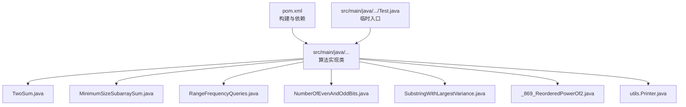
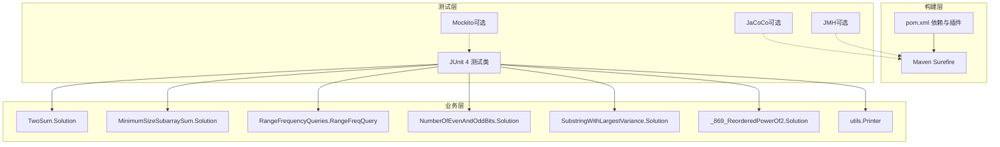
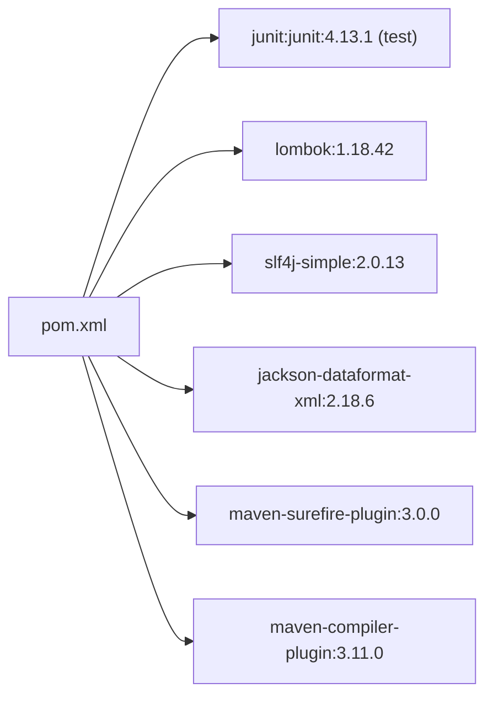

# 测试和验证

<cite>
**本文引用的文件**   
- [pom.xml](file://pom.xml)
- [README.md](file://README.md)
- [TwoSum.java](file://src/main/java/leetcode/editor/cn/TwoSum.java)
- [MinimumSizeSubarraySum.java](file://src/main/java/leetcode/editor/cn/MinimumSizeSubarraySum.java)
- [RangeFrequencyQueries.java](file://src/main/java/leetcode/editor/cn/RangeFrequencyQueries.java)
- [NumberOfEvenAndOddBits.java](file://src/main/java/leetcode/editor/cn/NumberOfEvenAndOddBits.java)
- [SubstringWithLargestVariance.java](file://src/main/java/leetcode/editor/cn/SubstringWithLargestVariance.java)
- [_869_ReorderedPowerOf2.java](file://src/main/java/leetcode/editor/cn/_869_ReorderedPowerOf2.java)
- [Test.java（oldcode）](file://src/main/java/leetcode/editor/cn/oldcode/Test.java)
- [Test.java（test0327）](file://src/main/java/leetcode/editor/cn/test0327/Test.java)
- [Test.java（双指针示例）](file://src/main/java/leetcode/lingshen/a_double_point_1/Test.java)
- [Printer.java](file://src/main/java/utils/Printer.java)
</cite>

## 目录
1. [简介](#简介)
2. [项目结构](#项目结构)
3. [核心组件](#核心组件)
4. [架构总览](#架构总览)
5. [详细组件分析](#详细组件分析)
6. [依赖分析](#依赖分析)
7. [性能考虑](#性能考虑)
8. [故障排查指南](#故障排查指南)
9. [结论](#结论)
10. [附录](#附录)

## 简介
本文件面向LeetCode算法题解项目的测试与验证，目标是：
- 建立规范的单元测试编写方法与最佳实践
- 设计覆盖边界条件的有效用例
- 引入性能测试方法与工具
- 配置并执行自动化测试流程
- 在算法练习中应用测试驱动开发（TDD）
- 提供调试技巧与错误诊断方法
- 集成持续集成与代码质量检查

## 项目结构
当前仓库采用Maven工程组织，Java源码位于 src/main/java，测试尚未迁移到标准 Maven 测试目录。现有部分类包含 main 方法用于快速验证，另有少量 Test 类作为临时入口。

图表来源
- [pom.xml:1-102](file://pom.xml#L1-L102)
- [TwoSum.java:1-78](file://src/main/java/leetcode/editor/cn/TwoSum.java#L1-L78)
- [MinimumSizeSubarraySum.java:1-74](file://src/main/java/leetcode/editor/cn/MinimumSizeSubarraySum.java#L1-L74)
- [RangeFrequencyQueries.java:1-165](file://src/main/java/leetcode/editor/cn/RangeFrequencyQueries.java#L1-L165)
- [NumberOfEvenAndOddBits.java:1-83](file://src/main/java/leetcode/editor/cn/NumberOfEvenAndOddBits.java#L1-L83)
- [SubstringWithLargestVariance.java:1-82](file://src/main/java/leetcode/editor/cn/SubstringWithLargestVariance.java#L1-L82)
- [_869_ReorderedPowerOf2.java:1-75](file://src/main/java/leetcode/editor/cn/_869_ReorderedPowerOf2.java#L1-L75)
- [Printer.java:1-16](file://src/main/java/utils/Printer.java#L1-L16)

章节来源
- [pom.xml:1-102](file://pom.xml#L1-L102)
- [README.md:1-12](file://README.md#L1-L12)

## 核心组件
- 构建与依赖管理：通过 pom.xml 声明 Java 版本、Junit 4 测试框架、maven-surefire-plugin 等。
- 算法实现类：每个题目一个类，内部包含 Solution 或对应数据结构类，并提供 main 方法用于本地快速验证。
- 辅助工具：utils.Printer 提供简单打印能力。
- 临时测试入口：多个 Test.java 使用 main 方法做简单演示，未形成统一测试体系。

章节来源
- [pom.xml:19-43](file://pom.xml#L19-L43)
- [pom.xml:89-100](file://pom.xml#L89-L100)
- [TwoSum.java:55-78](file://src/main/java/leetcode/editor/cn/TwoSum.java#L55-L78)
- [Printer.java:9-16](file://src/main/java/utils/Printer.java#L9-L16)

## 架构总览
从“测试与验证”的视角，系统由以下层次构成：
- 业务层：各算法类的 Solution 或具体查询类（如 RangeFreqQuery）。
- 测试层：基于 JUnit 4 的单元测试套件（建议放置于 src/test/java）。
- 构建层：Maven Surefire 自动发现并运行测试。
- 可选扩展：Mockito 进行依赖隔离；JaCoCo 统计覆盖率；JMH 进行基准测试。

图表来源
- [pom.xml:19-43](file://pom.xml#L19-L43)
- [pom.xml:89-100](file://pom.xml#L89-L100)
- [TwoSum.java:55-78](file://src/main/java/leetcode/editor/cn/TwoSum.java#L55-L78)
- [MinimumSizeSubarraySum.java:52-74](file://src/main/java/leetcode/editor/cn/MinimumSizeSubarraySum.java#L52-L74)
- [RangeFrequencyQueries.java:54-165](file://src/main/java/leetcode/editor/cn/RangeFrequencyQueries.java#L54-L165)
- [NumberOfEvenAndOddBits.java:56-83](file://src/main/java/leetcode/editor/cn/NumberOfEvenAndOddBits.java#L56-L83)
- [SubstringWithLargestVariance.java:47-82](file://src/main/java/leetcode/editor/cn/SubstringWithLargestVariance.java#L47-L82)
- [_869_ReorderedPowerOf2.java:40-75](file://src/main/java/leetcode/editor/cn/_869_ReorderedPowerOf2.java#L40-L75)
- [Printer.java:9-16](file://src/main/java/utils/Printer.java#L9-L16)

## 详细组件分析

### 单元测试编写方法与最佳实践
- 命名与组织
  - 将测试类放在 src/test/java 下，包名与源文件一致，例如 leetcode.editor.cn。
  - 测试类命名以被测试类名 + Test 结尾，如 TwoSumTest。
- 断言与期望
  - 使用 assertEquals、assertArrayEquals、assertTrue/False 等断言。
  - 对数组结果建议使用 Arrays.equals 比较。
- 参数化测试
  - 使用 @ParameterizedTest 或 @RunWith(Parameterized.class) 批量输入输出，减少重复代码。
- 边界条件覆盖
  - 空输入、单元素、最大值/最小值、溢出风险、重复元素、有序/无序、极端长度等。
- 可复现性
  - 避免依赖外部状态（时间、随机数），必要时使用固定种子或 Mock。
- 可读性与维护性
  - 每个测试聚焦单一行为，描述清晰，失败信息明确。

章节来源
- [pom.xml:19-25](file://pom.xml#L19-L25)
- [pom.xml:89-100](file://pom.xml#L89-L100)

### 设计有效的测试用例：边界与异常路径
- 两数之和（TwoSum）
  - 正常多组解、仅一组解、负数、大整数、相邻/不相邻索引、目标为0或极值。
- 最小子数组和（MinimumSizeSubarraySum）
  - 无解返回0、全部小于target、单个元素满足、滑动窗口边界收缩。
- 区间频率查询（RangeFrequencyQueries）
  - 左>右、越界、value不存在、全相同元素、查询范围等于整个数组。
- 奇偶位计数（NumberOfEvenAndOddBits）
  - n=0、正负边界、高位低位翻转、起始位判断。
- 最大方差子串（SubstringWithLargestVariance）
  - 单字符、全相同字符、交替字符、空串（若允许）。
- 重排后是否为2的幂（_869_ReorderedPowerOf2）
  - 前导零限制、位数变化、接近上限的数值。

章节来源
- [TwoSum.java:55-78](file://src/main/java/leetcode/editor/cn/TwoSum.java#L55-L78)
- [MinimumSizeSubarraySum.java:52-74](file://src/main/java/leetcode/editor/cn/MinimumSizeSubarraySum.java#L52-L74)
- [RangeFrequencyQueries.java:54-165](file://src/main/java/leetcode/editor/cn/RangeFrequencyQueries.java#L54-L165)
- [NumberOfEvenAndOddBits.java:56-83](file://src/main/java/leetcode/editor/cn/NumberOfEvenAndOddBits.java#L56-L83)
- [SubstringWithLargestVariance.java:47-82](file://src/main/java/leetcode/editor/cn/SubstringWithLargestVariance.java#L47-L82)
- [_869_ReorderedPowerOf2.java:40-75](file://src/main/java/leetcode/editor/cn/_869_ReorderedPowerOf2.java#L40-L75)

### 性能测试方法与工具
- 轻量级计时
  - 使用 System.nanoTime() 对热点方法进行多次迭代求均值，注意预热与GC影响。
- JMH 基准测试
  - 适合对比不同算法实现的吞吐与时延，支持 warmup、iterations、forks 等参数。
- 大数据集构造
  - 生成大规模输入（如 N=10^5~10^6）评估 O(n log n)/O(n^2) 差异。
- 内存与分配
  - 结合 VisualVM/JFR 观察对象分配与GC压力。

章节来源
- [pom.xml:19-43](file://pom.xml#L19-L43)

### 自动化测试的配置与执行流程
- 依赖与插件
  - 已引入 junit:junit:4.13.1，scope=test。
  - maven-surefire-plugin 默认扫描 src/test/java 下的 *Test.java 并执行。
- 执行命令
  - mvn test：编译并运行所有测试。
  - mvn clean test：清理后重新运行。
  - mvn test -Dtest=TwoSumTest：只运行指定测试类。
- 报告
  - 测试结果位于 target/surefire-reports。
- 覆盖率（可选）
  - 添加 JaCoCo 插件，mvn verify 生成覆盖率报告。

章节来源
- [pom.xml:19-25](file://pom.xml#L19-L25)
- [pom.xml:63-65](file://pom.xml#L63-L65)
- [pom.xml:89-100](file://pom.xml#L89-L100)

### 测试驱动开发（TDD）在算法练习中的应用
- 红-绿-重构循环
  - 先写失败的测试用例（红），再实现最小可用逻辑使其通过（绿），最后重构提升可读性与性能（重构）。
- 增量式推进
  - 针对复杂问题，先覆盖基础场景，再逐步加入边界与性能约束。
- 回归保障
  - 每次提交都确保已有测试通过，防止回退。

[本节为方法论说明，不直接分析具体文件]

### 调试技巧与错误诊断
- 断点与日志
  - 在关键分支设置断点；使用 utils.Printer.print 输出中间状态。
- 简化输入
  - 将复杂输入缩减为最小反例，定位问题分支。
- 常见错误
  - 数组越界、空指针、整数溢出、边界收缩条件错误、二分查找死循环。
- 可视化
  - 对字符串/矩阵类问题，打印缩略视图帮助理解。

章节来源
- [Printer.java:9-16](file://src/main/java/utils/Printer.java#L9-L16)

### 持续集成与代码质量检查
- GitHub Actions（建议）
  - 新增 .github/workflows/build.yml，触发 push/PR 时执行 mvn clean verify。
  - 缓存 Maven 依赖加速构建。
- 代码质量（可选）
  - SonarQube：mvn sonar:sonar 生成质量门禁。
  - Checkstyle/PMD：静态规则检查。
- 发布制品（可选）
  - mvn package 生成 jar，便于后续部署或分享。

[本节为通用CI建议，不直接分析具体文件]

## 依赖分析
- 运行时依赖
  - lombok、slf4j-simple、jackson-dataformat-xml（当前主要用于数据序列化，非测试必需）。
- 测试依赖
  - junit:junit:4.13.1（scope=test）。
- 构建插件
  - maven-compiler-plugin 指定 Java 25。
  - maven-surefire-plugin 负责测试发现与执行。

图表来源
- [pom.xml:19-43](file://pom.xml#L19-L43)
- [pom.xml:59-65](file://pom.xml#L59-L65)
- [pom.xml:89-100](file://pom.xml#L89-L100)

章节来源
- [pom.xml:19-43](file://pom.xml#L19-L43)
- [pom.xml:59-65](file://pom.xml#L59-L65)
- [pom.xml:89-100](file://pom.xml#L89-L100)

## 性能考虑
- 算法复杂度优先
  - 优先选择 O(n) 或 O(n log n) 方案，避免 O(n^2)。
- 数据结构选择
  - 哈希表、双端队列、堆、线段树等按场景选用。
- 输入规模
  - 根据题目提示与平台限制设定性能测试规模。
- 基准对比
  - 用 JMH 对比多种实现，关注 p95/p99 延迟与吞吐。

[本节为通用指导，不直接分析具体文件]

## 故障排查指南
- 测试无法发现
  - 确认测试类位于 src/test/java，命名符合 *Test.java 约定。
- 运行时报错
  - 检查断言失败信息，定位具体输入与期望输出。
- 性能退化
  - 使用 JMH 定位热点，结合 VisualVM 分析内存与CPU。
- 环境差异
  - 统一 Java 版本（本项目为 25），避免平台相关差异。

章节来源
- [pom.xml:14-17](file://pom.xml#L14-L17)
- [pom.xml:89-100](file://pom.xml#L89-L100)

## 结论
通过引入规范的单元测试、完善的边界用例、性能基准与自动化流水线，可以显著提升算法题解的正确性与稳定性。建议在保持现有 main 方法便捷性的同时，逐步将验证逻辑迁移至 JUnit 测试，并在 CI 中固化质量门禁。

[本节为总结，不直接分析具体文件]

## 附录

### 常用命令速查
- 运行全部测试：mvn test
- 运行单个测试：mvn test -Dtest=TwoSumTest
- 清理并运行：mvn clean test
- 打包：mvn package
- 覆盖率（需配置 JaCoCo）：mvn verify

[本节为操作参考，不直接分析具体文件]