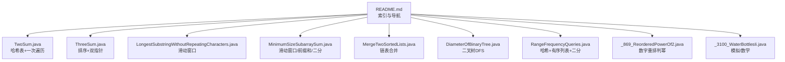
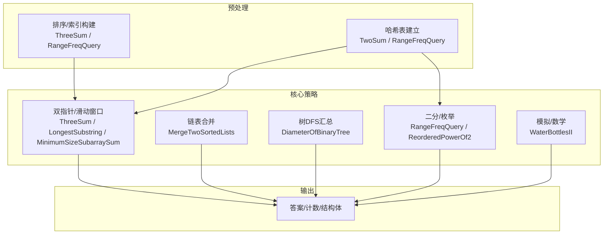
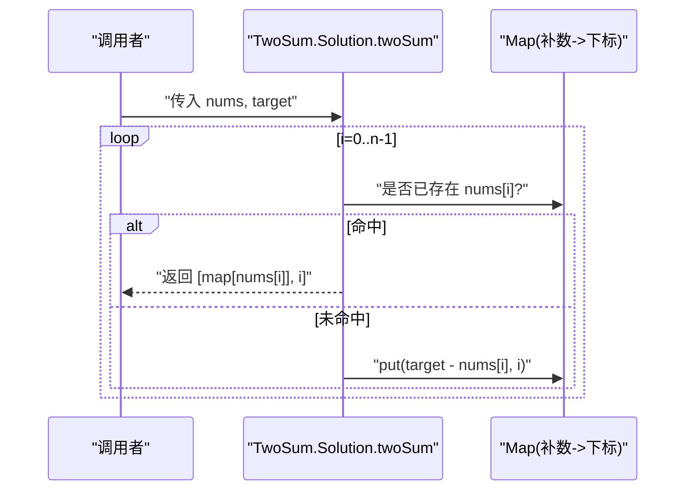
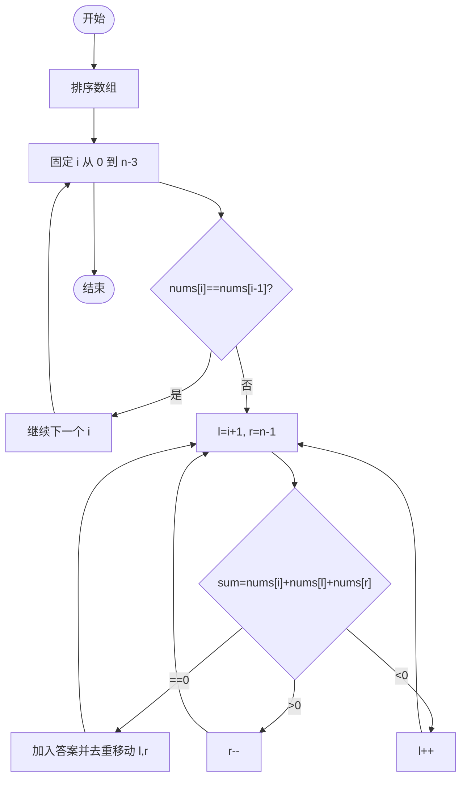
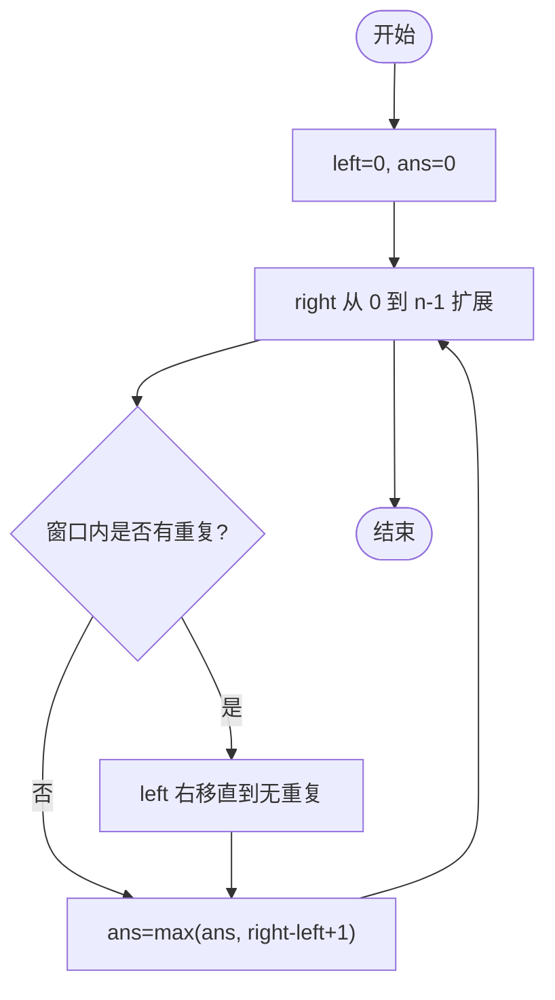
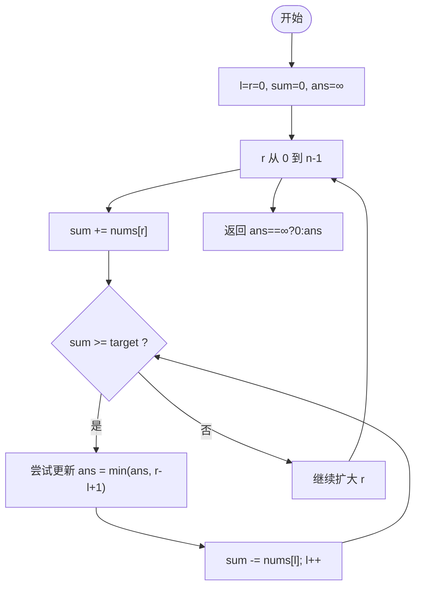
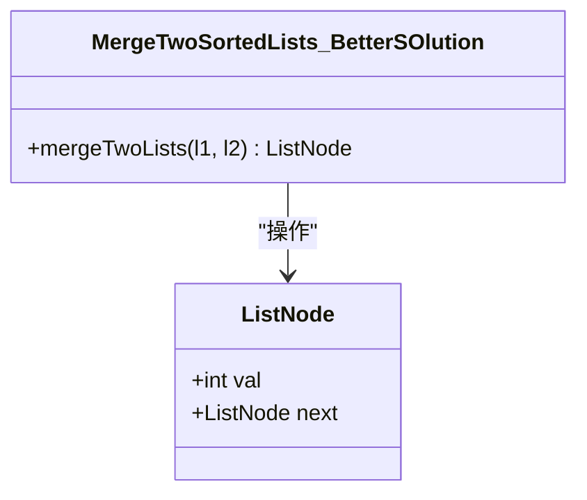
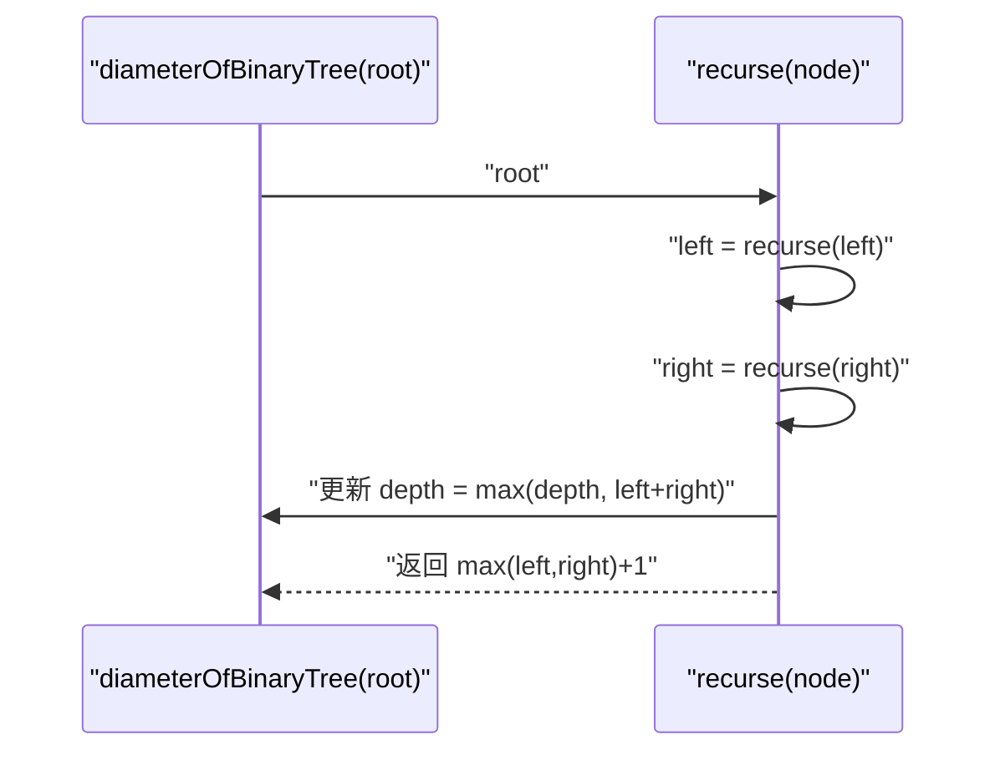
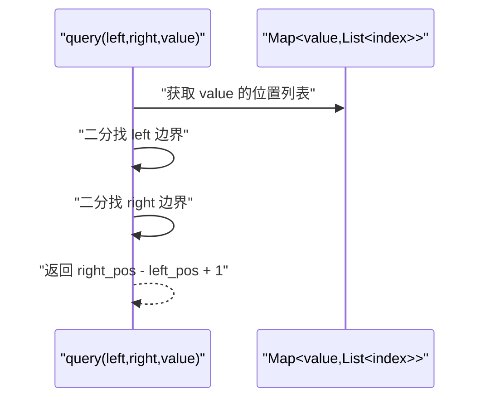
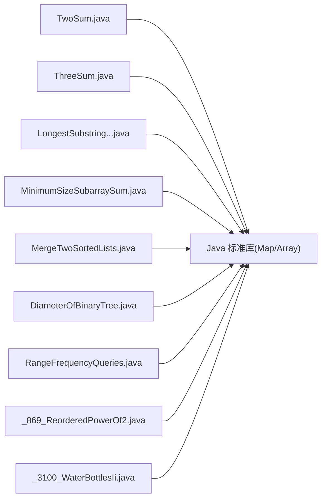

# 算法基础概念

<cite>
**本文引用的文件**   
- [README.md](file://README.md)
- [TwoSum.java](file://src/main/java/leetcode/editor/cn/TwoSum.java)
- [ThreeSum.java](file://src/main/java/leetcode/editor/cn/ThreeSum.java)
- [LongestSubstringWithoutRepeatingCharacters.java](file://src/main/java/leetcode/editor/cn/LongestSubstringWithoutRepeatingCharacters.java)
- [MinimumSizeSubarraySum.java](file://src/main/java/leetcode/editor/cn/MinimumSizeSubarraySum.java)
- [MergeTwoSortedLists.java](file://src/main/java/leetcode/editor/cn/MergeTwoSortedLists.java)
- [DiameterOfBinaryTree.java](file://src/main/java/leetcode/editor/cn/DiameterOfBinaryTree.java)
- [RangeFrequencyQueries.java](file://src/main/java/leetcode/editor/cn/RangeFrequencyQueries.java)
- [_869_ReorderedPowerOf2.java](file://src/main/java/leetcode/editor/cn/_869_ReorderedPowerOf2.java)
- [_3100_WaterBottlesIi.java](file://src/main/java/leetcode/editor/cn/_3100_WaterBottlesIi.java)
</cite>

## 目录
1. [引言](#引言)
2. [项目结构](#项目结构)
3. [核心组件](#核心组件)
4. [架构总览](#架构总览)
5. [详细组件分析](#详细组件分析)
6. [依赖分析](#依赖分析)
7. [性能考量](#性能考量)
8. [故障排查指南](#故障排查指南)
9. [结论](#结论)
10. [附录](#附录)

## 引言
本文件面向LeetCode题解项目的“算法基础概念”学习路径，目标是帮助读者从复杂度分析方法、常用模板与思路、数据结构使用模式到实战优化与调试技巧，形成循序渐进的知识体系。内容以仓库中的典型题目为案例，结合代码级实现进行讲解，强调可复用的解题框架与工程化实践。

## 项目结构
本项目采用按题号/主题组织的方式，每个问题一个Java源文件，内部包含：
- 题目描述注释（便于定位题意）
- 主类与Solution类（提交入口）
- 必要的辅助数据结构定义（如链表节点、树节点等）

图表来源
- [README.md:1-12](file://README.md#L1-L12)

章节来源
- [README.md:1-12](file://README.md#L1-L12)

## 核心组件
本节聚焦高频基础能力与模板，配合仓库中具体实现进行说明。

- 时间复杂度与空间复杂度分析方法
  - 时间复杂度：关注循环嵌套层数、递归深度、每次操作代价；对滑动窗口/双指针需统计左右指针移动次数；对分治/递归需考虑子问题规模与合并代价。
  - 空间复杂度：额外数组/哈希表大小、递归栈深度、结果集占用。
  - 参考实现：
    - 哈希表一次遍历：[TwoSum.java](file://src/main/java/leetcode/editor/cn/TwoSum.java)
    - 排序+双指针：[ThreeSum.java](file://src/main/java/leetcode/editor/cn/ThreeSum.java)
    - 滑动窗口：[LongestSubstringWithoutRepeatingCharacters.java](file://src/main/java/leetcode/editor/cn/LongestSubstringWithoutRepeatingCharacters.java)、[MinimumSizeSubarraySum.java](file://src/main/java/leetcode/editor/cn/MinimumSizeSubarraySum.java)
    - 链表合并：[MergeTwoSortedLists.java](file://src/main/java/leetcode/editor/cn/MergeTwoSortedLists.java)
    - 树DFS：[DiameterOfBinaryTree.java](file://src/main/java/leetcode/editor/cn/DiameterOfBinaryTree.java)
    - 哈希+有序列表+二分：[RangeFrequencyQueries.java](file://src/main/java/leetcode/editor/cn/RangeFrequencyQueries.java)
    - 数字重排判幂：[_869_ReorderedPowerOf2.java](file://src/main/java/leetcode/editor/cn/_869_ReorderedPowerOf2.java)
    - 模拟/数学：[_3100_WaterBottlesIi.java](file://src/main/java/leetcode/editor/cn/_3100_WaterBottlesIi.java)

- 常用算法模板与思路
  - 哈希表：键值映射、去重、计数、补数查找。
  - 双指针：同向（快慢）、相向（左右收缩）、固定长度窗口。
  - 滑动窗口：维护区间合法性，右扩左缩。
  - 前缀和/差分数组：区间求和、区间更新。
  - 二分查找：单调性判定、边界收敛。
  - 链表：虚拟头节点、原地拼接、反转。
  - 树：DFS/BFS、后序/先序/层序、直径/深度/路径汇总。
  - 位运算：奇偶位统计、掩码、位移。
  - 模拟/数学：状态机、递推、整除性质。

- 基本数据结构的使用模式与最佳实践
  - 数组/字符串：注意越界、空串、单元素边界；优先原地修改减少分配。
  - 哈希表：初始化容量避免扩容；选择合适键类型；注意重复处理。
  - 链表：统一使用虚拟头简化插入删除；注意空链与单节点分支。
  - 树：递归函数返回值设计清晰（如高度、最大路径），避免全局变量污染。
  - 队列/栈：BFS/回溯的标准容器；注意清空与复用。

章节来源
- [TwoSum.java:62-75](file://src/main/java/leetcode/editor/cn/TwoSum.java#L62-L75)
- [ThreeSum.java:62-90](file://src/main/java/leetcode/editor/cn/ThreeSum.java#L62-L90)
- [LongestSubstringWithoutRepeatingCharacters.java:56-71](file://src/main/java/leetcode/editor/cn/LongestSubstringWithoutRepeatingCharacters.java#L56-L71)
- [MinimumSizeSubarraySum.java:57-71](file://src/main/java/leetcode/editor/cn/MinimumSizeSubarraySum.java#L57-L71)
- [MergeTwoSortedLists.java:97-113](file://src/main/java/leetcode/editor/cn/MergeTwoSortedLists.java#L97-L113)
- [DiameterOfBinaryTree.java:56-73](file://src/main/java/leetcode/editor/cn/DiameterOfBinaryTree.java#L56-L73)
- [RangeFrequencyQueries.java:62-156](file://src/main/java/leetcode/editor/cn/RangeFrequencyQueries.java#L62-L156)
- [_869_ReorderedPowerOf2.java:46-71](file://src/main/java/leetcode/editor/cn/_869_ReorderedPowerOf2.java#L46-L71)
- [_3100_WaterBottlesIi.java:52-62](file://src/main/java/leetcode/editor/cn/_3100_WaterBottlesIi.java#L52-L62)

## 架构总览
下图展示各模块在“算法基础”层面的职责与交互关系，体现从输入到输出的通用流程：预处理（排序/建索引）→ 核心策略（双指针/滑动窗口/DFS/二分）→ 结果聚合。

图表来源
- [ThreeSum.java:62-90](file://src/main/java/leetcode/editor/cn/ThreeSum.java#L62-L90)
- [RangeFrequencyQueries.java:62-156](file://src/main/java/leetcode/editor/cn/RangeFrequencyQueries.java#L62-L156)
- [TwoSum.java:62-75](file://src/main/java/leetcode/editor/cn/TwoSum.java#L62-L75)
- [LongestSubstringWithoutRepeatingCharacters.java:56-71](file://src/main/java/leetcode/editor/cn/LongestSubstringWithoutRepeatingCharacters.java#L56-L71)
- [MinimumSizeSubarraySum.java:57-71](file://src/main/java/leetcode/editor/cn/MinimumSizeSubarraySum.java#L57-L71)
- [MergeTwoSortedLists.java:97-113](file://src/main/java/leetcode/editor/cn/MergeTwoSortedLists.java#L97-L113)
- [DiameterOfBinaryTree.java:56-73](file://src/main/java/leetcode/editor/cn/DiameterOfBinaryTree.java#L56-L73)
- [_869_ReorderedPowerOf2.java:46-71](file://src/main/java/leetcode/editor/cn/_869_ReorderedPowerOf2.java#L46-L71)
- [_3100_WaterBottlesIi.java:52-62](file://src/main/java/leetcode/editor/cn/_3100_WaterBottlesIi.java#L52-L62)

## 详细组件分析

### 两数之和（哈希表一次遍历）
- 思路要点
  - 用哈希表记录“目标值-当前值”的补数及其下标，边遍历边查询，避免二次扫描。
- 复杂度
  - 时间：O(n)，空间：O(n)。
- 关键实现位置
  - [TwoSum.java:62-75](file://src/main/java/leetcode/editor/cn/TwoSum.java#L62-L75)

图表来源
- [TwoSum.java:62-75](file://src/main/java/leetcode/editor/cn/TwoSum.java#L62-L75)

章节来源
- [TwoSum.java:62-75](file://src/main/java/leetcode/editor/cn/TwoSum.java#L62-L75)

### 三数之和（排序+双指针）
- 思路要点
  - 排序后固定第一个数，左右指针寻找另外两个数；通过跳过重复元素保证结果不重复。
- 复杂度
  - 时间：O(n^2)，空间：O(1)（不计结果）。
- 关键实现位置
  - [ThreeSum.java:62-90](file://src/main/java/leetcode/editor/cn/ThreeSum.java#L62-L90)

图表来源
- [ThreeSum.java:62-90](file://src/main/java/leetcode/editor/cn/ThreeSum.java#L62-L90)

章节来源
- [ThreeSum.java:62-90](file://src/main/java/leetcode/editor/cn/ThreeSum.java#L62-L90)

### 无重复字符的最长子串（滑动窗口）
- 思路要点
  - 维护窗口内字符出现状态，遇到重复则收缩左边界直到合法。
- 复杂度
  - 时间：O(n)，空间：O(Σ)（字符集大小）。
- 关键实现位置
  - [LongestSubstringWithoutRepeatingCharacters.java:56-71](file://src/main/java/leetcode/editor/cn/LongestSubstringWithoutRepeatingCharacters.java#L56-L71)

图表来源
- [LongestSubstringWithoutRepeatingCharacters.java:56-71](file://src/main/java/leetcode/editor/cn/LongestSubstringWithoutRepeatingCharacters.java#L56-L71)

章节来源
- [LongestSubstringWithoutRepeatingCharacters.java:56-71](file://src/main/java/leetcode/editor/cn/LongestSubstringWithoutRepeatingCharacters.java#L56-L71)

### 长度最小的子数组（滑动窗口/前缀和/二分）
- 思路要点
  - 正整数数组可用滑动窗口维护满足条件的最小子数组；也可用前缀和+二分或双指针变体。
- 复杂度
  - 滑动窗口：时间O(n)，空间O(1)。
- 关键实现位置
  - [MinimumSizeSubarraySum.java:57-71](file://src/main/java/leetcode/editor/cn/MinimumSizeSubarraySum.java#L57-L71)

图表来源
- [MinimumSizeSubarraySum.java:57-71](file://src/main/java/leetcode/editor/cn/MinimumSizeSubarraySum.java#L57-L71)

章节来源
- [MinimumSizeSubarraySum.java:57-71](file://src/main/java/leetcode/editor/cn/MinimumSizeSubarraySum.java#L57-L71)

### 合并两个有序链表（链表合并）
- 思路要点
  - 使用虚拟头节点，比较两链表当前节点值，较小者接入结果链表，最后拼接剩余部分。
- 复杂度
  - 时间：O(m+n)，空间：O(1)。
- 关键实现位置
  - [MergeTwoSortedLists.java:97-113](file://src/main/java/leetcode/editor/cn/MergeTwoSortedLists.java#L97-L113)

图表来源
- [MergeTwoSortedLists.java:115-121](file://src/main/java/leetcode/editor/cn/MergeTwoSortedLists.java#L115-L121)
- [MergeTwoSortedLists.java:97-113](file://src/main/java/leetcode/editor/cn/MergeTwoSortedLists.java#L97-L113)

章节来源
- [MergeTwoSortedLists.java:97-113](file://src/main/java/leetcode/editor/cn/MergeTwoSortedLists.java#L97-L113)
- [MergeTwoSortedLists.java:115-121](file://src/main/java/leetcode/editor/cn/MergeTwoSortedLists.java#L115-L121)

### 二叉树的直径（树DFS）
- 思路要点
  - 后序遍历计算左右子树高度，同时更新全局最大直径（左高+右高）。
- 复杂度
  - 时间：O(n)，空间：O(h)（递归栈）。
- 关键实现位置
  - [DiameterOfBinaryTree.java:56-73](file://src/main/java/leetcode/editor/cn/DiameterOfBinaryTree.java#L56-L73)

图表来源
- [DiameterOfBinaryTree.java:56-73](file://src/main/java/leetcode/editor/cn/DiameterOfBinaryTree.java#L56-L73)

章节来源
- [DiameterOfBinaryTree.java:56-73](file://src/main/java/leetcode/editor/cn/DiameterOfBinaryTree.java#L56-L73)

### 范围频率查询（哈希+有序列表+二分）
- 思路要点
  - 构造阶段：将每个值的出现位置按顺序存入List；查询阶段：在对应List上二分定位左右边界，得到区间内频次。
- 复杂度
  - 构造：O(n)；单次查询：O(log k)（k为该值出现次数）。
- 关键实现位置
  - [RangeFrequencyQueries.java:62-156](file://src/main/java/leetcode/editor/cn/RangeFrequencyQueries.java#L62-L156)

图表来源
- [RangeFrequencyQueries.java:62-156](file://src/main/java/leetcode/editor/cn/RangeFrequencyQueries.java#L62-L156)

章节来源
- [RangeFrequencyQueries.java:62-156](file://src/main/java/leetcode/editor/cn/RangeFrequencyQueries.java#L62-L156)

### 重排后判断是否为2的幂（数字重排）
- 思路要点
  - 将n的各位排序作为特征，枚举范围内所有2的幂，比较其排序后的特征是否一致。
- 复杂度
  - 取决于位数与2的幂个数，整体常数较小。
- 关键实现位置
  - [_869_ReorderedPowerOf2.java:46-71](file://src/main/java/leetcode/editor/cn/_869_ReorderedPowerOf2.java#L46-L71)

章节来源
- [_869_ReorderedPowerOf2.java:46-71](file://src/main/java/leetcode/editor/cn/_869_ReorderedPowerOf2.java#L46-L71)

### 水瓶兑换 II（模拟/数学）
- 思路要点
  - 模拟每次用 numExchange 个空瓶换满瓶，累计喝掉数量，numExchange 递增，直到无法再换。
- 复杂度
  - 时间：O(k)（k为可兑换轮数），空间：O(1)。
- 关键实现位置
  - [_3100_WaterBottlesIi.java:52-62](file://src/main/java/leetcode/editor/cn/_3100_WaterBottlesIi.java#L52-L62)

章节来源
- [_3100_WaterBottlesIi.java:52-62](file://src/main/java/leetcode/editor/cn/_3100_WaterBottlesIi.java#L52-L62)

## 依赖分析
- 模块耦合
  - 各题解相互独立，仅共享语言标准库（如HashMap、ArrayList、Arrays等）。
  - 数据结构定义（如ListNode、TreeNode）仅在各自文件中局部使用，降低跨文件耦合。
- 外部依赖
  - Java标准库集合与工具类；部分文件引入第三方注解（如lombok.val），不影响算法逻辑。
- 潜在风险
  - 大对象频繁创建可能带来GC压力；可通过复用缓冲区、减少中间对象缓解。

图表来源
- [TwoSum.java:62-75](file://src/main/java/leetcode/editor/cn/TwoSum.java#L62-L75)
- [ThreeSum.java:62-90](file://src/main/java/leetcode/editor/cn/ThreeSum.java#L62-L90)
- [LongestSubstringWithoutRepeatingCharacters.java:56-71](file://src/main/java/leetcode/editor/cn/LongestSubstringWithoutRepeatingCharacters.java#L56-L71)
- [MinimumSizeSubarraySum.java:57-71](file://src/main/java/leetcode/editor/cn/MinimumSizeSubarraySum.java#L57-L71)
- [MergeTwoSortedLists.java:97-113](file://src/main/java/leetcode/editor/cn/MergeTwoSortedLists.java#L97-L113)
- [DiameterOfBinaryTree.java:56-73](file://src/main/java/leetcode/editor/cn/DiameterOfBinaryTree.java#L56-L73)
- [RangeFrequencyQueries.java:62-156](file://src/main/java/leetcode/editor/cn/RangeFrequencyQueries.java#L62-L156)
- [_869_ReorderedPowerOf2.java:46-71](file://src/main/java/leetcode/editor/cn/_869_ReorderedPowerOf2.java#L46-L71)
- [_3100_WaterBottlesIi.java:52-62](file://src/main/java/leetcode/editor/cn/_3100_WaterBottlesIi.java#L52-L62)

## 性能考量
- 选择原则
  - 数据规模决定上限：n≤10^5时优先考虑O(n)或O(n log n)；n≤10^3可接受O(n^2)。
  - 空间换时间：哈希表/前缀和/线段树常用于降维查询。
  - 原地操作优先：减少额外分配，提升缓存命中率。
- 常见优化点
  - 预分配容量（如HashMap初始容量）避免扩容。
  - 滑动窗口尽量用定长数组替代Map以降低开销。
  - 链表合并使用虚拟头简化分支。
  - 树DFS返回值设计清晰，避免全局变量副作用。
- 基准建议
  - 针对热点路径做简单计时；对比不同实现（如滑动窗口 vs 前缀和+二分）。

## 故障排查指南
- 常见问题
  - 边界条件遗漏：空输入、单元素、全相同元素。
  - 重复处理不当：排序后未跳过重复导致结果重复。
  - 指针越界：双指针/滑动窗口收缩条件错误。
  - 溢出风险：累加和超过整型范围需改用long。
- 定位方法
  - 打印关键变量（窗口边界、哈希表状态、递归返回值）。
  - 构造最小反例验证分支覆盖。
  - 逐步缩小输入规模观察行为变化。
- 参考实现中的易错点
  - 三数之和去重逻辑：[ThreeSum.java:62-90](file://src/main/java/leetcode/editor/cn/ThreeSum.java#L62-L90)
  - 滑动窗口收缩终止条件：[LongestSubstringWithoutRepeatingCharacters.java:56-71](file://src/main/java/leetcode/editor/cn/LongestSubstringWithoutRepeatingCharacters.java#L56-L71)
  - 链表合并收尾拼接：[MergeTwoSortedLists.java:97-113](file://src/main/java/leetcode/editor/cn/MergeTwoSortedLists.java#L97-L113)
  - 树直径更新时机：[DiameterOfBinaryTree.java:56-73](file://src/main/java/leetcode/editor/cn/DiameterOfBinaryTree.java#L56-L73)

章节来源
- [ThreeSum.java:62-90](file://src/main/java/leetcode/editor/cn/ThreeSum.java#L62-L90)
- [LongestSubstringWithoutRepeatingCharacters.java:56-71](file://src/main/java/leetcode/editor/cn/LongestSubstringWithoutRepeatingCharacters.java#L56-L71)
- [MergeTwoSortedLists.java:97-113](file://src/main/java/leetcode/editor/cn/MergeTwoSortedLists.java#L97-L113)
- [DiameterOfBinaryTree.java:56-73](file://src/main/java/leetcode/editor/cn/DiameterOfBinaryTree.java#L56-L73)

## 结论
通过本仓库的典型题解，可以系统掌握时间/空间复杂度分析方法、常用算法模板与数据结构使用模式。建议在练习中坚持“先建模、再选模板、后优化细节”的流程，并结合调试与基准测试持续迭代，逐步提升解题效率与代码质量。

## 附录
- 快速检索索引
  - 哈希表：[TwoSum.java](file://src/main/java/leetcode/editor/cn/TwoSum.java)
  - 双指针/排序：[ThreeSum.java](file://src/main/java/leetcode/editor/cn/ThreeSum.java)
  - 滑动窗口：[LongestSubstringWithoutRepeatingCharacters.java](file://src/main/java/leetcode/editor/cn/LongestSubstringWithoutRepeatingCharacters.java)、[MinimumSizeSubarraySum.java](file://src/main/java/leetcode/editor/cn/MinimumSizeSubarraySum.java)
  - 链表：[MergeTwoSortedLists.java](file://src/main/java/leetcode/editor/cn/MergeTwoSortedLists.java)
  - 树：[DiameterOfBinaryTree.java](file://src/main/java/leetcode/editor/cn/DiameterOfBinaryTree.java)
  - 哈希+二分：[RangeFrequencyQueries.java](file://src/main/java/leetcode/editor/cn/RangeFrequencyQueries.java)
  - 数字重排：[_869_ReorderedPowerOf2.java](file://src/main/java/leetcode/editor/cn/_869_ReorderedPowerOf2.java)
  - 模拟/数学：[_3100_WaterBottlesIi.java](file://src/main/java/leetcode/editor/cn/_3100_WaterBottlesIi.java)