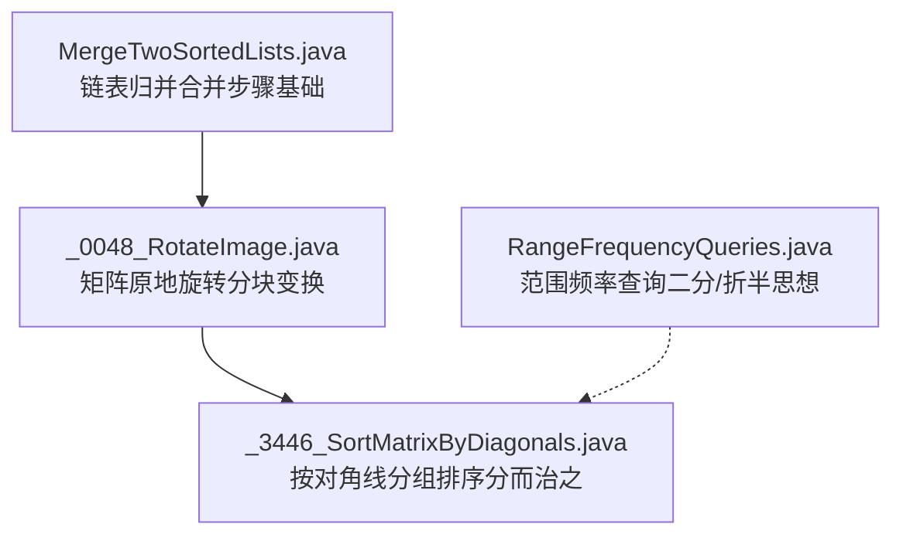
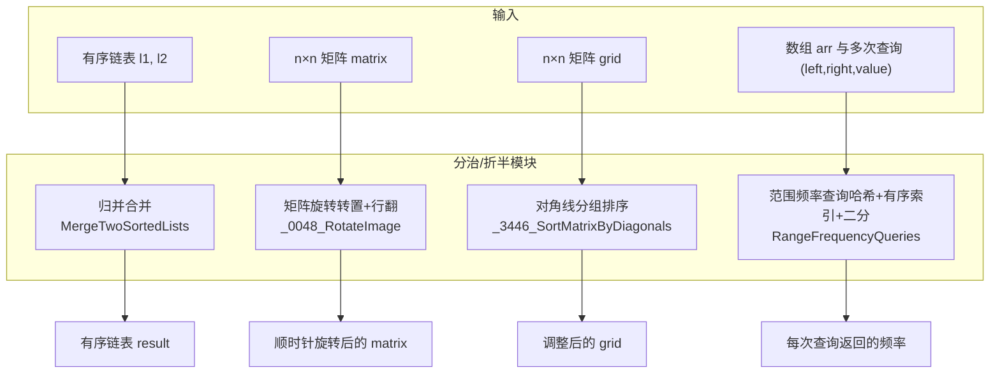
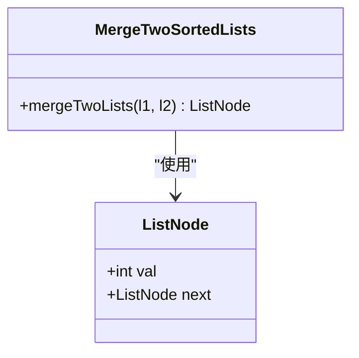
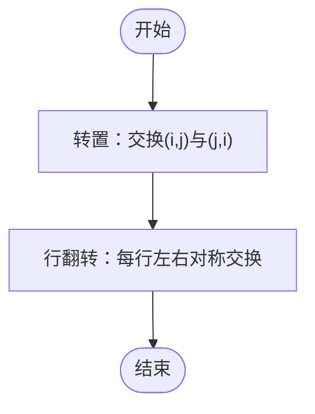
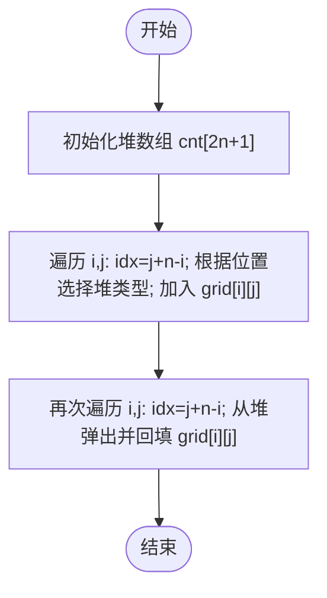
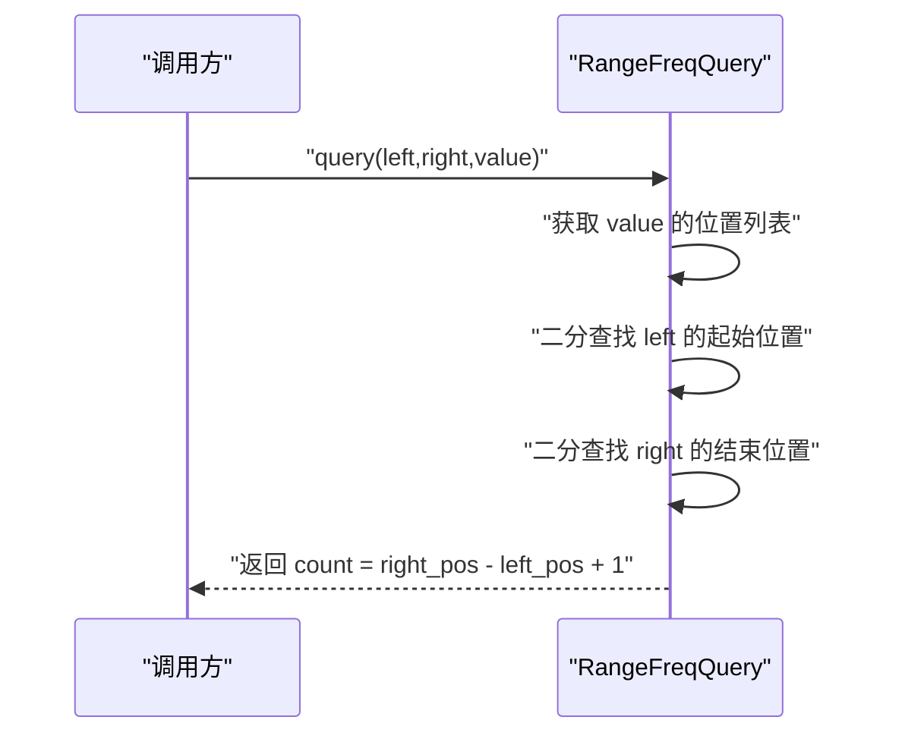
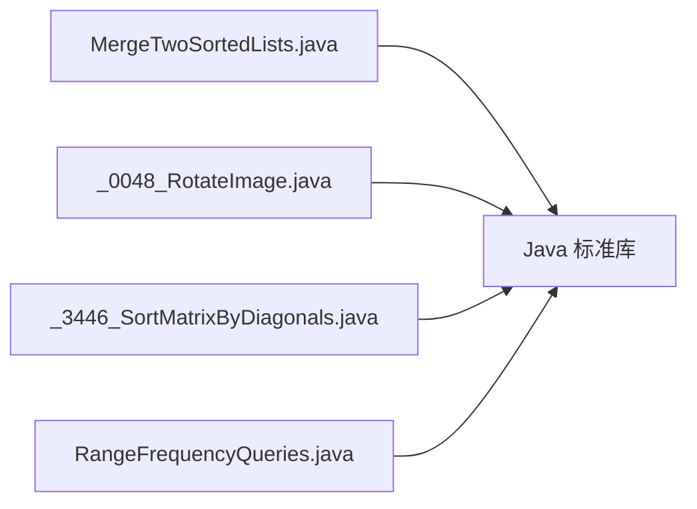

# 分治算法

<cite>
**本文引用的文件**   
- [src/main/java/leetcode/editor/cn/MergeTwoSortedLists.java](file://src/main/java/leetcode/editor/cn/MergeTwoSortedLists.java)
- [src/main/java/leetcode/editor/cn/_0048_RotateImage.java](file://src/main/java/leetcode/editor/cn/_0048_RotateImage.java)
- [src/main/java/leetcode/editor/cn/_3446_SortMatrixByDiagonals.java](file://src/main/java/leetcode/editor/cn/_3446_SortMatrixByDiagonals.java)
- [src/main/java/leetcode/editor/cn/RangeFrequencyQueries.java](file://src/main/java/leetcode/editor/cn/RangeFrequencyQueries.java)
</cite>

## 目录
1. [引言](#引言)
2. [项目结构](#项目结构)
3. [核心组件](#核心组件)
4. [架构总览](#架构总览)
5. [详细组件分析](#详细组件分析)
6. [依赖分析](#依赖分析)
7. [性能考虑](#性能考虑)
8. [故障排查指南](#故障排查指南)
9. [结论](#结论)
10. [附录](#附录)

## 引言
本文件围绕“分治算法”在LeetCode题解中的实践，系统讲解分解-解决-合并三步法、递归关系与终止条件设计，并通过矩阵操作与排序问题展示具体应用。重点包括：
- 递归树的构建与子问题独立性
- 合并操作的实现要点
- 时间复杂度分析与空间优化技巧
- 分治与动态规划的对比及选择策略

## 项目结构
本项目为Java实现的LeetCode题解集合，按题目组织源码文件。与分治相关的典型示例包括：
- 链表归并（Merge）作为“合并”步骤的基础单元
- 矩阵旋转与对角线排序体现二维数据的分块处理思想
- 范围频率查询中二分查找的“折半”思想与分治思维相通

图表来源 
- [src/main/java/leetcode/editor/cn/MergeTwoSortedLists.java](file://src/main/java/leetcode/editor/cn/MergeTwoSortedLists.java)
- [src/main/java/leetcode/editor/cn/_0048_RotateImage.java](file://src/main/java/leetcode/editor/cn/_0048_RotateImage.java)
- [src/main/java/leetcode/editor/cn/_3446_SortMatrixByDiagonals.java](file://src/main/java/leetcode/editor/cn/_3446_SortMatrixByDiagonals.java)
- [src/main/java/leetcode/editor/cn/RangeFrequencyQueries.java](file://src/main/java/leetcode/editor/cn/RangeFrequencyQueries.java)

章节来源
- [src/main/java/leetcode/editor/cn/MergeTwoSortedLists.java](file://src/main/java/leetcode/editor/cn/MergeTwoSortedLists.java)
- [src/main/java/leetcode/editor/cn/_0048_RotateImage.java](file://src/main/java/leetcode/editor/cn/_0048_RotateImage.java)
- [src/main/java/leetcode/editor/cn/_3446_SortMatrixByDiagonals.java](file://src/main/java/leetcode/editor/cn/_3446_SortMatrixByDiagonals.java)
- [src/main/java/leetcode/editor/cn/RangeFrequencyQueries.java](file://src/main/java/leetcode/editor/cn/RangeFrequencyQueries.java)

## 核心组件
- 链表归并（合并步骤）：提供将两个有序序列合并为一个有序序列的标准过程，是许多分治算法（如归并排序）的“合并”阶段核心。
- 矩阵原地旋转：通过转置+行翻转两步完成，体现了对二维数据分块处理的思路。
- 矩阵对角线排序：将每条对角线视为独立子问题，分别排序后回填，体现“分而治之”。
- 范围频率查询：利用哈希表+有序索引列表+二分查找，体现“折半”思想与分治思维的一致性。

章节来源
- [src/main/java/leetcode/editor/cn/MergeTwoSortedLists.java](file://src/main/java/leetcode/editor/cn/MergeTwoSortedLists.java)
- [src/main/java/leetcode/editor/cn/_0048_RotateImage.java](file://src/main/java/leetcode/editor/cn/_0048_RotateImage.java)
- [src/main/java/leetcode/editor/cn/_3446_SortMatrixByDiagonals.java](file://src/main/java/leetcode/editor/cn/_3446_SortMatrixByDiagonals.java)
- [src/main/java/leetcode/editor/cn/RangeFrequencyQueries.java](file://src/main/java/leetcode/editor/cn/RangeFrequencyQueries.java)

## 架构总览
下图展示了各组件之间的协作关系与数据流向，突出“分解-解决-合并”的分治范式在不同数据结构上的体现。

图表来源 
- [src/main/java/leetcode/editor/cn/MergeTwoSortedLists.java](file://src/main/java/leetcode/editor/cn/MergeTwoSortedLists.java)
- [src/main/java/leetcode/editor/cn/_0048_RotateImage.java](file://src/main/java/leetcode/editor/cn/_0048_RotateImage.java)
- [src/main/java/leetcode/editor/cn/_3446_SortMatrixByDiagonals.java](file://src/main/java/leetcode/editor/cn/_3446_SortMatrixByDiagonals.java)
- [src/main/java/leetcode/editor/cn/RangeFrequencyQueries.java](file://src/main/java/leetcode/editor/cn/RangeFrequencyQueries.java)

## 详细组件分析

### 组件A：链表归并（合并步骤）
- 角色定位：作为分治算法中的“合并”阶段基础单元，常用于归并排序等场景。
- 关键流程：比较两链表头节点值，较小者接入结果链；推进对应指针；直至某一链表为空，再拼接剩余部分。
- 复杂度：时间O(n+m)，空间O(1)（迭代实现）。
- 适用性：当子问题可独立求解且合并代价可控时，适合采用分治。

图表来源 
- [src/main/java/leetcode/editor/cn/MergeTwoSortedLists.java](file://src/main/java/leetcode/editor/cn/MergeTwoSortedLists.java)

章节来源
- [src/main/java/leetcode/editor/cn/MergeTwoSortedLists.java](file://src/main/java/leetcode/editor/cn/MergeTwoSortedLists.java)

### 组件B：矩阵原地旋转（分块变换）
- 角色定位：通过“转置+行翻转”两步完成顺时针旋转，体现对二维矩阵的分块处理。
- 关键流程：
  - 转置：交换(i,j)与(j,i)
  - 行翻转：每行左右对称交换
- 复杂度：时间O(n^2)，空间O(1)。
- 分治视角：可将矩阵划分为若干环或层，逐层旋转；此处给出的是更简洁的两步等价变换。

图表来源 
- [src/main/java/leetcode/editor/cn/_0048_RotateImage.java](file://src/main/java/leetcode/editor/cn/_0048_RotateImage.java)

章节来源
- [src/main/java/leetcode/editor/cn/_0048_RotateImage.java](file://src/main/java/leetcode/editor/cn/_0048_RotateImage.java)

### 组件C：按对角线分组排序（分而治之）
- 角色定位：将每条对角线视为独立子问题，分别排序后再回填，典型“分-解-合”模式。
- 关键流程：
  - 遍历矩阵，按对角线索引 j+n-i 将元素入堆（右上三角升序堆，左下三角降序堆）
  - 再次遍历矩阵，从对应堆弹出最小/最大元素回填
- 复杂度：时间O(n^2 log n)，空间O(n^2)（存储所有元素到堆）。
- 分治视角：对角线之间相互独立，满足子问题独立性；合并即回填。

图表来源 
- [src/main/java/leetcode/editor/cn/_3446_SortMatrixByDiagonals.java](file://src/main/java/leetcode/editor/cn/_3446_SortMatrixByDiagonals.java)

章节来源
- [src/main/java/leetcode/editor/cn/_3446_SortMatrixByDiagonals.java](file://src/main/java/leetcode/editor/cn/_3446_SortMatrixByDiagonals.java)

### 组件D：范围频率查询（折半/二分思想）
- 角色定位：虽非严格分治，但“折半”思想与分治同源；用于快速统计区间内某值的出现次数。
- 关键流程：
  - 预处理：记录每个值的所有出现位置（有序列表）
  - 查询：在有序列表中用二分查找确定[left,right]范围内的计数
- 复杂度：预处理O(n)，单次查询O(log n)，空间O(n)。
- 与分治的关系：二分查找本质是将搜索空间不断折半，符合分治的“缩小规模”思想。

图表来源 
- [src/main/java/leetcode/editor/cn/RangeFrequencyQueries.java](file://src/main/java/leetcode/editor/cn/RangeFrequencyQueries.java)

章节来源
- [src/main/java/leetcode/editor/cn/RangeFrequencyQueries.java](file://src/main/java/leetcode/editor/cn/RangeFrequencyQueries.java)

## 依赖分析
- 组件间耦合度低：各文件独立实现不同题目，无直接跨文件依赖。
- 共同依赖：均基于Java标准库（数组、列表、优先队列、哈希表等）。
- 潜在扩展：若实现“归并排序”，可将“链表归并”抽象为通用合并器，供数组/链表版本复用。

图表来源 
- [src/main/java/leetcode/editor/cn/MergeTwoSortedLists.java](file://src/main/java/leetcode/editor/cn/MergeTwoSortedLists.java)
- [src/main/java/leetcode/editor/cn/_0048_RotateImage.java](file://src/main/java/leetcode/editor/cn/_0048_RotateImage.java)
- [src/main/java/leetcode/editor/cn/_3446_SortMatrixByDiagonals.java](file://src/main/java/leetcode/editor/cn/_3446_SortMatrixByDiagonals.java)
- [src/main/java/leetcode/editor/cn/RangeFrequencyQueries.java](file://src/main/java/leetcode/editor/cn/RangeFrequencyQueries.java)

章节来源
- [src/main/java/leetcode/editor/cn/MergeTwoSortedLists.java](file://src/main/java/leetcode/editor/cn/MergeTwoSortedLists.java)
- [src/main/java/leetcode/editor/cn/_0048_RotateImage.java](file://src/main/java/leetcode/editor/cn/_0048_RotateImage.java)
- [src/main/java/leetcode/editor/cn/_3446_SortMatrixByDiagonals.java](file://src/main/java/leetcode/editor/cn/_3446_SortMatrixByDiagonals.java)
- [src/main/java/leetcode/editor/cn/RangeFrequencyQueries.java](file://src/main/java/leetcode/editor/cn/RangeFrequencyQueries.java)

## 性能考虑
- 时间复杂度
  - 链表归并：O(n+m)
  - 矩阵旋转：O(n^2)
  - 对角线排序：O(n^2 log n)
  - 范围频率查询：预处理O(n)，查询O(log n)
- 空间复杂度
  - 链表归并：O(1)（迭代）
  - 矩阵旋转：O(1)
  - 对角线排序：O(n^2)（堆存储）
  - 范围频率查询：O(n)（位置列表）
- 优化建议
  - 对角线排序可用计数排序/桶排序替代堆，降低常数因子
  - 范围频率查询可结合前缀和或线段树进行批量优化
  - 矩阵旋转可按层分治，减少重复计算

## 故障排查指南
- 边界条件
  - 空链表/空矩阵：确保提前返回或正确处理
  - 单元素/小规模输入：验证循环与索引不越界
- 常见错误
  - 对角线索引计算错误：注意 j+n-i 的范围与堆分配
  - 二分查找边界：确认左/右端点定义一致，避免死循环
  - 原地修改导致覆盖：矩阵旋转需保证转置与行翻转顺序正确
- 调试建议
  - 打印中间状态（如堆内容、位置列表）
  - 构造小样例逐步验证每一步输出

章节来源
- [src/main/java/leetcode/editor/cn/_3446_SortMatrixByDiagonals.java](file://src/main/java/leetcode/editor/cn/_3446_SortMatrixByDiagonals.java)
- [src/main/java/leetcode/editor/cn/RangeFrequencyQueries.java](file://src/main/java/leetcode/editor/cn/RangeFrequencyQueries.java)
- [src/main/java/leetcode/editor/cn/_0048_RotateImage.java](file://src/main/java/leetcode/editor/cn/_0048_RotateImage.java)

## 结论
- 分治的核心在于“子问题独立性”与“合并代价可控”。
- 矩阵与排序问题是分治的典型应用场景；链表归并为合并阶段提供了稳定高效的实现。
- 二分查找虽非严格分治，但其“折半”思想与分治同源，常作为分治的子程序。
- 在实际工程中，应权衡时间/空间复杂度与实现复杂度，选择合适的分治策略与数据结构。

## 附录
- 分治与动态规划对比与选择策略
  - 选择分治的条件
    - 问题可自然分解为相互独立的子问题
    - 子问题的解可以高效合并得到原问题解
    - 递归深度与合并开销可控
  - 选择动态规划的条件
    - 子问题存在重叠，需要记忆化或自底向上填表
    - 最优子结构明确，状态转移方程清晰
  - 决策参考
    - 若子问题独立且合并简单：优先考虑分治
    - 若子问题大量重叠：优先考虑动态规划
    - 若两者皆可：比较时间与空间复杂度，选择更优方案