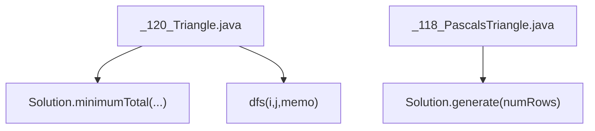
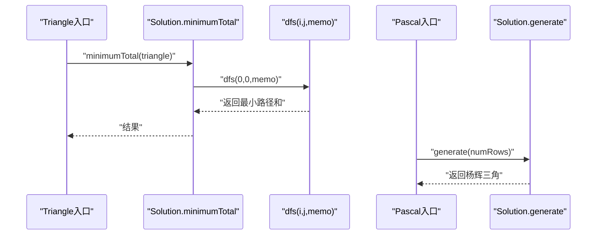
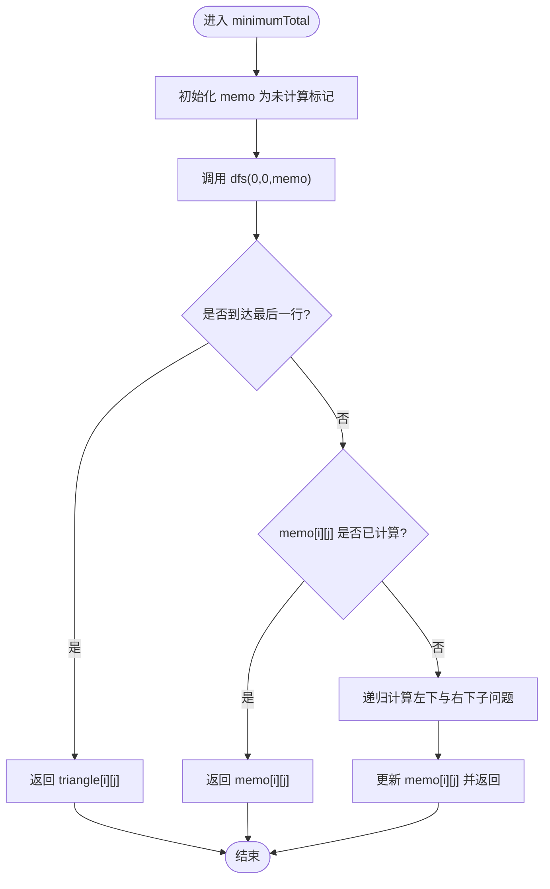
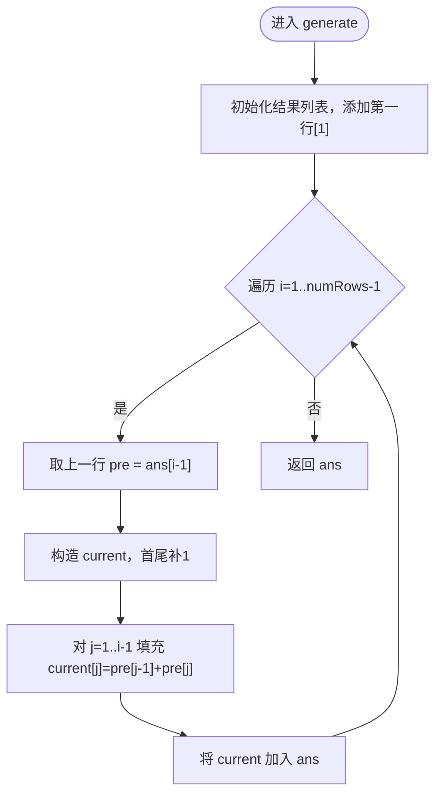
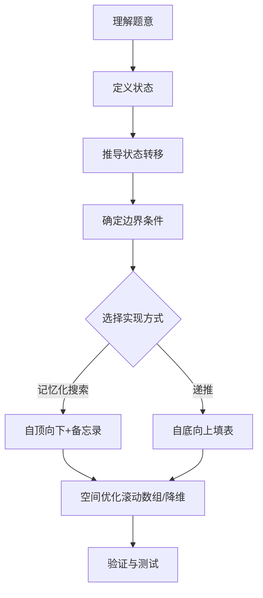
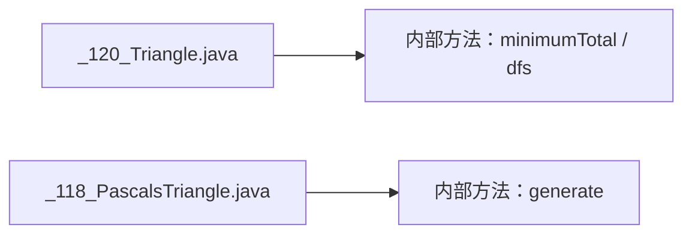

# 动态规划

<cite>
**本文引用的文件**   
- [_120_Triangle.java](file://src/main/java/leetcode/editor/cn/_120_Triangle.java)
- [_118_PascalsTriangle.java](file://src/main/java/leetcode/editor/cn/_118_PascalsTriangle.java)
</cite>

## 目录
1. [引言](#引言)
2. [项目结构](#项目结构)
3. [核心组件](#核心组件)
4. [架构总览](#架构总览)
5. [详细组件分析](#详细组件分析)
6. [依赖分析](#依赖分析)
7. [性能考虑](#性能考虑)
8. [故障排查指南](#故障排查指南)
9. [结论](#结论)
10. [附录](#附录)

## 引言
本章节面向LeetCode算法题解仓库中的“动态规划”专题，系统梳理动态规划的核心思想与实战方法。内容涵盖：
- 状态定义、状态转移方程设计与边界条件处理
- 一维DP、二维DP、区间DP、树形DP等常见类型
- 记忆化搜索（自顶向下）与自底向上方法的对比
- 空间优化策略与常见DP模式总结
- 以 Triangle、Pascal's Triangle 等经典题目展示建模过程与优化技巧

## 项目结构
本项目采用按题号组织的结构，每个题一个Java源文件，包含题目描述注释与Solution实现。与动态规划相关的示例文件包括：
- _120_Triangle.java：三角形最小路径和（典型二维DP/树形DP）
- _118_PascalsTriangle.java：杨辉三角（典型二维DP递推）

图示来源
- [_120_Triangle.java:55-83](file://src/main/java/leetcode/editor/cn/_120_Triangle.java#L55-L83)
- [_118_PascalsTriangle.java:39-62](file://src/main/java/leetcode/editor/cn/_118_PascalsTriangle.java#L39-L62)

章节来源
- [_120_Triangle.java:55-83](file://src/main/java/leetcode/editor/cn/_120_Triangle.java#L55-L83)
- [_118_PascalsTriangle.java:39-62](file://src/main/java/leetcode/editor/cn/_118_PascalsTriangle.java#L39-L62)

## 核心组件
本节聚焦两个代表性DP问题，提炼通用方法论与可复用模板。

- 三角形最小路径和（_120_Triangle.java）
  - 状态定义：dp[i][j]表示从位置(i,j)出发到达底部的最小路径和
  - 状态转移：dp[i][j] = triangle[i][j] + min(dp[i+1][j], dp[i+1][j+1])
  - 边界条件：最后一行直接取自身值
  - 实现方式：记忆化搜索（自顶向下），并给出原地滚动数组的空间优化思路
  - 复杂度：时间O(n^2)，空间O(n^2)或优化至O(n)

- 杨辉三角（_118_PascalsTriangle.java）
  - 状态定义：dp[i][j]为第i行第j列的数值
  - 状态转移：dp[i][j] = dp[i-1][j-1] + dp[i-1][j]（边界为1）
  - 实现方式：自底向上递推，逐行生成
  - 复杂度：时间O(n^2)，空间O(n^2)

章节来源
- [_120_Triangle.java:60-81](file://src/main/java/leetcode/editor/cn/_120_Triangle.java#L60-L81)
- [_118_PascalsTriangle.java:44-61](file://src/main/java/leetcode/editor/cn/_118_PascalsTriangle.java#L44-L61)

## 架构总览
下图展示了两个问题的调用关系与数据流，体现“自顶向下记忆化”和“自底向上递推”两种范式。

图示来源
- [_120_Triangle.java:60-81](file://src/main/java/leetcode/editor/cn/_120_Triangle.java#L60-L81)
- [_118_PascalsTriangle.java:44-61](file://src/main/java/leetcode/editor/cn/_118_PascalsTriangle.java#L44-L61)

## 详细组件分析

### 三角形最小路径和（_120_Triangle.java）
- 设计要点
  - 自顶向下记忆化搜索：用memo记录已计算子问题，避免重复递归
  - 状态转移清晰：当前节点选择下一层相邻两节点的最小值
  - 边界处理：到达最后一行直接返回该位置值
- 代码级流程（函数调用链）

图示来源
- [_120_Triangle.java:60-81](file://src/main/java/leetcode/editor/cn/_120_Triangle.java#L60-L81)

- 空间优化建议
  - 将二维memo压缩为一维数组，从下往上滚动更新，使额外空间降至O(n)
  - 注意更新顺序以避免覆盖尚未使用的上一行值

- 复杂度
  - 时间：O(n^2)
  - 空间：O(n^2)；优化后O(n)

章节来源
- [_120_Triangle.java:60-81](file://src/main/java/leetcode/editor/cn/_120_Triangle.java#L60-L81)

### 杨辉三角（_118_PascalsTriangle.java）
- 设计要点
  - 自底向上递推：逐行构建，每行首尾为1，中间元素等于上一行相邻两数之和
  - 可直接在结果结构中就地生成，无需额外DP表
- 代码级流程（生成步骤）

图示来源
- [_118_PascalsTriangle.java:44-61](file://src/main/java/leetcode/editor/cn/_118_PascalsTriangle.java#L44-L61)

- 复杂度
  - 时间：O(n^2)
  - 空间：O(n^2)（输出占用）

章节来源
- [_118_PascalsTriangle.java:44-61](file://src/main/java/leetcode/editor/cn/_118_PascalsTriangle.java#L44-L61)

### 概念性总览：DP建模四步法
- 明确状态：用最少维度刻画子问题（如索引、剩余容量、前驱状态等）
- 确定转移：写出由已知状态推导未知状态的递推式
- 设定边界：处理最小子问题（如空串、单元素、边界行/列）
- 选择方向：自顶向下（记忆化）或自底向上（迭代），并评估空间优化可能

（此图为概念流程图，不直接映射具体源码文件）

## 依赖分析
- 模块内聚性
  - 每个题独立成类，职责单一，便于单独测试与复用
- 外部依赖
  - 仅使用标准库集合与基础数学运算，无第三方依赖
- 耦合度
  - 各题之间无相互引用，低耦合，利于扩展新题型

图示来源
- [_120_Triangle.java:55-83](file://src/main/java/leetcode/editor/cn/_120_Triangle.java#L55-L83)
- [_118_PascalsTriangle.java:39-62](file://src/main/java/leetcode/editor/cn/_118_PascalsTriangle.java#L39-L62)

章节来源
- [_120_Triangle.java:55-83](file://src/main/java/leetcode/editor/cn/_120_Triangle.java#L55-L83)
- [_118_PascalsTriangle.java:39-62](file://src/main/java/leetcode/editor/cn/_118_PascalsTriangle.java#L39-L62)

## 性能考虑
- 时间复杂度
  - 两类问题均为O(n^2)，符合输入规模预期
- 空间复杂度
  - Triangle可通过滚动数组将额外空间降至O(n)
  - Pascal的输出本身占O(n^2)，无法进一步降低
- 常数优化
  - 避免不必要的对象创建与装箱拆箱
  - 合理初始化与提前返回减少无效计算

## 故障排查指南
- 越界访问
  - 检查边界行/列的处理逻辑，确保索引范围合法
- 初始值设置
  - 记忆化搜索中未计算标记需与有效结果区分开
- 更新顺序
  - 滚动数组时注意从后往前或从前向后更新，防止覆盖未使用值
- 溢出风险
  - 累加型DP需注意整数溢出，必要时使用更大类型或提前剪枝

## 结论
通过Triangle与Pascal's Triangle两个经典问题，可以系统掌握动态规划的建模方法与实现范式。建议在解题时遵循“状态—转移—边界—方向”的四步法，并在满足正确性的前提下优先进行空间优化。对于更复杂的场景（区间DP、树形DP、状压DP等），可在上述框架基础上扩展状态维度与转移规则。

## 附录
- 常见DP模式速查
  - 线性DP：最长递增子序列、打家劫舍、零钱兑换
  - 二维DP：编辑距离、矩阵路径类问题
  - 区间DP：石子合并、回文分割
  - 树形DP：树上最大独立集、二叉树最大路径和
  - 状态压缩DP：旅行商问题、棋盘覆盖
- 优化技巧清单
  - 降维（滚动数组）
  - 单调队列/栈优化
  - 前缀和/差分预处理
  - 记忆化搜索转迭代