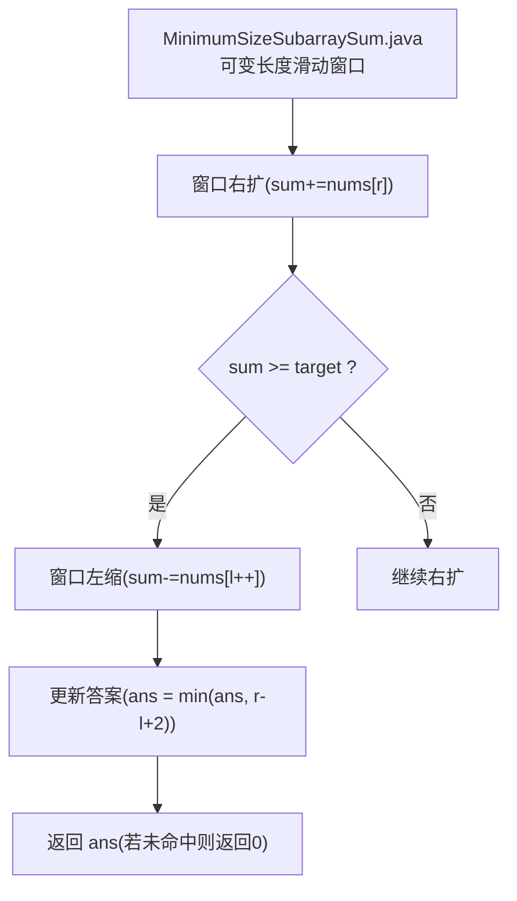
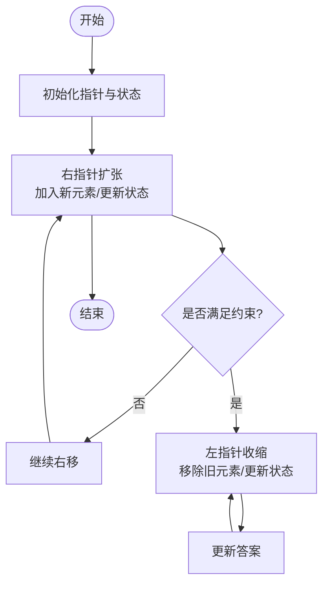
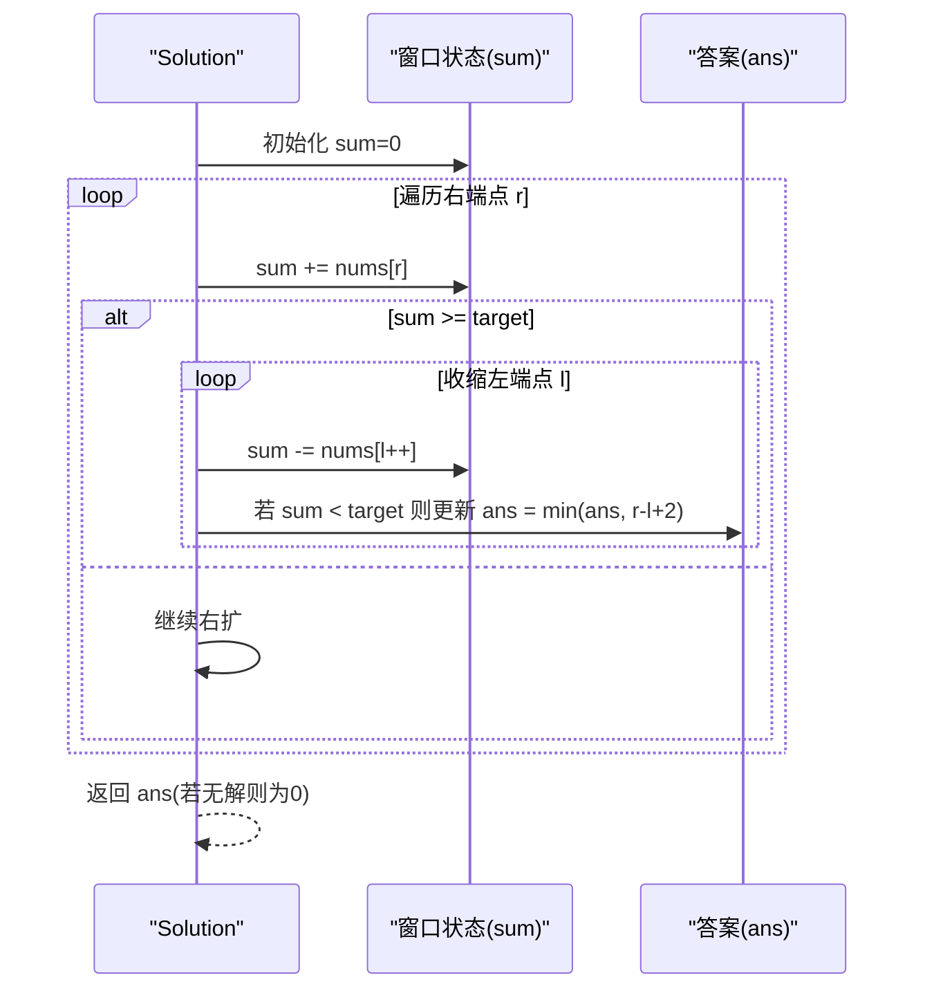
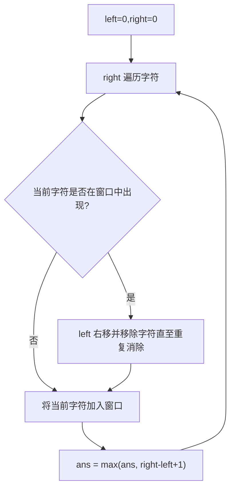
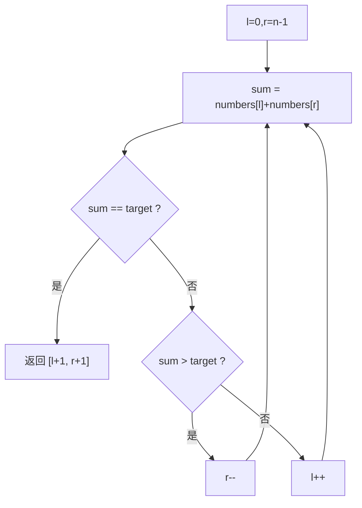
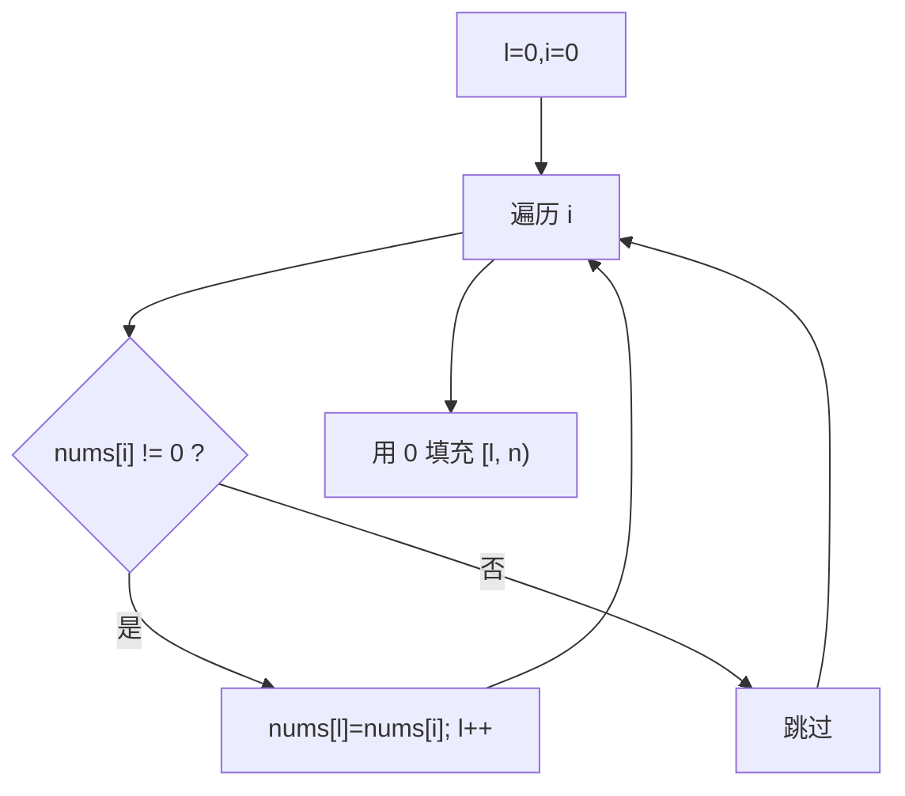
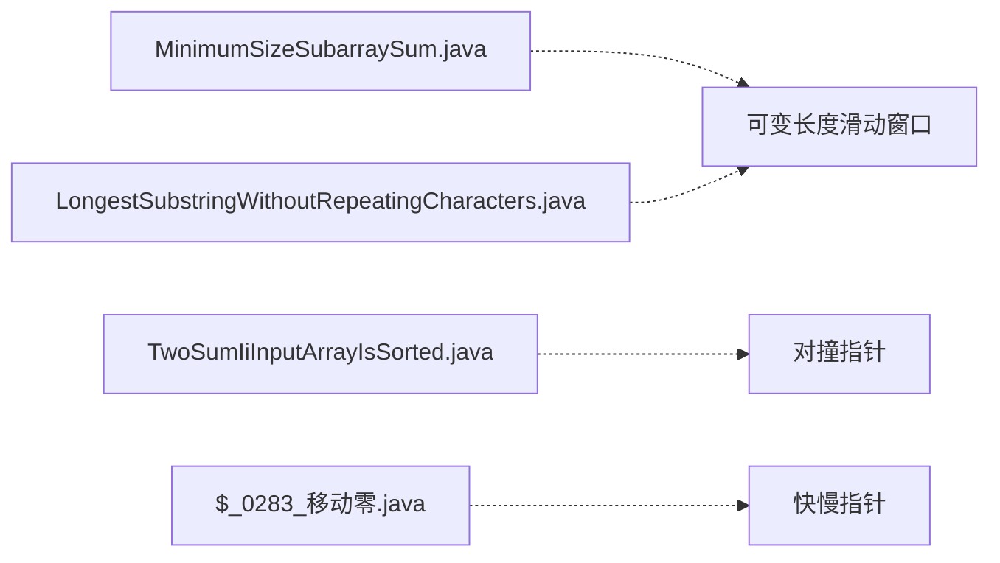

# 双指针与滑动窗口

<cite>
**本文引用的文件**   
- [MinimumSizeSubarraySum.java](file://src/main/java/leetcode/editor/cn/MinimumSizeSubarraySum.java)
- [LongestSubstringWithoutRepeatingCharacters.java](file://src/main/java/leetcode/editor/cn/LongestSubstringWithoutRepeatingCharacters.java)
- [TwoSumIiInputArrayIsSorted.java](file://src/main/java/leetcode/editor/cn/TwoSumIiInputArrayIsSorted.java)
- [$_0283_移动零.java](file://src/main/java/hot100/leetcode/editor/cn/$_0283_移动零.java)
</cite>

## 目录
1. [引言](#引言)
2. [项目结构](#项目结构)
3. [核心组件](#核心组件)
4. [架构总览](#架构总览)
5. [详细组件分析](#详细组件分析)
6. [依赖关系分析](#依赖关系分析)
7. [性能考量](#性能考量)
8. [故障排查指南](#故障排查指南)
9. [结论](#结论)
10. [附录](#附录)

## 引言
本文件围绕“双指针”和“滑动窗口”两大技术，系统梳理对撞指针、快慢指针两种模式，以及滑动窗口的固定长度与可变长度技巧。通过仓库中的经典题目（如 MinimumSizeSubarraySum）展示状态维护、边界处理与优化策略，并总结常见陷阱与调试方法，帮助读者快速建立可复用的解题模板。

## 项目结构
本项目按题号组织 Java 实现，每个题目一个类，内部包含 Solution 类与方法。与本文相关的代码集中在 leetcode.editor.cn 与 hot100.leetcode.editor.cn 两个包下：
- 滑动窗口（可变长度）：MinimumSizeSubarraySum.java、LongestSubstringWithoutRepeatingCharacters.java
- 对撞指针：TwoSumIiInputArrayIsSorted.java
- 快慢指针（原地重排/覆盖）：$_0283_移动零.java

**图示来源**
- [MinimumSizeSubarraySum.java:58-70](file://src/main/java/leetcode/editor/cn/MinimumSizeSubarraySum.java#L58-L70)

**章节来源**
- [MinimumSizeSubarraySum.java:58-70](file://src/main/java/leetcode/editor/cn/MinimumSizeSubarraySum.java#L58-L70)

## 核心组件
本节聚焦三类典型模式及其在本题库中的体现：
- 可变长度滑动窗口：以“满足条件时收缩左边界”为核心思想，适用于“最短/最长子数组/子串”等最值问题。
- 固定长度滑动窗口：窗口大小固定，仅右扩左缩同步推进，常用于“定长子数组均值/和”等问题。
- 对撞指针：左右指针相向而行，适合有序数组上的两数之和、三数之和等。
- 快慢指针：慢指针维护“合法区域”，快指针扫描推进，适合原地重排、去重等。

对应到仓库中的具体实现：
- 可变长度滑动窗口：MinimumSizeSubarraySum.java、LongestSubstringWithoutRepeatingCharacters.java
- 对撞指针：TwoSumIiInputArrayIsSorted.java
- 快慢指针：$_0283_移动零.java

**章节来源**
- [MinimumSizeSubarraySum.java:58-70](file://src/main/java/leetcode/editor/cn/MinimumSizeSubarraySum.java#L58-L70)
- [LongestSubstringWithoutRepeatingCharacters.java:57-70](file://src/main/java/leetcode/editor/cn/LongestSubstringWithoutRepeatingCharacters.java#L57-L70)
- [TwoSumIiInputArrayIsSorted.java:55-64](file://src/main/java/leetcode/editor/cn/TwoSumIiInputArrayIsSorted.java#L55-L64)
- [$_0283_移动零.java:13-22](file://src/main/java/hot100/leetcode/editor/cn/$_0283_移动零.java#L13-L22)

## 架构总览
从算法视角看，这些解法共享同一套“指针/窗口”抽象：
- 状态变量：窗口内和、计数表、答案等
- 扩张与收缩：右指针负责扩张，左指针负责收缩
- 终止条件：右指针到达末尾；或窗口不再满足约束
- 结果更新：在满足约束的窗口上计算最优值

[此图为概念性流程图，不直接映射具体源码，故无图示来源]

## 详细组件分析

### 可变长度滑动窗口：最小长度子数组之和
适用场景
- 正整数数组中，寻找和至少为 target 的最短连续子数组长度。

实现要点
- 维护窗口和 sum，右指针不断右扩；当 sum >= target 时，尝试收缩左边界，并在即将不满足条件时记录答案。
- 注意边界：当最终未找到可行窗口时返回 0。

复杂度
- 时间 O(n)，空间 O(1)。

关键流程示意

**图示来源**
- [MinimumSizeSubarraySum.java:58-70](file://src/main/java/leetcode/editor/cn/MinimumSizeSubarraySum.java#L58-L70)

**章节来源**
- [MinimumSizeSubarraySum.java:58-70](file://src/main/java/leetcode/editor/cn/MinimumSizeSubarraySum.java#L58-L70)

### 可变长度滑动窗口：不含重复字符的最长子串
适用场景
- 字符串中寻找不含重复字符的最长子串长度。

实现要点
- 使用布尔数组/哈希表维护窗口内字符出现情况；遇到重复则收缩左边界直到重复消除。
- 每次扩张后更新最大长度。

复杂度
- 时间 O(n)，空间 O(字符集大小)。

关键流程示意

**图示来源**
- [LongestSubstringWithoutRepeatingCharacters.java:57-70](file://src/main/java/leetcode/editor/cn/LongestSubstringWithoutRepeatingCharacters.java#L57-L70)

**章节来源**
- [LongestSubstringWithoutRepeatingCharacters.java:57-70](file://src/main/java/leetcode/editor/cn/LongestSubstringWithoutRepeatingCharacters.java#L57-L70)

### 对撞指针：有序数组的两数之和 II
适用场景
- 非递减数组中，找出和为目标值的两个数的下标（1-indexed）。

实现要点
- 左右指针分别指向首尾，根据当前和与目标的大小关系决定移动方向。
- 由于数组有序，该策略保证不会错过答案。

复杂度
- 时间 O(n)，空间 O(1)。

关键流程示意

**图示来源**
- [TwoSumIiInputArrayIsSorted.java:55-64](file://src/main/java/leetcode/editor/cn/TwoSumIiInputArrayIsSorted.java#L55-L64)

**章节来源**
- [TwoSumIiInputArrayIsSorted.java:55-64](file://src/main/java/leetcode/editor/cn/TwoSumIiInputArrayIsSorted.java#L55-L64)

### 快慢指针：移动零（原地重排）
适用场景
- 将数组中所有 0 移动到末尾，同时保持非零元素的相对顺序。

实现要点
- 慢指针 l 指向下一个非零元素应放置的位置；快指针 i 扫描数组，遇到非零则写入 l 并推进 l。
- 最后用 0 填充剩余位置。也可采用交换方式一次遍历完成。

复杂度
- 时间 O(n)，空间 O(1)。

关键流程示意

**图示来源**
- [$_0283_移动零.java:13-22](file://src/main/java/hot100/leetcode/editor/cn/$_0283_移动零.java#L13-L22)

**章节来源**
- [$_0283_移动零.java:13-22](file://src/main/java/hot100/leetcode/editor/cn/$_0283_移动零.java#L13-L22)

## 依赖关系分析
上述四类解法相互独立，各自封装于独立的类文件中，彼此无直接 import 依赖，耦合度低、内聚度高。它们共同体现了“指针/窗口”这一通用范式在不同问题上的适配。

[此图为概念性依赖图，不直接映射具体 import 关系，故无图示来源]

## 性能考量
- 时间复杂度
  - 滑动窗口与对撞指针通常达到 O(n)，因为每个元素最多被访问常数次。
  - 快慢指针同样线性时间，原地操作避免额外空间。
- 空间复杂度
  - 多数为 O(1) 或 O(字符集大小) 的常数级空间。
- 优化建议
  - 优先选择“右扩-收缩”的单循环结构，避免嵌套 for 导致 O(n^2)。
  - 对于频繁统计的问题，尽量使用数组/哈希表进行 O(1) 的状态更新。
  - 注意整型溢出风险（例如累加和），必要时使用更大类型或提前剪枝。

[本节为通用指导，不涉及具体文件分析]

## 故障排查指南
常见问题与定位思路
- 越界访问
  - 检查左右指针边界条件，确保在 while/for 中正确判断。
  - 参考路径：[MinimumSizeSubarraySum.java:58-70](file://src/main/java/leetcode/editor/cn/MinimumSizeSubarraySum.java#L58-L70)、[LongestSubstringWithoutRepeatingCharacters.java:57-70](file://src/main/java/leetcode/editor/cn/LongestSubstringWithoutRepeatingCharacters.java#L57-L70)
- 状态更新时机错误
  - 滑动窗口应在“即将不满足条件”或“刚满足条件”的明确时刻更新答案。
  - 参考路径：[MinimumSizeSubarraySum.java:62-67](file://src/main/java/leetcode/editor/cn/MinimumSizeSubarraySum.java#L62-L67)
- 对撞指针遗漏答案
  - 确认在 sum==target 时立即返回或记录答案，避免漏判。
  - 参考路径：[TwoSumIiInputArrayIsSorted.java:55-64](file://src/main/java/leetcode/editor/cn/TwoSumIiInputArrayIsSorted.java#L55-L64)
- 原地重排破坏顺序
  - 快慢指针需保证非零元素相对顺序不变，必要时采用交换而非覆盖。
  - 参考路径：[$_0283_移动零.java:13-22](file://src/main/java/hot100/leetcode/editor/cn/$_0283_移动零.java#L13-L22)

**章节来源**
- [MinimumSizeSubarraySum.java:58-70](file://src/main/java/leetcode/editor/cn/MinimumSizeSubarraySum.java#L58-L70)
- [LongestSubstringWithoutRepeatingCharacters.java:57-70](file://src/main/java/leetcode/editor/cn/LongestSubstringWithoutRepeatingCharacters.java#L57-L70)
- [TwoSumIiInputArrayIsSorted.java:55-64](file://src/main/java/leetcode/editor/cn/TwoSumIiInputArrayIsSorted.java#L55-L64)
- [$_0283_移动零.java:13-22](file://src/main/java/hot100/leetcode/editor/cn/$_0283_移动零.java#L13-L22)

## 结论
双指针与滑动窗口是解决“区间/子序列”问题的利器。掌握“右扩-收缩”的通用范式、明确状态维护与边界更新时机，即可高效应对大量变体。结合对撞指针与快慢指针，可在有序性与原地操作场景中进一步压缩时间与空间开销。

[本节为总结性内容，不涉及具体文件分析]

## 附录
- 模板速查
  - 可变长度滑动窗口
    - 右扩：加入新元素，更新状态
    - 收缩：while 不满足条件时，移除旧元素，更新状态
    - 更新答案：在满足条件的窗口上计算
  - 对撞指针
    - 初始化 l=0, r=n-1
    - 根据当前和/差与目标比较，移动较小或较大一侧
  - 快慢指针
    - 慢指针维护“合法前缀”，快指针扫描推进
    - 原地覆盖或交换，最后补齐剩余部分

[本节为通用模板说明，不涉及具体文件分析]