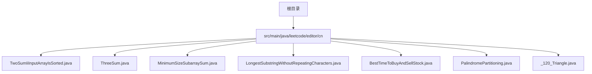
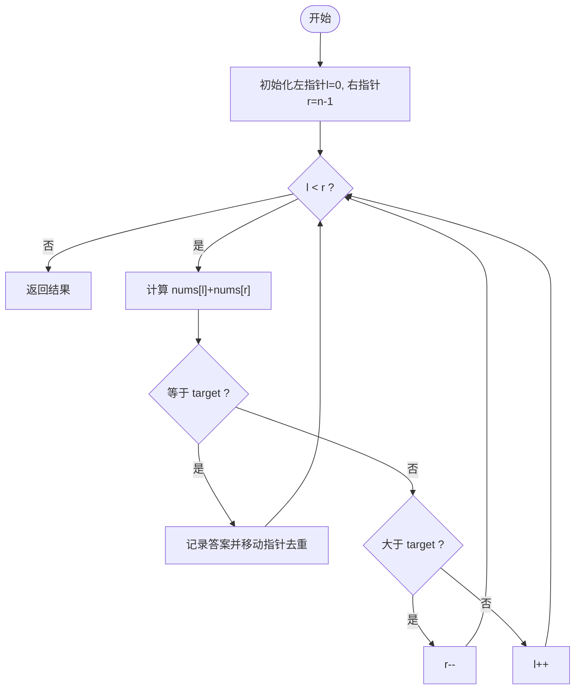
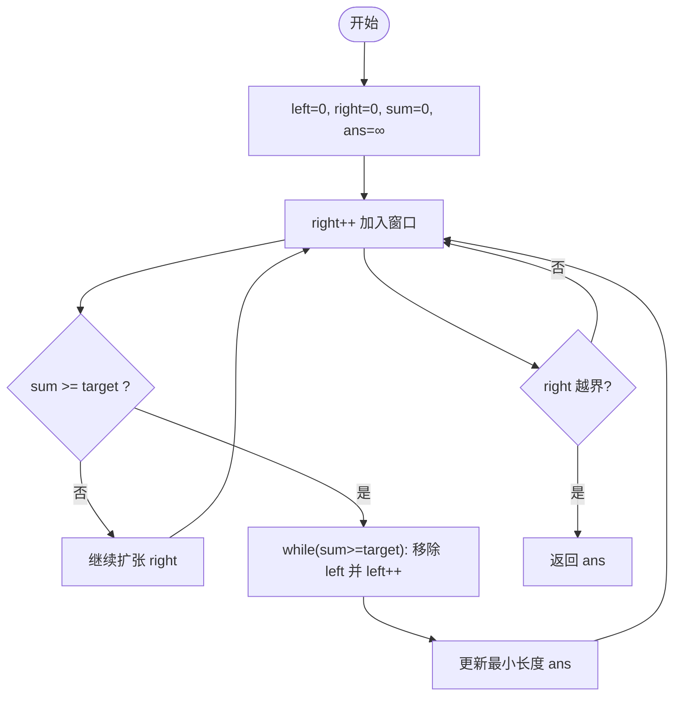
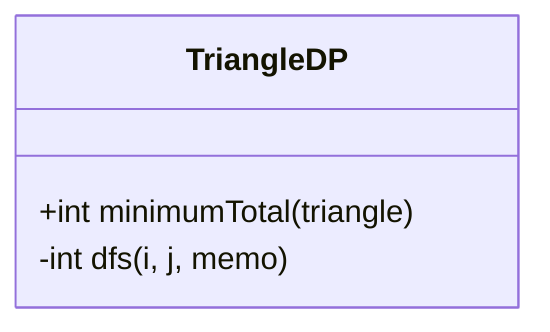
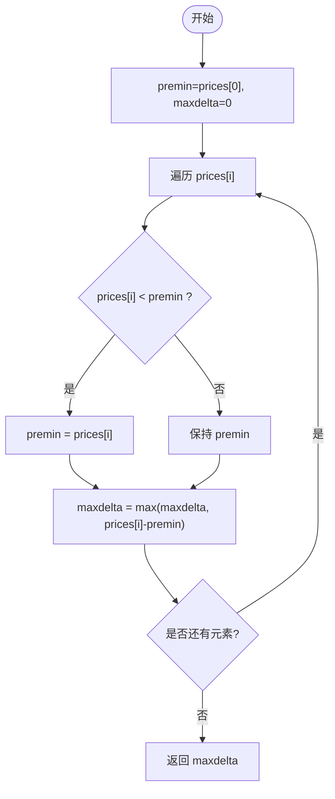
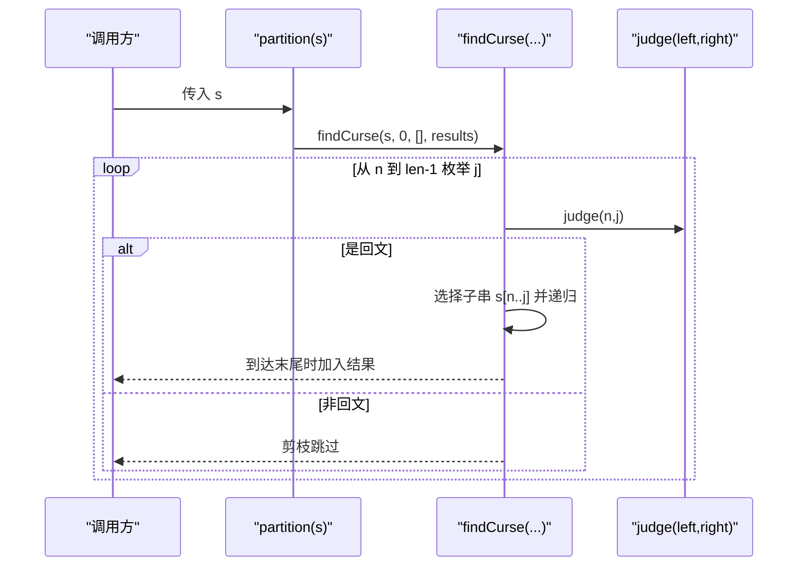
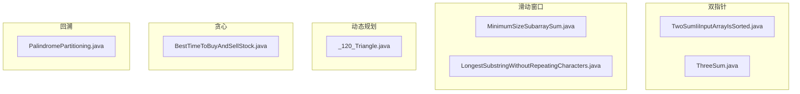
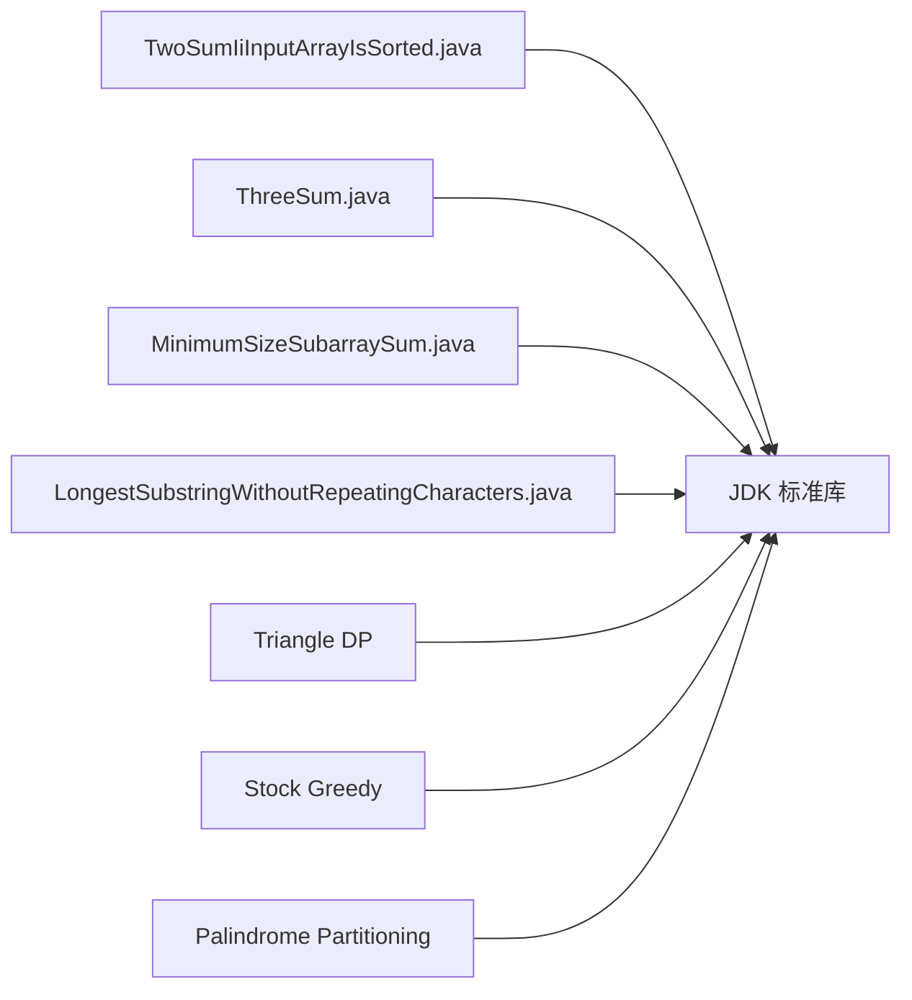

# 算法技术专题

<cite>
**本文引用的文件**   
- [README.md](file://README.md)
- [TwoSumIiInputArrayIsSorted.java](file://src/main/java/leetcode/editor/cn/TwoSumIiInputArrayIsSorted.java)
- [ThreeSum.java](file://src/main/java/leetcode/editor/cn/ThreeSum.java)
- [MinimumSizeSubarraySum.java](file://src/main/java/leetcode/editor/cn/MinimumSizeSubarraySum.java)
- [LongestSubstringWithoutRepeatingCharacters.java](file://src/main/java/leetcode/editor/cn/LongestSubstringWithoutRepeatingCharacters.java)
- [BestTimeToBuyAndSellStock.java](file://src/main/java/leetcode/editor/cn/BestTimeToBuyAndSellStock.java)
- [PalindromePartitioning.java](file://src/main/java/leetcode/editor/cn/PalindromePartitioning.java)
- [_120_Triangle.java](file://src/main/java/leetcode/editor/cn/_120_Triangle.java)
</cite>

## 目录
1. [引言](#引言)
2. [项目结构](#项目结构)
3. [核心组件](#核心组件)
4. [架构总览](#架构总览)
5. [详细组件分析](#详细组件分析)
6. [依赖分析](#依赖分析)
7. [性能考虑](#性能考虑)
8. [故障排查指南](#故障排查指南)
9. [结论](#结论)
10. [附录](#附录)

## 引言
本专题围绕LeetCode题解仓库中的典型实现，系统梳理双指针、滑动窗口、动态规划、贪心、回溯与分治等核心算法技术。内容涵盖：
- 适用场景与识别特征
- 常见实现模式与模板
- 复杂度分析与优化技巧
- 状态转移方程设计与递归关系建立
- 经典题目示例与代码路径定位
- 常见陷阱与解决方案

## 项目结构
仓库采用“按题号+文件名”组织，Java源码位于 src/main/java/leetcode/editor/cn 下，每个问题一个类，内部包含 Solution 类与方法；文档与说明在 doc 目录中（本专题主要基于源码进行分析）。

**图表来源** 
- [README.md:1-12](file://README.md#L1-L12)

**章节来源**
- [README.md:1-12](file://README.md#L1-L12)

## 核心组件
本节聚焦六大算法技术的代表性实现与要点，结合仓库中的具体题目进行讲解。

### 双指针（相向/同向）
- 适用场景
  - 有序数组上的两数/三数/四数之和
  - 原地修改数组、配对统计
- 实现模式
  - 相向指针：左右指针向中间收缩，依据当前和与目标的大小关系移动
  - 同向指针：快慢指针或固定步长推进
- 复杂度
  - 时间 O(n)~O(n^2)，空间 O(1)
- 示例与路径
  - 两数之和 II（有序数组）：[TwoSumIiInputArrayIsSorted.java](file://src/main/java/leetcode/editor/cn/TwoSumIiInputArrayIsSorted.java)
  - 三数之和：[ThreeSum.java](file://src/main/java/leetcode/editor/cn/ThreeSum.java)

**图表来源** 
- [TwoSumIiInputArrayIsSorted.java:54-65](file://src/main/java/leetcode/editor/cn/TwoSumIiInputArrayIsSorted.java#L54-L65)
- [ThreeSum.java:62-90](file://src/main/java/leetcode/editor/cn/ThreeSum.java#L62-L90)

**章节来源**
- [TwoSumIiInputArrayIsSorted.java:54-65](file://src/main/java/leetcode/editor/cn/TwoSumIiInputArrayIsSorted.java#L54-L65)
- [ThreeSum.java:62-90](file://src/main/java/leetcode/editor/cn/ThreeSum.java#L62-L90)

### 滑动窗口
- 适用场景
  - 子串/子数组的最值、计数、满足条件的最短/最长区间
- 实现模式
  - 右指针扩张窗口，条件不满足时左指针收缩
  - 使用哈希表/计数数组维护窗口内状态
- 复杂度
  - 时间 O(n)，空间 O(k)（k为字符集大小或不同元素个数）
- 示例与路径
  - 长度最小的子数组：[MinimumSizeSubarraySum.java](file://src/main/java/leetcode/editor/cn/MinimumSizeSubarraySum.java)
  - 无重复字符的最长子串：[LongestSubstringWithoutRepeatingCharacters.java](file://src/main/java/leetcode/editor/cn/LongestSubstringWithoutRepeatingCharacters.java)

**图表来源** 
- [MinimumSizeSubarraySum.java:57-71](file://src/main/java/leetcode/editor/cn/MinimumSizeSubarraySum.java#L57-L71)
- [LongestSubstringWithoutRepeatingCharacters.java:56-71](file://src/main/java/leetcode/editor/cn/LongestSubstringWithoutRepeatingCharacters.java#L56-L71)

**章节来源**
- [MinimumSizeSubarraySum.java:57-71](file://src/main/java/leetcode/editor/cn/MinimumSizeSubarraySum.java#L57-L71)
- [LongestSubstringWithoutRepeatingCharacters.java:56-71](file://src/main/java/leetcode/editor/cn/LongestSubstringWithoutRepeatingCharacters.java#L56-L71)

### 动态规划
- 适用场景
  - 最值/计数/存在性问题，具备最优子结构与重叠子问题
- 关键步骤
  - 定义状态 dp[i][...]
  - 写出状态转移方程
  - 确定边界与初始化
  - 选择自顶向下记忆化或自底向上递推
- 复杂度
  - 时间 O(状态数×转移代价)，空间可滚动优化
- 示例与路径
  - 三角形最小路径和（记忆化搜索）：[_120_Triangle.java](file://src/main/java/leetcode/editor/cn/_120_Triangle.java)

**图表来源** 
- [_120_Triangle.java:60-83](file://src/main/java/leetcode/editor/cn/_120_Triangle.java#L60-L83)

**章节来源**
- [_120_Triangle.java:60-83](file://src/main/java/leetcode/editor/cn/_120_Triangle.java#L60-L83)

### 贪心算法
- 适用场景
  - 局部最优能导出全局最优的问题（如股票买卖一次）
- 实现模式
  - 单遍扫描维护“历史最优/最小值”，实时更新答案
- 复杂度
  - 时间 O(n)，空间 O(1)
- 示例与路径
  - 买卖股票的最佳时机（一次交易）：[BestTimeToBuyAndSellStock.java](file://src/main/java/leetcode/editor/cn/BestTimeToBuyAndSellStock.java)

**图表来源** 
- [BestTimeToBuyAndSellStock.java:46-59](file://src/main/java/leetcode/editor/cn/BestTimeToBuyAndSellStock.java#L46-L59)

**章节来源**
- [BestTimeToBuyAndSellStock.java:46-59](file://src/main/java/leetcode/editor/cn/BestTimeToBuyAndSellStock.java#L46-L59)

### 回溯算法
- 适用场景
  - 枚举所有可行解（组合/排列/分割），需要剪枝优化
- 实现模式
  - 递归树深度优先搜索，进入前做选择，退出时撤销选择
  - 利用合法性判断提前剪枝
- 复杂度
  - 指数级，需通过剪枝降低常数
- 示例与路径
  - 字符串分割成回文串的所有方案：[PalindromePartitioning.java](file://src/main/java/leetcode/editor/cn/PalindromePartitioning.java)

**图表来源** 
- [PalindromePartitioning.java:41-73](file://src/main/java/leetcode/editor/cn/PalindromePartitioning.java#L41-L73)

**章节来源**
- [PalindromePartitioning.java:41-73](file://src/main/java/leetcode/editor/cn/PalindromePartitioning.java#L41-L73)

### 分治算法
- 适用场景
  - 可将问题划分为独立子问题，合并子问题解得到原问题解
- 实现模式
  - 分解→求解→合并；常配合归并排序、快速幂、线段树等
- 复杂度
  - 通常 T(n)=2T(n/2)+O(n) → O(n log n)
- 示例与路径
  - 本仓库未直接提供分治代表实现，建议参考归并排序、最大子数组（分治版）等经典题目

## 架构总览
下图展示各算法模块与对应题目的映射关系，便于快速定位与复习。

**图表来源** 
- [TwoSumIiInputArrayIsSorted.java:54-65](file://src/main/java/leetcode/editor/cn/TwoSumIiInputArrayIsSorted.java#L54-L65)
- [ThreeSum.java:62-90](file://src/main/java/leetcode/editor/cn/ThreeSum.java#L62-L90)
- [MinimumSizeSubarraySum.java:57-71](file://src/main/java/leetcode/editor/cn/MinimumSizeSubarraySum.java#L57-L71)
- [LongestSubstringWithoutRepeatingCharacters.java:56-71](file://src/main/java/leetcode/editor/cn/LongestSubstringWithoutRepeatingCharacters.java#L56-L71)
- [_120_Triangle.java:60-83](file://src/main/java/leetcode/editor/cn/_120_Triangle.java#L60-L83)
- [BestTimeToBuyAndSellStock.java:46-59](file://src/main/java/leetcode/editor/cn/BestTimeToBuyAndSellStock.java#L46-L59)
- [PalindromePartitioning.java:41-73](file://src/main/java/leetcode/editor/cn/PalindromePartitioning.java#L41-L73)

## 详细组件分析

### 双指针：两数之和 II（有序数组）
- 关键点
  - 利用有序性，相向指针根据和与目标比较移动
  - 注意返回下标为 1-based
- 复杂度
  - 时间 O(n)，空间 O(1)
- 常见陷阱
  - 忘记 1-based 下标转换
  - 循环终止条件写错导致死循环

**章节来源**
- [TwoSumIiInputArrayIsSorted.java:54-65](file://src/main/java/leetcode/editor/cn/TwoSumIiInputArrayIsSorted.java#L54-L65)

### 双指针：三数之和
- 关键点
  - 先排序，再固定 i，左右指针 l,r 寻找两数之和
  - 去重策略：对 i、l、r 分别跳过重复值
  - 剪枝：最小/最大可能和提前判断
- 复杂度
  - 时间 O(n^2)，空间 O(1)（不计输出）
- 常见陷阱
  - 去重逻辑不完整导致重复三元组
  - 边界条件 i<len-2 遗漏

**章节来源**
- [ThreeSum.java:62-90](file://src/main/java/leetcode/editor/cn/ThreeSum.java#L62-L90)

### 滑动窗口：长度最小的子数组
- 关键点
  - 右指针累加 sum，当 sum≥target 时尽量收缩左指针
  - 更新最小长度
- 复杂度
  - 时间 O(n)，空间 O(1)
- 常见陷阱
  - 收缩后更新长度的时机与边界处理
  - 不存在解时的返回值

**章节来源**
- [MinimumSizeSubarraySum.java:57-71](file://src/main/java/leetcode/editor/cn/MinimumSizeSubarraySum.java#L57-L71)

### 滑动窗口：无重复字符的最长子串
- 关键点
  - 用布尔数组/哈希表记录窗口内字符出现情况
  - 遇到重复则收缩左指针直到无重复
- 复杂度
  - 时间 O(n)，空间 O(字符集大小)
- 常见陷阱
  - 收缩时只删除到重复字符为止，避免过度收缩

**章节来源**
- [LongestSubstringWithoutRepeatingCharacters.java:56-71](file://src/main/java/leetcode/editor/cn/LongestSubstringWithoutRepeatingCharacters.java#L56-L71)

### 动态规划：三角形最小路径和（记忆化搜索）
- 关键点
  - 状态：dp(i,j) 表示从 (i,j) 到底的最小路径和
  - 转移：dp(i,j)=triangle[i][j]+min(dp(i+1,j), dp(i+1,j+1))
  - 边界：最后一行直接取值
  - 记忆化避免重复计算
- 复杂度
  - 时间 O(n^2)，空间 O(n^2)（可滚动优化至 O(n)）
- 常见陷阱
  - 索引越界与 memo 初始化值选择不当

**章节来源**
- [_120_Triangle.java:60-83](file://src/main/java/leetcode/editor/cn/_120_Triangle.java#L60-L83)

### 贪心：买卖股票的最佳时机（一次交易）
- 关键点
  - 维护历史最低价格 premin，每日计算利润并更新最大值
- 复杂度
  - 时间 O(n)，空间 O(1)
- 常见陷阱
  - 初始值设置与空数组边界

**章节来源**
- [BestTimeToBuyAndSellStock.java:46-59](file://src/main/java/leetcode/editor/cn/BestTimeToBuyAndSellStock.java#L46-L59)

### 回溯：字符串分割成回文串
- 关键点
  - 从当前位置 n 开始枚举结束位置 j，若 s[n..j] 是回文则选择并递归
  - 到达末尾时将当前分割方案加入结果
  - 回文判断可用双指针
- 复杂度
  - 时间 O(n·2^n) 量级，实际受回文剪枝影响
- 常见陷阱
  - 复制路径时浅拷贝导致引用污染
  - 回文判断的边界与奇偶长度处理

**章节来源**
- [PalindromePartitioning.java:41-73](file://src/main/java/leetcode/editor/cn/PalindromePartitioning.java#L41-L73)

## 依赖分析
- 模块内聚性
  - 每个问题独立成类，职责单一，内聚性好
- 外部依赖
  - 仅使用标准库（集合、数组、数学函数等），无第三方依赖
- 耦合度
  - 模块间几乎无相互引用，便于扩展与维护

**图表来源** 
- [TwoSumIiInputArrayIsSorted.java:54-65](file://src/main/java/leetcode/editor/cn/TwoSumIiInputArrayIsSorted.java#L54-L65)
- [ThreeSum.java:62-90](file://src/main/java/leetcode/editor/cn/ThreeSum.java#L62-L90)
- [MinimumSizeSubarraySum.java:57-71](file://src/main/java/leetcode/editor/cn/MinimumSizeSubarraySum.java#L57-L71)
- [LongestSubstringWithoutRepeatingCharacters.java:56-71](file://src/main/java/leetcode/editor/cn/LongestSubstringWithoutRepeatingCharacters.java#L56-L71)
- [_120_Triangle.java:60-83](file://src/main/java/leetcode/editor/cn/_120_Triangle.java#L60-L83)
- [BestTimeToBuyAndSellStock.java:46-59](file://src/main/java/leetcode/editor/cn/BestTimeToBuyAndSellStock.java#L46-L59)
- [PalindromePartitioning.java:41-73](file://src/main/java/leetcode/editor/cn/PalindromePartitioning.java#L41-L73)

## 性能考虑
- 双指针
  - 优先利用有序性或单调性减少搜索空间
  - 注意去重与剪枝，避免 O(n^2) 退化
- 滑动窗口
  - 窗口状态更新尽量 O(1)，必要时用定长数组替代 Map
  - 收缩条件要精确，避免漏更新或重复更新
- 动态规划
  - 优先自底向上递推，减少递归开销
  - 状态压缩与滚动数组降低空间
- 贪心
  - 严格证明局部最优可导出全局最优
  - 注意边界与初始值
- 回溯
  - 尽早剪枝（如回文判断、可行性检查）
  - 路径复制与撤销选择要正确

## 故障排查指南
- 双指针
  - 症状：死循环或错过答案
  - 排查：确认循环条件与指针移动方向；检查 1-based/0-based 下标
- 滑动窗口
  - 症状：结果偏大/偏小或超时
  - 排查：收缩逻辑是否正确；窗口状态更新是否在合适时机
- 动态规划
  - 症状：栈溢出或错误答案
  - 排查：memo 初始化值是否合理；边界是否覆盖；转移是否完备
- 贪心
  - 症状：样例通过但提交失败
  - 排查：反例构造；是否满足贪心选择性/最优子结构
- 回溯
  - 症状：重复解或内存不足
  - 排查：去重策略；路径复制方式；剪枝是否充分

## 结论
本专题以仓库中的典型实现为载体，系统化总结了双指针、滑动窗口、动态规划、贪心、回溯与分治的核心思想与实践要点。建议在掌握模板的基础上，结合题目约束与性质灵活调整，并通过复杂度分析与边界测试提升鲁棒性。

## 附录
- 学习路线建议
  - 先掌握双指针与滑动窗口，再过渡到动态规划与回溯
  - 贪心需配合严谨的证明与反例验证
  - 分治适合理解递归与合并过程，常作为进阶训练
- 相关题目清单（节选）
  - 双指针：两数之和 II、三数之和
  - 滑动窗口：长度最小的子数组、无重复字符的最长子串
  - 动态规划：三角形最小路径和
  - 贪心：买卖股票的最佳时机
  - 回溯：字符串分割成回文串