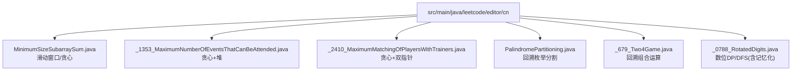
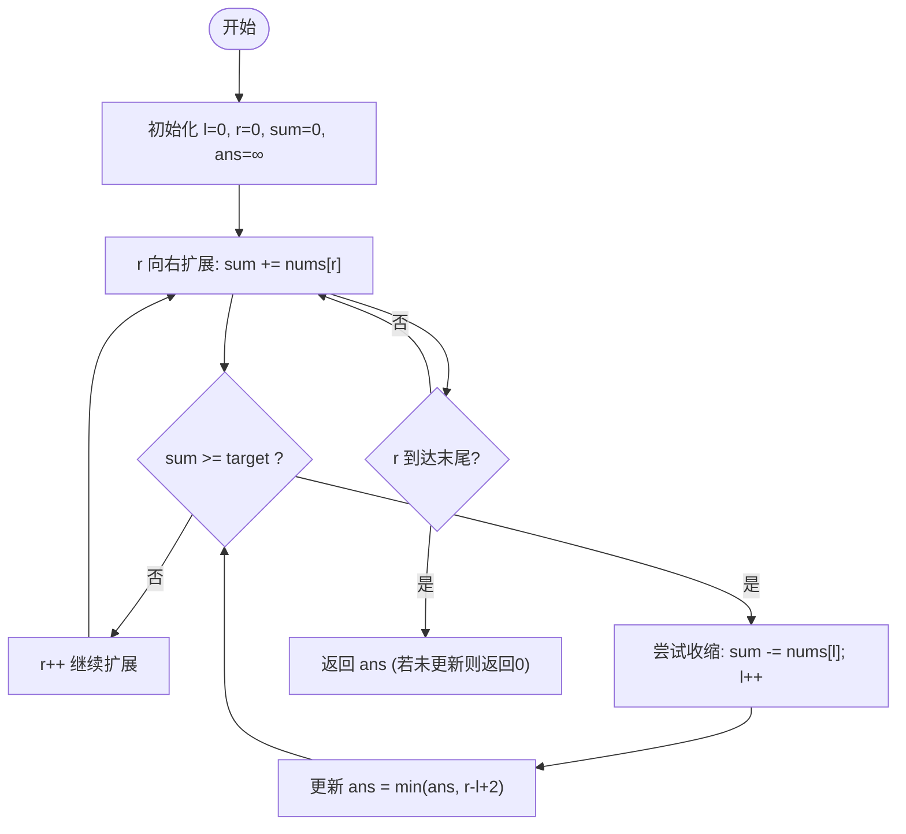
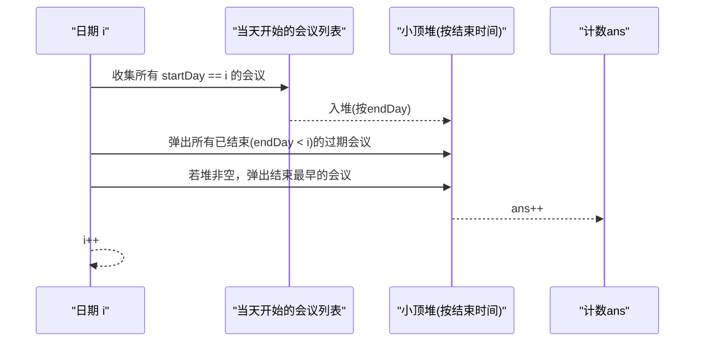
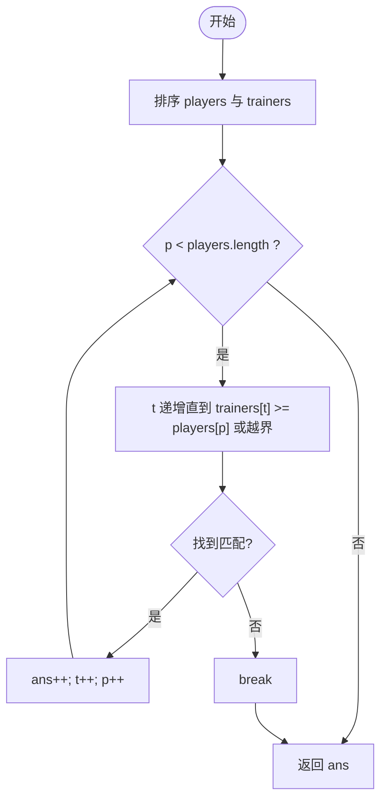
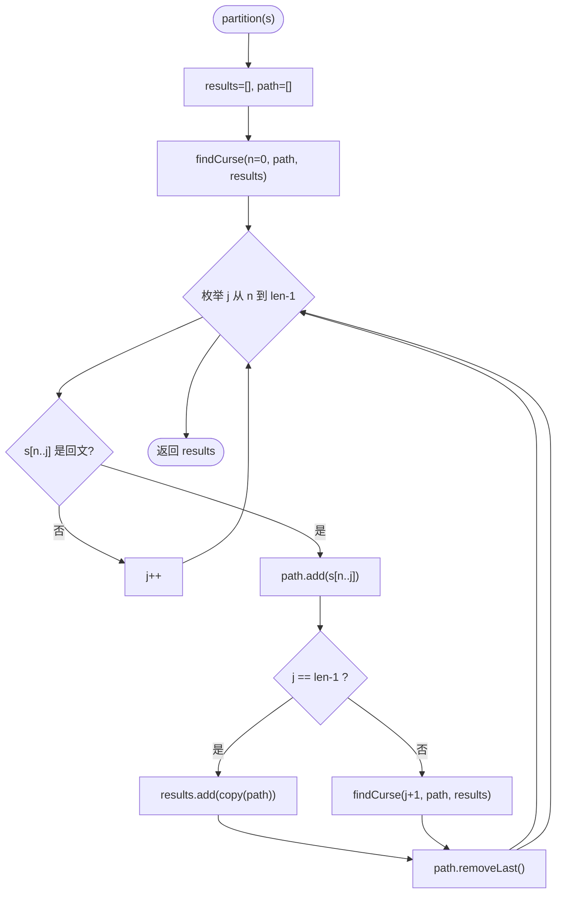
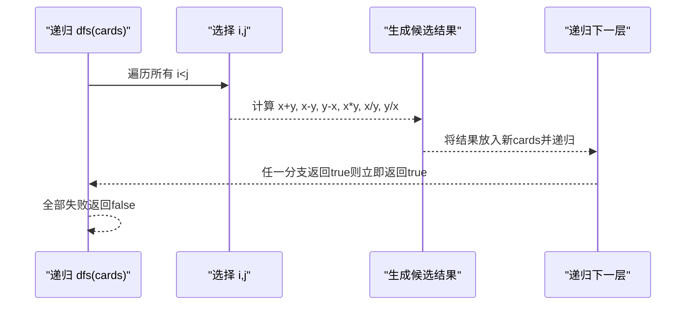
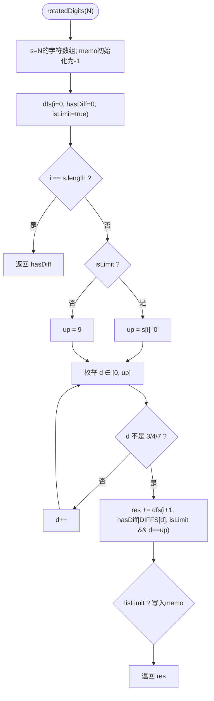
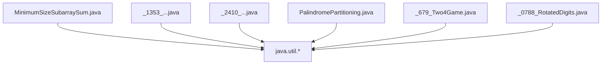

# 贪心与回溯算法

<cite>
**本文引用的文件**   
- [MinimumSizeSubarraySum.java](file://src/main/java/leetcode/editor/cn/MinimumSizeSubarraySum.java)
- [_1353_MaximumNumberOfEventsThatCanBeAttended.java](file://src/main/java/leetcode/editor/cn/_1353_MaximumNumberOfEventsThatCanBeAttended.java)
- [_2410_MaximumMatchingOfPlayersWithTrainers.java](file://src/main/java/leetcode/editor/cn/_2410_MaximumMatchingOfPlayersWithTrainers.java)
- [PalindromePartitioning.java](file://src/main/java/leetcode/editor/cn/PalindromePartitioning.java)
- [_679_Two4Game.java](file://src/main/java/leetcode/editor/cn/_679_Two4Game.java)
- [_0788_RotatedDigits.java](file://src/main/java/leetcode/editor/cn/_0788_RotatedDigits.java)
</cite>

## 目录
1. [简介](#简介)
2. [项目结构](#项目结构)
3. [核心组件](#核心组件)
4. [架构总览](#架构总览)
5. [详细组件分析](#详细组件分析)
6. [依赖分析](#依赖分析)
7. [性能考虑](#性能考虑)
8. [故障排查指南](#故障排查指南)
9. [结论](#结论)
10. [附录](#附录)

## 简介
本技术文档聚焦于LeetCode题解仓库中的“贪心算法”和“回溯算法”两大主题，结合具体题目实现进行系统化讲解：
- 贪心算法：强调局部最优选择策略、正确性证明思路（交换论证/反证法）、典型模式（排序+双指针、优先队列、滑动窗口）。
- 回溯算法：强调搜索空间建模、状态表示、递归终止条件、剪枝优化（可行性剪枝、最优性剪枝、重复分支去重等），以及常见模板。

通过以下代表性题目展示两种算法的应用场景与实现模式，并给出复杂度分析与优化建议。

## 项目结构
本项目为Java实现的LeetCode题解集合，按题目维度组织源码。与本文相关的代码位于 leetcode.editor.cn 包下，每个题目一个文件，内部包含 Solution 类或相关数据结构实现。



图表来源
- [MinimumSizeSubarraySum.java:1-74](file://src/main/java/leetcode/editor/cn/MinimumSizeSubarraySum.java#L1-L74)
- [_1353_MaximumNumberOfEventsThatCanBeAttended.java:1-89](file://src/main/java/leetcode/editor/cn/_1353_MaximumNumberOfEventsThatCanBeAttended.java#L1-L89)
- [_2410_MaximumMatchingOfPlayersWithTrainers.java:1-75](file://src/main/java/leetcode/editor/cn/_2410_MaximumMatchingOfPlayersWithTrainers.java#L1-L75)
- [PalindromePartitioning.java:1-76](file://src/main/java/leetcode/editor/cn/PalindromePartitioning.java#L1-L76)
- [_679_Two4Game.java:1-118](file://src/main/java/leetcode/editor/cn/_679_Two4Game.java#L1-L118)
- [_0788_RotatedDigits.java:1-75](file://src/main/java/leetcode/editor/cn/_0788_RotatedDigits.java#L1-L75)

章节来源
- [MinimumSizeSubarraySum.java:1-74](file://src/main/java/leetcode/editor/cn/MinimumSizeSubarraySum.java#L1-L74)
- [_1353_MaximumNumberOfEventsThatCanBeAttended.java:1-89](file://src/main/java/leetcode/editor/cn/_1353_MaximumNumberOfEventsThatCanBeAttended.java#L1-L89)
- [_2410_MaximumMatchingOfPlayersWithTrainers.java:1-75](file://src/main/java/leetcode/editor/cn/_2410_MaximumMatchingOfPlayersWithTrainers.java#L1-L75)
- [PalindromePartitioning.java:1-76](file://src/main/java/leetcode/editor/cn/PalindromePartitioning.java#L1-L76)
- [_679_Two4Game.java:1-118](file://src/main/java/leetcode/editor/cn/_679_Two4Game.java#L1-L118)
- [_0788_RotatedDigits.java:1-75](file://src/main/java/leetcode/editor/cn/_0788_RotatedDigits.java#L1-L75)

## 核心组件
本节从“贪心”和“回溯”两个维度，提炼出可复用的解题模式与关键要点。

- 贪心模式
  - 排序+双指针：将问题规约为有序序列上的选择问题，利用单调性推进指针。
  - 优先队列（最小堆/最大堆）：在“尽早结束/最早可用”的约束下，维护候选集的最优端点。
  - 滑动窗口：对连续子数组/子串问题，用左右指针维护可行区间并进行收缩。
- 回溯模式
  - 状态表示：通常包括当前索引、已选元素集合、路径、额外标志位（如是否受限、是否满足某性质）。
  - 递归终止：到达边界时判定是否构成合法解并记录结果。
  - 剪枝：可行性剪枝（提前判断不可行）、最优性剪枝（上界/下界估计）、重复分支去重（排序+跳过相同元素）。

章节来源
- [MinimumSizeSubarraySum.java:57-71](file://src/main/java/leetcode/editor/cn/MinimumSizeSubarraySum.java#L57-L71)
- [_1353_MaximumNumberOfEventsThatCanBeAttended.java:57-86](file://src/main/java/leetcode/editor/cn/_1353_MaximumNumberOfEventsThatCanBeAttended.java#L57-L86)
- [_2410_MaximumMatchingOfPlayersWithTrainers.java:53-72](file://src/main/java/leetcode/editor/cn/_2410_MaximumMatchingOfPlayersWithTrainers.java#L53-L72)
- [PalindromePartitioning.java:41-70](file://src/main/java/leetcode/editor/cn/PalindromePartitioning.java#L41-L70)
- [_679_Two4Game.java:67-115](file://src/main/java/leetcode/editor/cn/_679_Two4Game.java#L67-L115)
- [_0788_RotatedDigits.java:39-70](file://src/main/java/leetcode/editor/cn/_0788_RotatedDigits.java#L39-L70)

## 架构总览
下图展示了各题目的方法调用关系与数据流向，体现贪心与回溯在不同题目中的组织方式。

```mermaid
graph LR
subgraph "贪心"
MS["MinimumSizeSubarraySum.minSubArrayLen"] --> SW["滑动窗口收缩"]
ME["_1353...maxEvents"] --> PQ["优先队列(小顶堆)"]
MT["_2410...matchPlayersAndTrainers"] --> DP["排序+双指针"]
end
subgraph "回溯"
PP["PalindromePartitioning.partition"] --> DFS1["findCurse(枚举分割点)"]
T24["_679_Two4Game.judgePoint24"] --> DFS2["dfs(两两合并)"]
RD["_0788_RotatedDigits.rotatedDigits"] --> DFS3["dfs(数位枚举+记忆化)"]
end
MS --> |O(n)| 输出A["长度最小的子数组长度"]
ME --> |O(n log n)| 输出B["最多参加的会议数"]
MT --> |O(n log n)| 输出C["最大匹配数"]
PP --> |指数级| 输出D["所有回文分割方案"]
T24 --> |指数级| 输出E["能否得到24"]
RD --> |多项式| 输出F["好数个数"]
```

图表来源
- [MinimumSizeSubarraySum.java:57-71](file://src/main/java/leetcode/editor/cn/MinimumSizeSubarraySum.java#L57-L71)
- [_1353_MaximumNumberOfEventsThatCanBeAttended.java:57-86](file://src/main/java/leetcode/editor/cn/_1353_MaximumNumberOfEventsThatCanBeAttended.java#L57-L86)
- [_2410_MaximumMatchingOfPlayersWithTrainers.java:53-72](file://src/main/java/leetcode/editor/cn/_2410_MaximumMatchingOfPlayersWithTrainers.java#L53-L72)
- [PalindromePartitioning.java:41-70](file://src/main/java/leetcode/editor/cn/PalindromePartitioning.java#L41-L70)
- [_679_Two4Game.java:67-115](file://src/main/java/leetcode/editor/cn/_679_Two4Game.java#L67-L115)
- [_0788_RotatedDigits.java:39-70](file://src/main/java/leetcode/editor/cn/_0788_RotatedDigits.java#L39-L70)

## 详细组件分析

### 贪心：最小长度子数组（滑动窗口）
- 问题要点：寻找和≥target的最短连续子数组长度。
- 贪心/窗口策略：右指针扩张窗口累加和；当满足条件时，左指针尽可能收缩以更新答案。
- 正确性直觉：固定右端点时，左端点越靠右，窗口越小且仍满足条件的可能性越大；因此“能缩就缩”是局部最优，最终得到全局最优。
- 复杂度：时间 O(n)，空间 O(1)。



图表来源
- [MinimumSizeSubarraySum.java:57-71](file://src/main/java/leetcode/editor/cn/MinimumSizeSubarraySum.java#L57-L71)

章节来源
- [MinimumSizeSubarraySum.java:57-71](file://src/main/java/leetcode/editor/cn/MinimumSizeSubarraySum.java#L57-L71)

### 贪心：最多参加的会议数（优先队列）
- 问题要点：每天只能参加一场会议，求最大可参加数量。
- 贪心策略：按天扫描，将所有当天开始的会议加入“最小堆”（按结束时间）；每天优先选择结束最早的会议，保证释放资源更早，从而为后续留出更多机会。
- 正确性证明思路（交换论证）：假设在某天存在更优解没有选择结束最早的会议，而是选择了结束更晚的会议，可将两者交换而不减少后续可选集合，从而不劣于原解。
- 复杂度：时间 O(n log n + T log n)（T为最大天数），空间 O(n)。



图表来源
- [_1353_MaximumNumberOfEventsThatCanBeAttended.java:57-86](file://src/main/java/leetcode/editor/cn/_1353_MaximumNumberOfEventsThatCanBeAttended.java#L57-L86)

章节来源
- [_1353_MaximumNumberOfEventsThatCanBeAttended.java:57-86](file://src/main/java/leetcode/editor/cn/_1353_MaximumNumberOfEventsThatCanBeAttended.java#L57-L86)

### 贪心：运动员与训练师的最大匹配（排序+双指针）
- 问题要点：每位运动员能力≤训练师能力即可匹配，求最大匹配数。
- 贪心策略：将双方都从小到大排序，依次尝试用当前最弱的运动员匹配当前可用的最弱训练师；若匹配成功，二者均前进；否则仅训练师前进。
- 正确性直觉：若当前最弱运动员能被某个训练师匹配，选择“刚好能匹配”的训练师不会比选择更强的训练师更差（后者可能浪费更强资源）。
- 复杂度：时间 O(n log n + m log m)，空间 O(1)。



图表来源
- [_2410_MaximumMatchingOfPlayersWithTrainers.java:53-72](file://src/main/java/leetcode/editor/cn/_2410_MaximumMatchingOfPlayersWithTrainers.java#L53-L72)

章节来源
- [_2410_MaximumMatchingOfPlayersWithTrainers.java:53-72](file://src/main/java/leetcode/editor/cn/_2410_MaximumMatchingOfPlayersWithTrainers.java#L53-L72)

### 回溯：字符串的所有回文分割
- 问题要点：将字符串分割成若干子串，使每个子串都是回文，返回所有方案。
- 状态表示：当前起始位置 n、当前路径 findStrs、结果集 results。
- 递归过程：从 n 起枚举分割点 j，若 s[n..j] 是回文，则将其加入路径并递归至 j+1；到达末尾时记录结果。
- 剪枝：仅在子串为回文时才继续递归（可行性剪枝）。
- 复杂度：最坏指数级（取决于回文分割数量），每次判回文可 O(k) 或预处理 O(1)。



图表来源
- [PalindromePartitioning.java:41-70](file://src/main/java/leetcode/editor/cn/PalindromePartitioning.java#L41-L70)

章节来源
- [PalindromePartitioning.java:41-70](file://src/main/java/leetcode/editor/cn/PalindromePartitioning.java#L41-L70)

### 回溯：24点游戏（两两合并）
- 问题要点：给定4个数字，使用四则运算与括号，判断是否能得到24。
- 状态表示：当前剩余数字集合 cards。
- 递归过程：任选两张牌 x,y，计算所有可能的二元运算结果，替换为一张新牌后递归；当只剩一张牌时判断是否为24（浮点误差容差）。
- 剪枝：除法前检查分母不为0；数值接近24时可提前返回。
- 复杂度：常数规模但分支较多，整体近似指数级。



图表来源
- [_679_Two4Game.java:67-115](file://src/main/java/leetcode/editor/cn/_679_Two4Game.java#L67-L115)

章节来源
- [_679_Two4Game.java:67-115](file://src/main/java/leetcode/editor/cn/_679_Two4Game.java#L67-L115)

### 回溯/数位DP：旋转数（含记忆化）
- 问题要点：统计[1,N]中“好数”的数量（每位旋转后仍有效且与原数不同）。
- 状态表示：当前位置 i、是否已经出现“会变化”的数字 hasDiff、是否受上限限制 isLimit、目标上界字符数组 s、记忆化表 memo。
- 递归过程：逐位枚举 d∈[0, up]，过滤非法数字（3/4/7），更新 hasDiff 与 isLimit，递归至下一位；到达末尾时根据 hasDiff 返回贡献。
- 剪枝/优化：记忆化（isLimit=false的状态复用），非法数字直接跳过。
- 复杂度：O(位数×状态数)，多项式级别。



图表来源
- [_0788_RotatedDigits.java:39-70](file://src/main/java/leetcode/editor/cn/_0788_RotatedDigits.java#L39-L70)

章节来源
- [_0788_RotatedDigits.java:39-70](file://src/main/java/leetcode/editor/cn/_0788_RotatedDigits.java#L39-L70)

## 依赖分析
- 外部依赖
  - 标准库：java.util.Arrays、java.util.PriorityQueue、java.util.List、java.util.ArrayList、java.util.Map、java.util.HashMap 等。
- 内部耦合
  - 各题目相互独立，无跨文件依赖；Solution 类内方法间通过参数传递状态，保持高内聚低耦合。
- 循环依赖
  - 未发现循环依赖。



图表来源
- [MinimumSizeSubarraySum.java:1-74](file://src/main/java/leetcode/editor/cn/MinimumSizeSubarraySum.java#L1-L74)
- [_1353_MaximumNumberOfEventsThatCanBeAttended.java:1-89](file://src/main/java/leetcode/editor/cn/_1353_MaximumNumberOfEventsThatCanBeAttended.java#L1-L89)
- [_2410_MaximumMatchingOfPlayersWithTrainers.java:1-75](file://src/main/java/leetcode/editor/cn/_2410_MaximumMatchingOfPlayersWithTrainers.java#L1-L75)
- [PalindromePartitioning.java:1-76](file://src/main/java/leetcode/editor/cn/PalindromePartitioning.java#L1-L76)
- [_679_Two4Game.java:1-118](file://src/main/java/leetcode/editor/cn/_679_Two4Game.java#L1-L118)
- [_0788_RotatedDigits.java:1-75](file://src/main/java/leetcode/editor/cn/_0788_RotatedDigits.java#L1-L75)

章节来源
- [MinimumSizeSubarraySum.java:1-74](file://src/main/java/leetcode/editor/cn/MinimumSizeSubarraySum.java#L1-L74)
- [_1353_MaximumNumberOfEventsThatCanBeAttended.java:1-89](file://src/main/java/leetcode/editor/cn/_1353_MaximumNumberOfEventsThatCanBeAttended.java#L1-L89)
- [_2410_MaximumMatchingOfPlayersWithTrainers.java:1-75](file://src/main/java/leetcode/editor/cn/_2410_MaximumMatchingOfPlayersWithTrainers.java#L1-L75)
- [PalindromePartitioning.java:1-76](file://src/main/java/leetcode/editor/cn/PalindromePartitioning.java#L1-L76)
- [_679_Two4Game.java:1-118](file://src/main/java/leetcode/editor/cn/_679_Two4Game.java#L1-L118)
- [_0788_RotatedDigits.java:1-75](file://src/main/java/leetcode/editor/cn/_0788_RotatedDigits.java#L1-L75)

## 性能考虑
- 贪心
  - 滑动窗口：确保左右指针均只向前移动，避免重复扫描；注意边界更新时机。
  - 优先队列：尽量批量入队后再统一处理过期项；合理设置比较器以降低比较开销。
  - 排序+双指针：先排序再线性扫描，避免嵌套循环导致的平方复杂度。
- 回溯
  - 剪枝优先：在递归入口尽早判断不可行分支并返回。
  - 状态压缩与记忆化：对于可重叠子问题（如数位DP），使用 memo 缓存结果。
  - 避免不必要的对象创建：在深拷贝路径时评估开销，必要时使用可回退的数据结构。
  - 浮点精度：涉及除法时使用 EPS 容差，避免精度陷阱导致错误分支。

## 故障排查指南
- 贪心
  - 滑动窗口边界：更新答案的时机需严格对应“收缩后的窗口”，避免多算或少算。
  - 优先队列过期清理：必须在取堆顶前清理过期元素，防止误计。
  - 双指针顺序：确保在无法匹配时仅移动训练师指针，避免漏配。
- 回溯
  - 回文判定：注意奇偶中心对称的边界条件，避免越界。
  - 24点除法：除零保护与浮点比较必须到位。
  - 数位DP记忆化：仅在 isLimit=false 时写回 memo，避免污染受限状态。

章节来源
- [MinimumSizeSubarraySum.java:57-71](file://src/main/java/leetcode/editor/cn/MinimumSizeSubarraySum.java#L57-L71)
- [_1353_MaximumNumberOfEventsThatCanBeAttended.java:57-86](file://src/main/java/leetcode/editor/cn/_1353_MaximumNumberOfEventsThatCanBeAttended.java#L57-L86)
- [_2410_MaximumMatchingOfPlayersWithTrainers.java:53-72](file://src/main/java/leetcode/editor/cn/_2410_MaximumMatchingOfPlayersWithTrainers.java#L53-L72)
- [PalindromePartitioning.java:41-70](file://src/main/java/leetcode/editor/cn/PalindromePartitioning.java#L41-L70)
- [_679_Two4Game.java:67-115](file://src/main/java/leetcode/editor/cn/_679_Two4Game.java#L67-L115)
- [_0788_RotatedDigits.java:39-70](file://src/main/java/leetcode/editor/cn/_0788_RotatedDigits.java#L39-L70)

## 结论
- 贪心算法的关键在于“可证明的局部最优选择”。通过排序、堆或滑动窗口等工具，将复杂问题转化为单调性或早结束优势的选择。
- 回溯算法的核心在于“清晰的搜索空间建模与强力的剪枝”。良好的状态表示与终止条件配合可行性/最优性剪枝，能在指数级搜索空间中高效定位解。
- 在实际工程中，优先尝试贪心；若无法证明或构造贪心策略，再转向回溯/动态规划，并结合记忆化等手段优化。

## 附录
- 术语速查
  - 局部最优：在当前决策点上做出看似最好的选择。
  - 交换论证：通过交换两个选择的顺序来证明某种贪心策略不会变差。
  - 可行性剪枝：在搜索过程中提前丢弃不可能产生解的分支。
  - 最优性剪枝：基于上下界估计提前剪掉不可能优于当前最优的分支。
  - 记忆化：缓存已计算的子问题结果以避免重复计算。