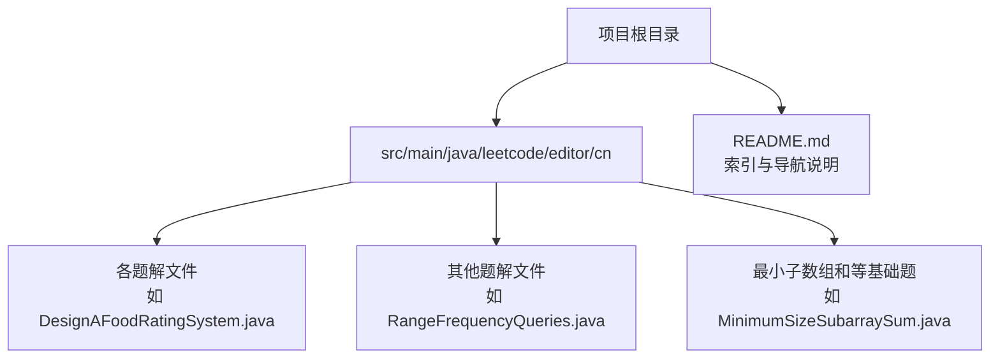
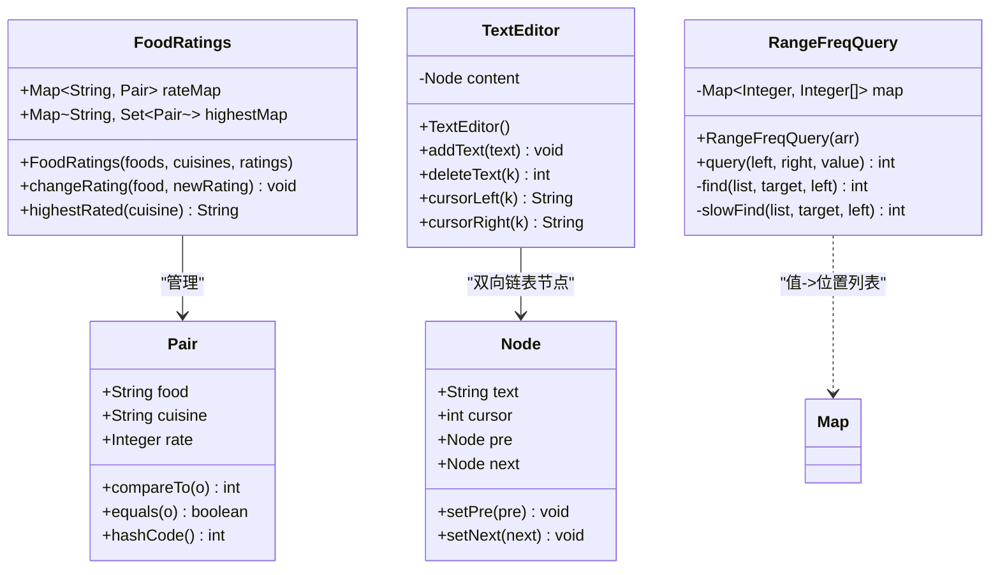
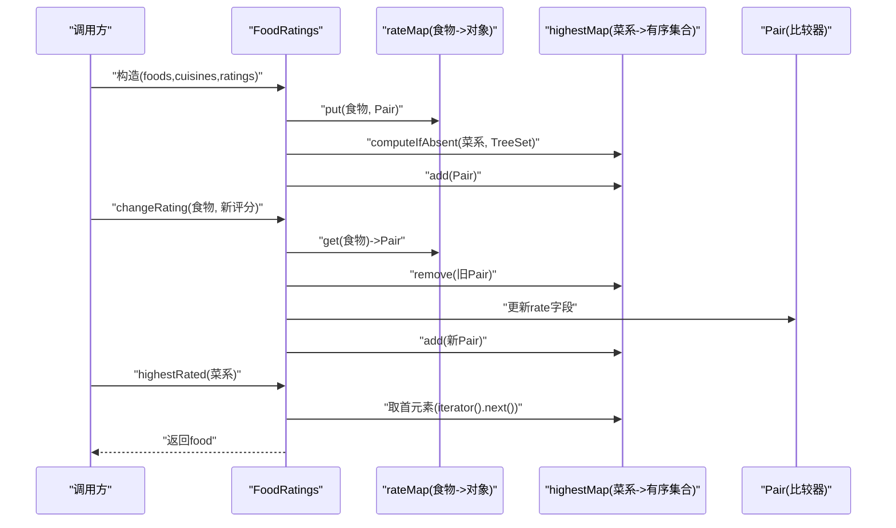
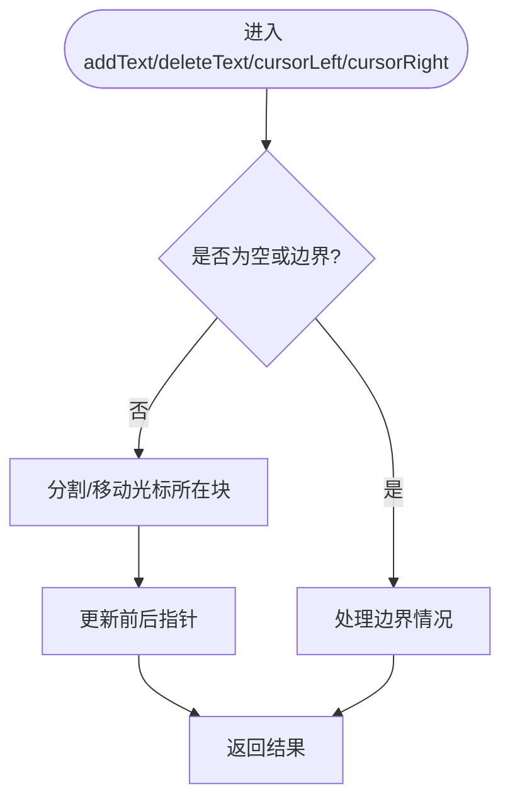
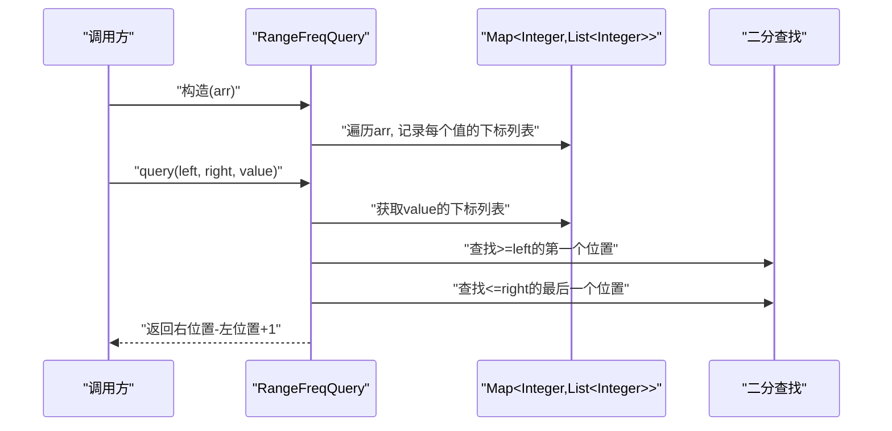
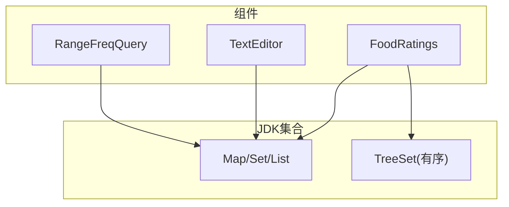

# 设计模式应用

<cite>
**本文引用的文件**   
- [README.md](file://README.md)
- [DesignAFoodRatingSystem.java](file://src/main/java/leetcode/editor/cn/DesignAFoodRatingSystem.java)
- [DesignATextEditor.java](file://src/main/java/leetcode/editor/cn/DesignATextEditor.java)
- [RangeFrequencyQueries.java](file://src/main/java/leetcode/editor/cn/RangeFrequencyQueries.java)
- [MinimumSizeSubarraySum.java](file://src/main/java/leetcode/editor/cn/MinimumSizeSubarraySum.java)
</cite>

## 目录
1. [引言](#引言)
2. [项目结构](#项目结构)
3. [核心组件](#核心组件)
4. [架构总览](#架构总览)
5. [详细组件分析](#详细组件分析)
6. [依赖分析](#依赖分析)
7. [性能考量](#性能考量)
8. [故障排查指南](#故障排查指南)
9. [结论](#结论)
10. [附录](#附录)

## 引言
本文件面向LeetCode算法题解项目，聚焦“设计模式在算法题目中的应用”。我们将结合仓库中的具体实现，系统讲解模板方法、策略、工厂、单例等经典模式在数据结构与算法场景下的落地方式，并给出模式选择原则、权衡考虑、组合使用技巧以及对可维护性与扩展性的影响。文档以代码级分析为基础，辅以图示帮助理解。

## 项目结构
本项目为Java语言实现的LeetCode题解集合，采用按题号/主题分文件的扁平化组织方式。每个题解通常包含：
- 题目描述注释（含示例、约束、相关标签）
- 一个主类（用于本地测试）
- 一个内部Solution或业务类（提交到平台的核心逻辑）

**图表来源** 
- [README.md:1-12](file://README.md#L1-L12)

**章节来源**
- [README.md:1-12](file://README.md#L1-L12)

## 核心组件
本节从“设计模式视角”提炼出三个代表性组件：
- 食物评分系统（基于有序集合的查询与更新）
- 带光标文本编辑器（基于双向链表的分块存储）
- 区间频率查询（基于哈希+二分查找的数据结构）

这些组件分别体现了策略、模板方法、工厂/单例等模式的适用点与组合方式。

**章节来源**
- [DesignAFoodRatingSystem.java:89-149](file://src/main/java/leetcode/editor/cn/DesignAFoodRatingSystem.java#L89-L149)
- [DesignATextEditor.java:93-280](file://src/main/java/leetcode/editor/cn/DesignATextEditor.java#L93-L280)
- [RangeFrequencyQueries.java:62-156](file://src/main/java/leetcode/editor/cn/RangeFrequencyQueries.java#L62-L156)

## 架构总览
下图展示了三个核心组件与其关键数据结构的交互关系，体现“数据组织 + 操作接口”的设计思路。

**图表来源** 
- [DesignAFoodRatingSystem.java:89-149](file://src/main/java/leetcode/editor/cn/DesignAFoodRatingSystem.java#L89-L149)
- [DesignATextEditor.java:93-280](file://src/main/java/leetcode/editor/cn/DesignATextEditor.java#L93-L280)
- [RangeFrequencyQueries.java:62-156](file://src/main/java/leetcode/editor/cn/RangeFrequencyQueries.java#L62-L156)

## 详细组件分析

### 组件A：食物评分系统（策略与有序集合）
该组件通过“按烹饪方式分组 + 按评分降序/字典序升序排序”的策略，支持高效查询最高评分食物与动态更新评分。

**图表来源** 
- [DesignAFoodRatingSystem.java:94-116](file://src/main/java/leetcode/editor/cn/DesignAFoodRatingSystem.java#L94-L116)
- [DesignAFoodRatingSystem.java:119-148](file://src/main/java/leetcode/editor/cn/DesignAFoodRatingSystem.java#L119-L148)

要点与模式映射：
- 策略模式：Pair的比较规则（先按评分降序，再按字典序升序）作为“排序策略”，通过TreeSet自动维护顺序。
- 工厂模式（可选）：若将Pair的创建封装为工厂方法，便于统一初始化与校验。
- 单例模式（可选）：若全局需要唯一实例（例如评测环境），可通过单例提供访问入口。

复杂度与权衡：
- changeRating：移除+插入有序集合，O(log n)。
- highestRated：取首元素，O(1)。
- 空间：O(n)存储所有Pair及索引。

最佳实践建议：
- 明确定义比较器不变式，避免修改已参与排序的对象关键字段；当前实现通过“删除旧对象+更新后重新插入”规避了问题。
- 对高频查询场景，可考虑缓存最近结果或使用更合适的堆结构。

**章节来源**
- [DesignAFoodRatingSystem.java:89-149](file://src/main/java/leetcode/editor/cn/DesignAFoodRatingSystem.java#L89-L149)

### 组件B：带光标文本编辑器（模板方法与分块链表）
该组件用双向链表分块存储文本，并提供增删改查光标附近文本的操作。其流程骨架清晰，适合用“模板方法”抽象通用步骤，将可变细节下沉到子类或策略中。

**图表来源** 
- [DesignATextEditor.java:101-137](file://src/main/java/leetcode/editor/cn/DesignATextEditor.java#L101-L137)
- [DesignATextEditor.java:140-183](file://src/main/java/leetcode/editor/cn/DesignATextEditor.java#L140-L183)
- [DesignATextEditor.java:185-215](file://src/main/java/leetcode/editor/cn/DesignATextEditor.java#L185-L215)

要点与模式映射：
- 模板方法：将“定位光标所在块 -> 执行具体操作 -> 维护链接 -> 返回结果”的流程抽成模板，不同操作（添加、删除、左右移动）仅覆盖差异部分。
- 策略模式：可将“分块策略”（固定长度块、自适应大小块）抽象为策略，根据负载特征切换。
- 工厂模式：Node的创建可集中到工厂，统一设置初始状态。
- 单例模式：若需全局共享编辑器实例（如在线评测），可暴露单例访问。

复杂度与权衡：
- 添加/删除/移动：均围绕光标附近块进行，时间复杂度近似O(k)（k为移动或删除长度）。
- 空间：按块存储，减少频繁字符串拷贝开销。

最佳实践建议：
- 将“光标移动”的递归/迭代路径抽取为独立方法，降低分支复杂度。
- 对超长文本，可采用“惰性合并”策略，定期合并小块以提升读取性能。

**章节来源**
- [DesignATextEditor.java:93-280](file://src/main/java/leetcode/editor/cn/DesignATextEditor.java#L93-L280)

### 组件C：区间频率查询（哈希+二分查找）
该组件维护“值→出现下标列表”的映射，利用下标列表的单调性进行二分查找，快速计算任意[left,right]范围内某值的频次。

**图表来源** 
- [RangeFrequencyQueries.java:66-73](file://src/main/java/leetcode/editor/cn/RangeFrequencyQueries.java#L66-L73)
- [RangeFrequencyQueries.java:75-115](file://src/main/java/leetcode/editor/cn/RangeFrequencyQueries.java#L75-L115)
- [RangeFrequencyQueries.java:138-155](file://src/main/java/leetcode/editor/cn/RangeFrequencyQueries.java#L138-L155)

要点与模式映射：
- 策略模式：二分查找的具体实现可作为策略（标准lower_bound/upper_bound、自定义边界条件），便于替换优化。
- 工厂模式：可根据输入规模或分布特征，选择不同预构建策略（如分块索引、线段树）。
- 单例模式：若存在多个查询器共享同一份静态索引，可考虑单例或静态工具类。

复杂度与权衡：
- 构造：O(n)。
- 查询：O(log n)（二分查找）。
- 空间：O(n)。

最佳实践建议：
- 确保下标列表严格递增，保证二分正确性。
- 对极端分布（大量重复值）可考虑压缩表示或分段索引。

**章节来源**
- [RangeFrequencyQueries.java:62-156](file://src/main/java/leetcode/editor/cn/RangeFrequencyQueries.java#L62-L156)

### 概念性总览：模式选择原则与权衡
- 何时使用策略模式：当同一操作有多种实现且可能随运行期条件变化时（如排序策略、分块策略、搜索策略）。
- 何时使用模板方法：当多个算法共享相同骨架流程，但某些步骤有差异时（如编辑器的各类操作）。
- 何时使用工厂模式：当对象的创建逻辑复杂或需要隐藏具体类型时（如Node、Pair的创建）。
- 何时使用单例模式：当需要全局唯一实例且无副作用时（如评测环境的配置或共享索引）。
- 组合使用：模板方法内调用策略；工厂负责生产策略/节点；单例提供全局入口。

[本节为概念性内容，不直接分析具体文件，故无“章节来源”]

## 依赖分析
下图展示三个组件之间的外部依赖与内部耦合关系。

**图表来源** 
- [DesignAFoodRatingSystem.java:94-103](file://src/main/java/leetcode/editor/cn/DesignAFoodRatingSystem.java#L94-L103)
- [DesignATextEditor.java:93-137](file://src/main/java/leetcode/editor/cn/DesignATextEditor.java#L93-L137)
- [RangeFrequencyQueries.java:66-73](file://src/main/java/leetcode/editor/cn/RangeFrequencyQueries.java#L66-L73)

**章节来源**
- [DesignAFoodRatingSystem.java:89-149](file://src/main/java/leetcode/editor/cn/DesignAFoodRatingSystem.java#L89-L149)
- [DesignATextEditor.java:93-280](file://src/main/java/leetcode/editor/cn/DesignATextEditor.java#L93-L280)
- [RangeFrequencyQueries.java:62-156](file://src/main/java/leetcode/editor/cn/RangeFrequencyQueries.java#L62-L156)

## 性能考量
- 食物评分系统：
  - changeRating涉及有序集合的删除与插入，注意比较器稳定性与对象不可变性约定。
  - highestRated为O(1)，适合高频查询。
- 文本编辑器：
  - 分块链表能显著减少大字符串复制成本，适合频繁局部编辑。
  - 光标移动与删除的时间复杂度与k成正比，符合题目要求。
- 区间频率查询：
  - 构造阶段线性扫描，查询阶段对数时间，整体高效。
  - 若值域较小且分布稀疏，可考虑位图或前缀计数表替代。

[本节为一般性指导，不直接分析具体文件，故无“章节来源”]

## 故障排查指南
- 食物评分系统
  - 现象：highestRated返回非预期结果。
  - 排查：确认Pair的compareTo与equals/hashCode一致性；检查是否误改了已在集合中的对象关键字段。
  - 参考实现位置：比较器与相等性定义。
- 文本编辑器
  - 现象：删除后光标越界或返回字符串不正确。
  - 排查：检查跨块删除时的递归定位与指针重连；确认strleft的拼接逻辑。
- 区间频率查询
  - 现象：query返回负数或越界。
  - 排查：确认二分查找的边界条件与left/right位置的语义；验证下标列表单调性。

**章节来源**
- [DesignAFoodRatingSystem.java:119-148](file://src/main/java/leetcode/editor/cn/DesignAFoodRatingSystem.java#L119-L148)
- [DesignATextEditor.java:140-183](file://src/main/java/leetcode/editor/cn/DesignATextEditor.java#L140-L183)
- [RangeFrequencyQueries.java:138-155](file://src/main/java/leetcode/editor/cn/RangeFrequencyQueries.java#L138-L155)

## 结论
通过对三个典型题解的结构化分析，可以看到：
- 策略模式适用于“行为可插拔”的场景（排序、分块、搜索）。
- 模板方法有助于统一操作流程，提升可维护性。
- 工厂与单例在对象创建与全局访问方面提供便利，但需谨慎使用以避免隐式耦合。
- 合理的数据结构与模式组合，能在保持简洁的同时显著提升性能与可扩展性。

[本节为总结性内容，不直接分析具体文件，故无“章节来源”]

## 附录
- 滑动窗口示例（最小满足条件的子数组长度）：
  - 双指针维护窗口，逐步收缩以满足条件，时间复杂度O(n)。
  - 参考实现位置：最小子数组和。

**章节来源**
- [MinimumSizeSubarraySum.java:57-71](file://src/main/java/leetcode/editor/cn/MinimumSizeSubarraySum.java#L57-L71)