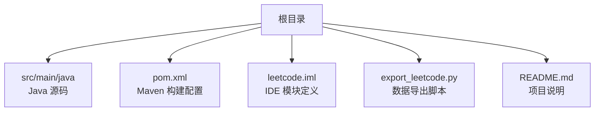
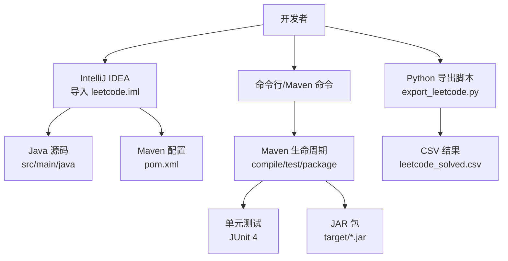
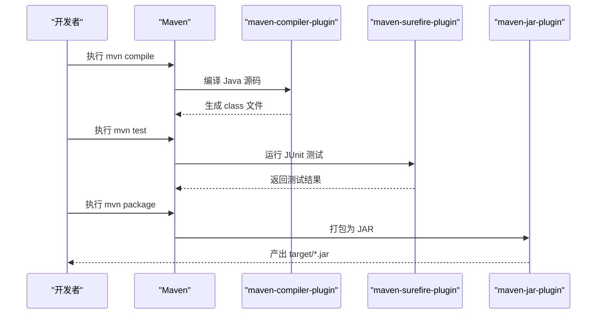
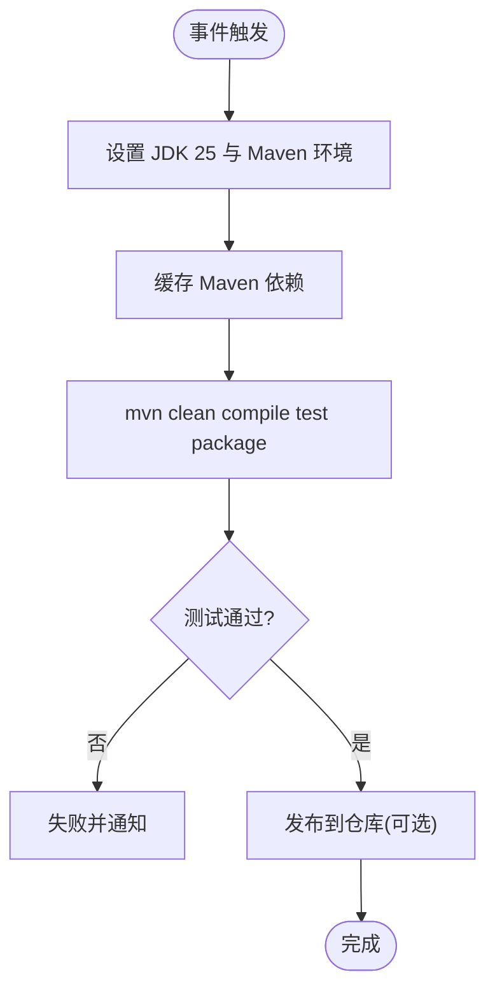
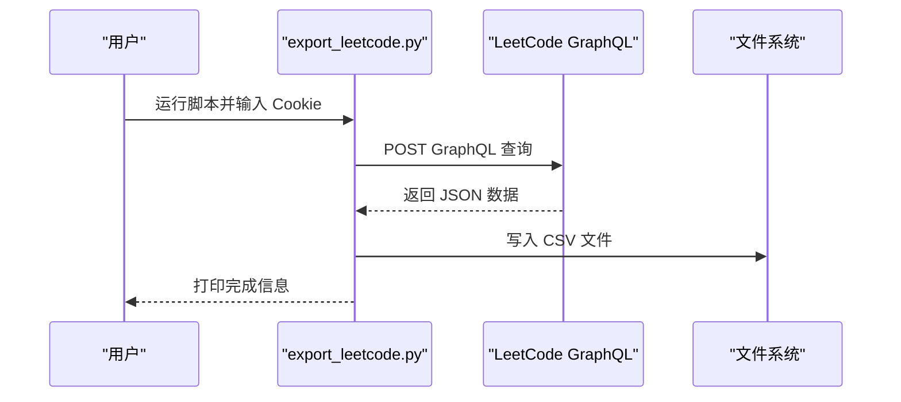
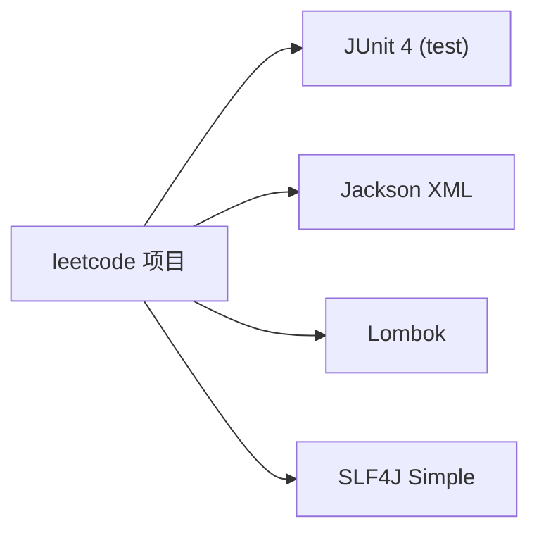

# 项目构建和部署

<cite>
**本文引用的文件**   
- [pom.xml](file://pom.xml)
- [README.md](file://README.md)
- [leetcode.iml](file://leetcode.iml)
- [export_leetcode.py](file://export_leetcode.py)
</cite>

## 目录
1. [简介](#简介)
2. [项目结构](#项目结构)
3. [核心组件](#核心组件)
4. [架构总览](#架构总览)
5. [详细组件分析](#详细组件分析)
6. [依赖分析](#依赖分析)
7. [性能考虑](#性能考虑)
8. [故障排查指南](#故障排查指南)
9. [结论](#结论)
10. [附录](#附录)

## 简介
本文件面向 LeetCode 算法题解项目的构建与部署，聚焦以下目标：
- 解释 Maven 配置的作用与可扩展点（包括自定义插件与属性）
- 提供 IDE 集成与开发环境优化建议
- 给出代码打包、测试与发布流程
- 说明版本管理与协作最佳实践
- 设计持续集成与自动化部署方案
- 提供性能分析与代码优化指导
- 列出项目维护与升级注意事项

本项目为个人刷题练习仓库，使用 Java 语言与 Maven 进行构建管理，源码位于标准 Maven 目录结构下。

## 项目结构
仓库采用标准 Maven 工程布局，Java 源代码位于 src/main/java，Maven 配置文件 pom.xml 位于根目录，IDE 模块文件 leetcode.iml 用于 IntelliJ IDEA 识别。另有 Python 脚本 export_leetcode.py 用于导出已提交题目信息到 CSV。

图表来源
- [pom.xml:1-102](file://pom.xml#L1-L102)
- [leetcode.iml:1-8](file://leetcode.iml#L1-L8)
- [export_leetcode.py:1-106](file://export_leetcode.py#L1-L106)
- [README.md:1-12](file://README.md#L1-L12)

章节来源
- [pom.xml:1-102](file://pom.xml#L1-L102)
- [README.md:1-12](file://README.md#L1-L12)

## 核心组件
- Maven 构建系统
  - 项目坐标：groupId=org.practise, artifactId=leetcode, version=1.0
  - 编译目标：Java 25（source/target 均为 25）
  - 编码：UTF-8
  - 依赖：JUnit 4（测试）、Jackson XML（XML 处理）、Lombok（注解生成）、SLF4J Simple（日志实现）
  - 插件：clean、resources、compiler、surefire、jar、install、deploy、site、project-info-reports；其中 compiler 插件显式配置 source/target=25
- IDE 集成
  - leetcode.iml 排除 .venv 目录，避免误扫描
- 辅助工具
  - export_leetcode.py 通过 GraphQL 接口拉取已提交题目并输出 CSV

章节来源
- [pom.xml:13-43](file://pom.xml#L13-L43)
- [pom.xml:45-100](file://pom.xml#L45-L100)
- [leetcode.iml:1-8](file://leetcode.iml#L1-L8)
- [export_leetcode.py:1-106](file://export_leetcode.py#L1-L106)

## 架构总览
从构建与运行视角看，项目由“源码 + 构建配置 + 工具脚本”组成，IDE 负责本地开发与调试，Maven 负责编译、测试与打包。

图表来源
- [pom.xml:45-100](file://pom.xml#L45-L100)
- [leetcode.iml:1-8](file://leetcode.iml#L1-L8)
- [export_leetcode.py:1-106](file://export_leetcode.py#L1-L106)

## 详细组件分析

### Maven 构建配置详解
- 项目元信息与属性
  - groupId/artifactId/version 定义了构件标识
  - properties 统一设置编码与 Java 版本，便于跨平台一致性与可维护性
- 依赖管理
  - 测试依赖 JUnit 4，scope=test，仅在测试阶段生效
  - Jackson XML 用于 XML 解析/序列化
  - Lombok 减少样板代码
  - SLF4J Simple 提供轻量日志实现
- 插件与生命周期
  - pluginManagement 锁定常用插件版本，避免默认版本漂移
  - maven-compiler-plugin 显式指定 source/target=25，确保编译一致性
  - maven-surefire-plugin 执行测试
  - maven-jar-plugin 生成 JAR
  - maven-install/deploy 支持本地安装与远程发布
  - site 相关插件用于生成站点文档
- 扩展点与自定义方法
  - 可在 properties 中集中管理版本与参数
  - 在 plugins 段添加或覆盖插件配置（如编译器选项、测试参数、资源过滤等）
  - 可通过 profiles 区分 dev/test/prod 构建差异（当前未启用）

章节来源
- [pom.xml:7-17](file://pom.xml#L7-L17)
- [pom.xml:19-43](file://pom.xml#L19-L43)
- [pom.xml:45-100](file://pom.xml#L45-L100)

#### 构建流程时序图

图表来源
- [pom.xml:45-100](file://pom.xml#L45-L100)

### IDE 集成与开发环境优化
- 导入项目
  - 使用 IntelliJ IDEA 打开根目录，IDEA 会自动识别 Maven 项目与 leetcode.iml
- 模块内容排除
  - leetcode.iml 已排除 .venv，避免无关目录被索引
- 推荐优化
  - 在 Settings 中启用 Lombok 注解处理器
  - 将 JDK 设置为 25，以匹配 pom.xml 的 source/target
  - 配置 Maven 本地仓库与镜像源，加速依赖下载
  - 开启自动导入与增量编译，提升编辑体验

章节来源
- [leetcode.iml:1-8](file://leetcode.iml#L1-L8)
- [pom.xml:13-17](file://pom.xml#L13-L17)

### 代码打包与发布流程
- 本地构建
  - 清理：mvn clean
  - 编译：mvn compile
  - 测试：mvn test
  - 打包：mvn package（产物在 target 目录）
- 本地安装
  - mvn install 将构件安装至本地仓库，供其他本地项目引用
- 远程发布
  - 需在 pom.xml 配置 distributionManagement 与 settings.xml 配置认证后，执行 mvn deploy
- 站点文档
  - mvn site 生成项目报告与文档（需配置 site 插件与站点描述）

章节来源
- [pom.xml:45-100](file://pom.xml#L45-L100)

### 版本管理与协作开发最佳实践
- 版本号策略
  - 当前使用 1.0，建议遵循语义化版本（主.次.修订），按功能与修复频率递增
- 分支模型
  - 主干分支 main，功能分支 feature/*，修复分支 hotfix/*，发布分支 release/*
- 提交规范
  - 使用约定式提交（feat/fix/docs/chore 等），便于自动生成变更日志
- 依赖更新
  - 定期审查依赖安全漏洞与可用新版本，结合 CI 自动检测
- 代码评审
  - 合并前至少一次评审，关注复杂度、可读性与边界条件

[本节为通用实践建议，不直接分析具体文件]

### 持续集成与自动化部署方案
- 触发条件
  - 推送至 main 或创建 Pull Request 时触发
- 任务建议
  - 安装 JDK 25
  - 缓存 Maven 依赖
  - 执行 mvn verify（包含 compile、test、package）
  - 可选：生成覆盖率报告与静态检查报告
- 部署策略
  - 若发布到私有仓库，需在 CI 中配置认证凭据
  - 对 tag 触发正式发布流程

[此图为概念流程示意，无需图表来源]

### 性能分析与代码优化指导
- 构建性能
  - 启用并行构建与依赖缓存
  - 合理划分模块（当前单体项目暂不需要）
- 运行时性能
  - 针对热点算法使用基准测试（例如 JMH）评估不同实现
  - 利用 JVM 参数调优（堆大小、GC 选择）
- 代码质量
  - 引入静态分析（Checkstyle、SpotBugs）与单元测试覆盖率
  - 控制圈复杂度与重复率，保持方法短小清晰

[本节为通用指导，不直接分析具体文件]

### 辅助脚本：导出已提交题目
- 功能概述
  - 通过 GraphQL 接口获取用户已提交题目列表，写入 CSV
- 输入要求
  - 需要 LEETCODE_SESSION 与 x-csrftoken 两个 Cookie 值
- 输出
  - 生成 leetcode_solved.csv，包含编号、标题、难度、最后提交时间、提交次数、URL
- 错误处理
  - 网络异常与 HTTP 错误会重试，最多三次

图表来源
- [export_leetcode.py:1-106](file://export_leetcode.py#L1-L106)

章节来源
- [export_leetcode.py:1-106](file://export_leetcode.py#L1-L106)

## 依赖分析
- 内部依赖
  - 无外部业务模块，所有类均位于同一模块内
- 外部依赖
  - JUnit 4：测试框架
  - Jackson XML：XML 数据处理
  - Lombok：编译期注解处理
  - SLF4J Simple：日志实现
- 插件依赖
  - 编译器、测试、打包、安装、部署、站点等插件

图表来源
- [pom.xml:19-43](file://pom.xml#L19-L43)

章节来源
- [pom.xml:19-43](file://pom.xml#L19-L43)

## 性能考虑
- 构建阶段
  - 使用 Maven 并行构建与依赖缓存，缩短冷启动时间
  - 仅对必要模块执行测试与打包
- 运行阶段
  - 根据实际负载调整 JVM 内存与 GC 策略
  - 对关键算法路径进行基准测试与剖析
- 存储与网络
  - 合理使用本地仓库与镜像源，降低依赖下载耗时

[本节为通用指导，不直接分析具体文件]

## 故障排查指南
- 构建失败
  - 检查 JDK 版本是否为 25，且与 pom.xml 的 source/target 一致
  - 确认网络连接与 Maven 镜像配置正确
- 测试失败
  - 查看 surefire 报告定位失败用例
  - 隔离问题用例，补充断言与边界条件
- 依赖冲突
  - 使用 mvn dependency:tree 分析冲突，必要时在 pom.xml 中显式声明版本
- 脚本运行异常
  - 确认 Cookie 有效且未过期
  - 检查网络连通性与 SSL 证书

章节来源
- [pom.xml:13-17](file://pom.xml#L13-L17)
- [pom.xml:45-100](file://pom.xml#L45-L100)
- [export_leetcode.py:47-69](file://export_leetcode.py#L47-L69)

## 结论
本项目基于标准 Maven 工程组织，配合 IntelliJ IDEA 与少量辅助脚本，形成简洁高效的本地开发与构建体系。建议在现有基础上逐步完善 CI/CD、静态检查与覆盖率统计，以提升团队协作效率与代码质量。同时，遵循统一的版本与分支策略，有助于长期维护与稳定演进。

[本节为总结性内容，不直接分析具体文件]

## 附录
- 常用命令
  - 清理：mvn clean
  - 编译：mvn compile
  - 测试：mvn test
  - 打包：mvn package
  - 安装：mvn install
  - 发布：mvn deploy（需配置仓库与凭据）
  - 站点：mvn site
- 参考文件
  - 构建配置：pom.xml
  - IDE 模块：leetcode.iml
  - 导出脚本：export_leetcode.py
  - 项目说明：README.md

章节来源
- [pom.xml:45-100](file://pom.xml#L45-L100)
- [leetcode.iml:1-8](file://leetcode.iml#L1-L8)
- [export_leetcode.py:1-106](file://export_leetcode.py#L1-L106)
- [README.md:1-12](file://README.md#L1-L12)