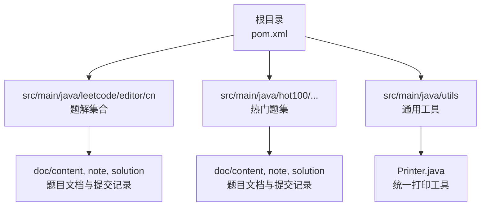
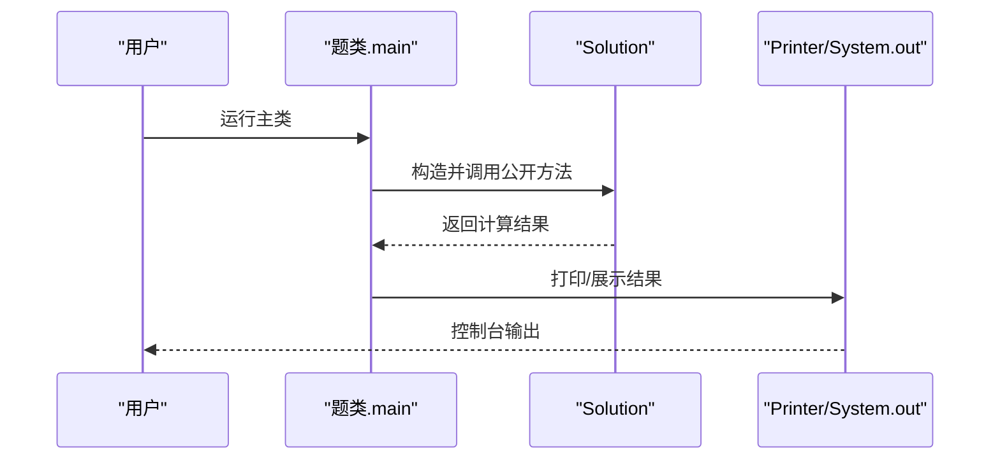
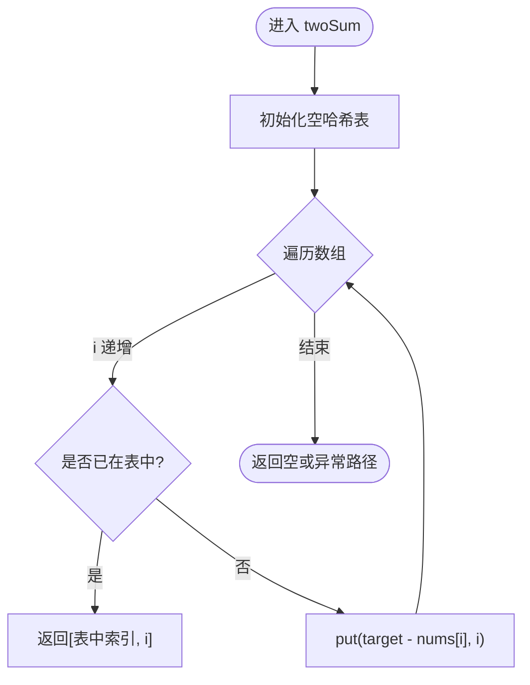
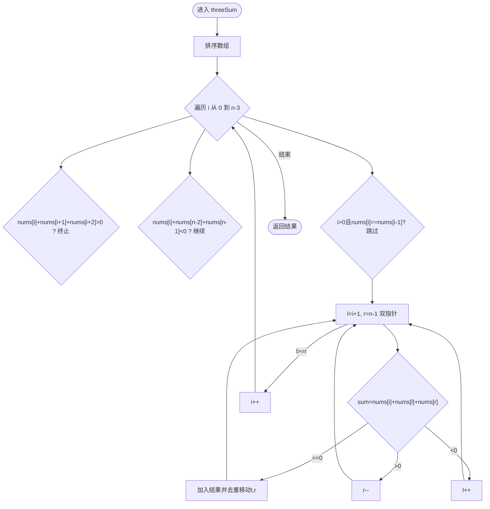
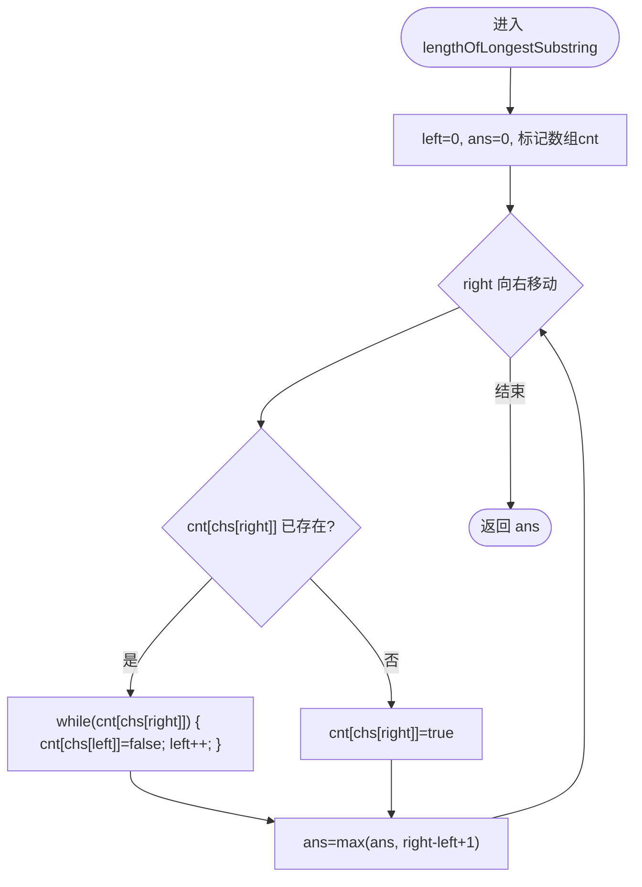
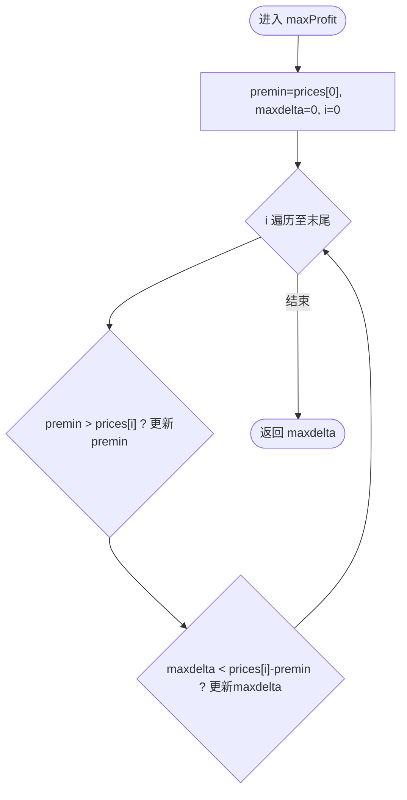
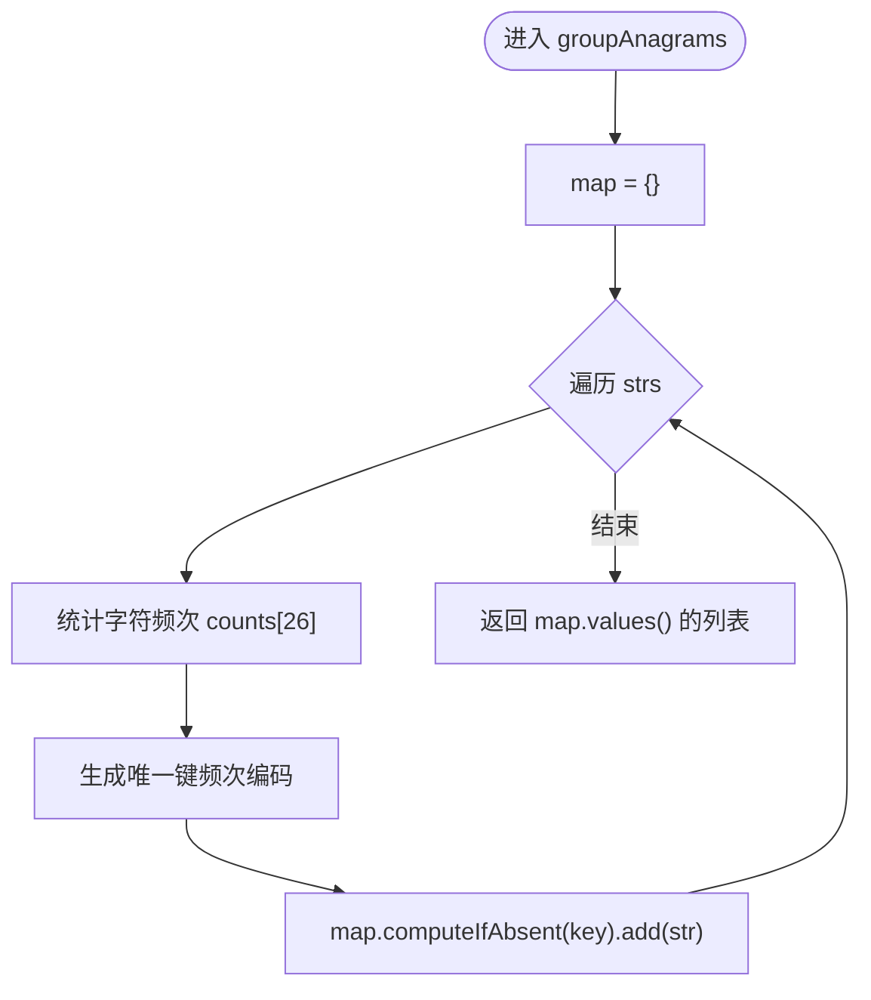
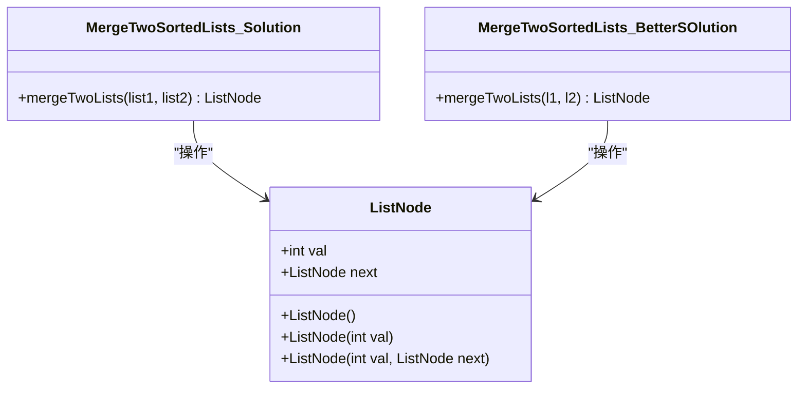
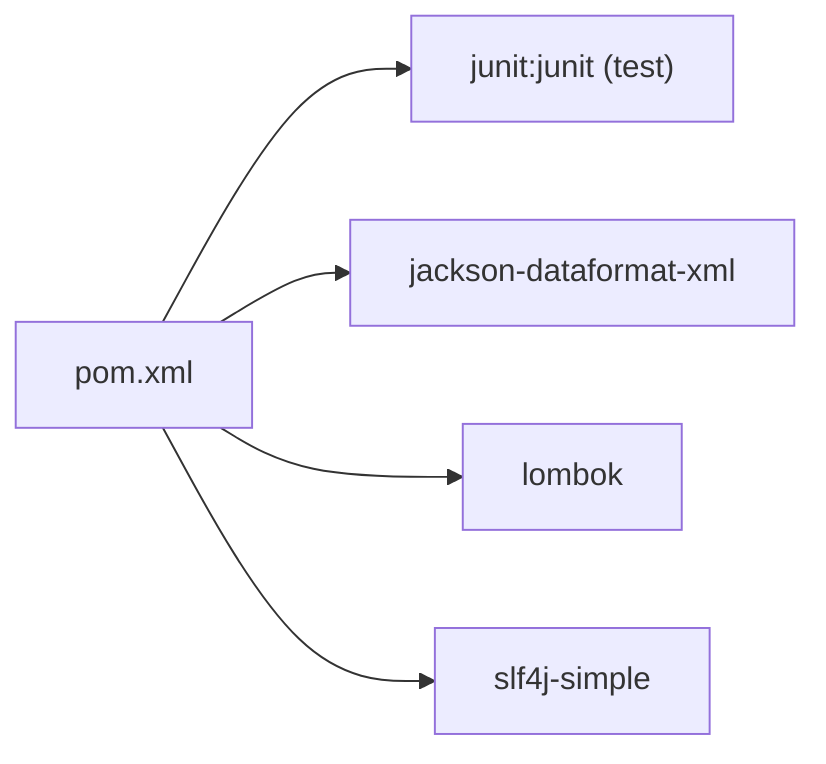

# 项目概述

<cite>
**本文引用的文件**   
- [README.md](file://README.md)
- [pom.xml](file://pom.xml)
- [TwoSum.java](file://src/main/java/leetcode/editor/cn/TwoSum.java)
- [ThreeSum.java](file://src/main/java/leetcode/editor/cn/ThreeSum.java)
- [$_0001_两数之和.java](file://src/main/java/hot100/leetcode/editor/cn/$_0001_两数之和.java)
- [BestTimeToBuyAndSellStock.java](file://src/main/java/leetcode/editor/cn/BestTimeToBuyAndSellStock.java)
- [GroupAnagrams.java](file://src/main/java/leetcode/editor/cn/GroupAnagrams.java)
- [LongestSubstringWithoutRepeatingCharacters.java](file://src/main/java/leetcode/editor/cn/LongestSubstringWithoutRepeatingCharacters.java)
- [MergeTwoSortedLists.java](file://src/main/java/leetcode/editor/cn/MergeTwoSortedLists.java)
- [Printer.java](file://src/main/java/utils/Printer.java)
</cite>

## 目录
1. [简介](#简介)
2. [项目结构](#项目结构)
3. [核心组件](#核心组件)
4. [架构总览](#架构总览)
5. [详细组件分析](#详细组件分析)
6. [依赖关系分析](#依赖关系分析)
7. [性能与复杂度](#性能与复杂度)
8. [故障排查指南](#故障排查指南)
9. [结论](#结论)
10. [附录：公共接口与使用示例](#附录公共接口与使用示例)

## 简介
本项目是一个面向 LeetCode 算法题的 Java 练习仓库，采用 Maven 构建，源码按“题目包 + 文档”的方式组织。每个题目通常包含一个可独立运行的类（内含 main 方法），以及配套的说明、笔记或提交记录等文档。项目同时提供通用工具类以简化调试输出，并通过 README 对部分专题进行索引。

该仓库的目标是：
- 为初学者提供清晰、可运行的题解样例，便于理解思路与实现细节
- 为有经验的开发者提供结构化、可复用的代码组织方式与工具链配置
- 通过统一的包结构与命名约定，降低检索与维护成本

## 项目结构
整体采用分层+主题的组织方式：
- src/main/java/leetcode/editor/cn：主流题解集合，每道题一个类，内部包含 Solution 类与可选的 main 测试入口
- src/main/java/hot100/...：精选热门题目的集中存放，配套 doc 目录存放 Markdown 说明
- src/main/java/utils：通用工具（如打印）
- 根目录 pom.xml：Maven 工程配置，定义 JDK 版本、依赖与插件
- README.md：简要索引与专题链接

图表来源
- [pom.xml:1-102](file://pom.xml#L1-L102)
- [README.md:1-12](file://README.md#L1-L12)

章节来源
- [README.md:1-12](file://README.md#L1-L12)
- [pom.xml:1-102](file://pom.xml#L1-L102)

## 核心组件
- 题解类模板：每个题目类包含一个内部 Solution 类，暴露标准方法签名；多数类提供 main 方法用于本地验证
- 工具类：utils.Printer 提供统一输出，便于快速查看结果
- 构建与依赖：Maven 管理编译环境（JDK 25）、单元测试（JUnit 4）、日志（SLF4J Simple）、JSON/XML 处理（Jackson XML）与 Lombok

章节来源
- [TwoSum.java:55-78](file://src/main/java/leetcode/editor/cn/TwoSum.java#L55-L78)
- [$_0001_两数之和.java:10-35](file://src/main/java/hot100/leetcode/editor/cn/$_0001_两数之和.java#L10-L35)
- [Printer.java:1-16](file://src/main/java/utils/Printer.java#L1-L16)
- [pom.xml:19-43](file://pom.xml#L19-L43)

## 架构总览
从运行视角看，典型流程如下：
- 用户执行某个题类的 main 方法
- main 构造对应 Solution 实例并调用其公开方法
- 方法返回结果后，通过 System.out 或 Printer.print 输出
- 若需要持久化或解析数据，可使用 Jackson XML 等依赖

图表来源
- [TwoSum.java:56-60](file://src/main/java/leetcode/editor/cn/TwoSum.java#L56-L60)
- [$_0001_两数之和.java:30-34](file://src/main/java/hot100/leetcode/editor/cn/$_0001_两数之和.java#L30-L34)
- [Printer.java:10-14](file://src/main/java/utils/Printer.java#L10-L14)

## 详细组件分析

### 哈希表与双指针：两数之和（TwoSum）
- 设计要点：一次遍历维护“目标值 - 当前值 -> 下标”的映射，遇到命中即返回答案
- 时间复杂度：O(n)，空间复杂度：O(n)
- 适用场景：数组中查找满足和条件的两个元素

图表来源
- [TwoSum.java:62-75](file://src/main/java/leetcode/editor/cn/TwoSum.java#L62-L75)

章节来源
- [TwoSum.java:55-78](file://src/main/java/leetcode/editor/cn/TwoSum.java#L55-L78)

### 排序+双指针：三数之和（ThreeSum）
- 设计要点：先排序，固定左指针 i，左右指针 l、r 向中间收缩，去重策略保证不重复三元组
- 时间复杂度：O(n^2)，空间复杂度：O(1)（不计结果存储）
- 适用场景：多数和、组合问题中的去重优化

图表来源
- [ThreeSum.java:62-90](file://src/main/java/leetcode/editor/cn/ThreeSum.java#L62-L90)

章节来源
- [ThreeSum.java:57-93](file://src/main/java/leetcode/editor/cn/ThreeSum.java#L57-L93)

### 滑动窗口：最长无重复子串
- 设计要点：右指针扩展窗口，出现重复则收缩左指针直至窗口合法，维护最大长度
- 时间复杂度：O(n)，空间复杂度：O(字符集大小)

图表来源
- [LongestSubstringWithoutRepeatingCharacters.java:56-71](file://src/main/java/leetcode/editor/cn/LongestSubstringWithoutRepeatingCharacters.java#L56-L71)

章节来源
- [LongestSubstringWithoutRepeatingCharacters.java:50-74](file://src/main/java/leetcode/editor/cn/LongestSubstringWithoutRepeatingCharacters.java#L50-L74)

### 动态规划/贪心：买卖股票的最佳时机
- 设计要点：维护历史最低价 premin，遍历更新最大利润 maxdelta
- 时间复杂度：O(n)，空间复杂度：O(1)

图表来源
- [BestTimeToBuyAndSellStock.java:46-59](file://src/main/java/leetcode/editor/cn/BestTimeToBuyAndSellStock.java#L46-L59)

章节来源
- [BestTimeToBuyAndSellStock.java:39-62](file://src/main/java/leetcode/editor/cn/BestTimeToBuyAndSellStock.java#L39-L62)

### 哈希分组：字母异位词分组
- 设计要点：统计每个字符串的字符频次作为键，将同构字符串归入同一列表
- 时间复杂度：O(N·K)，N 为字符串个数，K 为平均长度；空间复杂度：O(N·K)

图表来源
- [GroupAnagrams.java:51-72](file://src/main/java/leetcode/editor/cn/GroupAnagrams.java#L51-L72)

章节来源
- [GroupAnagrams.java:46-75](file://src/main/java/leetcode/editor/cn/GroupAnagrams.java#L46-L75)

### 链表合并：合并两个有序链表
- 设计要点：迭代比较两链表头节点，较小者接入新链表尾，最后拼接剩余部分
- 时间复杂度：O(m+n)，空间复杂度：O(1)

图表来源
- [MergeTwoSortedLists.java:115-121](file://src/main/java/leetcode/editor/cn/MergeTwoSortedLists.java#L115-L121)
- [MergeTwoSortedLists.java:61-94](file://src/main/java/leetcode/editor/cn/MergeTwoSortedLists.java#L61-L94)
- [MergeTwoSortedLists.java:97-113](file://src/main/java/leetcode/editor/cn/MergeTwoSortedLists.java#L97-L113)

章节来源
- [MergeTwoSortedLists.java:42-125](file://src/main/java/leetcode/editor/cn/MergeTwoSortedLists.java#L42-L125)

## 依赖关系分析
- 构建与语言：Maven 管理，JDK 25 编译与运行
- 测试框架：JUnit 4（test scope）
- 日志：SLF4J Simple（运行时简单实现）
- JSON/XML：Jackson Dataformat XML（用于序列化/反序列化）
- 代码生成：Lombok（减少样板代码）

图表来源
- [pom.xml:19-43](file://pom.xml#L19-L43)

章节来源
- [pom.xml:1-102](file://pom.xml#L1-L102)

## 性能与复杂度
- 哈希表方案（两数之和）：O(n) 时间、O(n) 空间，适合大规模输入
- 排序+双指针（三数之和）：O(n^2) 时间，注意去重逻辑避免重复结果
- 滑动窗口（最长无重复子串）：O(n) 时间，常数级辅助空间
- 线性扫描（股票最佳时机）：O(n) 时间、O(1) 空间
- 哈希分组（异位词）：O(N·K) 时间，键构造开销与内存占用需关注

[本节为通用指导，无需特定文件引用]

## 故障排查指南
- 运行时报空指针：检查输入是否为空或越界访问（例如空链表、空数组）
- 结果不正确：确认去重逻辑（如三数之和）与边界条件（如窗口收缩）
- 性能瓶颈：优先选择 O(n) 或 O(n log n) 的方案，避免嵌套循环
- 依赖缺失：确保 Maven 能正确下载 junit、jackson、lombok、slf4j-simple
- 输出混乱：使用 utils.Printer 统一输出格式，便于对比

章节来源
- [Printer.java:10-14](file://src/main/java/utils/Printer.java#L10-L14)
- [pom.xml:19-43](file://pom.xml#L19-L43)

## 结论
该项目以“题类 + 内部 Solution + 可选 main”的模式组织，配合 Maven 与常用库，形成一套轻量但实用的算法练习体系。通过统一的工具与文档结构，既便于初学者上手，也利于进阶者复用与扩展。建议后续在以下方面持续完善：
- 补充单元测试用例，覆盖边界与异常路径
- 引入更完善的日志与错误码规范
- 对热点题目增加复杂度分析与可视化图示

[本节为总结性内容，无需特定文件引用]

## 附录：公共接口与使用示例

### 两数之和（TwoSum）
- 类与方法
  - 类：TwoSum.Solution
  - 方法：twoSum(int[] nums, int target) int[]
- 参数
  - nums：整数数组
  - target：目标和
- 返回值
  - 长度为 2 的数组，表示满足条件的两个下标
- 使用示例
  - 参考：main 调用处
    - [TwoSum.java:56-60](file://src/main/java/leetcode/editor/cn/TwoSum.java#L56-L60)
    - [$_0001_两数之和.java:30-34](file://src/main/java/hot100/leetcode/editor/cn/$_0001_两数之和.java#L30-L34)

章节来源
- [TwoSum.java:55-78](file://src/main/java/leetcode/editor/cn/TwoSum.java#L55-L78)
- [$_0001_两数之和.java:10-35](file://src/main/java/hot100/leetcode/editor/cn/$_0001_两数之和.java#L10-L35)

### 三数之和（ThreeSum）
- 类与方法
  - 类：ThreeSum.Solution
  - 方法：threeSum(int[] nums) List<List<Integer>>
- 参数
  - nums：整数数组
- 返回值
  - 所有不重复的三元组列表
- 使用示例
  - 参考：main 占位与注释中的示例
    - [ThreeSum.java:57-61](file://src/main/java/leetcode/editor/cn/ThreeSum.java#L57-L61)

章节来源
- [ThreeSum.java:57-93](file://src/main/java/leetcode/editor/cn/ThreeSum.java#L57-L93)

### 最长无重复子串
- 类与方法
  - 类：LongestSubstringWithoutRepeatingCharacters.Solution
  - 方法：lengthOfLongestSubstring(String s) int
- 参数
  - s：输入字符串
- 返回值
  - 最长无重复子串的长度
- 使用示例
  - 参考：main 调用处
    - [LongestSubstringWithoutRepeatingCharacters.java:51-54](file://src/main/java/leetcode/editor/cn/LongestSubstringWithoutRepeatingCharacters.java#L51-L54)

章节来源
- [LongestSubstringWithoutRepeatingCharacters.java:50-74](file://src/main/java/leetcode/editor/cn/LongestSubstringWithoutRepeatingCharacters.java#L50-L74)

### 买卖股票的最佳时机
- 类与方法
  - 类：BestTimeToBuyAndSellStock.Solution
  - 方法：maxProfit(int[] prices) int
- 参数
  - prices：每日价格数组
- 返回值
  - 最大利润
- 使用示例
  - 参考：main 调用处
    - [BestTimeToBuyAndSellStock.java:40-44](file://src/main/java/leetcode/editor/cn/BestTimeToBuyAndSellStock.java#L40-L44)

章节来源
- [BestTimeToBuyAndSellStock.java:39-62](file://src/main/java/leetcode/editor/cn/BestTimeToBuyAndSellStock.java#L39-L62)

### 字母异位词分组
- 类与方法
  - 类：GroupAnagrams.Solution
  - 方法：groupAnagrams(String[] strs) List<List<String>>
- 参数
  - strs：字符串数组
- 返回值
  - 异位词分组后的二维列表
- 使用示例
  - 参考：main 占位与注释中的示例
    - [GroupAnagrams.java:47-49](file://src/main/java/leetcode/editor/cn/GroupAnagrams.java#L47-L49)

章节来源
- [GroupAnagrams.java:46-75](file://src/main/java/leetcode/editor/cn/GroupAnagrams.java#L46-L75)

### 合并两个有序链表
- 类与方法
  - 类：MergeTwoSortedLists.Solution / BetterSOlution
  - 方法：mergeTwoLists(ListNode, ListNode) ListNode
- 参数
  - list1/list2：升序链表头节点
- 返回值
  - 合并后的升序链表头节点
- 使用示例
  - 参考：main 构造与调用处
    - [MergeTwoSortedLists.java:43-49](file://src/main/java/leetcode/editor/cn/MergeTwoSortedLists.java#L43-L49)

章节来源
- [MergeTwoSortedLists.java:42-125](file://src/main/java/leetcode/editor/cn/MergeTwoSortedLists.java#L42-L125)